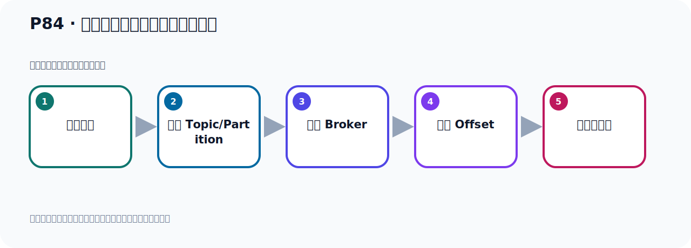
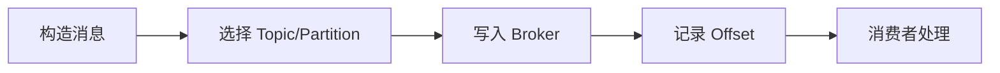

# P84：生产者发送消息自定义分区策略

> 笔记编号 84/156 · 时长 06:52 · [打开原视频 P84](https://www.bilibili.com/video/BV14J4m187jz?p=84)

[← P83: 生产者发送消息配置分区策略RoundRobinPartitioner测试](../06-producer-internals/p083-生产者发送消息配置分区策略RoundRobinPartitioner测试.md) · [返回本章](./README.md) · [P85: 生产者发送消息自定义分区策略 →](../06-producer-internals/p085-生产者发送消息自定义分区策略.md)

## 这节到底讲什么

**核心主题：生产者发送消息自定义分区策略。**

这节位于消息链路上。要顺着“发送端—Broker—分区日志—消费端”看数据和元数据怎样流动。
本节属于“副本、分区策略与生产者链路”这一章；放在全章里看，它的作用是：理解副本与分区，验证默认、轮询和自定义分区策略，并串起生产者发送流程与拦截器。

## 本节路线

## 老师的完整讲解（按视频顺序校正）

> 下面保留老师的完整讲解顺序，并修正 Kafka、Java、ZooKeeper、
> Topic、Partition、Offset 等常见识别错误。它不是压缩摘要；原始 ASR 在后面单独保留。

### 1. 00:00–01:18

接下来我们实现了字定义分配策略，自己写一个分配策略。那就是我们这个课件，这里。我们自己写个分配策略，那就定一个Partition的内，实现这个接口，然后我们自己去做一个分配，按照你自己的方式去分配。好，那么看看怎么做呢？那首先你要写个内，那我们在这个地方就写个内吧。叫字定义的CustomerPartition的，好，这边个内，字定义的。然后它有实现那个Partition的接口，Partition的这个接口，PA1，2，这个接口，倒入一下。Partition的这个接口，PA2T，Partition的这个接口，那我这边写不对，PA2TOS，好，把它内名改一下。

### 2. 01:18–02:14

改一下没筋名，叫这个名字。好，我们这个雷二这个项目是吧？看一下啊，我们在雷一这个项目，对，雷一这个项目，直接改一下。这里改一下没筋名，叫这个名字，雷一这个项目。OK，好，实现这个接口，然后复给里面的方法，那么用哪些方法呢？你就在这里直接艾尔特加回车，实现方法，它里面有三个方法去实现，这个话肥献的是过时的，过时的不用实现。好，这几个需要实现一下。好，那主要是实现这个Partition这个方法，这个方法是做分区的。好，这个关闭啊，然后这个config，这个你可以不实现，它这个没有反为值，所以可以不用管它，不实现，放着你，是吧，可以放着你啊。

### 3. 02:15–03:04

然后主要实现这个方法，那么这个方法我们怎么做呢？我们就准备写一个，写一个轮曲策略，轮曲策略。好，那我这里呢，我提前准备了一段这个代码，在轮曲策略里我们一起看着代码，怎么写的。我们沾了这个地方，好，在这里啊。首先它这个方法里面，它有一大堆参数，对吧，这个参数里面有个classed，也就是拿到我们Kafka这个集群的信息，是吧，通过这个集群信息里面有一个Partition这个for，托并的这个方法，然后把这个托并的传进去，它可以拿到你总共有多少这个Partition，它是一个列表，一个list。这样的话，我们得到这个Partition的一个个数，比如说我们是九个分区，那我们这边这个值就是九，就是九。

### 4. 03:05–04:04

好，成我这边做个判断。如果你这个消息是带有k的，你带有k的那么走l是代码，l是，你带k就走l是，你如果k是等于空，我就开始用我自己的代码。你如果是k不等于空，k不是空我就使用默认的这个分区策略，那你怎么办呢？就把它之前那个策略代码考过来，就这个代码。在这边之前看过，就在这里。我们之前看过它的原代码，对吧，如果你有k的话，它是执行这一段代码。所以我就把这一段代码考备过来，考备过来了。好，这个有k的情况下。没有k的情况下呢，我就是搞一个轮曲策略。那么轮曲策略呢，我在这里首先我定一个变量，这个变量，这个etj，automic，automic，etj。automic，这个automic。automic，atomik，etj，automic，etj。

### 5. 04:04–05:24

好，那这个米总的鞋叫nast，这个pavich。好，等于6一个呢，automic，etj，然后刚开始直式轮，刚开始直式轮。好，然后我就取它的下一个值，增加加1，加1，然后就下一个。如果下一个呢，大于我的这个，大于等于我的分区个数，我们总是9个。大于等于9的话，你如果等于9的话，那我就把这个下一个值啊，通过比较和设值，进一步来，把它设值0。那把下个值就设轮，又从轮开始加，这是比较并且给它设个值。好，那如果说，那我这个没用，我删掉啊。好，然后就把这个值返回啊，所以这个方法主要就是每次让它加1，每次让它加1。然后这是我们的分区值分区，我们看我们的分区值每次多少，把它打印一下。好，这就是我们这个方法，就写好了，写好了。写好了之后呢，我们把这个类啊，就放在我们的这个配置中，把它类，放在我们配类，那就是在这个地方，我们就用我们自己定义的，这个，自定义的这个particle，这个分区这个类。好，然后运行代码就可以了。

### 6. 05:26–06:12

对吧，非常简单啊，主要是实现这个方法，这个里面怎么，具体怎么做呢，你根据自己的这个需要，让你自己去写一下这个业务逻辑，写一下这个代码。好，那我写完之后，我开始测试，测试的话，我就在，首先我把之前这个，这个Topic啊，这个头壁壳，我们先删一下这个Topic，先删掉，我们删了一个新的Topic，啊，到处观察一下。好，那我们在这里面去发送消息，测试，在这个task里面去测试，这里面。好，去测的话，我为止发送五次，发送五次，掉一时这个方法，它是往我们这个Topic，黑Topic，发送，啊，在发送。好，那现在呢，我又开始去发，要这个，在这里面去发，好，又见，要运行一下。

### 7. 06:13–06:49

运行之后，我们看一下它的结果，好，那么它又发完了，发完之后，刚才看了它打印啊，这边有个虚拟观这个结果打印看一下，它的值是一二三五六七八九，是吧？然后呢，我们看一下它这个，在这个Kafka中，我们刷新一下，这个黑Topic就这个，好，那么这个它是不是轮曲的呢？它发消息，啊，在这里面有一条消息，在这里面，它隔一条数据发一个消息，隔一条数据发个消息。好，那这是什么原因啊？

## 关键术语

- **Kafka：** Apache 开源的分布式事件流平台，常用于高吞吐消息传递、数据管道和流处理。
- **Topic：** 事件的逻辑分类。生产者向 Topic 写数据，消费者从 Topic 读取数据。
- **Partition：** Topic 的物理分片，是 Kafka 并行度、顺序性和扩展能力的基本单位。

## 完整原声逐段记录

[查看本节带时间戳的本地 ASR](./transcripts/p084-生产者发送消息自定义分区策略-ASR.md)。主笔记负责可读性和术语校正；ASR 页面负责完整性复核。

## 读完记住

- 本节主题是 **生产者发送消息自定义分区策略**，它服务于本章目标：理解副本与分区，验证默认、轮询和自定义分区策略，并串起生产者发送流程与拦截器。
- 理解顺序是：构造消息 → 选择 Topic/Partition → 写入 Broker → 记录 Offset → 消费者处理。
- 学习时要同时核对老师的解释、画面中的配置/代码，以及最终运行结果。

## 最容易踩的坑

能发送成功不代表业务处理成功；序列化、分区、确认机制和消费进度需要分别观察。

## 自测

1. 不看笔记，用自己的话解释“生产者发送消息自定义分区策略”解决了什么问题。
2. 按顺序复述：构造消息、选择 Topic/Partition、写入 Broker、记录 Offset、消费者处理。
3. 如果运行结果和老师不同，你会先检查哪三个输入或环境条件？

## 学完检查

- [ ] 我能不看视频复述本节完整思路
- [ ] 我能指出关键命令、配置、类或接口的作用
- [ ] 我能解释画面中的输入与输出为什么对应
- [ ] 我核对过完整 ASR，没有跳过老师的补充说明
- [ ] 我完成了本节自测或复现实验
