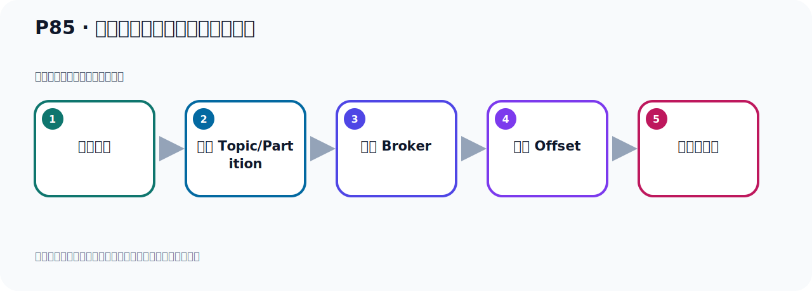

# P85：生产者发送消息自定义分区策略

> 笔记编号 85/156 · 时长 04:57 · [打开原视频 P85](https://www.bilibili.com/video/BV14J4m187jz?p=85)

[← P84: 生产者发送消息自定义分区策略](../06-producer-internals/p084-生产者发送消息自定义分区策略.md) · [返回本章](./README.md) · [P86: Kafka生产者发送消息的流程 →](../06-producer-internals/p086-Kafka生产者发送消息的流程.md)

## 这节到底讲什么

**核心主题：生产者发送消息自定义分区策略。**

这节位于消息链路上。要顺着“发送端—Broker—分区日志—消费端”看数据和元数据怎样流动。
本节属于“副本、分区策略与生产者链路”这一章；放在全章里看，它的作用是：理解副本与分区，验证默认、轮询和自定义分区策略，并串起生产者发送流程与拦截器。

## 本节路线

## 老师的完整讲解（按视频顺序校正）

> 下面保留老师的完整讲解顺序，并修正 Kafka、Java、ZooKeeper、
> Topic、Partition、Offset 等常见识别错误。它不是压缩摘要；原始 ASR 在后面单独保留。

### 1. 00:00–01:10

这次的论取，他发消息，在这里有一条消息，他格一条数据发一个消息。这是什么原因？这个是他里面的帕迪西方法，他会掉两次，原则中会有两次的掉用，导致他第二次掉帕迪西方法的时候，他才是真正的去用帕迪西方法。他第一次还会掉用，就是他里面的帕迪西方法掉两次，左是这个原因。我们在计入这个方法之前，他主要是掉两次，我们也可以这样定段点，怎么定呢？就是在新战产发送这里，计入这个方法，我们就往里面看一下，跟踪看一下，在里面运行一下。现在到这里，我们进入合计代码，找合计代码，不合计的我们先跳过去，这个代码刚刚看过了，之前看过的，发送进来。

### 2. 01:11–02:09

进了之后呢，再往下走，往下走。往下走，这次发送进来，剩了进来。接着之后往下走好，这里就发送我们进来掉到send 方法然后往下走，好，掉圣的，进来到这，好，下一步到这里，好，到这，到这好，到这里，到这里，是吧好的，序列化器，然后序列化器，好，到这那这个方法，对吧，这个方法啊我们去发消息，那么它会走一遍好，那里面有个断景了，它走一遍，它走完啊走，走，走好，现在是走到我们的那个就是我们自己的这个，自立这个分区方法嘛，走这里去获取那个值嘛，是吧好，它现在获取的值多少呢这个值，打印了，多少现在这个值是雷啊。

### 3. 02:09–03:01

雷的话，应该把数据放在雷这个分区里面，对吧好，它返回了返回了啊，然后呃在，在这地方返回了，对吧，然后返回的话，走返回的，好，返回了，这个是雷，好，这是雷返回了，好，走往下走，往下走往下走，好，那么这地方它又有个计算啊又有一个，它又计算，它其实数据还没有发没有发它又有一个计算，你看，上面这边不是个爬地计算吗这边一计算一个爬地计算的能力啊，计算了然后下面这地方又有个爬地计算，它又调一下这个方法是吧，一调这个方法所以呢你看，下面最终它这个反尾这个结果，这个结果它发的时候啊最终这个方法在里随腾啊，在里腾。

### 4. 03:02–03:50

那么是随要的在哪里啊这个随要的在这这个随要的在这，那么这地方是发了发，发出去发消息，对吧好，那么它又调了一遍这个爬地计啊，它调两遍，做这个导致的那它这个指啊，它这个处可能你把这个指感到腹时就可以了这个指，它是处是吧，这个处啊所以导致它这个调这个爬地计方法，计算两次，你看再调一次，你看就记得我们这个里面计算一次，你看我们进去啊我们，我们下一步，下一步你看又记得我们这个方法里面的又去取一遍这个指所以它就变成最终结果就是隔一条数据啊，隔一个序号放一个消息，隔一个序号放个消息，是这样的啊，原因在这里好，那原因找到了，知道怎么回事就行。

### 5. 03:51–04:47

好，那我这句下面就不再调试了啊，走完好，断点给它放开啊放开断了就放开走完好，那么以上呢，就是我们这个测试等它消息呢隔一条放一个，隔一条放一个等它这个效果啊你看它是这个雷号，雷号分区没有放啊，然后一然后到3然后到5然后到7这样放的主要是它那个跑地方法掉了两遍啊掉了两遍它有个直，有个不外直处，是处的话，这个方法会掉两遍好，那以上这个呢，就是我们自定义的这个分区策略，发动消息采用自定义的分区策略就是这个方法好，就是我们这个内啊自定义到时候在配置里中，再指定一下我们这个这个自定义这个配置自定义的这个分区实现就可以了到时就可以采用我们的这个实现。

### 6. 04:47–04:51

在实现这个分区把消息发到哪个分区用我们的实现。

## 完整原声逐段记录

[查看本节带时间戳的本地 ASR](./transcripts/p085-生产者发送消息自定义分区策略-ASR.md)。主笔记负责可读性和术语校正；ASR 页面负责完整性复核。

## 读完记住

- 本节主题是 **生产者发送消息自定义分区策略**，它服务于本章目标：理解副本与分区，验证默认、轮询和自定义分区策略，并串起生产者发送流程与拦截器。
- 理解顺序是：构造消息 → 选择 Topic/Partition → 写入 Broker → 记录 Offset → 消费者处理。
- 学习时要同时核对老师的解释、画面中的配置/代码，以及最终运行结果。

## 最容易踩的坑

能发送成功不代表业务处理成功；序列化、分区、确认机制和消费进度需要分别观察。

## 自测

1. 不看笔记，用自己的话解释“生产者发送消息自定义分区策略”解决了什么问题。
2. 按顺序复述：构造消息、选择 Topic/Partition、写入 Broker、记录 Offset、消费者处理。
3. 如果运行结果和老师不同，你会先检查哪三个输入或环境条件？

## 学完检查

- [ ] 我能不看视频复述本节完整思路
- [ ] 我能指出关键命令、配置、类或接口的作用
- [ ] 我能解释画面中的输入与输出为什么对应
- [ ] 我核对过完整 ASR，没有跳过老师的补充说明
- [ ] 我完成了本节自测或复现实验
