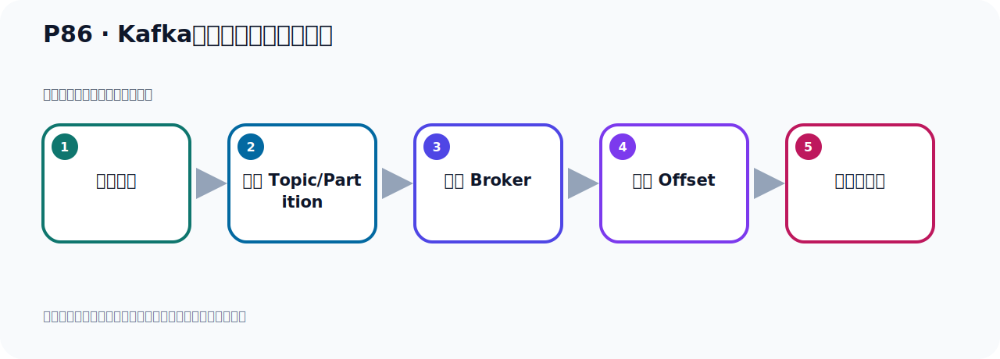
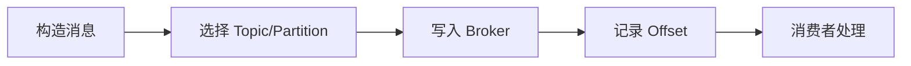

# P86：Kafka生产者发送消息的流程

> 笔记编号 86/156 · 时长 05:44 · [打开原视频 P86](https://www.bilibili.com/video/BV14J4m187jz?p=86)

[← P85: 生产者发送消息自定义分区策略](../06-producer-internals/p085-生产者发送消息自定义分区策略.md) · [返回本章](./README.md) · [P87: Kafka自定义消息发送的拦截器 →](../06-producer-internals/p087-Kafka自定义消息发送的拦截器.md)

## 这节到底讲什么

**核心主题：Kafka生产者发送消息的流程。**

这节位于消息链路上。要顺着“发送端—Broker—分区日志—消费端”看数据和元数据怎样流动。
本节属于“副本、分区策略与生产者链路”这一章；放在全章里看，它的作用是：理解副本与分区，验证默认、轮询和自定义分区策略，并串起生产者发送流程与拦截器。

## 本节路线

## 先用白话读懂

生产者发送链路可以先记成：ProducerRecord → ProducerInterceptor → key/value Serializer → Partitioner → RecordAccumulator 批次 → Sender 网络线程 → Broker。老师在源码中打断点逐步验证；默认可以没有拦截器，但序列化和分区选择一定会发生。

## 老师的完整讲解顺序（ASR 辅助复核）

> 下面按时间顺序保留经过基础术语替换的 ASR，方便核对老师是否提到某个细节。
> 人名、命令、代码和英文参数仍可能识别错误；准确结论以本节白话说明、代码块和实操速查表为准。

### 1. 00:00–01:02

下面我们来看一下，生产者发送消息的流程。生产者发送消息的流程的基本流程，就是我们右边这个图。首先我们的生产者发消息，他首先会经过这个拦截器。这个拦截器你可以有多个拦截器，都是可以的。一个或多个拦截器，或者说没有拦截器也可以。它默认是没有拦截器的。然后会走这个序列化器，对我们发生的这个消息，它有个键、一个纸，分别进行序列化器。默认是用String的序列化器。然后就走这个分区器。分区器就是我们消息要发到哪个分区，那么它内部来，如果你有key，它有一种分区算法。同时我们也可以指令这个分区器。好，这是它的一个流程，会经过这几个器，然后把消息发到Topic的这个Partition中。

### 2. 01:02–02:22

好，经过这几个流程，然后把消息发到这个Topic里面去。好，那下面我们通过源码来看一下。首先我找一个发送方法。这里就是一个发送方法。我们这里定个断点，把这个流程我们去跟踪一下，观察一下，好，里面我运行。好，运行之后就进到这里，我们进入这个方法进来。好，这里我们要走行。往下执行。然后我们进入这个send 方法，然后下一行，然后。好，那这里呢，我就找了一个发送方法，我们定个断点，然后呢，我们在这里去运行测试一下，跟踪一下它的流程。

### 3. 02:22–03:25

好，那么单码开始运行，运行之后，我们进入下一行进去，这个进入下一行，然后进入send 方法，好，下一行进来，好，非核心代码，我们跳过，我们要走，这一方开始发送，我们进去，然后再往下走。那么按照这个图的话，它第一个是走这个拦截器，我们看看它有没有走拦截器，我们找一下。好，我们找核心代码，我们要执行，然后到这里，好，这个地方里看了，就是拦截器吗？拦截器生产发送者，拦截器，这就是拦截器，好，也就是说这个方法点进来，到时候会找这个拦截器，如果拦截器不为空，那么会调这个拦截器的onSend的方法，所以第一步是走到拦截器，当然它默认的话，它这个拦截器是空的，你看啊，这个拦截器我们进去，我们进入拦截器这个方法，进来，进来之后呢，你看这个拦截器是吗？

### 4. 03:25–04:24

这个拦截器是空的，看一下，这个拦截器它是空的，它没有拦截器，所以默认它是没有拦截器的，所以那么这个就可以直接跳过了，没有拦截器，好，拦截器就找到了。然后这个闻了之后，接下来就走这个序列化器，那你看，我们要走，往下走，在这，好，这是发送，是吧，发送，让我们进入这个发送方法进来，进来之后，好，进来，进来之后呢，往下走一下，好，这里是发送，我们进入这个发送方法，进去，点这个方法，好，到这个发送，然后往下走，到这里，对吧，好，那么此时这个渗渗方法我们看啊，我们进入渗渗方法，好，再往下走，渗渗渗渗。

### 5. 04:24–05:23

我们要走好这是对值的序列化器所以他到这个流程就到这个序列化器啊进入序列化器好那接下来我们在晚上走今天晚上走就进入这个分区器了进入分区器好分区器这个代码我们原来看过我们再复习一下你看到这里面拿那个分区进入哪个分区就是消息要发哪去是吧哎这个流程好那么分区有了之后你看我想走一下好那走分区分区然后往下走往下走下面还有分区会掉两遍啊掉两遍好分区然后往下走走好这里就是发生消息的对吧发生消息了所以他前面呢你看这往下走就没有了就是绿腾的吧就发出就结束了所以这里面相应就把消息放进去了啊哦append 追加进去追加进去所以他到这个发出流程。

### 6. 05:23–05:40

最主要是经过这个拦截器经过序列化器经过分区器那么这个序列化器和这个分区器我们前面都介绍过那下面呢我们给大家看一下他这个拦截器该怎么做怎么实现好我们看一下。

## 关键术语

- **Kafka：** Apache 开源的分布式事件流平台，常用于高吞吐消息传递、数据管道和流处理。
- **Topic：** 事件的逻辑分类。生产者向 Topic 写数据，消费者从 Topic 读取数据。
- **Partition：** Topic 的物理分片，是 Kafka 并行度、顺序性和扩展能力的基本单位。

## 关键画面核对

画面同时展示 `ProducerConfig`、`CustomPartitioner`、`KafkaConfig`、`EventProducer` 和多组测试方法；`test10()` 循环发送多条消息，用实际分区结果验证完整生产者链路。

[查看课程关键画面核对总表](../../sources/visual-checks.md)。

## 完整原声逐段记录

[查看本节带时间戳的本地 ASR](./transcripts/p086-Kafka生产者发送消息的流程-ASR.md)。主笔记负责可读性和术语校正；ASR 页面负责完整性复核。

## 读完记住

- 本节主题是 **Kafka生产者发送消息的流程**，它服务于本章目标：理解副本与分区，验证默认、轮询和自定义分区策略，并串起生产者发送流程与拦截器。
- 理解顺序是：构造消息 → 选择 Topic/Partition → 写入 Broker → 记录 Offset → 消费者处理。
- 学习时要同时核对老师的解释、画面中的配置/代码，以及最终运行结果。

## 最容易踩的坑

能发送成功不代表业务处理成功；序列化、分区、确认机制和消费进度需要分别观察。

## 自测

1. 不看笔记，用自己的话解释“Kafka生产者发送消息的流程”解决了什么问题。
2. 按顺序复述：构造消息、选择 Topic/Partition、写入 Broker、记录 Offset、消费者处理。
3. 如果运行结果和老师不同，你会先检查哪三个输入或环境条件？

## 学完检查

- [ ] 我能不看视频复述本节完整思路
- [ ] 我能指出关键命令、配置、类或接口的作用
- [ ] 我能解释画面中的输入与输出为什么对应
- [ ] 我核对过完整 ASR，没有跳过老师的补充说明
- [ ] 我完成了本节自测或复现实验
