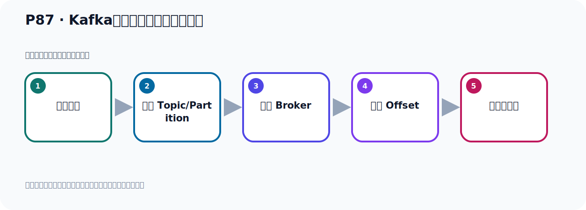
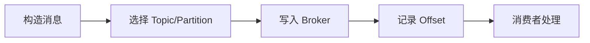

# P87：Kafka自定义消息发送的拦截器

> 笔记编号 87/156 · 时长 07:00 · [打开原视频 P87](https://www.bilibili.com/video/BV14J4m187jz?p=87)

[← P86: Kafka生产者发送消息的流程](../06-producer-internals/p086-Kafka生产者发送消息的流程.md) · [返回本章](./README.md) · [P88: Kafka自定义消息发送的拦截器测试 →](../06-producer-internals/p088-Kafka自定义消息发送的拦截器测试.md)

## 这节到底讲什么

**核心主题：Kafka自定义消息发送的拦截器。**

这节位于消息链路上。要顺着“发送端—Broker—分区日志—消费端”看数据和元数据怎样流动。
本节属于“副本、分区策略与生产者链路”这一章；放在全章里看，它的作用是：理解副本与分区，验证默认、轮询和自定义分区策略，并串起生产者发送流程与拦截器。

## 本节路线

## 老师的完整讲解（按视频顺序校正）

> 下面保留老师的完整讲解顺序，并修正 Kafka、Java、ZooKeeper、
> Topic、Partition、Offset 等常见识别错误。它不是压缩摘要；原始 ASR 在后面单独保留。

### 1. 00:00–01:05

好，那下面我们来看一下这个蓝节器，怎么添加这个蓝节器，再发送消息的时候，给消息给它蓝节一下。好，那么蓝节器的话它有个接口，有个接口，我们来把这个之前这个断点调试给它放开，放开。把这个不要，放开，把断点全部给它去掉。好，走完了啊。走完了以后呢，我们现在来添加一个蓝节器，蓝节器呢，我们搜一下它是有一个蓝节器的接口，叫什么接口呢？我们这里有一个，往下走一下，就是有一个叫制定蓝节器实现这个接口，Producer、Interceptor，实现这个接口。那去搜一下这个接口，这个接口，好，找到这个接口那就是这个接口，点进来。这是蓝节器这个接口，实现这个接口我们可以制定一个蓝节器，蓝节消息的发送，那么这个接口里面有几个方法，好，那现在我们就写一个啊。

### 2. 01:06–01:57

在这个地方我们写一个新的类，新的叫制定Custom，Custom这个Interceptor，好，我们在这属于生产者，我们区分一下叫Producer，对，Producer这个Interceptor，生产者，好，写这么类。那么这个类它首先要实现这个接口，实现这个接口。实现这个接口，我把其他地方关一下太多了，把其他地方关掉，好，留下这一个。然后覆盖里面的方法，走一下，然后实现方法，那就实现它这些方法，OK一下就可以了，对吧，生产方法。那么这个接口看一下，这个接口它这个犯行的，也就是你这个消息的这个键和纸的类型，这个犯行的，那为了它并且有这个黄色警告啊，我们给它加个犯行。

### 3. 01:58–03:00

那这个键呢，我们给它一个字幕串，只给它一个obj，好，这样啊。那这个地方，那这个类它也是个犯行的，那就是相对于这里也是一个键和纸，那么它也是个死锯obj，好，这里没有警告的，好，这个就是我们第一个一个拦截器，然后接下来就是你去实现它这个代码。实现代码的话呢，你看这个方法就是在你发送消息的时候，会先走这个方法，发送消息时，会先执行该方法，会先调用该方法，先调用，就用该方法，该方法，对消息进行拦截，进行这个拦截。那可以在这个拦截里面，拦截中呢，对消息啊，消息做一些，做一些处理啊，是吧，处理，或记下日志啊，记住日志啊，是吧，等等等等，等等等等，这个操作。

### 4. 03:02–03:52

好，根据业务情况，然后做相应的一个操作就可以了。就是我们这个方法。就像我们原来史文布德，史文威士里面有拦截器，请求发过来之后，先走拦截器，拦截器里面你可以做一些判断啊，做一些处理啊，等等啊。那么这里也是一样，发消息之前会做一个这个拦截，好，拦截之后它会拦截到你整个这个消息，在你发那个消息对象。这里面包含了你的Topic啊，分区啊，投布信息啊，建值啊，还有时间出啊，都包括了。那你可以对它比如说做修改，或做记录啊，都可以的。那这里呢，我现在主要是做一个记录啊，只能做个记录。那就是我们就直接就是，这个拦截消息吧。好，然后你把它这个信息打印一下，我们不做别的处理啊，就打印一下，托实讯一下。

### 5. 03:53–04:38

好，然后呢，我们这个拦截之后，就让这个消息继续往后执行，继续以，继续传给下面的啊，下面的这个方法。所以就随它一般自己本身，你看它要随它一般这个对象，那就是这个本身啊，这个叫本身。好，然后这个方法是一般啊，然后这个方法是干嘛呢，这个方法是叫确认，确认的话就是当你服务器啊，你这个消息不是从这个这个生产者发过来的吧，发给服务器，服务器会给你一个小意，给你个确认，表示服务器已经收到还是没收到这个消息。如果它收到这个消息，那么就这个手机会从这个mata，data的元数据中可以拿到这个一些信息，比如说偏移量，ovside的偏移量是多少。

### 6. 04:39–05:37

如果它没收到，那么这个时候应该是有个异常信息的，啊，然后如果服务器没收到，它就不会给你反为那个ovside的那个偏移量，对吧。所以我们这里你可以相应判断一下了。那首先啊，一副，如果说这个东西它不一空，那就说明服务器收到了，它不得一空。不得一空，那就是这个时候说明服务器收到该消息的，服务器收到了该消息。是吧，收到该消息，然后这个时候你可以从这里面，你可以拿到它那个ovside啊，这个冰箱里面点这个这个ovside呢。它的偏移量是多少，就可以拿到。当然这里面还有些比较信息，你给点一下，点一下。然后有这个，就是说这个冰箱里面它本质那些信息嘛，包括这个ovside啊，时间出啊，还有整这个训讯化k的size啊，还有这么size，还有这个分区啊等等啊，。

### 7. 05:38–06:31

那这些信息可以打印一下，那我们现在就拿一个来ovside，好，在这样子啊。那如果说它这个否则的话，否则的话它这个上面如果是等于空的话，一般是报错了，那这个时候就是它发生一层的啊。这个消息消息就发生，发生这个失败了，失败了，发生失败了，是吧，它一个一层，一层等于什么呢，你可以把一层的打印一下，一点，点托斯句，是吧。给点message，或者给点什么托斯句一下，啊，就这样，这是服务器有没有收到消息。这个服务器啊，服务器这个收到消息后的一个确认，确认返回，一个确认，给我们，给我们这个扣端一个确认。好，下面这个close这个我们就不用实现，这个config也可以不用管它，好，就可以放到这里可以了。

### 8. 06:32–06:56

那我们主要就写下这个确认和它这个发送这个方法，主要写下这个其他不用写。好，那我们自立的这个拦戒器就写完了。好，核心代码，写完了。然后下面我们去开车机测试，测试一下我们这个拦戒器，它怎么去，有没有掉入我们的轮戒器，我们该怎么去配置，让它能够生效，能够被执行。

## 关键术语

- **Kafka：** Apache 开源的分布式事件流平台，常用于高吞吐消息传递、数据管道和流处理。
- **Topic：** 事件的逻辑分类。生产者向 Topic 写数据，消费者从 Topic 读取数据。
- **Producer：** 向 Kafka Topic 发送事件的客户端。

## 完整原声逐段记录

[查看本节带时间戳的本地 ASR](./transcripts/p087-Kafka自定义消息发送的拦截器-ASR.md)。主笔记负责可读性和术语校正；ASR 页面负责完整性复核。

## 读完记住

- 本节主题是 **Kafka自定义消息发送的拦截器**，它服务于本章目标：理解副本与分区，验证默认、轮询和自定义分区策略，并串起生产者发送流程与拦截器。
- 理解顺序是：构造消息 → 选择 Topic/Partition → 写入 Broker → 记录 Offset → 消费者处理。
- 学习时要同时核对老师的解释、画面中的配置/代码，以及最终运行结果。

## 最容易踩的坑

能发送成功不代表业务处理成功；序列化、分区、确认机制和消费进度需要分别观察。

## 自测

1. 不看笔记，用自己的话解释“Kafka自定义消息发送的拦截器”解决了什么问题。
2. 按顺序复述：构造消息、选择 Topic/Partition、写入 Broker、记录 Offset、消费者处理。
3. 如果运行结果和老师不同，你会先检查哪三个输入或环境条件？

## 学完检查

- [ ] 我能不看视频复述本节完整思路
- [ ] 我能指出关键命令、配置、类或接口的作用
- [ ] 我能解释画面中的输入与输出为什么对应
- [ ] 我核对过完整 ASR，没有跳过老师的补充说明
- [ ] 我完成了本节自测或复现实验
