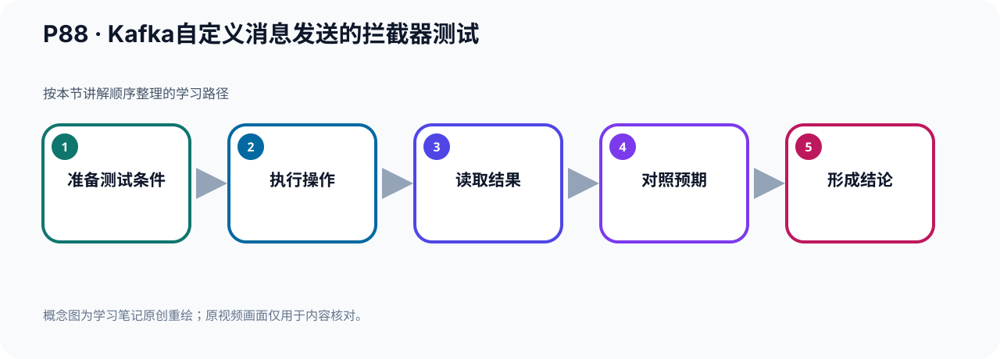

# P88：Kafka自定义消息发送的拦截器测试

> 笔记编号 88/156 · 时长 05:21 · [打开原视频 P88](https://www.bilibili.com/video/BV14J4m187jz?p=88)

[← P87: Kafka自定义消息发送的拦截器](../06-producer-internals/p087-Kafka自定义消息发送的拦截器.md) · [返回本章](./README.md) · [P89: SpringBoot集成Kafka开发接收消息体内容 →](../07-consumer-internals/p089-SpringBoot集成Kafka开发接收消息体内容.md)

## 先看结论

> 这节围绕“Kafka自定义消息发送的拦截器测试”做实验验证，重点不是看见一次成功，而是说清输入、预期、实际输出以及不一致时的排查顺序。它服务于本章目标：理解副本与分区，验证默认、轮询和自定义分区策略，并串起生产者发送流程与拦截器。

## 老师怎么一步步讲

1. 第 1 步，围绕“Kafka自定义消息发送的拦截器测试”完成准备测试条件。
2. 第 2 步，围绕“Kafka自定义消息发送的拦截器测试”完成执行操作。
3. 第 3 步，围绕“Kafka自定义消息发送的拦截器测试”完成读取结果。
4. 第 4 步，围绕“Kafka自定义消息发送的拦截器测试”完成对照预期。
5. 第 5 步，围绕“Kafka自定义消息发送的拦截器测试”完成形成结论。

## 老师的补充说明

下面按原声顺序整理老师的完整讲解脉络。保留原因、案例、对比、操作过程、边界条件和口头提醒；删除重复语气词，并把长口语拆成适合阅读的短段落。

> 技术术语已经过统一校正；仍无法确认的人名或口头英文会保留原意，并通过右侧时间范围返回视频核对。

### 先明确：Kafka自定义消息发送的拦截器测试要解决什么 · 00:00–01:06

我们人介器写好之后，接下来我们去测试一下这个人介器。测试这个人介器，你要上这个人介器，先配置一下。就在这个配置中去配置一下人介器。在它这个生产者这个配置中，我们要加一个人介器的配置。那就是在这个天间一个人介器，天加一个人介器。天加人介器，那就是它点铺头一下。那人介器是叫哪个名字呢？我们点这个生产者这个配置在里面，它有很多成量，我们可以搜一下，叫Interceptor，对吧。Interceptor，Interceptor，TOR，Interceptor。

Interceptor，它配置，那就是这个配置，叫Class Config，就读这个成量。这成量它里面的指示销页就配这个手机，叫人介器的Class。那么这里面就配一个，这个名字，那就是Config点它。

### 跟着老师操作，并观察运行结果 · 01:06–01:57

那后面指定我们这个人介器。那我们的人介器就是我们之前写的人介器，那就是这个Class，就是它。那就是它点Class，对吧。那我就把这个人介器，我们自定义的人介器就加记得了。加记得之后我们看看它有没有调我们的方法，我们只要看一下有没有打开这个信息就可以。发消息的时候看看有没有打开这个信息。那此时呢，我们就去发出消息，配置配置好了，这里已经配置好了。发消息，那在这里打开。那这里呢，我就不再发五个消息了，我就发一个消息，把这个五个消息注释掉，就发一个消息，测试一下。

那现在我们就在这里点一下运行，看一下有没有走拦截器。

### 跟着老师操作，并观察运行结果 · 02:00–03:31

那么运行之后呢，它这里报了一个错误，我们看一下，报了一个错。非法的，不合法的一个值。那就是我们配的这个人介器，可能不合法看一下，就是我们，这是我们的人介器这个类。是吧，配置人介器啊。配置人介器的class，就是我们这个配置，它希望是一个斗号分隔的列表，斗号分隔的列表。那我们这个地方看一下，我们这个配置。那么它这个点class，点class，那我这里方是一个列表，它是斗号分隔的列表，并且是个置物串啊。

我们看看我们之前这个地方它怎么配的，它这个也是要配一个置物串，它配class，这个class它是配一个了，class配一个。而我们现在这个地方的class，这个class圆，它是class意思，两个啊，就是多个嘛，配一个或多个啊，这个s这个复数。当它这个名字怎么配我们看一下，你怎么配呢，这个名字是这样配的，就是它要加一个呢，就是你直接配它的名字，直接配它的名字，那就是点给了它的level。

### 最后验证结果，并收束本节结论 · 03:31–05:17

点给了它的level，直接拿这个置物串，点给了它的level，直接用class不行，用class不行，用这个get level。get level之后呢，我们就这个时候我们再运行一下，看一下行不行，好，这个时候再右键运行一下。那么get level之后我运行以后啊，它就可以了，你看啊。我们的分区你看，这个什么服务器收到的该消息，是吧，蓝颜杰这个消息你看，都打印出来了，好，这个是分区的嘛，导致的啊，这个分区它打印的。

我们的分区那个实现里面有个打印分区纸，说明我们这个类型就生效了，这个类型，好，这是我们的这个配置啊，那么这一方呢，不能直接用class，应该用这个level。那上面这个地方level用class我们试一下，哦，level用level我们走一下，就是我们这个置立这个分区器，是吧，我们给它也加一个这个level啊，看它行不行，好，我们发个消息测试一下就知道了。那在这个地方我们点一下这个测试。

这是可以的，你直接get level可以啊，没问题，你看这个分区器是没有问题的，蓝颜杰也没问题，那么蓝颜杰它这里必须要用这个get level，不能用这个class，上面这个呢，你可以class，也可以用level啊。这是我们的这个level，天下level就ok的，这次置立了level，好，那么这一回来我们这个整个这个消息发出流程啊，会走这么三个组件，我们都给大家做了一个一的一个介绍啊，这是整个这个消息发出的时候，这三个这个三个组件。

## 放进整套课

本节属于 **副本、分区策略与生产者链路**。这一章要解决的是：理解副本与分区，验证默认、轮询和自定义分区策略，并串起生产者发送流程与拦截器。

这节用实验验证前面的配置或机制。重点是记录输入、预期、实际输出，以及两者不一致时如何定位。

### 记忆路线

```mermaid
flowchart LR
    N0["准备测试条件"]
    N1["执行操作"]
    N0 --> N1
    N2["读取结果"]
    N1 --> N2
    N3["对照预期"]
    N2 --> N3
    N4["形成结论"]
    N3 --> N4
```

## 用在工作里

| 项目 | 内容 |
|---|---|
| 先回答 | 先写下测试输入、前置状态和预期结果。 |
| 立刻做 | 执行测试并同时观察日志、Topic、Partition 与 Offset 变化。 |
| 留下证据 | 留下实际结果、差异原因和重新验证的证据。 |

## 关键术语

- **Kafka：** Apache 开源的分布式事件流平台，常用于高吞吐消息传递、数据管道和流处理。

## 最容易踩的坑

测试前残留的 Topic、Offset、缓存或旧进程会污染结果；每次实验都要先确认初始状态。

## 自测

1. 不看笔记，用自己的话解释“Kafka自定义消息发送的拦截器测试”解决了什么问题。
2. 按顺序复述：准备测试条件、执行操作、读取结果、对照预期、形成结论。
3. 如果运行结果和老师不同，你会先检查哪三个输入或环境条件？

## 学完检查

- [ ] 我能不看视频复述本节完整思路
- [ ] 我能指出关键命令、配置、类或接口的作用
- [ ] 我能解释画面中的输入与输出为什么对应
- [ ] 我读完了老师的详细讲解正文，没有只看路线图和要点
- [ ] 我完成了本节自测或复现实验

## 需要核对原话时

[查看本节带时间戳的完整 ASR](./transcripts/p088-Kafka自定义消息发送的拦截器测试-ASR.md)。主笔记负责理解与实践；ASR 页面负责逐句完整性复核。
