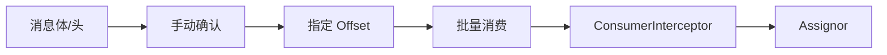

# 第 7 章：消费者开发与分区分配

掌握 ConsumerRecord、监听器、手动确认、指定位置消费、批量消费、拦截器和分区分配策略。

## 整章核心讲解

消费者组通过“组内分摊、组间广播”实现扩展：同组内一个 Partition 同一时刻只属于一个Consumer，不同组可以各自完整消费同一 Topic。

手动确认控制的是何时提交消费进度；指定 Topic/Partition/Offset 控制的是从哪里读取；批量消费控制一次交给业务多少记录；Assignor 控制重平衡后分区交给谁。四者不能混为一谈。

## 先看懂整章数据流

## 本章逐节目录

1. [P89 SpringBoot集成Kafka开发接收消息体内容](./p089-SpringBoot集成Kafka开发接收消息体内容.md) · 09:16
2. [P90 SpringBoot集成Kafka开发接收消息头内容](./p090-SpringBoot集成Kafka开发接收消息头内容.md) · 05:55
3. [P91 SpringBoot集成Kafka开发接收消息所有内容](./p091-SpringBoot集成Kafka开发接收消息所有内容.md) · 05:01
4. [P92 SpringBoot集成Kafka开发接收对象消息](./p092-SpringBoot集成Kafka开发接收对象消息.md) · 07:58
5. [P93 SpringBoot集成Kafka开发接收对象消息](./p093-SpringBoot集成Kafka开发接收对象消息.md) · 04:14
6. [P94 SpringBoot集成Kafka开发接收对象消息](./p094-SpringBoot集成Kafka开发接收对象消息.md) · 07:14
7. [P95 SpringBoot集成Kafka开发接收消息监听器注解](./p095-SpringBoot集成Kafka开发接收消息监听器注解.md) · 04:18
8. [P96 SpringBoot集成Kafka开发接收消息监听器手动确认消息](./p096-SpringBoot集成Kafka开发接收消息监听器手动确认消息.md) · 07:00
9. [P97 SpringBoot集成Kafka开发接收消息监听器手动确认消息](./p097-SpringBoot集成Kafka开发接收消息监听器手动确认消息.md) · 07:25
10. [P98 SpringBoot集成Kafka开发指定topic-partition-offset消费消息](./p098-SpringBoot集成Kafka开发指定topic-partition-offset消费消息.md) · 05:06
11. [P99 SpringBoot集成Kafka开发指定topic-partition-offset消费消息](./p099-SpringBoot集成Kafka开发指定topic-partition-offset消费消息.md) · 06:32
12. [P100 SpringBoot集成Kafka开发指定topic-partition-offset消费消息](./p100-SpringBoot集成Kafka开发指定topic-partition-offset消费消息.md) · 07:22
13. [P101 SpringBoot集成Kafka开发指定topic-partition-offset消费消息](./p101-SpringBoot集成Kafka开发指定topic-partition-offset消费消息.md) · 07:12
14. [P102 SpringBoot集成Kafka开发批量消费消息](./p102-SpringBoot集成Kafka开发批量消费消息.md) · 05:31
15. [P103 SpringBoot集成Kafka开发批量消费消息](./p103-SpringBoot集成Kafka开发批量消费消息.md) · 04:07
16. [P104 SpringBoot集成Kafka开发批量消费消息](./p104-SpringBoot集成Kafka开发批量消费消息.md) · 05:01
17. [P105 SpringBoot集成Kafka开发消费消息拦截器-定义ConsumerInterceptor](./p105-SpringBoot集成Kafka开发消费消息拦截器-定义ConsumerInterceptor.md) · 08:07
18. [P106 SpringBoot集成Kafka开发消费消息拦截器-配置ConsumerFactory](./p106-SpringBoot集成Kafka开发消费消息拦截器-配置ConsumerFactory.md) · 08:17
19. [P107 SpringBoot集成Kafka开发消费消息拦截器-ConsumerFactory](./p107-SpringBoot集成Kafka开发消费消息拦截器-ConsumerFactory.md) · 05:49
20. [P108 SpringBoot集成Kafka开发消费消息拦截器-KafkaListenerContainerFactory](./p108-SpringBoot集成Kafka开发消费消息拦截器-KafkaListenerContainerFactory.md) · 12:09
21. [P109 SpringBoot集成Kafka开发消费消息拦截器-消费者准备](./p109-SpringBoot集成Kafka开发消费消息拦截器-消费者准备.md) · 01:12
22. [P110 SpringBoot集成Kafka开发消费消息拦截器-测试验证](./p110-SpringBoot集成Kafka开发消费消息拦截器-测试验证.md) · 06:12
23. [P111 SpringBoot集成Kafka开发消息转发](./p111-SpringBoot集成Kafka开发消息转发.md) · 08:17
24. [P112 Kafka消息消费时的分区策略接口及实现类](./p112-Kafka消息消费时的分区策略接口及实现类.md) · 05:45
25. [P113 Kafka消息消费时的默认分区策略实现RangeAssignor](./p113-Kafka消息消费时的默认分区策略实现RangeAssignor.md) · 06:10
26. [P114 Kafka消息消费时的默认分区策略RangeAssignor具体分配方式](./p114-Kafka消息消费时的默认分区策略RangeAssignor具体分配方式.md) · 04:58
27. [P115 Kafka消息消费时的默认分区策略RangeAssignor代码测试验证](./p115-Kafka消息消费时的默认分区策略RangeAssignor代码测试验证.md) · 10:54
28. [P116 Kafka消息消费时的分区策略RoundRobinAssignor](./p116-Kafka消息消费时的分区策略RoundRobinAssignor.md) · 07:55
29. [P117 Kafka消息消费时的分区策略RoundRobinAssignor代码测试验证](./p117-Kafka消息消费时的分区策略RoundRobinAssignor代码测试验证.md) · 09:27
30. [P118 Kafka消息消费时的分区策略StickyAssignor和CooperativeStickyAssignor](./p118-Kafka消息消费时的分区策略StickyAssignor和CooperativeStickyAssignor.md) · 07:39

## 本章学习方法

1. 先把上面的流程图画在纸上，明确每节位于哪一步。
2. 读逐节正文，再用 ASR 核查老师的补充、口头提醒和演示顺序。
3. 遇到命令或代码课，必须记录“输入—配置—输出—失败原因”。
4. 学完后从头解释整章，不以“视频播放完”作为完成标准。
