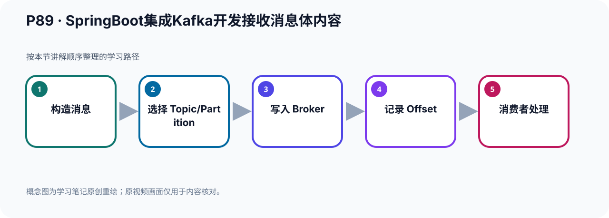
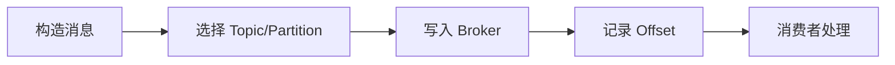

# P89：SpringBoot集成Kafka开发接收消息体内容

> 笔记编号 89/156 · 时长 09:16 · [打开原视频 P89](https://www.bilibili.com/video/BV14J4m187jz?p=89)

[← P88: Kafka自定义消息发送的拦截器测试](../06-producer-internals/p088-Kafka自定义消息发送的拦截器测试.md) · [返回本章](./README.md) · [P90: SpringBoot集成Kafka开发接收消息头内容 →](../07-consumer-internals/p090-SpringBoot集成Kafka开发接收消息头内容.md)

## 先看结论

> 这节把“SpringBoot集成Kafka开发接收消息体内容”放回消息链路，沿 Producer、Broker、Partition、Offset 与 Consumer 追踪数据和元数据如何流动。它服务于本章目标：掌握 ConsumerRecord、监听器、手动确认、指定位置消费、批量消费、拦截器和分区分配策略。

## 老师怎么一步步讲

1. 第 1 步，围绕“SpringBoot集成Kafka开发接收消息体内容”完成构造消息。
2. 第 2 步，围绕“SpringBoot集成Kafka开发接收消息体内容”完成选择 Topic/Partition。
3. 第 3 步，围绕“SpringBoot集成Kafka开发接收消息体内容”完成写入 Broker。
4. 第 4 步，围绕“SpringBoot集成Kafka开发接收消息体内容”完成记录 Offset。
5. 第 5 步，围绕“SpringBoot集成Kafka开发接收消息体内容”完成消费者处理。

## 老师的补充说明

下面按原声顺序整理老师的完整讲解脉络。保留原因、案例、对比、操作过程、边界条件和口头提醒；删除重复语气词，并把长口语拆成适合阅读的短段落。

> 技术术语已经过统一校正；仍无法确认的人名或口头英文会保留原意，并通过右侧时间范围返回视频核对。

### 先明确：SpringBoot集成Kafka开发接收消息体内容要解决什么 · 00:00–02:24

前面主要是实现生产者发送消息，接下来我们来看一下消费者消费消息的一些细节。这里我们打开代码，主要是通过代码来做一些分析和演示。之前我们这个代码中已经写了好多代码了，比较多了。所以我们现在来建一个新项目，这样比较清晰一点。这里我们又建了六一个新的模块，还是使用步道开发，我们写个名字，使不容易杠步的。然后杠这个02，杠这个Kafka，杠Base。这是我们这个项目，名字换一下，Maeve项目，然后把这个Maeve方法的包改短一点。

JDK 17，我们下一步，勾选NineBook，勾选一个热步主插件，然后我们主要在这里勾选一下这个Kafka，Aba及Kafka，把它勾选一下，我们勾选这么三个依赖，然后充电一下项目。这就是我们的项目就充电好了，充电了之后把它load一下，夹载一下，让它识别一下。这个项目就识别了，我把一些没有用的东西先删一下，比如说它都没有用，这个都没有用，删掉一下，这样我们代码上面干净一些。

这个就是我们的项目，我们策一下，我们主要研究一下这个消费者，把这个Maeve方法的内改短一点，太长了，太长了。然后这个地方，叫它，OK，继续，OK。这我们改了这个内，改了。这是Maeve方法，好，它。那主要是看一下这个消费者，消费者的话，我们可以把这边的代码拷贝一下，因为之前这边已经写过一个消费者，就是这个Consumer，那我们在这里写个Consumer。这个就是用来消费的，然后我们看一下，那我们还是在这里也放一个生辗者，放在这里面，粘过来，粘过来放个生辗者。

### 跟着老师操作，并观察运行结果 · 02:25–06:21

那这个生辗者，我们把一些多余的东西删一下，我把这些删掉，我们先留一个，因为我们是研究一下，下面这个代码再看。有一个，然后这个我们先去掉。这样比较干净，好，就是我们发一个消息，叫HandleTopic这个主题，我们把这个干净写成叫大写的吧，这样标准一点，Handle扛不扛。

这是我们的主题，发这个消息，好，这是发一个支付算的消息，发这个消息，然后我们就在这边这个地方去接收，接收HandleTopic，这个，那么它是HandleTopic这个名字，好，它的分数我们叫HandleTopic，好，这样，但是我们读取了试验，接收到了，那这我们的代码没问题。然后我们需要把这里配置一下，好，那我们把这个地方改成YAML 格式配置一下。YM，好，改完之后呢，把这个连接信息卡付卡的连接信息我们需要配置一下，把这个卡过来，然后做一些修改。

在这里面先粘一下，粘一下，好，那我们这个YM叫0.2，好，当这个没什么用，也可以去掉，好，这个我们是需要的，然后这些训练方式，我暂时没用上的，我先去掉，我们减换一下，然后待会用的时候我们再慢慢加，有什么需要解决的东西，解决的问题我们再加，好，然后这个消费者呢。

从最早的开始读是吧，好，这个型啊，然后这个末日这个没用上，我们放这里啊，这个消费者也可以吧，也可以把去掉下，好，我们是用最减化这个方式，一步一步的去研究他的消费啊，好，那这就是我们这个配置就配好了，生成的消费者没有做任何的配置啊。那现在就去把这个成语起起来，这个成语起起来之后他的这个消费者，他就在容器中，就监听，他有一个线程，一直在监听这个Topic上，有没有消息，有消息，他就读了这个消息，对吧，好，这个读过去啊，那我们把这个密封啊，运行起来，运行起来。

运行起来之后呢，我们竟然用这个生产者，然后去发个消息，啊，这个生产者，生产者发消息，那就是在那个测试内，去发一下，我们在这个测试内发一下，好，把测试内也改短一点，好，再改短一点。然后再拎二这个项目，OK一下，继续，好，改短之后呢，我们在这里就注入一下我们的那个发布消息的那个，那个B，写个新项目啊，再我们清晰一点，然后发消息，那我们在这里测试，啊，他也是他拎一，让我们调这个生产者，然后去生的发消息，点，调他的方法，好，调这个方法发消息。

那现在的日志啊，我们先清一下，这个项目已经清晰了，没有任何费底，清一下了，把日志清一下。清一下之后呢，我们在这里去发送，好，再说去发送一下，也发送。那我们现在是发那个制服社消息，对吧，发社消息，发完之后，好，看一下，好，他发完了，发完之后，我们看一下这个消费者这边，他有没有接到，那就看这个有没有打印出来，那消费者按理说他应该在这边，是吧，他成语在这边，那我们在这里收拾一下，好，他确实已经赌到了，赌了那个消息，对吧，好，赌到了啊，好，那现在把这个成语关掉啊，关掉。

关了之后呢，我们现在这个地方啊，这个读消息的时候，我们改一下，怎么改呢，就是我们这个，这是我们接受这个消息，是个字幕串，他前面林沐莉加一个注解，加什么注解叫拍漏的，拍这个的注解。

### 跟着老师操作，并观察运行结果 · 06:22–07:11

那么这个注解呢，他是表示这个消息体呢，接收消息体内容，好，你看这个，这个注解，是吧，綁定一个方法参数，綁定在方法参数上，就是这个消息的这个拍漏的就在复杂嘛，好，就拿到这个消息的复杂好，就加这个一个重点他能不能接到这个数据那我们再来测试一下把妹方法跑起来然后再发个消息好，那现在我们这个妹方法起起来之后我们这个接听器就一直在接听好，日志清一下然后我们开始用这个发送者生辗者就发个消息看他能不能接到好，发个消息。

### 继续拆解记录 Offset · 07:17–07:42

那么他就发文了发文之后我们在这个生辗者这边看看消费的这边看能不能读到啊好，把这个在你搜索一下搜索他也可以读到啊，可以读到所以在这个接收消息的时候呢也可以加上这样一个重点加这个重点好，那么这个注解啊就是接收消息体内容的就表示我们这个呢。

### 继续拆解消费者处理 · 07:42–08:11

是消息体的内容把消息的内容放到我这个边的中台所以我们把这里稍微说明一下这个注解啊那像是在这个我们这个位置好，这就是好，我们后面整理一下啊他就是在标记标记是呢消息体内容标记是消息体内容把用它标记一下。

### 继续拆解消费者处理 · 08:13–08:43

用它标记的这个参数是消息体内容标记那该这个参数是呢消息体内容好，通过这个注解去接收好，那这是我们呢接收消息的时候啊一个注解做一个解读做一个说明你加上这个注解之后那就表示你这个参数是我们消息的内容消息体内容。

### 最后验证结果，并收束本节结论 · 08:43–09:11

消息体内容当着你不加这个注解他也可以接到这个消息他相信是内形匹配我们消息发过来是个字幕串那你这边接个的时候也是字幕串那么他你不加的注解也是拿到这个消息内容但是你加上注解之后呢那么更加明确一些啊表示我这个变量用来接收啊就是把消息的内容到时候用这个变量来接收他起到这样一个标记的一个作用。

## 放进整套课

本节属于 **消费者开发与分区分配**。这一章要解决的是：掌握 ConsumerRecord、监听器、手动确认、指定位置消费、批量消费、拦截器和分区分配策略。

这节位于消息链路上。要顺着“发送端—Broker—分区日志—消费端”看数据和元数据怎样流动。

### 记忆路线

```mermaid
flowchart LR
    N0["构造消息"]
    N1["选择 Topic/Partition"]
    N0 --> N1
    N2["写入 Broker"]
    N1 --> N2
    N3["记录 Offset"]
    N2 --> N3
    N4["消费者处理"]
    N3 --> N4
```

## 用在工作里

| 项目 | 内容 |
|---|---|
| 先回答 | 先明确消息从哪里产生、写入哪个 Topic、由谁消费。 |
| 立刻做 | 复现发送、Broker 写入和消费者处理的完整链路。 |
| 留下证据 | 记录 Partition、Offset、序列化结果和消费端输出。 |

## 关键术语

- **Kafka：** Apache 开源的分布式事件流平台，常用于高吞吐消息传递、数据管道和流处理。
- **Topic：** 事件的逻辑分类。生产者向 Topic 写数据，消费者从 Topic 读取数据。
- **Consumer：** 从 Kafka Topic 拉取并处理事件的客户端。

## 最容易踩的坑

能发送成功不代表业务处理成功；序列化、分区、确认机制和消费进度需要分别观察。

## 自测

1. 不看笔记，用自己的话解释“SpringBoot集成Kafka开发接收消息体内容”解决了什么问题。
2. 按顺序复述：构造消息、选择 Topic/Partition、写入 Broker、记录 Offset、消费者处理。
3. 如果运行结果和老师不同，你会先检查哪三个输入或环境条件？

## 学完检查

- [ ] 我能不看视频复述本节完整思路
- [ ] 我能指出关键命令、配置、类或接口的作用
- [ ] 我能解释画面中的输入与输出为什么对应
- [ ] 我读完了老师的详细讲解正文，没有只看路线图和要点
- [ ] 我完成了本节自测或复现实验

## 需要核对原话时

[查看本节带时间戳的完整 ASR](./transcripts/p089-SpringBoot集成Kafka开发接收消息体内容-ASR.md)。主笔记负责理解与实践；ASR 页面负责逐句完整性复核。
