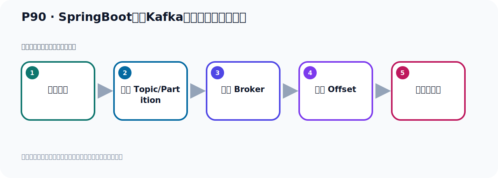
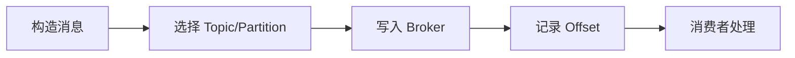

# P90：SpringBoot集成Kafka开发接收消息头内容

> 笔记编号 90/156 · 时长 05:55 · [打开原视频 P90](https://www.bilibili.com/video/BV14J4m187jz?p=90)

[← P89: SpringBoot集成Kafka开发接收消息体内容](../07-consumer-internals/p089-SpringBoot集成Kafka开发接收消息体内容.md) · [返回本章](./README.md) · [P91: SpringBoot集成Kafka开发接收消息所有内容 →](../07-consumer-internals/p091-SpringBoot集成Kafka开发接收消息所有内容.md)

## 这节到底讲什么

**核心主题：SpringBoot集成Kafka开发接收消息头内容。**

这节位于消息链路上。要顺着“发送端—Broker—分区日志—消费端”看数据和元数据怎样流动。
本节属于“消费者开发与分区分配”这一章；放在全章里看，它的作用是：掌握 ConsumerRecord、监听器、手动确认、指定位置消费、批量消费、拦截器和分区分配策略。

## 本节路线

## 老师的完整讲解（按视频顺序校正）

> 下面保留老师的完整讲解顺序，并修正 Kafka、Java、ZooKeeper、
> Topic、Partition、Offset 等常见识别错误。它不是压缩摘要；原始 ASR 在后面单独保留。

### 1. 00:00–01:02

刚才我们是通过一个注解，就是Pilot的这个注解。我们可以把消息体内容通过这个注解来标注一下，表示我这个变量是读取的消息体内容。那接下来我们介绍一个注解，就是AtHeide注解。那么它表示我这个变量是要读取你这个消息头的内容。消息头，这个消息体，那么这个消息头我们通过代码来测试一下。好，那就是我们在这里可以再写一个参数，然后用AtHeide是，AtHeide标注一下，用它标注。好，标注什么呢？那么这个AtHeide你要读这个浅牛头的内容，那你也指一下那个名字或者是value，他们两个是等价的。用名字或者是value都是可以的。好，那我们也写个value吧。好，那这里面写一个value。

### 2. 01:02–02:06

那个value，那等于什么呢？我要读浅牛头什么内容呢？比如说我要读他们那个Topic可。读它Topic可，那这个是我们可以用一个，这个Hide是这个参数啊，它里面有，是长料的点，这个RaceV啊，Hide是点，点，点，点RaceV啊，RaceVTopic可，就这个。好，然后读到之后，把它这个Topic可，这个名字放到我的这个变量中，Topic可。好，那这样的话我就读到了它那个，我接收的手是从哪个Topic可接收到这个消息，这是从这个消息头去读到那种。那么从这个之外，它应该还有些别的成熟啊，我们可以看一下，比方说这个里面，这是接收的这个Topic可，那么它有接收的这个k呢，我们也可以读一下，那这个是我们可以这里再写几个测试一下。

### 3. 02:07–03:11

再来一个，再来一个，好，那我们接收一下比方说，它这个接收到这个k，接收到k，这是一个吧，再比如说说，这个接收这个pd型是从哪个分区接收这个消息，对吧，可以啊，好，这是k，然后这个是pd型。好，那这样的话你看，我们就从旗流头中去接这个三个信息，那我们看看它有没有接到啊，好，我们打印一下，这个Topic可，Topic可它是多少，我们把它来加一下，把它Topic可打印一下。好，然后我们后面呢，再给它，这这地方加它，加一下，拼一下，拼接一下，再拼一个k，再拼一个pd型。好，那我们这个到时候运行之后，我们看看这个信息有没有拿到，通过at high的注解。

### 4. 03:12–04:12

那我们就首先把这个Mate方法给它运行起来，让这个接听器，接听在这个容器中。好，它起到完以后，我们接下来就去发一个消息，在这里去发一个消息，发送。好，那发送完以后，我们就看一下这个消费者有没有拿到这些信息，那此时消费者呢，就通过这个文字。在左边这个日志中，因为右边是我们的测试，左边是我们容器起到的位置。好，那这里面它报了一个错，报了个错来，那就是它没有这个头，这个k，它没有这个k，那我们把这个k去掉一下，就说它发的这个消息里面是不带这个k的，接收k不带，它没有这个这个制断的，那你就把这个先删一下，这个不要。它没有，它报错了，那不要，好，把这个就，那就下面这一段打印这一段，去掉一下。

### 5. 04:13–05:28

好，然后再看看，它这个parti系，按理说应该是有的，对吧，parti系应该是有。表示它从哪个分区接收消息，好，让这个运行方法运行起来，让这个接听器在容器中接听，好，清一下日志，我们再来发一个消息，再看一下，好，发送。好，那么发送完了，发送的时候，它的日志是正常的，没有问题，然后接下来，我们去把这个打印结果，在这个地方去找一下，在这边看里面接到，目前这边好像没有报一程，来，我们看一下，来，找到了，你看，它的消息都看到了，它的Topic是这个Topic，它的分区是雷分区。那我们hando这个Topic呢，handoTopic，它确实只有一个，只有一个分区，handoTopic这个名字，这个名字，不如上面这个，上面这个给删一下吧，上面这个删掉，上面这个不是，好，这个Topic你看，它确实只有一个分区，好，那这样的话我们就拿到了这个，这个信息啊，从消息头中拿消息，这是从附带中拿消息，这是从消息的附带中拿这个消息，这个是从呢，这个头里面，消息的头里面，。

### 6. 05:29–05:52

拿消息头，好，这是这个hando的注解，那我们在这里背住一下，是吧，那么这个就是标记该参数是消息头，消息头内容，消息头，这个内容，好，这是我们这个注解。

## 关键术语

- **Kafka：** Apache 开源的分布式事件流平台，常用于高吞吐消息传递、数据管道和流处理。
- **Topic：** 事件的逻辑分类。生产者向 Topic 写数据，消费者从 Topic 读取数据。

## 完整原声逐段记录

[查看本节带时间戳的本地 ASR](./transcripts/p090-SpringBoot集成Kafka开发接收消息头内容-ASR.md)。主笔记负责可读性和术语校正；ASR 页面负责完整性复核。

## 读完记住

- 本节主题是 **SpringBoot集成Kafka开发接收消息头内容**，它服务于本章目标：掌握 ConsumerRecord、监听器、手动确认、指定位置消费、批量消费、拦截器和分区分配策略。
- 理解顺序是：构造消息 → 选择 Topic/Partition → 写入 Broker → 记录 Offset → 消费者处理。
- 学习时要同时核对老师的解释、画面中的配置/代码，以及最终运行结果。

## 最容易踩的坑

能发送成功不代表业务处理成功；序列化、分区、确认机制和消费进度需要分别观察。

## 自测

1. 不看笔记，用自己的话解释“SpringBoot集成Kafka开发接收消息头内容”解决了什么问题。
2. 按顺序复述：构造消息、选择 Topic/Partition、写入 Broker、记录 Offset、消费者处理。
3. 如果运行结果和老师不同，你会先检查哪三个输入或环境条件？

## 学完检查

- [ ] 我能不看视频复述本节完整思路
- [ ] 我能指出关键命令、配置、类或接口的作用
- [ ] 我能解释画面中的输入与输出为什么对应
- [ ] 我核对过完整 ASR，没有跳过老师的补充说明
- [ ] 我完成了本节自测或复现实验
