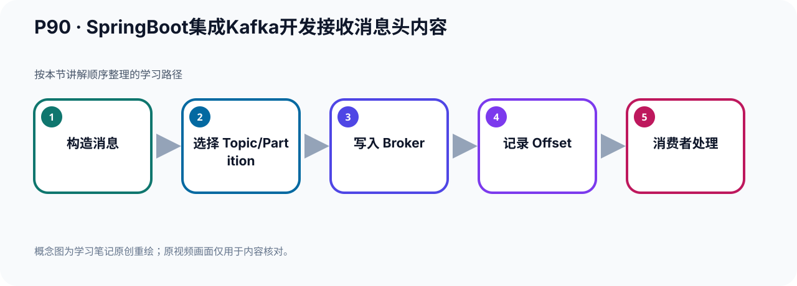
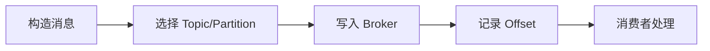

# P90：SpringBoot集成Kafka开发接收消息头内容

> 笔记编号 90/156 · 时长 05:55 · [打开原视频 P90](https://www.bilibili.com/video/BV14J4m187jz?p=90)

[← P89: SpringBoot集成Kafka开发接收消息体内容](../07-consumer-internals/p089-SpringBoot集成Kafka开发接收消息体内容.md) · [返回本章](./README.md) · [P91: SpringBoot集成Kafka开发接收消息所有内容 →](../07-consumer-internals/p091-SpringBoot集成Kafka开发接收消息所有内容.md)

## 先看结论

> 这节把“SpringBoot集成Kafka开发接收消息头内容”放回消息链路，沿 Producer、Broker、Partition、Offset 与 Consumer 追踪数据和元数据如何流动。它服务于本章目标：掌握 ConsumerRecord、监听器、手动确认、指定位置消费、批量消费、拦截器和分区分配策略。

## 老师怎么一步步讲

1. 第 1 步，围绕“SpringBoot集成Kafka开发接收消息头内容”完成构造消息。
2. 第 2 步，围绕“SpringBoot集成Kafka开发接收消息头内容”完成选择 Topic/Partition。
3. 第 3 步，围绕“SpringBoot集成Kafka开发接收消息头内容”完成写入 Broker。
4. 第 4 步，围绕“SpringBoot集成Kafka开发接收消息头内容”完成记录 Offset。
5. 第 5 步，围绕“SpringBoot集成Kafka开发接收消息头内容”完成消费者处理。

## 老师的补充说明

下面按原声顺序整理老师的完整讲解脉络。保留原因、案例、对比、操作过程、边界条件和口头提醒；删除重复语气词，并把长口语拆成适合阅读的短段落。

> 技术术语已经过统一校正；仍无法确认的人名或口头英文会保留原意，并通过右侧时间范围返回视频核对。

### 先明确：SpringBoot集成Kafka开发接收消息头内容要解决什么 · 00:00–00:43

刚才我们是通过一个注解，就是Pilot的这个注解。我们可以把消息体内容通过这个注解来标注一下，表示我这个变量是读取的消息体内容。那接下来我们介绍一个注解，就是AtHeide注解。那么它表示我这个变量是要读取你这个消息头的内容。消息头，这个消息体，那么这个消息头我们通过代码来测试一下。那就是我们在这里可以再写一个参数，然后用AtHeide是，AtHeide标注一下，用它标注。

### 老师用例子进一步解释 · 00:43–01:49

标注什么呢？那么这个AtHeide你要读这个浅牛头的内容，那你也指一下那个名字或者是value，他们两个是等价的。用名字或者是value都是可以的。那我们也写个value吧。那这里面写一个value。那个value，那等于什么呢？我要读浅牛头什么内容呢？比如说我要读他们那个Topic可。读它Topic可，那这个是我们可以用一个，这个Hide是这个参数啊，它里面有，是长料的点，这个RaceV啊，Hide是点，点，点，点RaceV啊，RaceVTopic可，就这个。

然后读到之后，把它这个Topic可，这个名字放到我的这个变量中，Topic可。那这样的话我就读到了它那个，我接收的手是从哪个Topic可接收到这个消息，这是从这个消息头去读到那种。

### 老师用例子进一步解释 · 01:50–03:19

那么从这个之外，它应该还有些别的成熟啊，我们可以看一下，比方说这个里面，这是接收的这个Topic可，那么它有接收的这个k呢，我们也可以读一下，那这个是我们可以这里再写几个测试一下。再来一个，再来一个，好，那我们接收一下比方说，它这个接收到这个k，接收到k，这是一个吧，再比如说说，这个接收这个pd型是从哪个分区接收这个消息，对吧，可以啊，好，这是k，然后这个是pd型。

那这样的话你看，我们就从旗流头中去接这个三个信息，那我们看看它有没有接到啊，好，我们打印一下，这个Topic可，Topic可它是多少，我们把它来加一下，把它Topic可打印一下。然后我们后面呢，再给它，这这地方加它，加一下，拼一下，拼接一下，再拼一个，再拼一个，再拼一个k，再拼一个pd型。那我们这个到时候运行之后，我们看看这个信息有没有拿到，通过at high的注解。那我们就首先把这个Mate方法给它运行起来，让这个接听器，接听在这个容器中。

### 跟着老师操作，并观察运行结果 · 03:20–04:12

它起到完以后，我们接下来就去发一个消息，在这里去发一个消息，发送。那发送完以后，我们就看一下这个消费者有没有拿到这些信息，那此时消费者呢，就通过这个文字。在左边这个日志中，因为右边是我们的测试，左边是我们容器起到的位置。那这里面它报了一个错，报了个错来，那就是它没有这个头，这个k，它没有这个k，那我们把这个k去掉一下，就说它发的这个消息里面是不带这个k的，接收k不带，它没有这个这个制断的，那你就把这个先删一下，这个不要。

它没有，它报错了，那不要，好，把这个就，那就下面这一段打印这一段，去掉一下。

### 最后验证结果，并收束本节结论 · 04:13–05:52

然后再看看，它这个parti系，按理说应该是有的，对吧，parti系应该是有。表示它从哪个分区接收消息，好，让这个运行方法运行起来，让这个接听器在容器中接听，好，清一下日志，我们再来发一个消息，再看一下，好，发送。那么发送完了，发送的时候，它的日志是正常的，没有问题，然后接下来，我们去把这个打印结果，在这个地方去找一下，在这边看里面接到，目前这边好像没有报一程，来，我们看一下，来，找到了，你看，它的消息都看到了，它的Topic是这个Topic，它的分区是雷分区。

那我们hando这个Topic呢，handoTopic，它确实只有一个，只有一个分区，handoTopic这个名字，这个名字，不如上面这个，上面这个给删一下吧，上面这个删掉，上面这个不是，好，这个Topic你看，它确实只有一个分区，好，那这样的话我们就拿到了这个，这个信息啊，从消息头中拿消息，这是从附带中拿消息，这是从消息的附带中拿这个消息，这个是从呢，这个头里面，消息的头里面，拿消息头，好，这是这个hando的注解，那我们在这里背住一下，是吧，那么这个就是标记该参数是消息头，消息头内容，消息头，这个内容，好，这是我们这个注解。

## 放进整套课

本节属于 **消费者开发与分区分配**。这一章要解决的是：掌握 ConsumerRecord、监听器、手动确认、指定位置消费、批量消费、拦截器和分区分配策略。

这节位于消息链路上。要顺着“发送端—Broker—分区日志—消费端”看数据和元数据怎样流动。

### 记忆路线

```mermaid
flowchart LR
    N0["构造消息"]
    N1["选择 Topic/Partition"]
    N0 --> N1
    N2["写入 Broker"]
    N1 --> N2
    N3["记录 Offset"]
    N2 --> N3
    N4["消费者处理"]
    N3 --> N4
```

## 用在工作里

| 项目 | 内容 |
|---|---|
| 先回答 | 先明确消息从哪里产生、写入哪个 Topic、由谁消费。 |
| 立刻做 | 复现发送、Broker 写入和消费者处理的完整链路。 |
| 留下证据 | 记录 Partition、Offset、序列化结果和消费端输出。 |

## 关键术语

- **Kafka：** Apache 开源的分布式事件流平台，常用于高吞吐消息传递、数据管道和流处理。
- **Topic：** 事件的逻辑分类。生产者向 Topic 写数据，消费者从 Topic 读取数据。

## 最容易踩的坑

能发送成功不代表业务处理成功；序列化、分区、确认机制和消费进度需要分别观察。

## 自测

1. 不看笔记，用自己的话解释“SpringBoot集成Kafka开发接收消息头内容”解决了什么问题。
2. 按顺序复述：构造消息、选择 Topic/Partition、写入 Broker、记录 Offset、消费者处理。
3. 如果运行结果和老师不同，你会先检查哪三个输入或环境条件？

## 学完检查

- [ ] 我能不看视频复述本节完整思路
- [ ] 我能指出关键命令、配置、类或接口的作用
- [ ] 我能解释画面中的输入与输出为什么对应
- [ ] 我读完了老师的详细讲解正文，没有只看路线图和要点
- [ ] 我完成了本节自测或复现实验

## 需要核对原话时

[查看本节带时间戳的完整 ASR](./transcripts/p090-SpringBoot集成Kafka开发接收消息头内容-ASR.md)。主笔记负责理解与实践；ASR 页面负责逐句完整性复核。
