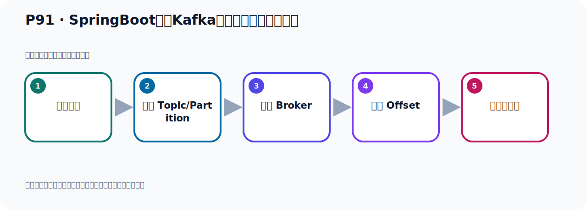
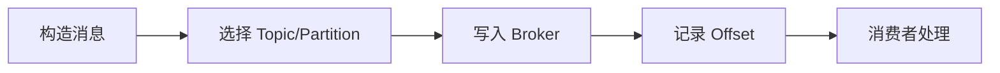

# P91：SpringBoot集成Kafka开发接收消息所有内容

> 笔记编号 91/156 · 时长 05:01 · [打开原视频 P91](https://www.bilibili.com/video/BV14J4m187jz?p=91)

[← P90: SpringBoot集成Kafka开发接收消息头内容](../07-consumer-internals/p090-SpringBoot集成Kafka开发接收消息头内容.md) · [返回本章](./README.md) · [P92: SpringBoot集成Kafka开发接收对象消息 →](../07-consumer-internals/p092-SpringBoot集成Kafka开发接收对象消息.md)

## 这节到底讲什么

**核心主题：SpringBoot集成Kafka开发接收消息所有内容。**

这节位于消息链路上。要顺着“发送端—Broker—分区日志—消费端”看数据和元数据怎样流动。
本节属于“消费者开发与分区分配”这一章；放在全章里看，它的作用是：掌握 ConsumerRecord、监听器、手动确认、指定位置消费、批量消费、拦截器和分区分配策略。

## 本节路线

## 老师的完整讲解（按视频顺序校正）

> 下面保留老师的完整讲解顺序，并修正 Kafka、Java、ZooKeeper、
> Topic、Partition、Offset 等常见识别错误。它不是压缩摘要；原始 ASR 在后面单独保留。

### 1. 00:00–01:01

好，那接下来我们看下来，我们的消息啊，也可以采用这个ConsumerRecord用它来接收，接收这个消息。用这个对象来接收消息，那么这个信息它就比较全了，这个对象中，包含很多信息，我们来看一下用它来接收消息啊。那这个是我们在这个下面呢，换行一下。用这样一个类，不是它啊，用我们这样一个类，复杂一下。用这个类来去接收消息。这个类，Record的类，不它接收。我们这边是Record啊。那如果这个地方有个Dou号分隔一下，Dou号分隔一下。用它接收的话，你看啊，这个里面呢，它有很多信息啊。有的Topic啊、分区啊、Obsite啊等等啊、时间出啊，这些都有。

### 2. 01:01–02:05

好，那你想用任何信息，通过这个对象，都可以拿到。对吧？都可以拿到。好，那我们在它这个后边啊，再打一句话吧，打一句话啊。不过去到这个事件，我们后面呢，直接就加上我们的这个，这个对象，直接托时据算了。掉下托时据方法，把它的信息打印一下。好，这个时候我们看看啊，通过它可以拿到很多信息啊，所有的信息。那我们在这地方呢，把它类方法先运起起来，然后我们去发一个消息，让它去接收一下。好，类方运起完了，然后我们去发送一个消息，那么通过这个test发送一个消息，这里右键的发送。好，那么它发送完以后，是吧？这个日志正常没有任何的问题，我们就看一下左边啊，左边这边呢，它接到消息，你看，它读到这个消息啊。

### 3. 02:05–02:49

你看这个对象中，包括你的很多信息，包括Topic，包括Party，包括一些什么Onsight，还有创建时间等等，都有了，是吧？都有了。好，这个是它到这个，用它来接收这个信息啊，这个信息比较多了，包括你的消息内容也有。如果你要想拿Tibet的信息，都有，都可以拿到。比方说，我们到时候拿消息内容，那你在这里这么拿就行了，比如说你加上，把它点开它，它点这个消息内容的话呢，应该就这个value，这就是内容，对吧？你要拿内容就拿它，那你要拿别的，比如说，拿头里面信息，通过它拿，那时间戳，通过它拿Topic，拿K，拿它，对吧？

### 4. 02:49–03:36

那Onsight，那这个Partition，都可以拿到，好，所以它比较全，所以我们也可以用这个内来接收我们的这个消息，它是比较全的，一个内。好，这是我们通过它接收消息的一种方式。那这个前面，它能不能加这个Payback的度解呢？我们说Payback的度解，它是用来标记这个消息内容的，那我们这个地方，它不光是有消息内容，还有别的，那我们这里给你试一下，我们这里前面如果加这个度解，它有没有问题，是吧？这些人加这个度解，好，那我们跑一遍测试一下。那此时呢，我们没有办法，先让它跑起来，然后我们去发个消息，看它接收有没有问题，在前面加个这个度解。

### 5. 03:37–04:42

好，其他完了，我们这个时候呢，去发出一个消息，这里发送，好，点一下这个发出消息。好，那我发出消息就发完了，在发完了，这没有问题，没错，然后这边接收到没有了，这样它也接收到了。那就是你加上这个度解之后，标记它是消息内容那也可以，它也没有毛病，也是可以的。表示我这个是接收你的消息，接收你消息内容，这样标记它也可以，但是它这样的话，感觉不是很，不是那么清晰。因为这个应该标记在这个消息体里面，就是说我的消息体的内容，消息体用它标记，但是我们用这个对象它也可以标记，标记它也没毛病，那就是你这个用的也是可以的。那我们通过测试来，已经测试了，只不过它这个度解感觉不是那么清晰，按理说这个度解应该是标记在这个内容上，内容用它标注一下。

### 6. 04:42–04:57

像这个信息它是比较多的，包含内容也包含这个情侣头，各种信息都包含。那么它起码加重解它也行，它也没毛病。好，那这是我们测试的一个情况，这是接收消息的接收情况。

## 关键术语

- **Kafka：** Apache 开源的分布式事件流平台，常用于高吞吐消息传递、数据管道和流处理。
- **Topic：** 事件的逻辑分类。生产者向 Topic 写数据，消费者从 Topic 读取数据。
- **Partition：** Topic 的物理分片，是 Kafka 并行度、顺序性和扩展能力的基本单位。
- **Consumer：** 从 Kafka Topic 拉取并处理事件的客户端。
- **ConsumerRecord：** Kafka 原生消费者收到的记录对象，包含消息体、Topic、Partition、Offset 等信息。

## 完整原声逐段记录

[查看本节带时间戳的本地 ASR](./transcripts/p091-SpringBoot集成Kafka开发接收消息所有内容-ASR.md)。主笔记负责可读性和术语校正；ASR 页面负责完整性复核。

## 读完记住

- 本节主题是 **SpringBoot集成Kafka开发接收消息所有内容**，它服务于本章目标：掌握 ConsumerRecord、监听器、手动确认、指定位置消费、批量消费、拦截器和分区分配策略。
- 理解顺序是：构造消息 → 选择 Topic/Partition → 写入 Broker → 记录 Offset → 消费者处理。
- 学习时要同时核对老师的解释、画面中的配置/代码，以及最终运行结果。

## 最容易踩的坑

能发送成功不代表业务处理成功；序列化、分区、确认机制和消费进度需要分别观察。

## 自测

1. 不看笔记，用自己的话解释“SpringBoot集成Kafka开发接收消息所有内容”解决了什么问题。
2. 按顺序复述：构造消息、选择 Topic/Partition、写入 Broker、记录 Offset、消费者处理。
3. 如果运行结果和老师不同，你会先检查哪三个输入或环境条件？

## 学完检查

- [ ] 我能不看视频复述本节完整思路
- [ ] 我能指出关键命令、配置、类或接口的作用
- [ ] 我能解释画面中的输入与输出为什么对应
- [ ] 我核对过完整 ASR，没有跳过老师的补充说明
- [ ] 我完成了本节自测或复现实验
