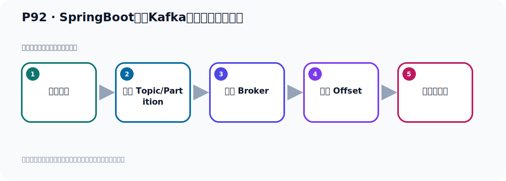
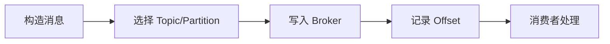

# P92：SpringBoot集成Kafka开发接收对象消息

> 笔记编号 92/156 · 时长 07:58 · [打开原视频 P92](https://www.bilibili.com/video/BV14J4m187jz?p=92)

[← P91: SpringBoot集成Kafka开发接收消息所有内容](../07-consumer-internals/p091-SpringBoot集成Kafka开发接收消息所有内容.md) · [返回本章](./README.md) · [P93: SpringBoot集成Kafka开发接收对象消息 →](../07-consumer-internals/p093-SpringBoot集成Kafka开发接收对象消息.md)

## 这节到底讲什么

**核心主题：SpringBoot集成Kafka开发接收对象消息。**

这节位于消息链路上。要顺着“发送端—Broker—分区日志—消费端”看数据和元数据怎样流动。
本节属于“消费者开发与分区分配”这一章；放在全章里看，它的作用是：掌握 ConsumerRecord、监听器、手动确认、指定位置消费、批量消费、拦截器和分区分配策略。

## 本节路线

## 老师的完整讲解（按视频顺序校正）

> 下面保留老师的完整讲解顺序，并修正 Kafka、Java、ZooKeeper、
> Topic、Partition、Offset 等常见识别错误。它不是压缩摘要；原始 ASR 在后面单独保留。

### 1. 00:00–01:19

好，那接下来我们来看一下这个消息消费的手。如果生产者他发生一个对象，比如说他发生一个优热对象，我们是否可以这样直接的接收。或者说把优热对象前面加一个拍桌的注解，这样他能否接收到。好，我们研究一下这个问题。那就说我们下面就去发送一个对象消息。那我们在这边，我们找一个准备一个优热对象，把上面我们已经有了优热对象给他拷贝过来。这个模组内他里面有个优热对象，然后放在我们这边的代码中。好，那这样的话我就有个优热对象，他里面有几个字段，这是一个对象。然后这对象上面这几个是不可注解，不可，用于生产者给的方法生成无产各个气。生成所有参数的购习，然后生成构建气模式。好，然后我们去发送消息，那我们这个时候呢，消费者这里接收，那就是这个地方去接收啊。

### 2. 01:20–02:17

接收的时候呢，我们这里将于就是我们写一个新的一个方法，把这个先注释一下。上面这个我只要把这个注解注释掉，那么他就不生效了，不生效了，我们下面来一个方法二，因为这个没有注解了，那么他不生效了，就用下面这个方法。下面这个方法呢，我们主要是这些多余的我先不要啊。多余的我可以留着，可以绑留着啊，这个可以绑留着，然后我们现在这个信息倒是优热对象，那就是我们这里写个优热对象，看能不能接到。优热，优热对象。好，看下这个消息，能不能通过这种方式，本来接到。好，那倒是把这个优的呢，打印一下，对吧，好，那就是我们接收消息啊，那我就把这个程序呢，先开在这里，把这个程序右键，测试方法运行。

### 3. 02:19–03:24

运行，好，呃，上面这个方法是用不上的啊。好，那么他运行起来了啊，他就在接听啊，在接听的，没有抱错，没错，那接下来我们就发一个对象消息，好，那我们就发个对象消息，那就在我们这个发送这个地方，写一个新的发送方法，发一个对象，叫方法二，好，那么对象呢，我们通过购建气膜，是给他购建一个对象，呃，User点build，然后购建他AD，给一个AD是AD我们随便写一个啊，然后购建一个手机号，随便写一个。然后购建一个3日，Bosthday，好，然后六个这个时间作为3日，然后最终点一下build方法，这样我们就购建了一个呢，用户对象，然后就把他用户对象呢，发送出去啊，好，到时候这里面就传一个用户对象来发送出去，。

### 4. 03:24–04:12

那我自己说个用户对象的话，发出去的话，那我自己说，注入个什么，注入个，呃，另外一个模板啊，那在这里面需要传一个呢，在范围里面指定一个obj，里面写个obj，好，我们这个叫，呃，time-battery-2，到时这里面用time-battery-2去发送，好，他就是发生一个对象的，这里面是obj，然后我们调一下这个方法去发生一个对象，那这个是我们在测试内这里，好，再写一个测试，好，这边叫方法2，那这边叫方法2，对吧，好，我们先就直接发一下啊，看看他有没有问题，先直接发一下，我们这个，监听他已经开这里的啊，这个开这里的，我们现在去发，发消息，看看他能否接到，。

### 5. 04:13–05:13

好，那现在我们就发了啊，首先这个发的手的他本身就报错了，那我们需要把发送这个报错，先解决掉，好，爆什么错，我们要走一下，看一下，他这个是蓄力化，一层，就是我们的这个优的对象，是吧，不雷转换，这个优的对象优着，到什么呢，到这个自不串，因为他默认是自不串讯的话，默认是由自不串讯的话，那你这个优着，你用自不串讯的话，他不行，不行，好，那这个时候呢，我们在这个，这地方指的一下生产者的讯的话方式，是吧，这个我们前面介绍过，好，左手指的那个指的讯的话方式，这个指，那么指的讯的话方式，有什么方式呢，换一个方式啊，点一点，好，我们看一下他这个接口的实现，那我们就给他来一个呢，来一个这个叫接成讯的话，叫这个接成讯的话，好，来一个这个来，。

### 6. 05:14–06:10

负责下他这个包米加内米，好，对关掉，那这些方写一个来接成讯的话，这个来，好，那这些话我是不是可以发出去了，是吧，啊，就可以发出去了，好，之前没发出去啊，那我们这个时候再重新发送，加这个，许的话，好，这时候没看发一下，会不会报错，好，那么此时，我这个消息发出去就没有问题了，他转成接水，啊，发到Kafka上，好，这已经发出去了，发生之后来的，我们看看我们这个消息接收这边啊，这是发送，啊，这边这个是接收，那接收这边看个呢日志，啊，这在日志，在之前启动，好，看一下往下走，往下，好，到再再下来，好，接收这边你看破错了，啊，这有异常，这个消息转换异常，。

### 7. 06:11–07:02

他是不能转换，啊，从这个使距，是吧，哎，然后优者，转优者，啊，不能转，转不了，好，包了这个出啊，那我们看一下，然后上面就是这个转换啊，不能转换，这个问题，这就是你这个消息的这个消费者这边，是吧，那你消息的消费者这边是不是也需要指定一个训练话呢，那我们看一下，他接收的时候接不到啊，就在我们这个地方，消费的时候，他接收你这个对象优者，是不行的，啊，不行的，好，那我们在这个消费者这边，是不是可以指定一个叫值得训练话，也有个值得训练话叫反讯的话的，反讯的话，是吧，好，反讯的话，那我们找一下啊，他这个反讯的话，值得反讯的话，他默论是使距的训练话，。

### 8. 07:02–07:50

反讯的话，叫DES嘛，D12多内的，是反讯的话，那我们看看，反讯的话有哪些实现，在他的接口，考取H看一下，是吧，好，那么这是反讯的话，那么我们刚才是用接收训练话，那我现在用接收反讯的话，看看能不能接到呢，好，那这个手用这个接收反讯的话，那就是这个类是吧，好，那是我们用这个接收反讯的话，就把这个类，复制一下这个代码，他类弥复制一下，复制一下，好，那我在这边啊，把多余的先关一下，那我们在这里配上，我这个反讯的话，值得反讯的话，是接收反讯的话，这边是接收训练话，这是接收反讯的话，好，这样我们来测试一下，看看可不可以，好，把代码都停掉，停了之后呢，我们，。

### 9. 07:50–07:53

首先把这个启动起来，启动。

## 关键术语

- **Kafka：** Apache 开源的分布式事件流平台，常用于高吞吐消息传递、数据管道和流处理。

## 完整原声逐段记录

[查看本节带时间戳的本地 ASR](./transcripts/p092-SpringBoot集成Kafka开发接收对象消息-ASR.md)。主笔记负责可读性和术语校正；ASR 页面负责完整性复核。

## 读完记住

- 本节主题是 **SpringBoot集成Kafka开发接收对象消息**，它服务于本章目标：掌握 ConsumerRecord、监听器、手动确认、指定位置消费、批量消费、拦截器和分区分配策略。
- 理解顺序是：构造消息 → 选择 Topic/Partition → 写入 Broker → 记录 Offset → 消费者处理。
- 学习时要同时核对老师的解释、画面中的配置/代码，以及最终运行结果。

## 最容易踩的坑

能发送成功不代表业务处理成功；序列化、分区、确认机制和消费进度需要分别观察。

## 自测

1. 不看笔记，用自己的话解释“SpringBoot集成Kafka开发接收对象消息”解决了什么问题。
2. 按顺序复述：构造消息、选择 Topic/Partition、写入 Broker、记录 Offset、消费者处理。
3. 如果运行结果和老师不同，你会先检查哪三个输入或环境条件？

## 学完检查

- [ ] 我能不看视频复述本节完整思路
- [ ] 我能指出关键命令、配置、类或接口的作用
- [ ] 我能解释画面中的输入与输出为什么对应
- [ ] 我核对过完整 ASR，没有跳过老师的补充说明
- [ ] 我完成了本节自测或复现实验
