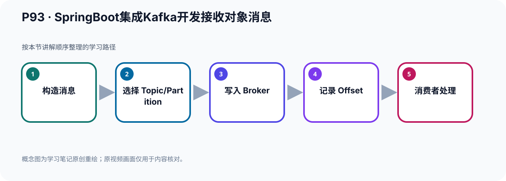
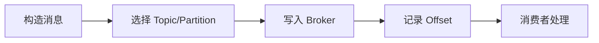

# P93：SpringBoot集成Kafka开发接收对象消息

> 笔记编号 93/156 · 时长 04:14 · [打开原视频 P93](https://www.bilibili.com/video/BV14J4m187jz?p=93)

[← P92: SpringBoot集成Kafka开发接收对象消息](../07-consumer-internals/p092-SpringBoot集成Kafka开发接收对象消息.md) · [返回本章](./README.md) · [P94: SpringBoot集成Kafka开发接收对象消息 →](../07-consumer-internals/p094-SpringBoot集成Kafka开发接收对象消息.md)

## 先看结论

> 这节把“SpringBoot集成Kafka开发接收对象消息”放回消息链路，沿 Producer、Broker、Partition、Offset 与 Consumer 追踪数据和元数据如何流动。它服务于本章目标：掌握 ConsumerRecord、监听器、手动确认、指定位置消费、批量消费、拦截器和分区分配策略。

## 老师怎么一步步讲

1. 第 1 步，围绕“SpringBoot集成Kafka开发接收对象消息”完成构造消息。
2. 第 2 步，围绕“SpringBoot集成Kafka开发接收对象消息”完成选择 Topic/Partition。
3. 第 3 步，围绕“SpringBoot集成Kafka开发接收对象消息”完成写入 Broker。
4. 第 4 步，围绕“SpringBoot集成Kafka开发接收对象消息”完成记录 Offset。
5. 第 5 步，围绕“SpringBoot集成Kafka开发接收对象消息”完成消费者处理。

## 老师的补充说明

下面按原声顺序整理老师的完整讲解脉络。保留原因、案例、对比、操作过程、边界条件和口头提醒；删除重复语气词，并把长口语拆成适合阅读的短段落。

> 技术术语已经过统一校正；仍无法确认的人名或口头英文会保留原意，并通过右侧时间范围返回视频核对。

### 先明确：SpringBoot集成Kafka开发接收对象消息要解决什么 · 00:00–00:57

提到之后，我们首先把这个启动起来。那我现在启动的时候，它提示我找不到类啊。原来它提示这个，没有这个包，没有这个类啊。那么这个类叫Jagerson这个类。Jagerson这个类。那这个需要一个JAR 包。那这个JAR 包怎么办呢？这个JAR 包我们可以通过实为物的，可以加技的啊。我们这个项目是实为物的。这边等一下。它依赖在这里是吧？我们来加个依赖，加什么依赖就加这里吧。加一个叫Jagerson依赖，就是Spring Boot，GangStart，GangJagerson。

这个依赖，这个依赖里面，这个依赖里面已经包含了Jagerson刷新一下。下来一下，好，这边看一下。这边，你看这个Jagerson，Jagerson依赖就是这个Jagerson，它没有进两文刷新一下。

### 跟着老师操作，并观察运行结果 · 00:59–02:10

刷新，我们刚刚那个Jagerson依赖在这，然后你看它里面就有Jagerson了。这有Jagerson，Jagerson这个包，Jagerson的包，都加好了。都加好之后，我们这个时候再跑一下看看有没有问题啊，刚才启动是爆出了。这个时候我们再内方运行一下啊，这个内方运行就是这个类的右键，然后运行一下。那么它现在启动了啊，启动好之后呢，那么现在没有爆出，啊，正轴的，它现在这个类就找到，找到正轴的，没有爆出，好，可以把事实清一下。

清一下之后呢，我们现在去发送，发送一个对象消息，发送一个优的对象在里面，这里面是发了一个优的对象，点击看一下里面，发出一个优的对象，对吧，发到哈多Topic上。那么先去发，用这个测试的类去发一下，点一下这个发送。发送之后看看有没有问题啊。首先这个发送是没有问题的，我们把这个直用接成序列化器的已经发了，是吧，哎，这边没有发送的时候，没有日志错误，没有日志异常。那么我们今天来看这个消费。

### 最后验证结果，并收束本节结论 · 02:10–04:13

消费这边还报错呢，而且它在不停的闪动，还在爆原，还在玩爆，还在爆，不停的爆原。在不停的爆，好，那我这个时候提一下，把这个提掉。提掉之后呢，我们看一下这个错误啊，看一下这个错误。我们这个接受消效的时候，我们也中了一个反叙的话，对吧，好，它这个错误呢是什么，是布雷这个，哎，这个什么，序列化器那个异常啊。然后再往下走一走，看一下，这个反叙的话，然后呢，呃，建职，然后是。

我想看一下，它的原因啊，就是这个参数，啊，看什么原因呢，啊，在这里看一下，它说这个U的这个内，呃，意思NOT，trust，不是一个细人的包，就你这个U的内啊，你这个靠谱北京方路的这个内，它不细人，不受细人，对吧，它只细这个加发U条，还有这个，呃，加发NOT这个包，它不细人你这个包，对吧，不细人你这个包，它没法帮你反叙的话，哎，是这个情况，啊，那就是我们这个内呢，哎，这样不行的，它没法帮你反叙的话，那这个你要去调整的话呢，就需要做很多配置，稍微有点繁琐，有点麻烦，那我们在发送这个对象的时候呢，我们可以怎么呢，我们可以啊，不去直接发送这个对象，我们人工的把这个对象先转成这个接身，然后你制服穿的方式发出去，这样就避免你这个包不受细人，它的主要原因啊，就是你这个包，不细人啊，trust的细人，不细人你这个包，

它只细细加发U条和加发NOT这个包，因为它把你这个包啊，有什么非法操作，是不安全的，所以它不细人，好，那我们像这种发送对象的话，我们其实可以这样发了，就是在发的时候呢，我们可以这样发送，然后我们可以再发送这个对象，然后我们可以再发。

## 放进整套课

本节属于 **消费者开发与分区分配**。这一章要解决的是：掌握 ConsumerRecord、监听器、手动确认、指定位置消费、批量消费、拦截器和分区分配策略。

这节位于消息链路上。要顺着“发送端—Broker—分区日志—消费端”看数据和元数据怎样流动。

### 记忆路线

```mermaid
flowchart LR
    N0["构造消息"]
    N1["选择 Topic/Partition"]
    N0 --> N1
    N2["写入 Broker"]
    N1 --> N2
    N3["记录 Offset"]
    N2 --> N3
    N4["消费者处理"]
    N3 --> N4
```

## 用在工作里

| 项目 | 内容 |
|---|---|
| 先回答 | 先明确消息从哪里产生、写入哪个 Topic、由谁消费。 |
| 立刻做 | 复现发送、Broker 写入和消费者处理的完整链路。 |
| 留下证据 | 记录 Partition、Offset、序列化结果和消费端输出。 |

## 关键术语

- **Kafka：** Apache 开源的分布式事件流平台，常用于高吞吐消息传递、数据管道和流处理。
- **Topic：** 事件的逻辑分类。生产者向 Topic 写数据，消费者从 Topic 读取数据。

## 最容易踩的坑

能发送成功不代表业务处理成功；序列化、分区、确认机制和消费进度需要分别观察。

## 自测

1. 不看笔记，用自己的话解释“SpringBoot集成Kafka开发接收对象消息”解决了什么问题。
2. 按顺序复述：构造消息、选择 Topic/Partition、写入 Broker、记录 Offset、消费者处理。
3. 如果运行结果和老师不同，你会先检查哪三个输入或环境条件？

## 学完检查

- [ ] 我能不看视频复述本节完整思路
- [ ] 我能指出关键命令、配置、类或接口的作用
- [ ] 我能解释画面中的输入与输出为什么对应
- [ ] 我读完了老师的详细讲解正文，没有只看路线图和要点
- [ ] 我完成了本节自测或复现实验

## 需要核对原话时

[查看本节带时间戳的完整 ASR](./transcripts/p093-SpringBoot集成Kafka开发接收对象消息-ASR.md)。主笔记负责理解与实践；ASR 页面负责逐句完整性复核。
