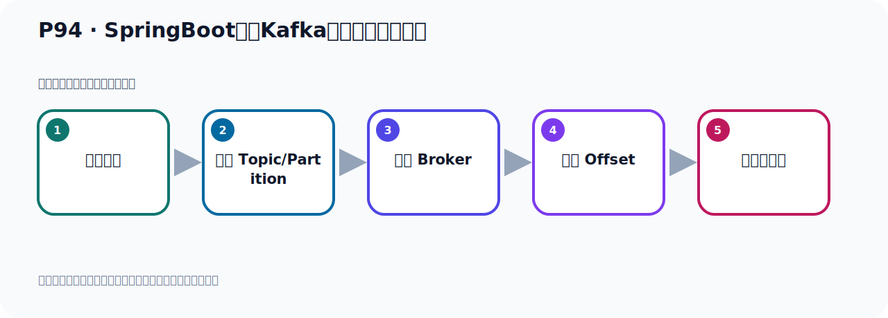
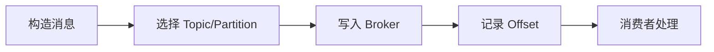

# P94：SpringBoot集成Kafka开发接收对象消息

> 笔记编号 94/156 · 时长 07:14 · [打开原视频 P94](https://www.bilibili.com/video/BV14J4m187jz?p=94)

[← P93: SpringBoot集成Kafka开发接收对象消息](../07-consumer-internals/p093-SpringBoot集成Kafka开发接收对象消息.md) · [返回本章](./README.md) · [P95: SpringBoot集成Kafka开发接收消息监听器注解 →](../07-consumer-internals/p095-SpringBoot集成Kafka开发接收消息监听器注解.md)

## 这节到底讲什么

**核心主题：SpringBoot集成Kafka开发接收对象消息。**

这节位于消息链路上。要顺着“发送端—Broker—分区日志—消费端”看数据和元数据怎样流动。
本节属于“消费者开发与分区分配”这一章；放在全章里看，它的作用是：掌握 ConsumerRecord、监听器、手动确认、指定位置消费、批量消费、拦截器和分区分配策略。

## 本节路线

## 老师的完整讲解顺序（ASR 辅助复核）

> 下面按时间顺序保留经过基础术语替换的 ASR，方便核对老师是否提到某个细节。
> 人名、命令、代码和英文参数仍可能识别错误；准确结论以本节白话说明、代码块和实操速查表为准。

### 1. 00:00–00:54

好，那我们向这种发送对象的话，我们其实可以这样发了，就是在发的时候呢，我们就直接，是吧，用自护串的方式去发，就不用搞这个对象了。用自护串的方式发，这里面放自护串，然后呢，我们这个地方呢，把这个U字转成一个，转成一个接成自护串发出去。最终还是一个自护串，U字变成一个接成串，对吧？好，写一个方法，把这个U字转成一个接成串，然后再发出去。那这样的话，我发出去还是一个自护串，对不对？好，那这个是呢，我们只需要在那边写一个工具内啊，去转一下就可以了。好，写一个U条，然后点接成U条，写个工具内，写个方法，他们的一个实在一个记得方法，好，转自护串，对象转自护串，然后突接成写这边一个方法。好，那这个种子转呢，我们可以通过那个，。

### 2. 00:55–01:54

这个谁他给我们提出了一个一个一个叫Urbogigert，maple，这个类，这个可以把对象转接成这个maple和gigert。好，那么这个是我们写一个静态的静态的这个类啊，创立一个静态的这个长量类是吧，好，所以这个那么这个变量应该是大写，这样比较标准，大写。好，通过他呢，他呢，那我们要写一个，转接成，那你这里面给我传一个对象，对象没写个Urbogigert，一个传一个对象，然后我通过这个类呢，write一下，wii te s s什么，使句，这样就把你这个Urbogigert转转接成的，就这样，啊，然后他有一层啊，有一层的我们把它直接拳开起一下，在这里可以返回一下。好，我们这个方法，就是我们先创建一个这个对象印射工具内，。

### 3. 01:55–02:49

啊，这个内，然后这里面有个方法叫write，写你这个把对象的直啊，就把对象以制服创的方式写出去，写出去之后，他就变成接成了，啊，变成一个接成制服创了，好，这个方法就是把对象转接成，那此时我们在这边就可以用一下这个方法，他点，通接成，把我们这个Urbogigert，传进来，对吧，哎，然后得了个接成，然后把接成发出去，可以了。那这些的话呢，我们这边就没有必要去配置这个值得讯化，就不需要配的，好，那这个时候把值得讯化就删掉了，默认用他的制服创就行了，好，那么下面这个，这个，呃，消费者也不需要配那种讯化了，好，那就是我们发出的时候，发的是一个呢，制服创的接成，那这边接着手，接着手，那接着手怎么呢，接着手呢，这边也是个接成的，也是个制服创，那就是说这边就接出一个什么，制服创的，。

### 4. 02:50–03:54

Urbogigert，Urbogigert就行了，那就是一个Urbogigert，然后你如果想要把这个Urbogigert转对向的话，那你可以转一下，比如说转对向，转的Urbogigert，好，Urbogigert，好，那就是接着转对向，那就是用我们这个工具类，我们再写一个方法去转对向，就像方法，在突什么，突，突B，B严育突B，好，转，转对B对向，那就是你给我传一个接成，我帮你转对向，那就是传一个接成过来，好，转接出来，让它怎么转对向呢，它点这个Rid，Rid，好，RidValue，然后变这个对向，那就是你给我传一个这个接成串进来，好，接成串进来，这个接成串，然后后面传一个类型，转成什么类型的这个对向，好，那就是这里传一个接成记得，是吧，好，后面转成一个类型，啊，转类型，那我这里指定一个类型，class，好，写个T类型，任何类型都可以，是吧，好，那我这里写个这个，这个类型就行了，。

### 5. 03:54–04:54

调类型，好，那你之前是这样的话，我们要转个对向，那就是这方面的消息传一个反轮个T，T类型，那么这是个犯行方法，所以前面加个这个T的一个一个说明，一个声名，这样我们就把它，你传一个T类型的，任何类型的class过来，是吧，class过来，我帮你转成这个对向，好，这样写也可以的，好，这个方法叫犯行方法，你前面必须要加这个监固号，你不加的话，你会有一个对向，好，这样写也可以的，好，这个方法叫犯行方法，你前面必须要加这个监固号，你不加的话，你会有一个对向，我们要不要加OurOurOur。

### 6. 04:54–05:58

然后把你的这个接吻来转对象转什么对象呢转成优热对象好那这样我们代表的起号了这个话呢我们也可以把这个接吻再转回来变成一个对象对吧好转一小拿着对象呢也没有毛病对吧这样也可以找到好那这我们直接把它对象打印象对吧好那我们就写完了啊写完之后我们这个时候测试一下那我们在这里首先把这个项目来跑起来跑起来之后我们去发送一个消息来看一下好跑起来之后啊这是我们这个这是之前的一个信息啊数据啊那现在我们重新发一个在这里再发一个好我们在你发送那发的时候呢他现在是发一个接吻啊所以他也是字不串格式的好那这个时候我们在这个地方去这个地方啊这一方去发送一下。

### 7. 06:04–06:57

好那我们这个发送就发完了没有异常然后看消费者这边接到没有看一下他接到了这用对象依然可以接到啊没有任何问题好这就是我们这个如果你是一个对象消息你可以这样的处理不然的话你直接呢发出对象的话呢他会出现一个这个包不信任的那会有这样一个问题那我们可以用这种方式来去发的话呢就没有问题的把它变成一个字不串然后发出去就不会出现这个包不信任这个问题而且我们在消费者这边也可以把这个接吻出来再转承对象也可以再转过去我们只需要写个工具方法就可以了工具方法就可以了好那以上这个呢就是说我们如果想直接这样去接受对象他还是有问题的这有问题所以这个我们先去调一下。

### 8. 06:57–07:09

因为他那个包是不信任的不信任的好以上的就是我们发送对象消息接受对象消息的一个一个处理的方式。

## 关键术语

- **Kafka：** Apache 开源的分布式事件流平台，常用于高吞吐消息传递、数据管道和流处理。

## 完整原声逐段记录

[查看本节带时间戳的本地 ASR](./transcripts/p094-SpringBoot集成Kafka开发接收对象消息-ASR.md)。主笔记负责可读性和术语校正；ASR 页面负责完整性复核。

## 读完记住

- 本节主题是 **SpringBoot集成Kafka开发接收对象消息**，它服务于本章目标：掌握 ConsumerRecord、监听器、手动确认、指定位置消费、批量消费、拦截器和分区分配策略。
- 理解顺序是：构造消息 → 选择 Topic/Partition → 写入 Broker → 记录 Offset → 消费者处理。
- 学习时要同时核对老师的解释、画面中的配置/代码，以及最终运行结果。

## 最容易踩的坑

能发送成功不代表业务处理成功；序列化、分区、确认机制和消费进度需要分别观察。

## 自测

1. 不看笔记，用自己的话解释“SpringBoot集成Kafka开发接收对象消息”解决了什么问题。
2. 按顺序复述：构造消息、选择 Topic/Partition、写入 Broker、记录 Offset、消费者处理。
3. 如果运行结果和老师不同，你会先检查哪三个输入或环境条件？

## 学完检查

- [ ] 我能不看视频复述本节完整思路
- [ ] 我能指出关键命令、配置、类或接口的作用
- [ ] 我能解释画面中的输入与输出为什么对应
- [ ] 我核对过完整 ASR，没有跳过老师的补充说明
- [ ] 我完成了本节自测或复现实验
