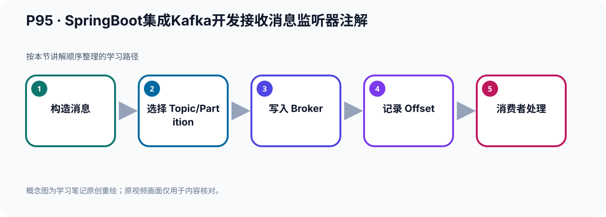
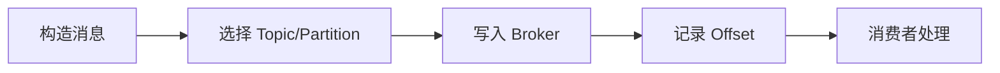

# P95：SpringBoot集成Kafka开发接收消息监听器注解

> 笔记编号 95/156 · 时长 04:18 · [打开原视频 P95](https://www.bilibili.com/video/BV14J4m187jz?p=95)

[← P94: SpringBoot集成Kafka开发接收对象消息](../07-consumer-internals/p094-SpringBoot集成Kafka开发接收对象消息.md) · [返回本章](./README.md) · [P96: SpringBoot集成Kafka开发接收消息监听器手动确认消息 →](../07-consumer-internals/p096-SpringBoot集成Kafka开发接收消息监听器手动确认消息.md)

## 先看结论

> 这节把“SpringBoot集成Kafka开发接收消息监听器注解”放回消息链路，沿 Producer、Broker、Partition、Offset 与 Consumer 追踪数据和元数据如何流动。它服务于本章目标：掌握 ConsumerRecord、监听器、手动确认、指定位置消费、批量消费、拦截器和分区分配策略。

## 老师怎么一步步讲

1. 第 1 步，围绕“SpringBoot集成Kafka开发接收消息监听器注解”完成构造消息。
2. 第 2 步，围绕“SpringBoot集成Kafka开发接收消息监听器注解”完成选择 Topic/Partition。
3. 第 3 步，围绕“SpringBoot集成Kafka开发接收消息监听器注解”完成写入 Broker。
4. 第 4 步，围绕“SpringBoot集成Kafka开发接收消息监听器注解”完成记录 Offset。
5. 第 5 步，围绕“SpringBoot集成Kafka开发接收消息监听器注解”完成消费者处理。

## 老师的补充说明

下面按原声顺序整理老师的完整讲解脉络。保留原因、案例、对比、操作过程、边界条件和口头提醒；删除重复语气词，并把长口语拆成适合阅读的短段落。

> 技术术语已经过统一校正；仍无法确认的人名或口头英文会保留原意，并通过右侧时间范围返回视频核对。

### 先明确：SpringBoot集成Kafka开发接收消息监听器注解要解决什么 · 00:00–00:50

下面我们继续看下这个GSO消息的时候，这个监力器，它在读取你的Topic、分组的词，也可以去读一个站位服的信息。我们看一下，比方说，我们在这里把所有的关一下，把程序关掉。我们这是消费者在这，是吧？我们把上面原来这个注释掉，我们写一个新方法。新方法，我们这里叫三，未来能够看的打击信息，我们写个三，再写个三，上面这是二，再说二。然后上面这个分是一，这是一，区分一下。我们这个三在上面这个重视都注不掉了，它还不是一项了，我们只有这个三是一项，这个三没有把重点考过来。

### 老师用例子进一步解释 · 00:51–02:35

那就是说我们这个名字，你可以用站位服，可以用站位服的话，你可以把这个名字配在这个配置的念中，那此时我们可以这样配一下，比如说，Kafka，然后点Topic，对吧？然后点名字，等于什么？这是我们字D一配置，这是字D的换一行，然后这个帽号，换一行，Topic，然后帽号，名字我们是叫这个名字，哈啰，是吧？这所谓字D一配置，字D一配置，不是框架提供的，字D一配置，那么这个字D一配置它是可以读的，可以通过来，这个站位服可以读过来，那就是我们这一份呢，把它用这个多了，多了大过号，大过号。

然后就是Kafka，点Topic，点内容，好，那么通过它呢，点一下，你看，它就读到了你这个名字，那同样的，你这个分组，这个分组呢，你也可以在你配一下，Kafka，Topic，这个，那我们写一下Kafka，这个，扣胸，消费吗？扣胸，然后帽号，然后这个呢，这个分组，记，IOP分组，好，名字叫这个名字，对吧？这个名字，好，那我们这边可以读一下，这就是这里方就是怎么，站位服去读，多了，然后就是Kafka，扣胸，然后这个，gob，对吧？

### 最后验证结果，并收束本节结论 · 02:35–04:14

你看我们这点一下，它可以到这里来，好，也就是这些信息，我们在这代码中可以不写识，不写识呢，我们可以写了这个配置文件里面，好，然后呢，在这个代码中，通过站位服也可以读到它，也可以读到，好，那我们重新再测试一下这个代码，看看它有没有问题呢，这个所谓右键，运行这个测试方法，让这个gnd器启动，启动之后呢，我们去发一个消息去看一下，好，那启动之后，你看代码里面，正轴的没有包一场，它清掉，清掉之后，然后在这个测试这里测试一下，好，这里发一个消息，发送一下试一下，好，那我们这个发送呢就结束了，它发送呢也是正轴的，没有异常，上面这些东西它不是异常，这个是一个配置信息里可以开启，那这是一个，你来往后走啊，在这个配置信息上，这个，这个，丢下这个config，一个配置呢，配置的values，配置值，它不是异常，好，那完了之后呢，

我们看看这个消费者有没有接到，这是发送，关掉，消费者接到没有呢，看一下它打印，这个4件3，你看，打印出来了，就是我们消费者，就是我们这个代码，这个代码是吧，打印出来了，说明我们这样读取是可以的，好，也就是呢，我们这个托弥克啊，还有gubu id啊，这些数据啊，也可以从配置，配置维艳中去读取，我们这边呢，用站位服就可以使用啊，使用我们配置维艳中的这个值，好，这是一个小细节。

## 放进整套课

本节属于 **消费者开发与分区分配**。这一章要解决的是：掌握 ConsumerRecord、监听器、手动确认、指定位置消费、批量消费、拦截器和分区分配策略。

这节位于消息链路上。要顺着“发送端—Broker—分区日志—消费端”看数据和元数据怎样流动。

### 记忆路线

```mermaid
flowchart LR
    N0["构造消息"]
    N1["选择 Topic/Partition"]
    N0 --> N1
    N2["写入 Broker"]
    N1 --> N2
    N3["记录 Offset"]
    N2 --> N3
    N4["消费者处理"]
    N3 --> N4
```

## 用在工作里

| 项目 | 内容 |
|---|---|
| 先回答 | 先明确消息从哪里产生、写入哪个 Topic、由谁消费。 |
| 立刻做 | 复现发送、Broker 写入和消费者处理的完整链路。 |
| 留下证据 | 记录 Partition、Offset、序列化结果和消费端输出。 |

## 关键术语

- **Kafka：** Apache 开源的分布式事件流平台，常用于高吞吐消息传递、数据管道和流处理。
- **Topic：** 事件的逻辑分类。生产者向 Topic 写数据，消费者从 Topic 读取数据。

## 最容易踩的坑

能发送成功不代表业务处理成功；序列化、分区、确认机制和消费进度需要分别观察。

## 自测

1. 不看笔记，用自己的话解释“SpringBoot集成Kafka开发接收消息监听器注解”解决了什么问题。
2. 按顺序复述：构造消息、选择 Topic/Partition、写入 Broker、记录 Offset、消费者处理。
3. 如果运行结果和老师不同，你会先检查哪三个输入或环境条件？

## 学完检查

- [ ] 我能不看视频复述本节完整思路
- [ ] 我能指出关键命令、配置、类或接口的作用
- [ ] 我能解释画面中的输入与输出为什么对应
- [ ] 我读完了老师的详细讲解正文，没有只看路线图和要点
- [ ] 我完成了本节自测或复现实验

## 需要核对原话时

[查看本节带时间戳的完整 ASR](./transcripts/p095-SpringBoot集成Kafka开发接收消息监听器注解-ASR.md)。主笔记负责理解与实践；ASR 页面负责逐句完整性复核。
