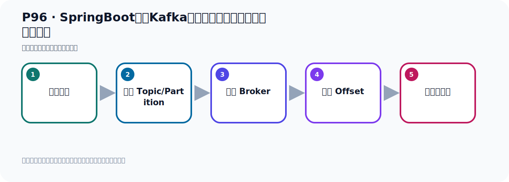
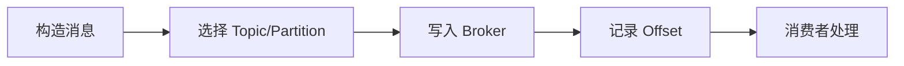

# P96：SpringBoot集成Kafka开发接收消息监听器手动确认消息

> 笔记编号 96/156 · 时长 07:00 · [打开原视频 P96](https://www.bilibili.com/video/BV14J4m187jz?p=96)

[← P95: SpringBoot集成Kafka开发接收消息监听器注解](../07-consumer-internals/p095-SpringBoot集成Kafka开发接收消息监听器注解.md) · [返回本章](./README.md) · [P97: SpringBoot集成Kafka开发接收消息监听器手动确认消息 →](../07-consumer-internals/p097-SpringBoot集成Kafka开发接收消息监听器手动确认消息.md)

## 这节到底讲什么

**核心主题：SpringBoot集成Kafka开发接收消息监听器手动确认消息。**

这节位于消息链路上。要顺着“发送端—Broker—分区日志—消费端”看数据和元数据怎样流动。
本节属于“消费者开发与分区分配”这一章；放在全章里看，它的作用是：掌握 ConsumerRecord、监听器、手动确认、指定位置消费、批量消费、拦截器和分区分配策略。

## 本节路线

## 老师的完整讲解顺序（ASR 辅助复核）

> 下面按时间顺序保留经过基础术语替换的 ASR，方便核对老师是否提到某个细节。
> 人名、命令、代码和英文参数仍可能识别错误；准确结论以本节白话说明、代码块和实操速查表为准。

### 1. 00:00–01:04

接下来我们继续看一下消息的接收通过接听器和消息。这里面有一个ICK接口参数。在这个接收消息的时候，这里面可以传个ICK接收参数。我们看看这个参数有什么作用。我们在这里写个代码来演示、测试一下。我就把这个代码拷贝一份，放下面，把方法改成方法4。把上面这个重点去掉，那么它就失效了。我们在这里测试，其他地方都一样的。我们在这里就是多接收一个参数，多接收一个参数。这里加一个Dou号，加什么参数呢？ICK这个参数。这个参数的含义就是确认的意思。就是确认这个意思，ICK。我们去翻译一下，你看一下这个单词，本身就是确认的意思。它什么意思？

### 2. 01:04–02:19

承认、确认、收接确认、确认收到，就这个意思，ICK。这个单词，这个接口有什么用呢？它主要是启用手动消息确认模式，开启手动消息确认。如果说你直接加这个参数，这个参数里面它有一个方法，就叫ICK这个方法。就这个方法，叫开启手动确认这个消息。什么意思呢？就是告诉Kafka、卡福卡这个服务器。该消息呢？该消息我已经收到了，就告诉他我已经收到这个消息场，这个两个确认。默认情况下，卡福卡是自动确认，它不需要你手动确认，它默认自动确认。它这边这个方法掉了之后，它就消息就确认了，它是自动化确认的，自动确认。那现在我们相遇用这个参数来开启手动确认，好，这我们手动确认，我发出接收消息之后，我们手动确认。

### 3. 02:19–03:13

好，这里我们写个试，去翻一下，写个试，去翻一下。好，那现在这个预期，那有没有问题呢？我们去看一下。好，那我们就把这个代码给它跑起来，这上面都住不掉了，现在只剩下一个接听器了。然后把代码先预期起来，让这个接听器在Spring Boot绿容器中给它接听起来，然后我们去发消息，去观察一下。好，那么发消息去观察一下它，那我们看一下呢，我们在这个地方发消息，在你发消息，我们点一下发送，发送一下。看看有没有什么问题，看一下。好，那我们这个消息就发送完了，这边是不是都是正常的，发送完了，关掉。那我们左边这个是我们的接听器，接听器它里面已经抛出一个异程了，看一下。

### 4. 03:14–04:15

抛出个异程了，这个异程啊，就是它说你没有这个LCK可以用，作为一个参数，就是没有ACK可以用啊。就你这个手动模式，现在相遇没有成功，它说这个接听器啊，接听器容器，必须有一个呢，手动模式。然后我们才可以使用这个ACK，也就是你这个方法中直接拿这个参数的话呢，它是不行的啊，它是接不到数据的，它是抱错的。因为你还没有开启这个服务端的这个手动确认模式，那这个时候你是不能用这个参数的，不能用这个参数的。你要开启手动确认模式之后，才可以用这个参数，所以现在用这个参数，它是抱错的。然后我们这个读取这个数据，你看它应该没读到，因为这个方法本身一调用的时候就抱错了，收一下字，你看，这个是没有的，没读到啊，它没读到。

### 5. 04:15–05:17

所以这个时候呢，你要想使用这个参数的话，你要让你的服务系这个接听的时候，要开启手动确认模式。那怎么开启呢，那这个时候在我们的配置的业中啊，在配置别中不是在这个消费者啊，还是在什么呢，还是在他这个LASER的这个接听器里面，配置这个接听器，消息这个接听器。是吧，它里面有个LASER的这个配置啊，LASER的，对吧，好，LASER里面有一个叫ICK，ICK，这个模式就这个，ICK模式。好，那么开什么模式呢，我们找这个叫手动模式，这个手动模式，好，开启手动模式，那我们开启消息确认，这是开启这个消息GNT的这个，手动确认模式，是吧，就是我收到消息之后啊，我要自己手动调一个方法，告诉服务器我收到这个消息了。

### 6. 05:17–06:09

还不是让这个程序自动去告诉服务器，还需要我们手动去告诉服务器，就是我们要人工去调一行这个代码，表示我确认啊。好，就是要这样开启这个手动确认模式，好，开启完之后，我们重新再测试代码。好，那首先呢，还是让这个容器先启动起来，让GNT啊，现在GNT啊，先开始消息GNT，现在它已经启动好了。启动好以后呢，把这个认字就可以清掉啊，清掉它没有报错啊，接下来我们去发一个消息看一下，我们首先看一下我们现在这个对接中有几个消息啊，打开这个Halotopy吧，再刷新一下，目前它里面有五个消息啊，有五个。好，五个消息，现在我在这里再去发一个消息啊，再去发一个，调这个方法，发送一个。

### 7. 06:14–06:58

好，那现在它就发送完成，没有问题，发送完了。好，那此时看左边这边啊，那这边呢，它也没有报错，而且我们的这个消息也收到了，是吧，也收到这个消息了。好，那收到之后呢，我们是通过手动确认的，好，它现在没有报错，那你开启这个参数之后，开启这个手动模式以后呢，你这边这个方法，GNT这个方法才可以接收这个参数，否则你用这个参数它会报错，现在就不报错了。那现在呢，我们如果说我们这个手动确认消息，我不确认，那会出什么奇迫呢？好，那我们去测试一下。好，那我们就开始测试一下，我们现在就开始测试一下。

## 关键术语

- **Kafka：** Apache 开源的分布式事件流平台，常用于高吞吐消息传递、数据管道和流处理。

## 完整原声逐段记录

[查看本节带时间戳的本地 ASR](./transcripts/p096-SpringBoot集成Kafka开发接收消息监听器手动确认消息-ASR.md)。主笔记负责可读性和术语校正；ASR 页面负责完整性复核。

## 读完记住

- 本节主题是 **SpringBoot集成Kafka开发接收消息监听器手动确认消息**，它服务于本章目标：掌握 ConsumerRecord、监听器、手动确认、指定位置消费、批量消费、拦截器和分区分配策略。
- 理解顺序是：构造消息 → 选择 Topic/Partition → 写入 Broker → 记录 Offset → 消费者处理。
- 学习时要同时核对老师的解释、画面中的配置/代码，以及最终运行结果。

## 最容易踩的坑

能发送成功不代表业务处理成功；序列化、分区、确认机制和消费进度需要分别观察。

## 自测

1. 不看笔记，用自己的话解释“SpringBoot集成Kafka开发接收消息监听器手动确认消息”解决了什么问题。
2. 按顺序复述：构造消息、选择 Topic/Partition、写入 Broker、记录 Offset、消费者处理。
3. 如果运行结果和老师不同，你会先检查哪三个输入或环境条件？

## 学完检查

- [ ] 我能不看视频复述本节完整思路
- [ ] 我能指出关键命令、配置、类或接口的作用
- [ ] 我能解释画面中的输入与输出为什么对应
- [ ] 我核对过完整 ASR，没有跳过老师的补充说明
- [ ] 我完成了本节自测或复现实验
