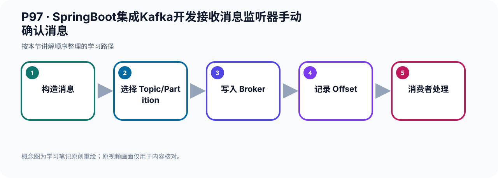
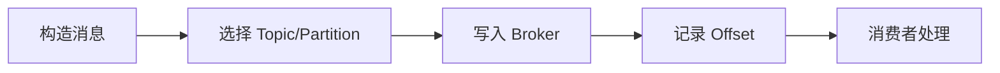

# P97：SpringBoot集成Kafka开发接收消息监听器手动确认消息

> 笔记编号 97/156 · 时长 07:25 · [打开原视频 P97](https://www.bilibili.com/video/BV14J4m187jz?p=97)

[← P96: SpringBoot集成Kafka开发接收消息监听器手动确认消息](../07-consumer-internals/p096-SpringBoot集成Kafka开发接收消息监听器手动确认消息.md) · [返回本章](./README.md) · [P98: SpringBoot集成Kafka开发指定topic-partition-offset消费消息 →](../07-consumer-internals/p098-SpringBoot集成Kafka开发指定topic-partition-offset消费消息.md)

## 先看结论

> 这节把“SpringBoot集成Kafka开发接收消息监听器手动确认消息”放回消息链路，沿 Producer、Broker、Partition、Offset 与 Consumer 追踪数据和元数据如何流动。它服务于本章目标：掌握 ConsumerRecord、监听器、手动确认、指定位置消费、批量消费、拦截器和分区分配策略。

## 老师怎么一步步讲

1. 第 1 步，围绕“SpringBoot集成Kafka开发接收消息监听器手动确认消息”完成构造消息。
2. 第 2 步，围绕“SpringBoot集成Kafka开发接收消息监听器手动确认消息”完成选择 Topic/Partition。
3. 第 3 步，围绕“SpringBoot集成Kafka开发接收消息监听器手动确认消息”完成写入 Broker。
4. 第 4 步，围绕“SpringBoot集成Kafka开发接收消息监听器手动确认消息”完成记录 Offset。
5. 第 5 步，围绕“SpringBoot集成Kafka开发接收消息监听器手动确认消息”完成消费者处理。

## 老师的补充说明

下面按原声顺序整理老师的完整讲解脉络。保留原因、案例、对比、操作过程、边界条件和口头提醒；删除重复语气词，并把长口语拆成适合阅读的短段落。

> 技术术语已经过统一校正；仍无法确认的人名或口头英文会保留原意，并通过右侧时间范围返回视频核对。

### 先明确：SpringBoot集成Kafka开发接收消息监听器手动确认消息要解决什么 · 00:00–01:03

下面就是JDK，JDK到消息之后，把消息做个打印，也就是这里面是做业务处理，其实这样代码是做业务处理。我们JDK到消息之后，我们开始来就是收到消息之后，收到消息后，处理业务。业务处理完以后，我们是发出确认。业务处理完成，那就是给服务器确认，给卡尔夫卡这个服务器的确认。那现在我现在不给服务器确认，你不给服务器确认怎么办呢？那你这个消息相当于就没有消费，下次还可以再读这个消息。这样的话就会出现消息重复消费，那你要做好消息的密等性的一个控制。

我们现在测试一下，就是我不消费的话，我不确认的话，那么这个消息，它可以被多次消费。

### 老师用例子进一步解释 · 01:04–02:25

我们测试一下这个现象，首先把代码跑起来，跑起来之后我们就开始在容器中监听消息，日志清一下。然后我们就去发一个消息，发个消息它肯定就可以接到，让我们发个消息。发送一下，好这是发送，发送之后它这边就发送完了，发送完以后那么它这边肯定接到了。接到了之后你看，由于你接到之后，你没有进行确认，就是这个消息，这个消息没有确认。没有确认的话，其实我现在把这个程序重启一下，比如说我现在把点一下这个重启，或者关闭之后我重启一下，给我点重启。

重启它又可以收到这个消息，就相与这个消息还没有消费，还没有消费。然后我们再关掉，然后再启动，它还可以接收到这个消息，又可以接到这个消息，对吧，你关掉之后，你再启动，又可以接到这个消息。这是这样子，那如果说我现在做一下确认，那就是在消息业务处理完之后，我们给它确认一下。

### 跟着老师操作，并观察运行结果 · 02:26–03:40

确认一下就是我们告诉服务器这个消息我已经处理过了，好，那么下次你就接收不到这个消息了。相当于就是把那个服务器的Offset就会做一个更新，Offset那种偏移量会做更新，你没有提交的话，那么偏移量没有更新。你确认提交了，那么它就会更新偏移量。那下次它会从下一个这个位置开始读，你没有确认的话，那么偏移量还是之前那个老位置，所以你下次启动这个消费者，它可以继续从这个老位置开始读，因为你这个偏移量没有更新，你确认之后那偏移量就更新了，它就可以从后面位置开始读。

现在我就把这个确认了，确认了以后来把这个程序跑起来，跑起来之后那么它启动之后就可以收到这个消息，收到这个消息之后，然后它给服务器已经发了个确认了。它已经发了个确认了，确认之后那么服务器的Offset消息的这个下标，这个序号就会更新。更新的我如果说我这个时候再启动我这个程序的话，之前可以再接到，那你再把它关闭，然后你再启动一下，那它就接不到了，因为那个Offset已经更新了。

### 对比不同情况，明确条件和边界 · 03:41–04:44

此时你看一下，它是接不到消息的，可以看一下，没有这个消息，因为消息已经确认了。这里是我们这个手动确认，所以我们在开发的时候，也写单文的时候你可以这样写，把那个业务代码，你可以用它确认起来。放到这个券，这个语句快，券语句快。然后呢我们这个代码在这，是吧，这个语句快。如果业务充现问题，我们开启一下这个议程，看一下议程，如果充现问题的。充现问题的我们就不确认，你如果没有问题就确认，如果说你这边充现议程充现问题，那这个手机不用调这个sq。

也不调sq，那么它可以下次可以再去接收这个消息，因为它的那个偏移下标，偏移量还没有更新。比方说我们在这个位置假设发这个议程，然后呢等于一时除以零，它也可以发生议程的。

### 跟着老师操作，并观察运行结果 · 04:45–06:08

发生议程之后，那么这个议程之后，它就到这里来吧，到这里来之后我们没有做消息确认，那这个消息还可以再接收。因为你没有确认可以再接收，我们可以试一下，那么此时把这个容器先启动，让监听器在容器中先监听。那么它现在在这里监听，然后我们去发一个消息，我们看一下，那此时在这里吗，我们去发送一个消息，发送一个消息。那我这个消息看一下，啊，消息就发完了，看一下是字发完了，好，关掉。

那此时你看左边啊，因为它发生议程的，它是除以零的议程，啊，它这个消息接到了，但是它除以零的议程，它只是没有确认，它这个，这地方呢，它首先第一次读了这个消息，然后发生这个议程了，然后没有确认，没有确认了，它又发了一遍啊，又想又接受了一遍。接受一遍之后呢，然后依然是异常，然后没有确认，没有确认，没有确认了，那个欧山的片一亮就没有更新，没有更新了，现在我现在把这个代码重启一下，我再重启它还可以再接这个消息啊，再接受，你看。

重启之后，它可以再接受到这个消息，你看一下上面，这个消息又可以接到，然后你关闭之后，然后再接受，它又可以接到。

### 最后验证结果，并收束本节结论 · 06:09–07:21

也就是它那个片一的这个下标没有更新，所以我在起的手又可以从这个又可以接到这个消息，它更新之后你下次，才可以从它后面位置开始去接受消息，它没有更新的，你要开始从这个位置开始接受消息。这是我们关于这个手动提交，这个问题，通过ICK去手动提交，那这的话呢，我们可以达到什么效果呢，就是我们可以自己来控制你要不要提交，在莫雷情况下，Kafka消息服务器消费消息后，它会自动发送确认给服务器。

表示它默认是制动提交，发送给服务器一个确认，表示消息已经被成功处理，这是它制动的方式，但是我们有的时候啊，在某些程序下，我们希望消息处理成功后再发确认。也就是我们业务处理成功了，我就发确认，没有处理成功我不发确认，处理失败的时候我不发确认。这的话以便于这个消息我可以再接收到，可以再接收这个消息。这就是它的手动消息确认。

## 放进整套课

本节属于 **消费者开发与分区分配**。这一章要解决的是：掌握 ConsumerRecord、监听器、手动确认、指定位置消费、批量消费、拦截器和分区分配策略。

这节位于消息链路上。要顺着“发送端—Broker—分区日志—消费端”看数据和元数据怎样流动。

### 记忆路线

```mermaid
flowchart LR
    N0["构造消息"]
    N1["选择 Topic/Partition"]
    N0 --> N1
    N2["写入 Broker"]
    N1 --> N2
    N3["记录 Offset"]
    N2 --> N3
    N4["消费者处理"]
    N3 --> N4
```

## 用在工作里

| 项目 | 内容 |
|---|---|
| 先回答 | 先明确消息从哪里产生、写入哪个 Topic、由谁消费。 |
| 立刻做 | 复现发送、Broker 写入和消费者处理的完整链路。 |
| 留下证据 | 记录 Partition、Offset、序列化结果和消费端输出。 |

## 关键术语

- **Kafka：** Apache 开源的分布式事件流平台，常用于高吞吐消息传递、数据管道和流处理。
- **Offset：** 事件在 Partition 中的位置编号，也是消费者记录消费进度的依据。

## 最容易踩的坑

能发送成功不代表业务处理成功；序列化、分区、确认机制和消费进度需要分别观察。

## 自测

1. 不看笔记，用自己的话解释“SpringBoot集成Kafka开发接收消息监听器手动确认消息”解决了什么问题。
2. 按顺序复述：构造消息、选择 Topic/Partition、写入 Broker、记录 Offset、消费者处理。
3. 如果运行结果和老师不同，你会先检查哪三个输入或环境条件？

## 学完检查

- [ ] 我能不看视频复述本节完整思路
- [ ] 我能指出关键命令、配置、类或接口的作用
- [ ] 我能解释画面中的输入与输出为什么对应
- [ ] 我读完了老师的详细讲解正文，没有只看路线图和要点
- [ ] 我完成了本节自测或复现实验

## 需要核对原话时

[查看本节带时间戳的完整 ASR](./transcripts/p097-SpringBoot集成Kafka开发接收消息监听器手动确认消息-ASR.md)。主笔记负责理解与实践；ASR 页面负责逐句完整性复核。
