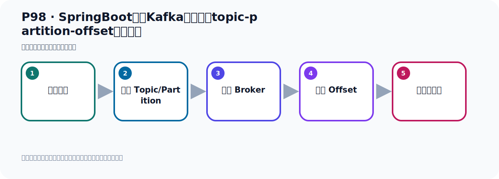
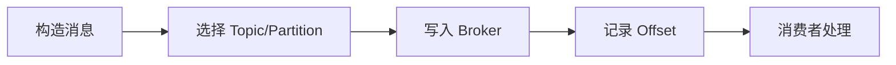

# P98：SpringBoot集成Kafka开发指定topic-partition-offset消费消息

> 笔记编号 98/156 · 时长 05:06 · [打开原视频 P98](https://www.bilibili.com/video/BV14J4m187jz?p=98)

[← P97: SpringBoot集成Kafka开发接收消息监听器手动确认消息](../07-consumer-internals/p097-SpringBoot集成Kafka开发接收消息监听器手动确认消息.md) · [返回本章](./README.md) · [P99: SpringBoot集成Kafka开发指定topic-partition-offset消费消息 →](../07-consumer-internals/p099-SpringBoot集成Kafka开发指定topic-partition-offset消费消息.md)

## 这节到底讲什么

**核心主题：SpringBoot集成Kafka开发指定topic-partition-offset消费消息。**

这节位于消息链路上。要顺着“发送端—Broker—分区日志—消费端”看数据和元数据怎样流动。
本节属于“消费者开发与分区分配”这一章；放在全章里看，它的作用是：掌握 ConsumerRecord、监听器、手动确认、指定位置消费、批量消费、拦截器和分区分配策略。

## 本节路线

## 老师的完整讲解（按视频顺序校正）

> 下面保留老师的完整讲解顺序，并修正 Kafka、Java、ZooKeeper、
> Topic、Partition、Offset 等常见识别错误。它不是压缩摘要；原始 ASR 在后面单独保留。

### 1. 00:00–00:49

好，那接下来我们继续看一下，我们Kafka接收消息的时候，我们能不能指定Topic、指定Partition、指定Offset、进行消费。好，那这里呢，我们给他举个例子，以后你在项目开发中就可以参考这个例子来进行开发。那这里主要就是他的配置稍微麻烦点，在我们接近期这个注解中啊，通过加一些属性，然后配置一下就可以实现。我们可以指定从某个偏移下标开始消费消息，指定从某个分区开始消费消息。那我们这个Topic肯定是需要指定的，后面的两个呢，我们看看怎么指定。好，那我们有写个代码，测试一下啊。好，那代码呢，我在这里就把这个代码提前写好了，写了一个例子啊。

### 2. 00:49–01:44

好，那我现在把上面这个注解给他注释掉，上面这个福利用了。让我们看一下第五个这个方法啊，方法五对吧。好，首先这个主ID，消费主ID，好，得到我们配置文件啊，那我们在这个配置文件中有个主ID，那么他得了这个主ID。然后在这个地方就是配置那个Topic Partixi相关信息，就是包括Topic，包括Partixi。好，那么他这个属性，你看一下，他是一个数组，然后数组呢是这个类型，那么这个类型又是个注解。他是个注解，所以这方面用at符号，由于他这个属性是个数组，说我们写个大过号，大过号从那开始，然后到这结束。好，他里面的类型是这个注解，好，所以我们加一个这个注解，那么这个注解里面他又有一些属性，是吧，有些属性。

### 3. 01:44–02:29

好，所以我们这里指定，这个属性就是，这是指定Topic的名字，那这个名字肯定需要有个Topic的名字，你要GNT打个Topic。好，Topic的名字我们从配置标中，躲这个Handle，躲着名字，然后然后我们看一下，我们脱这个名字是这个名字，哎，我这名字叫Name，不是叫这个名字，我看我们在什么写错了。我们上面这一方写Name，这里写错了，这地方是Name，Topic的Name是这样的，卡付卡，Topic的Name，看一下，卡付卡，Topic的Name，是Name，好。这是Topic的名字，然后这是我们的分区，就是我要读，我要GNT，这个Topic下到，雷分区，一分区和二分区。

### 4. 02:29–03:16

这个分区，它是个数组，是吧，它是个数组，所以里面可以存多个，可以存多个，是这个情况，来，关一下。好，然后这个地方是PartyC O-Side，那在这个PartyC O-Side里面，它本身是个数组，然后它又是一个，数组本身这个类型又是一个注解，所以我们在这个属性中，它是什么呢，首先等于一个大过号，大过号，大过号表示是数组，这是大过号，表示是数组，然后它里面的类型，它是一个这个注解，所以我们里面的这个注解，好，注解里面的它又有很多属性，是吧，这里面有很多属性，好，那这里面我们定义一下，这个分区3，分区4，分区3从什么位置开始读呢，它的出手位置，从3这个O-Side开始读，。

### 5. 03:16–04:18

好，这个也是从3这个位置开始读，好，这种整个这个配置，那么整个这个配置表示什么意思呢，就是说，我们接听这个Kafka的，首先这是Kafka的Topic，是吧，首先一个Topic，Topic下的分区，那就是雷分区，一分区，二分区，这三个分区的所有消息，这三个分区是不限制O-Side的，不限制偏移量的，好，另外还有一个叫三分区和四分区，也就是我们这个Topic下的那个三分区和四分区，我们只读，我们只读三偏移量是三以后的数据，三以前的数据我们是不读的，所以整个这个配置就是这个意思，好，整个配置就是我们接听这个Topic，这个Topic下的雷一二分区，它的所有消息我都会进行接听，这三个分区是没有指定它的那个偏移量，。

### 6. 04:18–05:04

那么对于三分区和四分区我们指定偏移量了，是从三以后开始读，三以后开始读，它的出示位置是三，好，这里是我们整个这个指定Topic，指定分区，指定偏移量，然后人消不消息，好，那下面代码都要，下面代码要我们就把下面代码这个异常我们就给去掉，异常去掉，然后我们就跑到代码，那首先我们要准备一个Topic，这个Topic是哪个Topic呢？在这它是叫哈诺Topic，那我们就往哈诺Topic多发几个消息啊，这点啊，那我们看看这个是不是哈诺Topic，它发的是哈诺Topic，好，可以啊，那就掉这个方法多发几个消息。

## 关键术语

- **Kafka：** Apache 开源的分布式事件流平台，常用于高吞吐消息传递、数据管道和流处理。
- **Topic：** 事件的逻辑分类。生产者向 Topic 写数据，消费者从 Topic 读取数据。
- **Partition：** Topic 的物理分片，是 Kafka 并行度、顺序性和扩展能力的基本单位。
- **Offset：** 事件在 Partition 中的位置编号，也是消费者记录消费进度的依据。

## 完整原声逐段记录

[查看本节带时间戳的本地 ASR](./transcripts/p098-SpringBoot集成Kafka开发指定topic-partition-offset消费消息-ASR.md)。主笔记负责可读性和术语校正；ASR 页面负责完整性复核。

## 读完记住

- 本节主题是 **SpringBoot集成Kafka开发指定topic-partition-offset消费消息**，它服务于本章目标：掌握 ConsumerRecord、监听器、手动确认、指定位置消费、批量消费、拦截器和分区分配策略。
- 理解顺序是：构造消息 → 选择 Topic/Partition → 写入 Broker → 记录 Offset → 消费者处理。
- 学习时要同时核对老师的解释、画面中的配置/代码，以及最终运行结果。

## 最容易踩的坑

能发送成功不代表业务处理成功；序列化、分区、确认机制和消费进度需要分别观察。

## 自测

1. 不看笔记，用自己的话解释“SpringBoot集成Kafka开发指定topic-partition-offset消费消息”解决了什么问题。
2. 按顺序复述：构造消息、选择 Topic/Partition、写入 Broker、记录 Offset、消费者处理。
3. 如果运行结果和老师不同，你会先检查哪三个输入或环境条件？

## 学完检查

- [ ] 我能不看视频复述本节完整思路
- [ ] 我能指出关键命令、配置、类或接口的作用
- [ ] 我能解释画面中的输入与输出为什么对应
- [ ] 我核对过完整 ASR，没有跳过老师的补充说明
- [ ] 我完成了本节自测或复现实验
