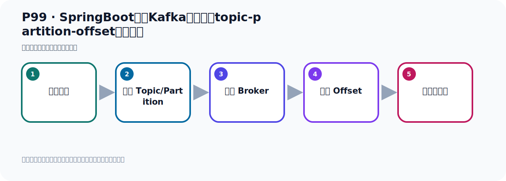
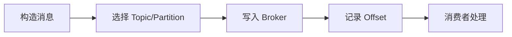

# P99：SpringBoot集成Kafka开发指定topic-partition-offset消费消息

> 笔记编号 99/156 · 时长 06:32 · [打开原视频 P99](https://www.bilibili.com/video/BV14J4m187jz?p=99)

[← P98: SpringBoot集成Kafka开发指定topic-partition-offset消费消息](../07-consumer-internals/p098-SpringBoot集成Kafka开发指定topic-partition-offset消费消息.md) · [返回本章](./README.md) · [P100: SpringBoot集成Kafka开发指定topic-partition-offset消费消息 →](../07-consumer-internals/p100-SpringBoot集成Kafka开发指定topic-partition-offset消费消息.md)

## 这节到底讲什么

**核心主题：SpringBoot集成Kafka开发指定topic-partition-offset消费消息。**

这节位于消息链路上。要顺着“发送端—Broker—分区日志—消费端”看数据和元数据怎样流动。
本节属于“消费者开发与分区分配”这一章；放在全章里看，它的作用是：掌握 ConsumerRecord、监听器、手动确认、指定位置消费、批量消费、拦截器和分区分配策略。

## 本节路线

## 老师的完整讲解（按视频顺序校正）

> 下面保留老师的完整讲解顺序，并修正 Kafka、Java、ZooKeeper、
> Topic、Partition、Offset 等常见识别错误。它不是压缩摘要；原始 ASR 在后面单独保留。

### 1. 00:00–00:57

下面我们就开始发送这个消息。发送消息我们调到这个方法去发送消息，对吧？我们发送消息我们这边这个消息监听的时候，它是有五个分区，雷、E、R到4，五个分区，所以我们需要你发销页的时候要准备五个分区。准备五个分区的话，我们怎么做呢？我们需要通过代码的方式指定五个分区，就是创建一个托币格里面要有五个分区。默认情况下，你在发消息的时候它其实默认只创建一个分区，所以我们需要在代码中做个调整。那怎么调整？我们之前在前面的代码中我们写过一个，就是我们写个配置内。这个配置内中你可以指定托币格下的分区的个数，还有它的副本的个数。好，那我们就写类是这样一个代码，配置内。

### 2. 00:57–01:47

好，那我们就写一下，在我们这边，那下面要写一个托币格内，那我就把上面这个托币格内在下面沾一个，好，那这里我们先写一个包，托币格包。然后把这个内沾进来，好，我先把所有的关系，因为太多了，能乱，把上面这个先收起来，然后这里改一下，那这些都没有了，我先删掉。我们只要配一下，配一个托币格，配一下它的分区个数，好，多余的删掉，就留下这一个B就可以了。然后呢，我们这个托币个名字，我们叫Hullo，是吧？Hullo托币格叫这个名字，叫Hullo托币格。好，那我们这就Hullo托币格。咱们是5个分区，对，我们是给它5个分区，副本有一个，因为现在我们是单结点，所以副本就一个。

### 3. 01:48–02:46

好，那这个配置配好了，那到时候我们，我这边发消息的时候，它是有5个分区的，5个分区，好，那么这一块就整个好了。最后我们下面开始这个地方发消息，好，发消息，我把这个方法换个新的，写个新方法，叫3嘛，叫3，它还是叫3。好，那这里面倒是写个泰的3方法，那就是我们点进来，这里把这个方法副这一份写个3，好，3方法。然后我们这边倒是调这个3方法，去发出消息，发消息，好，那发的时候我们要往5个分区去发，好，那这里我给它改一下，怎么办呢？我们在这个位置，我们发多少个呢？比如说我发二十个，二十一个吧，二十五个，好吧，二十五个，4，A，好，徐伟很想发一首歌，好，每次发的时候我们就准备一个对象。

### 4. 02:48–03:43

那么这个对象的它的这个ID，我们就用这个A作为ID，然后它这个手机号，这个后面我们加一个这个A辆量算，去分一下手机号，好，在我们每个对象的这个数据它不一样，好，然后去发这里去发，发二十五条消息，好，发的时候我们给它指定一个Q，成一个Q，你指定一个Q的时候呢，它就根据那个Q的哈希直是吧，然后再根据分区个数取谋，那么这样的话呢，它可以把这个数据的可以分散在不同的分区中去，好，我们整个Q，这个Q两边写个Q，然后后面加个这个I辆量，这样的话每个Q都不一样，Q不一样，那它哈希后的结果不一样，哈希后的结果不一样，它的分区的，啊，。

### 5. 03:43–04:42

最终那个分区就不一样，对吧，它可以发生到不同的分区里面去，好，我们这样来重复啊，那么这一块呢，我们前面其实给大家介绍过这个，它那个发售消息的时候，它有个分区选择，我们看一下客气啊，前面，在这个就是这个，它有个分区器，这里是吧，若你有Q，有Q的起落下，根据你这个Q，然后取一个哈希直，然后根据这个爬跌行的这个分区数网，然后取余数，这样来分散到哪个分区，来确定到哪个分区，发到哪个分区，好，那我现在只一个Q啊，那我这代码就写好了，写好了之后呢，我们就开始去发售啊，掉在方法去发，好，那现在我们去发一下，那就掉这个态度的方法，这个方法零三啊，好，再发，好，那这个什么运行一下，目前发之前我们看一下啊，我这边呢，刷新一下，我现在把之前的Topic码就删掉了，现在什么Topic码都没有了，啊，都删掉了，我现在呢，重新发个新的，。

### 6. 04:43–05:34

来右一边发售，好，发动之后，我们看一下他的这个信息啊，好，我在发的手写，他报了个错，我们先把他错误解决一下，这个错误看一下是什么错误看一下，这个Topic科，group，不能解析这个Topic科group啊，在我们这个消费者里面啊，他不能解析这个Topic科，这个group，不能解析这个值啊，那我们看一下下面，不能解析这个值，KafkaTopic科group，我们看一下我们这个配置是不是KafkaTopic科group啊，KafkaTopic科group，不是，我们KafkaConsumer group，Consumer group，好，那这个他读的是读不到，在消费者这一方，。

### 7. 05:35–06:25

他是KafkaConsumer group，这个名字，现在是Topic科内部，好，再重新发售一下，把这个先关掉，这里，好，然后呢，运行一下，看看，好，那现在他这几个地方打勾了，打勾了就没有报错，没有报错，他就发成功了，看一下是指，没有问题，好，发成功了，我们这个时候看一下卡，然后卡里面的信息，在你刷新一下，点这个刷新刷新，刷新之后，好，我们这里呢，这是我们哈读Topic科，好，他里面呢，去看，就有五个分区，首先是五个分区啊，然后每个分区里面有对的有几条消息，这样子，对吧，每个里面有几条消息，好，那我们这个数据就准备好了，准备好之后啊，我们又去测试一下我们那个消费，。

### 8. 06:25–06:28

这段消费，这是我们的数据的准备啊，就准备好了，。

## 关键术语

- **Kafka：** Apache 开源的分布式事件流平台，常用于高吞吐消息传递、数据管道和流处理。
- **Topic：** 事件的逻辑分类。生产者向 Topic 写数据，消费者从 Topic 读取数据。
- **Partition：** Topic 的物理分片，是 Kafka 并行度、顺序性和扩展能力的基本单位。
- **Consumer：** 从 Kafka Topic 拉取并处理事件的客户端。
- **Consumer Group：** 协作消费同一 Topic 的消费者集合；同组内一个分区同一时刻只交给一个消费者。
- **Offset：** 事件在 Partition 中的位置编号，也是消费者记录消费进度的依据。

## 完整原声逐段记录

[查看本节带时间戳的本地 ASR](./transcripts/p099-SpringBoot集成Kafka开发指定topic-partition-offset消费消息-ASR.md)。主笔记负责可读性和术语校正；ASR 页面负责完整性复核。

## 读完记住

- 本节主题是 **SpringBoot集成Kafka开发指定topic-partition-offset消费消息**，它服务于本章目标：掌握 ConsumerRecord、监听器、手动确认、指定位置消费、批量消费、拦截器和分区分配策略。
- 理解顺序是：构造消息 → 选择 Topic/Partition → 写入 Broker → 记录 Offset → 消费者处理。
- 学习时要同时核对老师的解释、画面中的配置/代码，以及最终运行结果。

## 最容易踩的坑

能发送成功不代表业务处理成功；序列化、分区、确认机制和消费进度需要分别观察。

## 自测

1. 不看笔记，用自己的话解释“SpringBoot集成Kafka开发指定topic-partition-offset消费消息”解决了什么问题。
2. 按顺序复述：构造消息、选择 Topic/Partition、写入 Broker、记录 Offset、消费者处理。
3. 如果运行结果和老师不同，你会先检查哪三个输入或环境条件？

## 学完检查

- [ ] 我能不看视频复述本节完整思路
- [ ] 我能指出关键命令、配置、类或接口的作用
- [ ] 我能解释画面中的输入与输出为什么对应
- [ ] 我核对过完整 ASR，没有跳过老师的补充说明
- [ ] 我完成了本节自测或复现实验
