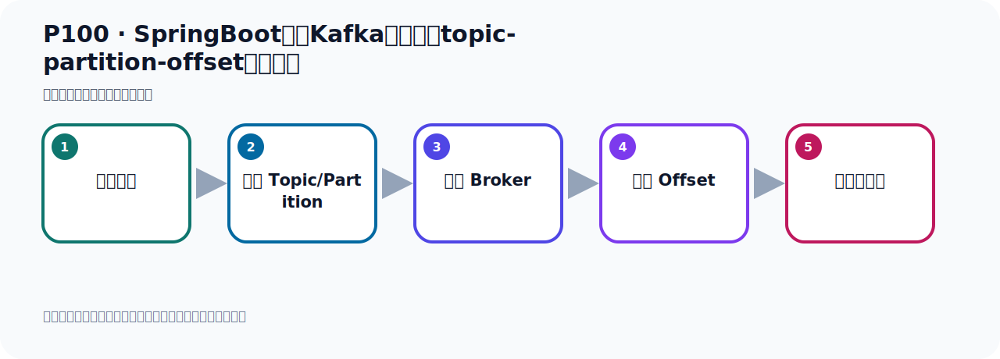
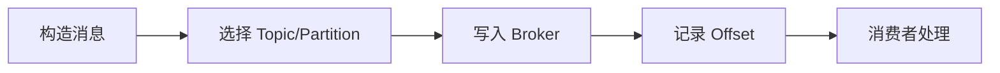

# P100：SpringBoot集成Kafka开发指定topic-partition-offset消费消息

> 笔记编号 100/156 · 时长 07:22 · [打开原视频 P100](https://www.bilibili.com/video/BV14J4m187jz?p=100)

[← P99: SpringBoot集成Kafka开发指定topic-partition-offset消费消息](../07-consumer-internals/p099-SpringBoot集成Kafka开发指定topic-partition-offset消费消息.md) · [返回本章](./README.md) · [P101: SpringBoot集成Kafka开发指定topic-partition-offset消费消息 →](../07-consumer-internals/p101-SpringBoot集成Kafka开发指定topic-partition-offset消费消息.md)

## 这节到底讲什么

**核心主题：SpringBoot集成Kafka开发指定topic-partition-offset消费消息。**

这节位于消息链路上。要顺着“发送端—Broker—分区日志—消费端”看数据和元数据怎样流动。
本节属于“消费者开发与分区分配”这一章；放在全章里看，它的作用是：掌握 ConsumerRecord、监听器、手动确认、指定位置消费、批量消费、拦截器和分区分配策略。

## 本节路线

## 老师的完整讲解顺序（ASR 辅助复核）

> 下面按时间顺序保留经过基础术语替换的 ASR，方便核对老师是否提到某个细节。
> 人名、命令、代码和英文参数仍可能识别错误；准确结论以本节白话说明、代码块和实操速查表为准。

### 1. 00:00–00:55

现在我们就把数据准备好了在这个主题下。但是我们看一下，我们刚才是用这个方法去发送消息，用这个方法去发送消息。那么它在发送消息的时候，因为它也会启动IoC 容器，应该是这个B嘛。应该是注入了B，它是注入了B。那就是我们IoC 容器会起起来。那么IoC 容器起起来，那就相当于它会让消费者的监听器它会生效。这一个消费者就会Consumer了，是吧？因为你在上面有这个注点，所以在你发送消息的时候，IoC 容器启动了。IoC 容器启动之后，那么它这个监听器就生效了。生效之后，那么它就已经帮我们消费了一些消息了。我们在刚才那个日志中，应该可以看一下，运行之后，那这是我们运行的日志，是吧？

### 2. 00:55–01:50

日志里面我们看一下，你看这边读书的事件，什么5，你看就是我们刚才的它这个方法，这个5这个方法，它的配置下的这个5的方法，这个是字，你打一个字字，在我们这边是可以收到的。你看可以收到，有这么多条，是吧？已经收走了。那就是说，你这个在测试的时候，它其实已经把消息就消费了。所以，我为了更严谨的去测试，我可以这样，我把这个代码先注释掉，先让它别消费。就在我发消息的时候，我先不让它消费，先不消费，先不消费。然后呢，我们去先发消息，然后再单独去消费，那我就这样做，把它这个代码注释掉。注释掉之后，我把Kafka的这个之前的东西删掉，右键，然后把这个Topic的删掉。

### 3. 01:50–02:33

好，整个消息都删掉，删掉之后我们重新发一下，重新发一下。重新发一下，那就是这个时候发的时候，它就不消费了，我们再找一下，这个再发送。再发送，它底下是发送25条消息，这底下是发送25条消息。好，那我们在这个发完了，现在发完之后，你收下它有没有这个打一事件啊，就是在这个消费的里，它可以现在没有消费，因为我们把注入解给注释掉了，这个时候你收下，是没有的，对吧？这一个结果，好，那现在我们消息的就发送好了，把这个关掉。发送好之后，我们Kafka在这边再收下，再刷新一下，看一下这个Topic的下，现在是25个消息，看一下是不是这么多啊？

### 4. 02:33–03:27

这个是10个，加这个16，然后22，25个消息，刚好。那接下来呢，接下来就是我们去单独去消费，单独去消费，那就是这个时候呢，我就把这个打开。打开了，打开之后，它开始去消费吧，消费了，我们这个时候就是发起动这个密方法，让什么途径启动，然后这个接待器就开始工作，开始工作它就接消息，接消息之后，我们可能也没有打一句话，对吧？那这个时候呢，把这个密方法又进行御行启动，启动时不了程序。好，再走一下，那么走完之后，我们就根据这个去搜索一下，看一下打印几个，是吧？好，那这个全部搜一下，搜一下之后，我们发现它只打印三个，那这是什么原因呢？

### 5. 03:27–04:30

按理说我们应该有25个消息，一天不止三个吧？那根据我们的配置，我们去检查一下，首先，我们配置来要读雷，一，二，这三个分区要读所有数据，是吧？这个三个分区读所有数据，那你们看一下，首先看一下，雷一二，那么这三个分区要读所有数据，那它应该读这六，一十一十六，它应该有一十六条消息，对吧？因为这三个分区就有十六条消息，然后呢，接下来就是它下面有个指定这个偏义量，那么三和四，是吧？三和四这里个分区，三和四分区，它从三开始读，从三开始读的话，那就是这个地方将于就没有读不到，因为它从三往后开始读数据，那么将于从四五六去读，但是这里面只有三个消息，所以它后面就没有消息，所以这里面就倒是这里面是哪一个消息，对吧？那这里面它应该有三个，对吧？应该有三个可以读三个出来，因为它从三这个下边开始读，可以读三个出来。

### 6. 04:31–05:45

所以它最终它打印出来之后，它现在目前这个打印，它读了这三个，那么这三个其实来自于哪里来的？这个三个其实就来自于我们的三和四这里面分区里面，从这里面读了三个消息，从这里面读了三个消息，因为这里面是人一个消息，是吧？因为它从三这个下边开始读，所以这里面是人一个，所以它把这三个读了，但是我们上面还有十六个没有读到，对吧？十六个没有读到，那么这种问题，其实我们前面介绍过，就是你在默认情况下，它读取消息的时候，它是从最新的位置开始读，历史消息是不读的，历史消息不读，从最新位置开始读，所以你这几个消息就没有读到。那么我们需要加一个配置，正在前面我们介绍过，是吧？你要想把历史消息读到，那你需要在消费里面加一个配置，叫做这个O2OsideReset，然后要改成这个Olist最早的，从最早的开始读，从第一条消息开始读，对不对？加这个配置。

### 7. 05:46–06:48

加这个配置之后，那你就可以从第一条消息开始读了，否则它读不到，默认情况下都是从最新位置开始读，消费者都是这样去消费的。好，那既然是这样的话，那为什么我们这个三这个分区，它为什么能够把这个后面的数捕到呢？我们看一下，就说我们这三个区区我们没有读到，因为默认情况下它从最新的位置开始读，所以它没有读到，好，那我们这两个，这个下面这个可以是零，它是零条，下面这是零条，上面这个它读到三条，这个三条它为什么可以读到呢？我这手边的话，这三条为什么可以读到，这是一路眼，你加那个初始的这个Olist，就指明了我需要从三偏一调后开始读，因为你指定了，指定了，所以它就可以读类似消息，可以读出它后面的那三条，相当于这个作用相当于就是那个起了一个什么，。

### 8. 06:48–07:21

指定偏移量的作用，那就是本来我是从最新位置开始读，你如果不加这个偏一调的话，我本来啊，我也是这个零条，我也是读不到的，也读不到，但是由于你加了这个初始这个位置，所以它就可以读到，历史的那三条可以读到，那上面这个呢，你没有指定，那么它默认从最新开始读，好，那现在我们就是已经指定了，对吧，之后我们指定的是从最新位置开始读，对吧，好，那我们看一下，好，那我们现在就开始读了，我们来看一下，我们来。

## 关键术语

- **Kafka：** Apache 开源的分布式事件流平台，常用于高吞吐消息传递、数据管道和流处理。
- **Topic：** 事件的逻辑分类。生产者向 Topic 写数据，消费者从 Topic 读取数据。
- **Partition：** Topic 的物理分片，是 Kafka 并行度、顺序性和扩展能力的基本单位。
- **Consumer：** 从 Kafka Topic 拉取并处理事件的客户端。
- **Offset：** 事件在 Partition 中的位置编号，也是消费者记录消费进度的依据。

## 完整原声逐段记录

[查看本节带时间戳的本地 ASR](./transcripts/p100-SpringBoot集成Kafka开发指定topic-partition-offset消费消息-ASR.md)。主笔记负责可读性和术语校正；ASR 页面负责完整性复核。

## 读完记住

- 本节主题是 **SpringBoot集成Kafka开发指定topic-partition-offset消费消息**，它服务于本章目标：掌握 ConsumerRecord、监听器、手动确认、指定位置消费、批量消费、拦截器和分区分配策略。
- 理解顺序是：构造消息 → 选择 Topic/Partition → 写入 Broker → 记录 Offset → 消费者处理。
- 学习时要同时核对老师的解释、画面中的配置/代码，以及最终运行结果。

## 最容易踩的坑

能发送成功不代表业务处理成功；序列化、分区、确认机制和消费进度需要分别观察。

## 自测

1. 不看笔记，用自己的话解释“SpringBoot集成Kafka开发指定topic-partition-offset消费消息”解决了什么问题。
2. 按顺序复述：构造消息、选择 Topic/Partition、写入 Broker、记录 Offset、消费者处理。
3. 如果运行结果和老师不同，你会先检查哪三个输入或环境条件？

## 学完检查

- [ ] 我能不看视频复述本节完整思路
- [ ] 我能指出关键命令、配置、类或接口的作用
- [ ] 我能解释画面中的输入与输出为什么对应
- [ ] 我核对过完整 ASR，没有跳过老师的补充说明
- [ ] 我完成了本节自测或复现实验
