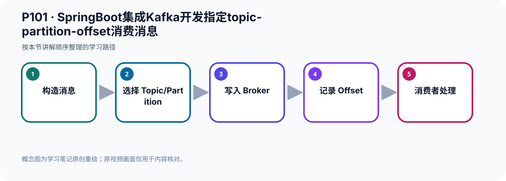
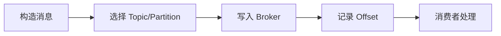

# P101：SpringBoot集成Kafka开发指定topic-partition-offset消费消息

> 笔记编号 101/156 · 时长 07:12 · [打开原视频 P101](https://www.bilibili.com/video/BV14J4m187jz?p=101)

[← P100: SpringBoot集成Kafka开发指定topic-partition-offset消费消息](../07-consumer-internals/p100-SpringBoot集成Kafka开发指定topic-partition-offset消费消息.md) · [返回本章](./README.md) · [P102: SpringBoot集成Kafka开发批量消费消息 →](../07-consumer-internals/p102-SpringBoot集成Kafka开发批量消费消息.md)

## 先看结论

> 这节把“SpringBoot集成Kafka开发指定topic-partition-offset消费消息”放回消息链路，沿 Producer、Broker、Partition、Offset 与 Consumer 追踪数据和元数据如何流动。它服务于本章目标：掌握 ConsumerRecord、监听器、手动确认、指定位置消费、批量消费、拦截器和分区分配策略。

## 老师怎么一步步讲

1. 第 1 步，围绕“SpringBoot集成Kafka开发指定topic-partition-offset消费消息”完成构造消息。
2. 第 2 步，围绕“SpringBoot集成Kafka开发指定topic-partition-offset消费消息”完成选择 Topic/Partition。
3. 第 3 步，围绕“SpringBoot集成Kafka开发指定topic-partition-offset消费消息”完成写入 Broker。
4. 第 4 步，围绕“SpringBoot集成Kafka开发指定topic-partition-offset消费消息”完成记录 Offset。
5. 第 5 步，围绕“SpringBoot集成Kafka开发指定topic-partition-offset消费消息”完成消费者处理。

## 老师的补充说明

下面按原声顺序整理老师的完整讲解脉络。保留原因、案例、对比、操作过程、边界条件和口头提醒；删除重复语气词，并把长口语拆成适合阅读的短段落。

> 技术术语已经过统一校正；仍无法确认的人名或口头英文会保留原意，并通过右侧时间范围返回视频核对。

### 先明确：SpringBoot集成Kafka开发指定topic-partition-offset消费消息要解决什么 · 00:00–01:01

那我们从最新的读那这玩意配置好了。配置好之后接下来我们去读一下再试试啊。那这个是我们重新这个跑一下带码把这个关掉。关了之后我们在右键然后运行这个位方法再走一遍再读一遍看看怎么样是否可以读到。读完以后我们就把它打印这个信息我们收下看读了几条。你发现它依然读了三条。那就是我上面那个没读到啊，就是我们这几个分区还是没读到啊，对吧，还是没读到。然后它把这个地方三条读到了，后面的三条读到了。那么这个是当我们这个指定了什么呢？

就说我们在这里指定了这个earliest之后，你需要用一个新的分组消费组去读。

### 对比不同情况，明确条件和边界 · 01:01–02:29

我们之前有介绍过在这里啊，再往前走一下。在防止消息的时候这个丢这个位置，你看啊，我们配置了这个参数之后，它也不会生效。因为Kafka只会再找不到偏移量时使用这个配置。那就是说由于由于这个这个分区里面的数据，你已经用了个group id，用了个分组已经消费过一次了。如果之前已经用这个消费组ID，你消费过这个主题，就是这个Topic，你消费过了。那么此时你这个分组就是你这个消费组，它的那个消费组的这个偏移量，我们又Kafka，就记下来。

那么即便是你设置了earliest的这个参数，那也是没有用的。因为它把你这个消费组已经记下来的，它之前消费到什么位置？它不能记的。是吧？已经记的。所以你这个设置这个之后还是消费不到。所以此时我们要重置偏移量，或者是起一个新的消费组ID，那么它就可以消费到了。可以消费到了。所以你现在想要消费到另外那16条，那怎么办呢？那就是你在消费的时候，把这个消费组ID这个改一下，就这个这个改一下。

### 老师用例子进一步解释 · 02:30–03:37

因为这个消费组，你之前监听启动的时候，它已经对这个Topic已经连上去以后，已经做过一次消费。做个一次消费之后呢，那么你这个消费组，它就帮你记下来。它的那个偏移量，比如说它有五个废去。第1个，它可能记下来的位置是6。第2个，我们是三条数据，那边记下位置是3。第3个废去，它可能记下来是3。第几个废去，记下来是第几个废去。那你现在用同一个组去消费的时候，它即便是你配置它最早的去消费，它也消费不到。但是呢，我们这个材料组它不是有影响。这个叫初始这个偏移量，它不是有影响。

它不是有你这个消费组的那个相同迷崔。你第2次去消费的时候，就消费不到。它不是有这个影响。它是可以的。它你用这个同一个组的迷崔，你再消费，它依然可以从三条位置开始读。所以我们现在马上就改个名字了，改名字了那么它就可以读到。那之前它这个消费组名字叫哈罗国服，下午就改了哈罗国服2。

### 跟着老师操作，并观察运行结果 · 03:38–04:59

改名字了，好，名字改了，改了之后我们会此时再去消费一下，那它就可以消费到了，再走一下。那我们此时再运气我们这个迷方法再执行一下，走一下。走一下之后你发现这个时候就消费了这么多消息，我们数下多少条呢？我们去看一下它们日志打击了多少条，走一下。走一下走路是19条，19条，19条那就是刚好符合我们这个数据，你看我们这个数据是怎么齐锋呢？算一下对吧？

算一下我们前面这三个飞区我们读所有，这个加起来它就是16条，你看6加410再加616条，然后我们下面这两个飞区，这个它直接读了一条，因为从3位置70位置3可以读，它读不到，这个从73位置可以读三条，对吧？所以再加3条，那总共是19条，好，那这样的话我们就是读到了这个19条数据，就读到了。那么这就是我们这个代码的一个实现，就是它稍微配置稍微复杂一些，整个这个配置就表示，我们读取这个托并的下的雷一二这三个分区里面的所有数据，然后三和四这个分区呢？

### 跟着老师操作，并观察运行结果 · 05:00–06:05

从3这个位置开始读，之前的3之前的位置还是不读的，包括3这个位置它不读的。当然你在测试的时候你注意一下，你图一个消费组，它如果刚开始启动之后，它已经对这个托并口已经做过一次监听，那么此时它会寄一个欧帅的值，所以你消费的时候就消费不到，对吧？所以你需要改一下，一个是要加上这个Erlist，另外就是如果说你这个消费组已经消费过一次，那你需要把消费组的名字改一下，这样才可以消费到，才可以测试。

那么关于这块，我们前面在这个地方我们当时是给它讲解过的，测试过的，到时候你注意一下，这样测试了你才可以测试拿到这个数据。那么以上就是我们这种指贼分区，指贼托并口，指贼分区，指定从什么位置开始读，这种方式。我们从什么位置开始读啊，这个偏移量从什么位置开始读，它这个读啊，它是不受你这个分组名称的一个限制的。

### 最后验证结果，并收束本节结论 · 06:06–07:08

你分组名称是同一个名称，是吧？你之前读过一次，你看我现在，现在我在启动这个项目，在启动，它还可以把那个三条数捉到这个，启动一下，走一下。它还可以读了这三条数据呢，你搜一下，还有这三条，对吧？这是三条。也就是说你这个相同组名称啊，这个组名称相同你之前读过，但是我如果有这个骑士值的话，它依然是可以读的。你都可以读到，当你没有骑士值的话，那么这个是，你即便是把这种改成Allist了，从最早开始读，但也不行，因为你那个分组名称之前是消费过的。

它以记下了一个--list一个偏移量，所以此时你需要重置一下历史偏移量，也就是对这个消费组ID要做一个历史片一件的重置，然后才可以，到时候才可以读到它的信息。或者说你改一个消费组名称，变成一个全新的消费组，那也可以读到--list数据。那么以上这个测试，我们就测试完了。

## 放进整套课

本节属于 **消费者开发与分区分配**。这一章要解决的是：掌握 ConsumerRecord、监听器、手动确认、指定位置消费、批量消费、拦截器和分区分配策略。

这节位于消息链路上。要顺着“发送端—Broker—分区日志—消费端”看数据和元数据怎样流动。

### 记忆路线

```mermaid
flowchart LR
    N0["构造消息"]
    N1["选择 Topic/Partition"]
    N0 --> N1
    N2["写入 Broker"]
    N1 --> N2
    N3["记录 Offset"]
    N2 --> N3
    N4["消费者处理"]
    N3 --> N4
```

## 用在工作里

| 项目 | 内容 |
|---|---|
| 先回答 | 先明确消息从哪里产生、写入哪个 Topic、由谁消费。 |
| 立刻做 | 复现发送、Broker 写入和消费者处理的完整链路。 |
| 留下证据 | 记录 Partition、Offset、序列化结果和消费端输出。 |

## 关键术语

- **Kafka：** Apache 开源的分布式事件流平台，常用于高吞吐消息传递、数据管道和流处理。
- **Topic：** 事件的逻辑分类。生产者向 Topic 写数据，消费者从 Topic 读取数据。
- **Partition：** Topic 的物理分片，是 Kafka 并行度、顺序性和扩展能力的基本单位。
- **Offset：** 事件在 Partition 中的位置编号，也是消费者记录消费进度的依据。

## 最容易踩的坑

能发送成功不代表业务处理成功；序列化、分区、确认机制和消费进度需要分别观察。

## 自测

1. 不看笔记，用自己的话解释“SpringBoot集成Kafka开发指定topic-partition-offset消费消息”解决了什么问题。
2. 按顺序复述：构造消息、选择 Topic/Partition、写入 Broker、记录 Offset、消费者处理。
3. 如果运行结果和老师不同，你会先检查哪三个输入或环境条件？

## 学完检查

- [ ] 我能不看视频复述本节完整思路
- [ ] 我能指出关键命令、配置、类或接口的作用
- [ ] 我能解释画面中的输入与输出为什么对应
- [ ] 我读完了老师的详细讲解正文，没有只看路线图和要点
- [ ] 我完成了本节自测或复现实验

## 需要核对原话时

[查看本节带时间戳的完整 ASR](./transcripts/p101-SpringBoot集成Kafka开发指定topic-partition-offset消费消息-ASR.md)。主笔记负责理解与实践；ASR 页面负责逐句完整性复核。
