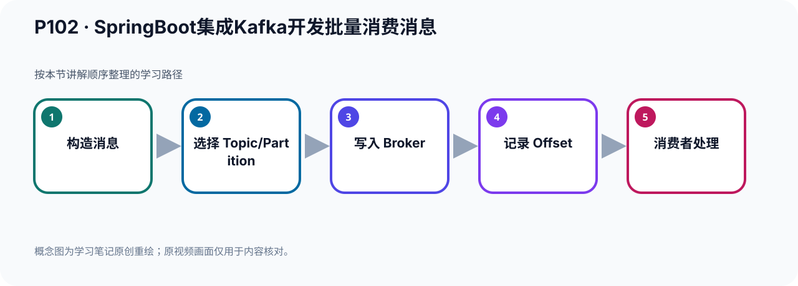

# P102：SpringBoot集成Kafka开发批量消费消息

> 笔记编号 102/156 · 时长 05:31 · [打开原视频 P102](https://www.bilibili.com/video/BV14J4m187jz?p=102)

[← P101: SpringBoot集成Kafka开发指定topic-partition-offset消费消息](../07-consumer-internals/p101-SpringBoot集成Kafka开发指定topic-partition-offset消费消息.md) · [返回本章](./README.md) · [P103: SpringBoot集成Kafka开发批量消费消息 →](../07-consumer-internals/p103-SpringBoot集成Kafka开发批量消费消息.md)

## 先看结论

> 这节把“SpringBoot集成Kafka开发批量消费消息”放回消息链路，沿 Producer、Broker、Partition、Offset 与 Consumer 追踪数据和元数据如何流动。它服务于本章目标：掌握 ConsumerRecord、监听器、手动确认、指定位置消费、批量消费、拦截器和分区分配策略。

## 老师怎么一步步讲

1. 第 1 步，围绕“SpringBoot集成Kafka开发批量消费消息”完成构造消息。
2. 第 2 步，围绕“SpringBoot集成Kafka开发批量消费消息”完成选择 Topic/Partition。
3. 第 3 步，围绕“SpringBoot集成Kafka开发批量消费消息”完成写入 Broker。
4. 第 4 步，围绕“SpringBoot集成Kafka开发批量消费消息”完成记录 Offset。
5. 第 5 步，围绕“SpringBoot集成Kafka开发批量消费消息”完成消费者处理。

## 老师的补充说明

下面按原声顺序整理老师的完整讲解脉络。保留原因、案例、对比、操作过程、边界条件和口头提醒；删除重复语气词，并把长口语拆成适合阅读的短段落。

> 技术术语已经过统一校正；仍无法确认的人名或口头英文会保留原意，并通过右侧时间范围返回视频核对。

### 先明确：SpringBoot集成Kafka开发批量消费消息要解决什么 · 00:00–00:52

前面我们通过指定Topic、指定分区、指定Offset进行消息的消费。下面我们来看一下，我们如何进行批量的消费。也就是说，这个消息消费刚开始默认是一条一条消费。但是我现在批量消费就是我一次性就取20条，取50条，取80条，这个叫批量消费。我们看一下，再摩扯一下消息的批量消费。主要两个步驻，第一步你需要在配置面中配置一下，然后第二步，接收消息的时候用--list接收就可以了。下面我们去通过代码来测试验证一下。那这里为了大家方便，我把这个程序再写个雷山这个程序和之前去分享。

### 继续拆解选择 Topic/Partition · 00:52–01:44

不然这里面写太多了，到时候不太好复习。我写个新程序，那我们建个新的，去分享，这样比较清楚一些。那么这些还是名字写一下，是Spring Boot，然后是雷山，然后也是Kafka，来Gunbase，好，这是名字，那我们加发Maven 项目，把这个改短点，JDK17，好，出去好，然后下一步，然后我们勾选Lombok，勾选SFX件，再勾选一个呢，就是这个Message，然后就是Kafka，好，主要就是这个，其他不需要勾选，我们冲进一下。

冲进之后呢，我们开始去写代码，好，它需要去下来模板。这是我们的项目，项目冲两个之后呢，我把一些不需要收的一些文件，文件夹上删掉一下。这样我们项目比较干净，一个它，它，它都没有用，这些删掉。

### 继续拆解写入 Broker · 01:44–03:10

是吧，好，这就是我们的项目了，就这样子。它没有办法改短一点，太长了，好，这我们改成这个名字，然后这里改一下，然后继续，OK一下。那我们这个项目准备好了，准备好了，然后这个文件，我们改成这个YAML 格式的，YAML 格式在实际开发中，应用的更加广泛，所以我们用这个模式OK一下。

那我们首先的第一步呢，就是要配置一下，是吧，现在我们从这边考一下，就是我们要连到Kafka，那你这个时候配一下Kafka的连接信息，好，这个易用民，让他自己，这个直接考配一下易用民就这一段，是吧，我们这里是雷山，然后就Kafka连地址这一段配置一下，好，这地方应该在和他对齐这样，Kafka连地址配好。那么其他东西我们待会需要到什么，需要什么就配什么啊，哎，这样子啊。

这是我们的配置，这样可以连到Kafka上去了，然后呢，我们要实现批量消费啊，那这个时候你需要在这个文件中配什么呢，配置一个使不认Kafka，Listner这个Type-0，Batch叫批量，这是设置这个监听的时候是批量消费，Listner，那就是配一个使不认的KafkaListner，那就是使不认，然后Kafka，然后Listner，在下面的配置间定器，配置消息间定器，。

### 最后验证结果，并收束本节结论 · 03:13–05:29

对吧，好，那么就Listner，好，这个这个一个Type，这个Type，它原来的木认值叫Single，Single就是单读的，单一的，一个一个消息去接收，一个一个去接收，那我们现在把这个Type改一下，改什么呢，你看它要单一的，有批量的，那么这个单一的它调入这个调入的时候，它这个消费基督就一次消费一个，那OneConsumerRequired，那么上面这个，Batch，OneConsumerRequired，所以它是批量，选择Batch，那么把这个考下来，它调到上面去了，再回头，好，这个文配置好，点它的批量，那然后呢，看一下啊，然后就是KafkaListner，我们看看啊，它这个应该往后退一个，不然你看这个黄色的，不实比啊，但是这样的，因为它是Spray，然后Kafka，然后下面Listner，

应该在它的Kafka的下面，不是它的并垫，在它下面，好，那么这个配好了，然后就是配什么呢，然后就是配一下，这个每次你取多少条，你消费的时候每次取多少条，那就Kafka，然后Consumer什么什么啊，好，再再配一下Consumer，好，那再去配个Consumer，好，Consumer我们点一下，点这个取的时候，哎，Markers的破Record，比如说每次我们取20条，我们做个测试，每次取20条，好，那这就是去每次取多少条，加上这个，这个参数，每次取多少条，好，那么上面这个参数的意思，我们也给它标注一下，这设置呢，批量消费，这边的设置，批量消费，默认是单条消费，默认是单个消息消费，好，我现在我们批量消费，好，那么这个配置就配好了，它的第一步配置，好，然后我们要批量消费，第二步呢就是我们要接收消息的时候呢，

用Listner去接收，好，那就是你在这边你写个接听器，就消费者，消费者写接听器，然后他是批量接收，好，我们写个考虚吧，怎么点呢，这个，。

## 放进整套课

本节属于 **消费者开发与分区分配**。这一章要解决的是：掌握 ConsumerRecord、监听器、手动确认、指定位置消费、批量消费、拦截器和分区分配策略。

这节位于消息链路上。要顺着“发送端—Broker—分区日志—消费端”看数据和元数据怎样流动。

### 记忆路线

```mermaid
flowchart LR
    N0["构造消息"]
    N1["选择 Topic/Partition"]
    N0 --> N1
    N2["写入 Broker"]
    N1 --> N2
    N3["记录 Offset"]
    N2 --> N3
    N4["消费者处理"]
    N3 --> N4
```

## 用在工作里

| 项目 | 内容 |
|---|---|
| 先回答 | 先明确消息从哪里产生、写入哪个 Topic、由谁消费。 |
| 立刻做 | 复现发送、Broker 写入和消费者处理的完整链路。 |
| 留下证据 | 记录 Partition、Offset、序列化结果和消费端输出。 |

## 关键术语

- **Kafka：** Apache 开源的分布式事件流平台，常用于高吞吐消息传递、数据管道和流处理。
- **Topic：** 事件的逻辑分类。生产者向 Topic 写数据，消费者从 Topic 读取数据。
- **Consumer：** 从 Kafka Topic 拉取并处理事件的客户端。
- **Offset：** 事件在 Partition 中的位置编号，也是消费者记录消费进度的依据。

## 最容易踩的坑

能发送成功不代表业务处理成功；序列化、分区、确认机制和消费进度需要分别观察。

## 自测

1. 不看笔记，用自己的话解释“SpringBoot集成Kafka开发批量消费消息”解决了什么问题。
2. 按顺序复述：构造消息、选择 Topic/Partition、写入 Broker、记录 Offset、消费者处理。
3. 如果运行结果和老师不同，你会先检查哪三个输入或环境条件？

## 学完检查

- [ ] 我能不看视频复述本节完整思路
- [ ] 我能指出关键命令、配置、类或接口的作用
- [ ] 我能解释画面中的输入与输出为什么对应
- [ ] 我读完了老师的详细讲解正文，没有只看路线图和要点
- [ ] 我完成了本节自测或复现实验

## 需要核对原话时

[查看本节带时间戳的完整 ASR](./transcripts/p102-SpringBoot集成Kafka开发批量消费消息-ASR.md)。主笔记负责理解与实践；ASR 页面负责逐句完整性复核。
