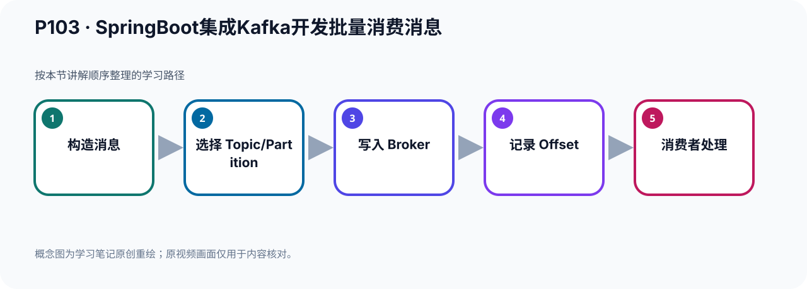
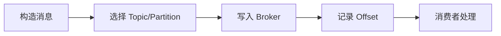

# P103：SpringBoot集成Kafka开发批量消费消息

> 笔记编号 103/156 · 时长 04:07 · [打开原视频 P103](https://www.bilibili.com/video/BV14J4m187jz?p=103)

[← P102: SpringBoot集成Kafka开发批量消费消息](../07-consumer-internals/p102-SpringBoot集成Kafka开发批量消费消息.md) · [返回本章](./README.md) · [P104: SpringBoot集成Kafka开发批量消费消息 →](../07-consumer-internals/p104-SpringBoot集成Kafka开发批量消费消息.md)

## 先看结论

> 这节把“SpringBoot集成Kafka开发批量消费消息”放回消息链路，沿 Producer、Broker、Partition、Offset 与 Consumer 追踪数据和元数据如何流动。它服务于本章目标：掌握 ConsumerRecord、监听器、手动确认、指定位置消费、批量消费、拦截器和分区分配策略。

## 老师怎么一步步讲

1. 第 1 步，围绕“SpringBoot集成Kafka开发批量消费消息”完成构造消息。
2. 第 2 步，围绕“SpringBoot集成Kafka开发批量消费消息”完成选择 Topic/Partition。
3. 第 3 步，围绕“SpringBoot集成Kafka开发批量消费消息”完成写入 Broker。
4. 第 4 步，围绕“SpringBoot集成Kafka开发批量消费消息”完成记录 Offset。
5. 第 5 步，围绕“SpringBoot集成Kafka开发批量消费消息”完成消费者处理。

## 老师的补充说明

下面按原声顺序整理老师的完整讲解脉络。保留原因、案例、对比、操作过程、边界条件和口头提醒；删除重复语气词，并把长口语拆成适合阅读的短段落。

> 技术术语已经过统一校正；仍无法确认的人名或口头英文会保留原意，并通过右侧时间范围返回视频核对。

### 先明确：SpringBoot集成Kafka开发批量消费消息要解决什么 · 00:00–01:45

CMAK 点了EVENT 课件和消费器。

那么消息上的加一个监听器KafkaListener监听器然后里面指定他的主题这个主题是必须要有的没有的话他都不错Topic他是个速度你可以写多个多个主题那我们Topic就换到Topic吧或者说我们换一个叫代气Topic拼掉的PATCH好一个主题然后他还需要一个group id就分组ID消费者分组IDgroup idgroup id这个我们就BATCH那么这样的话我们把Topic是哪一颗从这个Topic去消费我们的分组是这个分组这个分组必须要有的没有的话他就是不错那么接下来消息消息我们用List接收器然后把他里面的消息我们写一个叫用什么接收那个消息我们把用用这个叫ConsumerRecord接收用这个接收一个一个的消息用这个对象拿到冒充起来好那这就我们的消息了被困的好这样就消息接到然后下面的代码我们就直接打印一下

把它考虑一下这样什么消费啊到底必须消费我们看他多少条然后他那个数据是散播这边做打印这他数据。

### 继续追踪实现过程和关键调用 · 01:45–02:55

他这个List我们把它打印一下然后还有他总共多少条他的size多少好那我们这样就行了写完了这个消费者就写好了写好了之后呢我们下面就去写一个这个发送发送就发送一批数据我们看看这个是不是可以消费啊那我们先把这个地方注掉先让他不消费我们先写个生产者去发送一下好那这个是我们考个一个生产者从中间考一个吧这考一个这个丢什么我丢什么这个摩托论也考一下说的这个UTO这个接收处理也考一下把这几个考过来把东西关一下这什么的摸度内我用的对象吗放这里然后呢这是考数码这是我们渗的找我们看一下我们找一个方法找一个方法我们就找一个发送数据的方法我们就用这个方法上面的不要了这个方法就直接改成一辈子就行的那我们发送了我们是一次去20条我们发个这个120125个吧我们发125个消息的我能立法的我们刚刚那个主题名字我们在消费的时候。

### 最后验证结果，并收束本节结论 · 02:55–04:02

是用的是叫batchTopic那我们这里面就写叫batchTopic往这里去发发这个拥护对象发125条发完以后呢我们到现在这边去监听接收我们先发然后再接收先发再接收那我们在这个测试里面就测一下把它改短一点测试一下好把它改成一直改短继续然后在里面测试那测试的话呢就和之前这个人一样我们把他那个首先注入把你这个生产者消息的发生了这个生产者注入一下好让我们测试这次我们就调一下测试方法来考虑一下这个代码好这样就可以测试了好我们整个的整个的关系想出去看一下好测试到这里的话把生产者注进来怎么生产者发125个消息虚万一125次然后这里去调整方法去发不行的好那现在我就去发去发我们点一下然后发送。

## 放进整套课

本节属于 **消费者开发与分区分配**。这一章要解决的是：掌握 ConsumerRecord、监听器、手动确认、指定位置消费、批量消费、拦截器和分区分配策略。

这节位于消息链路上。要顺着“发送端—Broker—分区日志—消费端”看数据和元数据怎样流动。

### 记忆路线

```mermaid
flowchart LR
    N0["构造消息"]
    N1["选择 Topic/Partition"]
    N0 --> N1
    N2["写入 Broker"]
    N1 --> N2
    N3["记录 Offset"]
    N2 --> N3
    N4["消费者处理"]
    N3 --> N4
```

## 用在工作里

| 项目 | 内容 |
|---|---|
| 先回答 | 先明确消息从哪里产生、写入哪个 Topic、由谁消费。 |
| 立刻做 | 复现发送、Broker 写入和消费者处理的完整链路。 |
| 留下证据 | 记录 Partition、Offset、序列化结果和消费端输出。 |

## 关键术语

- **Kafka：** Apache 开源的分布式事件流平台，常用于高吞吐消息传递、数据管道和流处理。
- **Topic：** 事件的逻辑分类。生产者向 Topic 写数据，消费者从 Topic 读取数据。
- **Event：** Kafka 中的一条业务记录，通常由 key、value、时间戳和 headers 等组成。
- **Consumer：** 从 Kafka Topic 拉取并处理事件的客户端。
- **ConsumerRecord：** Kafka 原生消费者收到的记录对象，包含消息体、Topic、Partition、Offset 等信息。
- **CMAK：** Kafka Manager 的社区延续版本，用于集群管理；不同 Kafka 版本存在兼容边界。

## 最容易踩的坑

能发送成功不代表业务处理成功；序列化、分区、确认机制和消费进度需要分别观察。

## 自测

1. 不看笔记，用自己的话解释“SpringBoot集成Kafka开发批量消费消息”解决了什么问题。
2. 按顺序复述：构造消息、选择 Topic/Partition、写入 Broker、记录 Offset、消费者处理。
3. 如果运行结果和老师不同，你会先检查哪三个输入或环境条件？

## 学完检查

- [ ] 我能不看视频复述本节完整思路
- [ ] 我能指出关键命令、配置、类或接口的作用
- [ ] 我能解释画面中的输入与输出为什么对应
- [ ] 我读完了老师的详细讲解正文，没有只看路线图和要点
- [ ] 我完成了本节自测或复现实验

## 需要核对原话时

[查看本节带时间戳的完整 ASR](./transcripts/p103-SpringBoot集成Kafka开发批量消费消息-ASR.md)。主笔记负责理解与实践；ASR 页面负责逐句完整性复核。
