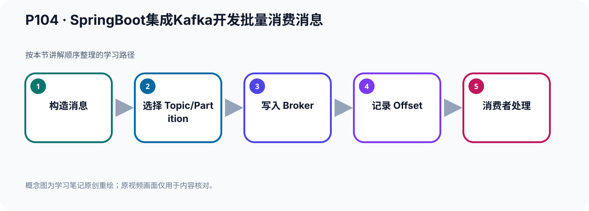
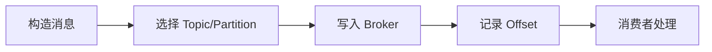

# P104：SpringBoot集成Kafka开发批量消费消息

> 笔记编号 104/156 · 时长 05:01 · [打开原视频 P104](https://www.bilibili.com/video/BV14J4m187jz?p=104)

[← P103: SpringBoot集成Kafka开发批量消费消息](../07-consumer-internals/p103-SpringBoot集成Kafka开发批量消费消息.md) · [返回本章](./README.md) · [P105: SpringBoot集成Kafka开发消费消息拦截器-定义ConsumerInterceptor →](../07-consumer-internals/p105-SpringBoot集成Kafka开发消费消息拦截器-定义ConsumerInterceptor.md)

## 先看结论

> 这节把“SpringBoot集成Kafka开发批量消费消息”放回消息链路，沿 Producer、Broker、Partition、Offset 与 Consumer 追踪数据和元数据如何流动。它服务于本章目标：掌握 ConsumerRecord、监听器、手动确认、指定位置消费、批量消费、拦截器和分区分配策略。

## 老师怎么一步步讲

1. 第 1 步，围绕“SpringBoot集成Kafka开发批量消费消息”完成构造消息。
2. 第 2 步，围绕“SpringBoot集成Kafka开发批量消费消息”完成选择 Topic/Partition。
3. 第 3 步，围绕“SpringBoot集成Kafka开发批量消费消息”完成写入 Broker。
4. 第 4 步，围绕“SpringBoot集成Kafka开发批量消费消息”完成记录 Offset。
5. 第 5 步，围绕“SpringBoot集成Kafka开发批量消费消息”完成消费者处理。

## 老师的补充说明

下面按原声顺序整理老师的完整讲解脉络。保留原因、案例、对比、操作过程、边界条件和口头提醒；删除重复语气词，并把长口语拆成适合阅读的短段落。

> 技术术语已经过统一校正；仍无法确认的人名或口头英文会保留原意，并通过右侧时间范围返回视频核对。

### 先明确：SpringBoot集成Kafka开发批量消费消息要解决什么 · 00:00–01:01

发送到我们这里去的一个接身的一个创立包。因为我们发送这里面，它是把一个对象的转接身发送到。那需要一个接身的包，我们这个需要加个E站。加个接身的E站，这个E的加一下，缺少接身的包。在项目中这里面，就加在它后面，刷新一下。刷新之后，下载一下。这个接身就处理就没问题了。关一下。那现在我们重新去发，点一下发送，右键发送。发送之后，我们看一下它的数据有没有发成功。现在就已经发了。发完了这个没不错。没不错，长长的数据在Kafka刷新看一下，我们这里点刷新。

刷新之后，有个BatchTorbit，它里面一把手脚消息，可以。我们由于这个Torbit没有给它指定分区个数，所以它默认只有一个分区。

### 继续追踪实现过程和关键调用 · 01:01–02:06

怕理性是一个，里面有125个消息。消息发好了，接下来我们就把接近器这个注冊给它打开。这个注冊给它打开，看它能不能进行批量消费，就是一次性就拿20条，那就是我们要拿好几次。那就相对于这个方法会掉好几次，它120条要掉6、7次，要掉7次，对吧？大概是叫7次，每次两半条，叫7次，最后一次还有5条，它就125条。那我们这个小木理方法，小木理方法这个内就加了重力中，加重力中这个接近器就开始工作，在监听，那么它就接收消息，对不对？

那这我们就，那我们这个接收是接不到，因为它默认是从最新的消息开始接收，那接不到，接不到，你看。对吧？因为它默认是从最新的消息开始接收，所以这边一条都没接到。所以我们要注意一下，你看这个批击消费你这些收一下，收不到，对吧？那注意一下，那就是什么呢？那就是我们在消费的时候，你要词一下，我们接收的时候，从最早的那个接收，那就是它的一个output，什么时候？

### 跟着老师操作，并观察运行结果 · 02:06–03:30

output，那这个，这个，在这个监听器，在消费者的例子吧？消费者，AUT，output就是在这里，然后是all list，从最早的消息开始接收，从第一条消息开始接收，对吧？从第一条开始接收，这样它才接到，不然它接不到，这个需要设置一下。这个地方我们是重视的方向为止，在这批击消费者。

那你现在，由于你刚才已经接收过一次了，你这个地方，即便是你现在调整为从最新一条开始接收，那也接不到，因为我们前面记得过，你这个分组，这个组它之前已经消费轨子，虽然它没接到东西，但是这个消费组已经帮你记录了那个outside，所以此时你在预刑它其实还接不到，也预刑一下，还是接不到，我们可以收拾一下这个打印的字，有没有打印？在那里，是说收一下，你看，收不到，对吧？收不到，所以这个时候你需要重置outside，或者是给组改个名字才可以，这个我们在前面给它介绍过，对吧？

由于我们第一次运行的时候，在接待期运行的时候，它用这个组已经消费过一次了，虽然它没能没有拿到东西，但是它已经把这个消费组已经记录了一个outside，。

### 最后验证结果，并收束本节结论 · 03:30–04:58

而且它记录了outside是最新的一个outside，就是你这个消息的125，那么126这个位置开始记起的，它记得126这个位置，所以你在消费它消费不到，即便是你改了这个outside它也消费不到，因为你这个消费组它原来有记录，你要把它清掉，或者是改个名字，那我们这里改个消费组2，对吧？改个2以后呢，那现在我们就可以消费了，这是走一下，我们看一下，启动这个程序，走一下，那么现在它就可以消费125条，好，那么这个时候你看一下，它是不是125条呢？

你看，这是第一次2次3次4次5次6次7次，它总共是125条，每次消费20条，那就是2x6x120，然后再最后一次是5条，是吧？你看这个星期可以看到，你看这个size你看，这都是20，20，20的，这都是20是吧？这6次都是20，你看最后一次这个size多少？是5个，所以总共加在一起是125个，好，那么这边就是批量消费消息，我们这里把打印让它那个--list，这个历史在接受这个消息的一个赛人，它的历史有多长？

那么从这里可以看到，前面每一次都是20条，最后一次是5条，好，以上就是我们如何去批量的消息消费，那么你需要做到事情呢，就是这两个步骤，这样就可以实现消息的批量消费。

## 放进整套课

本节属于 **消费者开发与分区分配**。这一章要解决的是：掌握 ConsumerRecord、监听器、手动确认、指定位置消费、批量消费、拦截器和分区分配策略。

这节位于消息链路上。要顺着“发送端—Broker—分区日志—消费端”看数据和元数据怎样流动。

### 记忆路线

```mermaid
flowchart LR
    N0["构造消息"]
    N1["选择 Topic/Partition"]
    N0 --> N1
    N2["写入 Broker"]
    N1 --> N2
    N3["记录 Offset"]
    N2 --> N3
    N4["消费者处理"]
    N3 --> N4
```

## 用在工作里

| 项目 | 内容 |
|---|---|
| 先回答 | 先明确消息从哪里产生、写入哪个 Topic、由谁消费。 |
| 立刻做 | 复现发送、Broker 写入和消费者处理的完整链路。 |
| 留下证据 | 记录 Partition、Offset、序列化结果和消费端输出。 |

## 关键术语

- **Kafka：** Apache 开源的分布式事件流平台，常用于高吞吐消息传递、数据管道和流处理。

## 最容易踩的坑

能发送成功不代表业务处理成功；序列化、分区、确认机制和消费进度需要分别观察。

## 自测

1. 不看笔记，用自己的话解释“SpringBoot集成Kafka开发批量消费消息”解决了什么问题。
2. 按顺序复述：构造消息、选择 Topic/Partition、写入 Broker、记录 Offset、消费者处理。
3. 如果运行结果和老师不同，你会先检查哪三个输入或环境条件？

## 学完检查

- [ ] 我能不看视频复述本节完整思路
- [ ] 我能指出关键命令、配置、类或接口的作用
- [ ] 我能解释画面中的输入与输出为什么对应
- [ ] 我读完了老师的详细讲解正文，没有只看路线图和要点
- [ ] 我完成了本节自测或复现实验

## 需要核对原话时

[查看本节带时间戳的完整 ASR](./transcripts/p104-SpringBoot集成Kafka开发批量消费消息-ASR.md)。主笔记负责理解与实践；ASR 页面负责逐句完整性复核。
