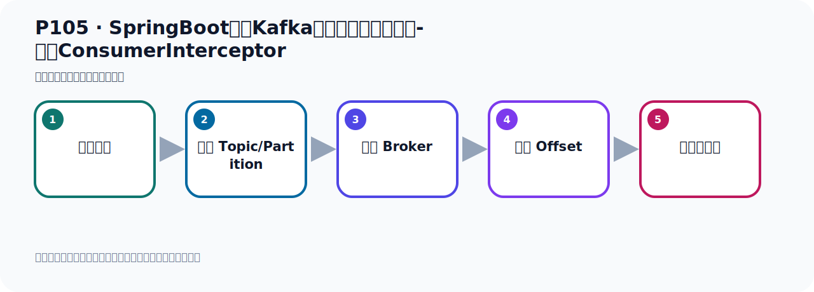
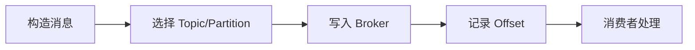

# P105：SpringBoot集成Kafka开发消费消息拦截器-定义ConsumerInterceptor

> 笔记编号 105/156 · 时长 08:07 · [打开原视频 P105](https://www.bilibili.com/video/BV14J4m187jz?p=105)

[← P104: SpringBoot集成Kafka开发批量消费消息](../07-consumer-internals/p104-SpringBoot集成Kafka开发批量消费消息.md) · [返回本章](./README.md) · [P106: SpringBoot集成Kafka开发消费消息拦截器-配置ConsumerFactory →](../07-consumer-internals/p106-SpringBoot集成Kafka开发消费消息拦截器-配置ConsumerFactory.md)

## 这节到底讲什么

**核心主题：SpringBoot集成Kafka开发消费消息拦截器-定义ConsumerInterceptor。**

这节位于消息链路上。要顺着“发送端—Broker—分区日志—消费端”看数据和元数据怎样流动。
本节属于“消费者开发与分区分配”这一章；放在全章里看，它的作用是：掌握 ConsumerRecord、监听器、手动确认、指定位置消费、批量消费、拦截器和分区分配策略。

## 本节路线

## 老师的完整讲解顺序（ASR 辅助复核）

> 下面按时间顺序保留经过基础术语替换的 ASR，方便核对老师是否提到某个细节。
> 人名、命令、代码和英文参数仍可能识别错误；准确结论以本节白话说明、代码块和实操速查表为准。

### 1. 00:00–01:08

刚才我们介绍了是消费者 吸料消费消息，一次性消费多条消息。我们下面再介绍一下，消费消息的时候，我们对消息进行拦截。那么它是什么意思呢？就是说我在消费这个消息之前，我们可以通过配置拦截器对消息进行拦截。在消息被实际处理之前对其进行一些操作，比方说记录日志、修改消息内容，或者是执行一些安全检查等等。我们知道消费消息我们在前面写代码的时候，我们都是通过配置一个监听器，通过注解实现的。那么这种实现是一种生迷式的实现，因为你不用学具体的怎么去读取消息的过程，而是生迷式的。那么SprayKafuka这个项目已经帮你实现了底下的功能，我们通过生迷式的方式加上注解。

### 2. 01:08–02:10

那么它拿到消息之后，它会调我们这个方法，然后把消息传给我们，我们就拿这个消息了。好，那现在能力气的意思就是说，我在调理这个方法之前，我先做个拦截，你先走我的能力气，能力气走完之后再走你这个方法，我们下面这个方法再执行。那这一会我们就可以对这个消息做一些处理，比如说我要记录一下日志，我对这个消息做个安全检查，对这个消息内容做一些修改都是可以的。好，这个就叫拦截气，在消息真正的，你拿到消息之前，我可以对消息做一些操作，做一些处理，做一些过滤等等。好，这个就是拦截气。那我们现在看一下它怎么做呢？来，做个两步。第一步，你要实现一个Kafka的这个Consumer Interception 能力气接口，先实现接口，你写一个内实现这个接口，覆盖它里面的方法。

### 3. 02:10–03:12

然后第二步呢，在Kafka消费者的这个消费者工厂中，要配置在这个配置和注册这个能力气，就是你所这个能力气要生效，那你需要在它的消费者工厂中，要注册配置一下。那下面我们主要通过代码来去实现一下，实现之后我们就清楚了。那下面我们开始写代码，那写代码的话呢，我们首先为了大家后续复习方便，把项目最好是弄一个新项目。好，如果新项目，我们这里做了一个新项目，快速创建一下，创建一个新项目。那我们还是史不乐意的Boot，刚刚这个NASI，Kafka，然后Base，然后我们这个地方改端一点。好，JDK是17，是Maev，下一步，下一步主要是勾选个热布数，还有这个Kafka，就在核心的几个包勾选一下，好，创建。

### 4. 03:13–04:13

那这个项目呢，我们就创建好了，创建好之后我们就开始去实现。好，那现在项目就创建好了，创建好之后我们开始在里面去写代码，把一些多余的我们先把它删掉一下，让这个项目更干净。好，那开始写代码，第一步呢，我们是干嘛呢？我们是写一个实现消费者能业器的这个类，好，我们写个类，就叫Customer Consumer Interciput，自定义的，自定义的能业器，好，那么写个能业器这里。然后写个这个能业器，我们写叫Interciput，好，这个包，然后名字叫这个名字，在我们写个能业器，名字比较长，这个测试方法的内改短点太长了。好，我们这个能试这个模块，从构下，名字OK。好，现在我们写这个能业器，这个能业器它怎么写呢？它主要是实现它那个接口，这个接口叫Consumer，。

### 5. 04:14–05:11

Interciput，好，那么我们就实现这个接口看一下，它是犯行的，犯行里面是K和V，也就是你这个消息的键和值，那么消息我们键倒是用使距，只在我们也用使距。好，实现这个接口那里也覆盖里面的方法，那么我们再次覆盖方法的形态，覆盖一下，实现方法，好，那么它里面有这么多出现方法，那么我们就确定，覆盖一下，这就可以了。好，这是我们制定的这个消费者能业器，制定的消费者能业器。好，然后就覆盖里面的方法，那么看起来这有好几个方法，首先这个方法，onConsumer，那么这个方法就是在消费消息之前执行，在这个你看消费消息之前，。

### 6. 05:12–06:08

在你真正的去调理那个监听器里面的方法，拿到消费的时候，在它之前就会执行这个方法。好，那么这个叫onConsumer，那么这个就是你消息拿到之后，消息这个拿到之后，然后之后呢，提交这个Offset，我们消息拿了之后，我们这个消费成功了，我们不是要提交Offset的吗，Offset之前，执行，执行该方法，在你提交Offset的时候，它会执行这个方法，这个方法，好，下面这个close，这个close我们可以看一下什么意思呢，它说这个调用是当你intersept被关闭的时候，这个被关闭的时候调用，这个方法我们可以不用去操作，不用去管它，。

### 7. 06:09–07:07

那下面这个配置，这个方法你也可以放这里不用去实现，就让它的这个复结口看它有没有默认实现，它没有默认实现，这个可以不用实现，是空着，可以空着，我们主要就实现这两个，来自消息就是在消息拿到之前，消费之前调这个方法，然后在你提交Offset之前调这个方法就可以了，好，那我们这里写个实现，那这个地方我们现在写个实现，比如说我在消息证一时被消费之前我记下实词，可以，当然可以，比如说我们打个实词，你有log，log去记住一下，我这里随便打一下，等一下我就把这个地方把这个信息打一下，这些事，这是我们这个unConsumer，unConsumer这个执行，这个方法被方法执行，执行我们把他里面这个数据打一下，直接就让他托词去打一就行了，好，打一完之后你让这个数据要返回，返回之后就让它继续往下面，。

### 8. 07:09–07:56

是吧，让它继续往下面去操作，往下面去操作就是让那个接近器里面那个方法去拿到这个消息，所以我们先执行这个方法，这个方法执行完之后，好，你把这个数据继续往下传，传给下面那个接近器那个方法，好，那个方法然后去接收这个消息，接收消息然后他就去接到消息之后他就要制度给服务器一个确认，再给服务器确认之前再调一下这个方法，这个方法电文之后你再convict提交这个Offset的确认，对吧，还是这样的，好，那我们这边也打一句话，以我们是测试所打一句话就可以了，好，那这种没有on这个convict方法执行，然后把这个对象就直接打印一下，好，那我现在这个接近器，不是这个拦截器就写好了啊，。

### 9. 07:56–08:03

大家细小了，这种的第一步就完成了，写一个质低的消费者拦截器，写在两个方法就可以了。

## 关键术语

- **Kafka：** Apache 开源的分布式事件流平台，常用于高吞吐消息传递、数据管道和流处理。
- **Consumer：** 从 Kafka Topic 拉取并处理事件的客户端。
- **Offset：** 事件在 Partition 中的位置编号，也是消费者记录消费进度的依据。

## 完整原声逐段记录

[查看本节带时间戳的本地 ASR](./transcripts/p105-SpringBoot集成Kafka开发消费消息拦截器-定义ConsumerInterceptor-ASR.md)。主笔记负责可读性和术语校正；ASR 页面负责完整性复核。

## 读完记住

- 本节主题是 **SpringBoot集成Kafka开发消费消息拦截器-定义ConsumerInterceptor**，它服务于本章目标：掌握 ConsumerRecord、监听器、手动确认、指定位置消费、批量消费、拦截器和分区分配策略。
- 理解顺序是：构造消息 → 选择 Topic/Partition → 写入 Broker → 记录 Offset → 消费者处理。
- 学习时要同时核对老师的解释、画面中的配置/代码，以及最终运行结果。

## 最容易踩的坑

能发送成功不代表业务处理成功；序列化、分区、确认机制和消费进度需要分别观察。

## 自测

1. 不看笔记，用自己的话解释“SpringBoot集成Kafka开发消费消息拦截器-定义ConsumerInterceptor”解决了什么问题。
2. 按顺序复述：构造消息、选择 Topic/Partition、写入 Broker、记录 Offset、消费者处理。
3. 如果运行结果和老师不同，你会先检查哪三个输入或环境条件？

## 学完检查

- [ ] 我能不看视频复述本节完整思路
- [ ] 我能指出关键命令、配置、类或接口的作用
- [ ] 我能解释画面中的输入与输出为什么对应
- [ ] 我核对过完整 ASR，没有跳过老师的补充说明
- [ ] 我完成了本节自测或复现实验
