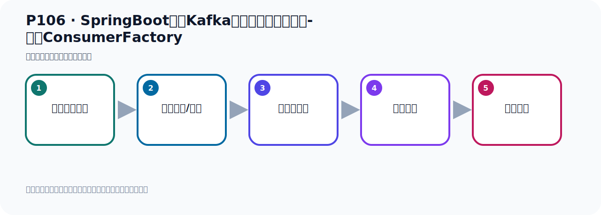
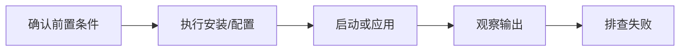

# P106：SpringBoot集成Kafka开发消费消息拦截器-配置ConsumerFactory

> 笔记编号 106/156 · 时长 08:17 · [打开原视频 P106](https://www.bilibili.com/video/BV14J4m187jz?p=106)

[← P105: SpringBoot集成Kafka开发消费消息拦截器-定义ConsumerInterceptor](../07-consumer-internals/p105-SpringBoot集成Kafka开发消费消息拦截器-定义ConsumerInterceptor.md) · [返回本章](./README.md) · [P107: SpringBoot集成Kafka开发消费消息拦截器-ConsumerFactory →](../07-consumer-internals/p107-SpringBoot集成Kafka开发消费消息拦截器-ConsumerFactory.md)

## 这节到底讲什么

**核心主题：SpringBoot集成Kafka开发消费消息拦截器-配置ConsumerFactory。**

这是一节动手课。不要只记命令，要把前置条件、操作步骤、关键参数和成功信号连成一条验证链。
本节属于“消费者开发与分区分配”这一章；放在全章里看，它的作用是：掌握 ConsumerRecord、监听器、手动确认、指定位置消费、批量消费、拦截器和分区分配策略。

## 本节路线

## 老师的完整讲解顺序（ASR 辅助复核）

> 下面按时间顺序保留经过基础术语替换的 ASR，方便核对老师是否提到某个细节。
> 人名、命令、代码和英文参数仍可能识别错误；准确结论以本节白话说明、代码块和实操速查表为准。

### 1. 00:00–00:50

我们这个蓝节气的代码写好以后啊，我们接下来就是要进行第二步。第二步呢就是在Kamakar消费者的这个消费者工厂中要配置注册这个蓝节气。主要就是他们通过那个Proplix里面配置一个呢，这个类型啊这个参数，然后是等于我们这个蓝节气的类名。那么这一块呢我们原来在开发生产论时呢，我们当时也是写过类似的代码，我们可以打开这些代码看一眼。比如说在之前的代码中啊，我们这个配置内可以看一下康费搞配置内。当时我们配置生产者，你看这个生产者工厂，然后他配置生产工厂的时候，也需要一些属性是吧，那么这个属性啊，也通过这个Map能配置的。

### 2. 00:51–01:45

那现在呢我们配消费者和这个代码是类似的，也就是我们在这边也需要写个呢一个配置内，好，这里我就写个配置内。然后是那我们这里也是写了Kafka，Kafka康费格，好，写了一个配置内，呃，配置内他也是加一个康费关系住解，假如他是一个配置内啊，那么这些类种啊，大家需要学习一下实际的部分啊，就吃到了，知道怎么回事了。好，那第一步呢我们就是把那些属性需要做一下这个配置，那就是这个方法，我们这边可以考虑一下啊，改一下，那么这是消费者消费配置。消费者消费配置，对吧，那么消费者消费配置配置什么东西呢，首先你需要不就是转过servo，那么这个需要有，你需要知道是哪个服务器是吧，需要这个有吧。

### 3. 01:46–02:33

然后就是那个，那我们这边就不是Producer，应该是Consumer配置啊，Consumer，Consumer，对吧，哎，然后那个calfe一个，他的一个配置，所以这是Consumer嘛，Consumer，Consumer。他也需要这个服务器例子，也需要这个键的训练话，看他这个键的训练话叫什么名字看一下，他点，点这个k，他点servo内容，我看一下。servo内容，好，那么k的训练话就是这个。哦，这个叫反训练话，k的反训练话是哪一个类，是吧，还有这个值的反训练话，那就是点value，值的训练话就是这个，反训的话，这是反训的话啊，好，配他。

### 4. 02:34–03:20

呃，然后就是，然后就是配一下我们那个蓝节器，那应该就，他应该是e to seven，e to seven，写的名字，好，那应该就是这个calfe一个，啊，下面就是文档，也看上面这个，我们可以点进去看一下，他的每个配置像啊，有一个配置像是这个名字，然后有个文档呢，是你这个的一个文档，那么文档也说这个配置像是什么意思，他在这个文档中呢，给你写好了，呃，直接写这里的，所以这个辩量没什么用，他只是对你这个配置像的一个说明，像他这个文档，多可是个文档，啊，是这个意思，其他字中也是一样啊，你看这个是配置，这是他的文档，是吧，那当然这个他没有文档啊，你看这是他配置，这是他的文档，啊，就这个意思，好，。

### 5. 03:21–04:07

那接下来你把前几个值，然后接下来我们这里的天天档蓝节器，我们之前是生产者对吧，我们现在是消费者，天天档蓝节器，那就是这里方，啊，那就是这里方的天天档蓝节器啊，那我下面这个就不要了啊，啊，上面是这个方，我们先把这个主事，放这位子，那下面这个多余的生教，好，听见一个消费男性器，消费男性器就这样就可以了，好，接下来把这一个类写下，那么消费男性器呢，我们是哪个类的，我们现在把多余的可以关掉了，那我们是哪个类，把这个折起来，我们是男性器，我们这个类，好，那他，那这方面就是他点class点给任务就可以了，好，那去加好了，然后这个符地址啊，那地址这一块呢，我们需要去，。

### 6. 04:07–04:56

呃，去读一下，我们看看之前怎么读的，我把代码抄一下，啊，之前写过，我们抄抄一下，照抄一下就可以了，之前读的地址，它是通过这个配置，哎，通过这个方式读的，那我们去读一下就可以了，到这里来，我们也去读一下配置配件，好，那么的伏级地址就解决了，然后今天我们这里需要一个叫，呃，可以的反训的话啊，就这个不是训的话，应该是反训的话，那我们需要在这个配置一些中啊，在这个地方，好，改一下，改一下的配置，改成y，y，y格式，外面格式，然后它的这个里边的配置项呢，我们从这边先考虑一下一个基础的，基础的考过来，然后改造，那在这里面，先沾一下，。

### 7. 04:57–05:52

那这个项目是蓝色的这个项目，啊，然后它的AP是这个地址，好，这个接地基这些我先，都做个三组啊，先留个最基本的这个样子，好，这个样子，然后，嗯，那我这个伏级地址读好了，然后今天就是一个叫训练话，反训的话，是吧，希望反训话那就是我们这个地方应该是有个叫消费者，他把一个坑凶吧，消费者，他然后配个这个k的，k的这个反训的话，是吧，还有个值的反训的话，那就是value的一个反训的话，那么他值多少啊，点击的看一下，那里就用默认也行啊，默认是这个类，那就是默认还是使取，那我们就使取啊，附置一下，那他就是这个，空格一下，这个这是他的反训的话，那这下面这个也有他这个反训的话，都用使取反训的话，好，那么这样的话，我们又把这个配了，这种配上之后，我们到时候读了读，读这个并论就行的。

### 8. 05:54–06:48

那到时候这个读的时候就改一下这个吧，那么Kafka，到时候这地方是ConsumerConsumer，是吧，然后到时候读的这个k的反训的话，这样，好，这边也是Consumer，然后k值的反训的话，就这个值的反训的话，好，到时候我们这就可以了啊，然后这里面就是他的k的反训的话，k的反训的话值的反训的话，对吧，k的反训的话，那就是通过他，然后k的反训的话，通过他k的反训，反训的话，对吧，好，那我这就配完了啊，配完张图片器也加好了，那我们现在这个配置内啊，该配的地方都配好了好，配好之后，接下来干嘛呢，接下来和之前是一样的啊，和我们之前的呢，和我们之前的生产者都配置差不多。

### 9. 06:48–07:39

你需要搞一个呢，消费者工厂，我们之前这边你看一下他带嘛什么，他配置完之后，他是搞了一个生产者工厂，那现在来我们要搞一个消费者工厂这里，要配置一个消费者工厂，这是消费者消费者工厂，好，那我们这边可以是cashable factorycashable factory，那这边是cashable factory好，他的内型啊，内型我们这里都是使具嘛，我们都是中算的，我们都是使具好，那你底下六个什么呢，那六个default的calfocon，cashable factory好，就用这个，他是个接口啊，这是个接口，你来点击这个接口，点击来，cashable是个接口，那么接口的实现。

### 10. 07:39–08:12

考取来去看一下，他的实现呢，一个叫moke，这个是测试相关的，所以我们只有这个default只能用这个，因为这个是与测试相关的啊，这个moke，我们就看这个啊就可以了，看这个default就行了好，那我们这就用default创建它，创建出来，好，那我们这个工厂就来创建了，对吧好，那我们现在这个工厂就创建好了，创建好之后来我们这个里面的配置项就来自于我们上面的这一段配置项这是我们的消费在工厂，这一块就配好了。

## 关键术语

- **Kafka：** Apache 开源的分布式事件流平台，常用于高吞吐消息传递、数据管道和流处理。
- **Producer：** 向 Kafka Topic 发送事件的客户端。
- **Consumer：** 从 Kafka Topic 拉取并处理事件的客户端。

## 完整原声逐段记录

[查看本节带时间戳的本地 ASR](./transcripts/p106-SpringBoot集成Kafka开发消费消息拦截器-配置ConsumerFactory-ASR.md)。主笔记负责可读性和术语校正；ASR 页面负责完整性复核。

## 读完记住

- 本节主题是 **SpringBoot集成Kafka开发消费消息拦截器-配置ConsumerFactory**，它服务于本章目标：掌握 ConsumerRecord、监听器、手动确认、指定位置消费、批量消费、拦截器和分区分配策略。
- 理解顺序是：确认前置条件 → 执行安装/配置 → 启动或应用 → 观察输出 → 排查失败。
- 学习时要同时核对老师的解释、画面中的配置/代码，以及最终运行结果。

## 最容易踩的坑

只照抄命令而不核对当前目录、版本、端口和配置文件路径，最容易造成“命令没报错但服务不可用”。

## 自测

1. 不看笔记，用自己的话解释“SpringBoot集成Kafka开发消费消息拦截器-配置ConsumerFactory”解决了什么问题。
2. 按顺序复述：确认前置条件、执行安装/配置、启动或应用、观察输出、排查失败。
3. 如果运行结果和老师不同，你会先检查哪三个输入或环境条件？

## 学完检查

- [ ] 我能不看视频复述本节完整思路
- [ ] 我能指出关键命令、配置、类或接口的作用
- [ ] 我能解释画面中的输入与输出为什么对应
- [ ] 我核对过完整 ASR，没有跳过老师的补充说明
- [ ] 我完成了本节自测或复现实验
