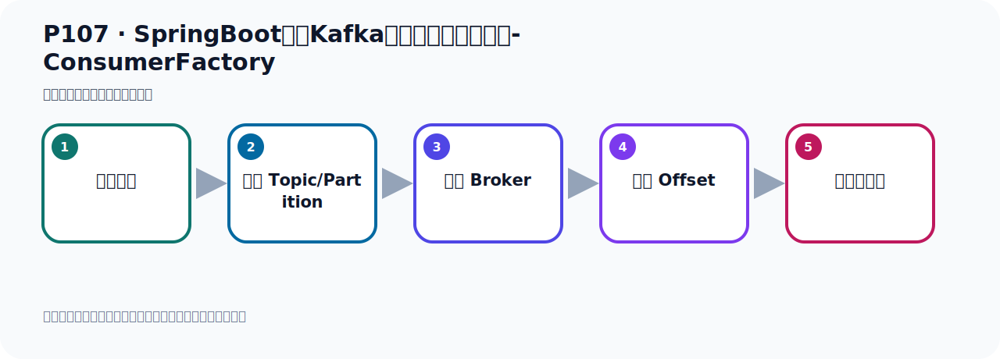
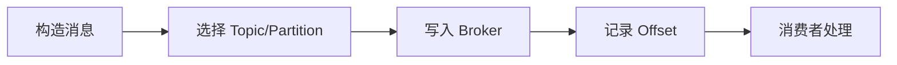

# P107：SpringBoot集成Kafka开发消费消息拦截器-ConsumerFactory

> 笔记编号 107/156 · 时长 05:49 · [打开原视频 P107](https://www.bilibili.com/video/BV14J4m187jz?p=107)

[← P106: SpringBoot集成Kafka开发消费消息拦截器-配置ConsumerFactory](../07-consumer-internals/p106-SpringBoot集成Kafka开发消费消息拦截器-配置ConsumerFactory.md) · [返回本章](./README.md) · [P108: SpringBoot集成Kafka开发消费消息拦截器-KafkaListenerContainerFactory →](../07-consumer-internals/p108-SpringBoot集成Kafka开发消费消息拦截器-KafkaListenerContainerFactory.md)

## 这节到底讲什么

**核心主题：SpringBoot集成Kafka开发消费消息拦截器-ConsumerFactory。**

这节位于消息链路上。要顺着“发送端—Broker—分区日志—消费端”看数据和元数据怎样流动。
本节属于“消费者开发与分区分配”这一章；放在全章里看，它的作用是：掌握 ConsumerRecord、监听器、手动确认、指定位置消费、批量消费、拦截器和分区分配策略。

## 本节路线

## 老师的完整讲解顺序（ASR 辅助复核）

> 下面按时间顺序保留经过基础术语替换的 ASR，方便核对老师是否提到某个细节。
> 人名、命令、代码和英文参数仍可能识别错误；准确结论以本节白话说明、代码块和实操速查表为准。

### 1. 00:00–01:01

我们的消费者工程配置好之后，接下来我们怎么去使用我们自己所配置的消费者工程。此时我们还需要配一个监听器容器工程。这一块我们需要给它先研究一下。我现在给大家这么筹读，我们这个项目是在这个能视项目录下，我现在让我这个配置内我先让它失效，我先不配置这个东西，我什么都不配。我把这个重解去掉之后，那我这个配置内相对就失效了，就相对没有作用，不起作用。使用的容器就不能少不了这个内的，它就失效了。然后我们干嘛呢？让我研究一下这个项目，使用的项目起动之后，它里面有什么东西来？它会根据你的这个配置文件，它会连到Kafka上去，然后它里面会有一个消费者工程，。

### 2. 01:01–01:56

同时有一个监听器容器工程，有这么两个工程的并。那我们在这里面，我们先去研究一下，那就是我们这个使用部的程序起动之后，我们看一下它有没有，看一下它返回到这个容器中，有没有我们这个消费者工程，以及那个监听器容器工程，看有没有，那就是我们这个使用部的程序，梦一方法运行完之后，梦一方法运行完之后，它这里有个我们返回一个容器的，这就是个容器内，容器你看，这个内你看它继承死不死的Application Contest，所以它返回是个容器，这就是我们返回的容器，那我们知道这个结论以后，那就是我们这个返回值，你可以用这个容器来接收，也就是我们这里拿到一个容器，十分容器，拿到十分容器之后，。

### 3. 01:56–02:48

我们通过容器去拿一下，它点get那个B of type，根据class内形，我拿这个B，它返回是个Map，就是我们看看容器中有没有某个内形的B，某个内形的B有没有，那么传个什么B呢，传个Consume，Consume Factory，传这个class，看看容器中有没有这个Consume这个消费者工厂B，看有没有这个B，就这个内形的，它的实现我们可能就来去看一下，它的实现肯定是离负了这个实现的，那么看一下我们这个程序形容之后，它里面有没有这样一个B，我们现在是这个配备我们就失效了，配备就失效了，那相当于它目前只有这个配置，只有这个配置，。

### 4. 02:48–03:55

只有这个配置的话，它容器中有没有这个消费者工厂B呢，那么通过它可以打印一下就知道了，Vr，对吧，vr之后它反过来是一个Map，它反过来是个Map，把它Map过来打印一下就可以了，那就要付一起这个循环，就它点付一起，循环它这个Map的话，它肯定就是一个q，一个value，一个value，这是那么表示，那么这一块需要学一下那么表示，我们打印一下它的这个，我们这个地方就是B，这个B all type，反应这个标记，倒是好，打一下k，然后再打一下这个值，刚刚好，打一下值V，那我们先跑一下，看看它里面有没有一个叫消费者工厂B，看一下有没有，好那么打了之后，我们可以看到，你看这个q就是我们这个Kafka，。

### 5. 03:56–04:44

ConsumerFactory，这个值就是它这个default，Kafka，ConsumerFactory，它是有这个B的，有这个B，对吧，也就是说我们这个SVM和Kafka整合之后，你这边即便是你不配这个配置内，我们配置内现在失效了没有配，你不用自己配，就是你不自己配这个什么Consumer这个工厂的话，它其实利用你这个配置为件，它会自己有一个，它从一中有一个这个ConsumerFactory这个B，那为什么我们还有自己在这边配一个B呢，最主要就是因为它的这个，它根据配置为件所配的这个B呢，它里边没有，没有什么，没有我们的拦戒器啊，因为我们制定了一个拦戒器，是吧，拦戒器，那它没有这个拦戒器，。

### 6. 04:45–05:39

所以我们就需要自己的人工去覆盖一下它里面的B，就我自己写个嘛，把它那个末日那个给覆盖掉，不用容器中创建的那个，因为我们自己创建的那个，就是在框架本身会帮你创建一个这个FactoryB，但是我们不用它那个，不用自己的，用自己的我要在里面做修改啊，就是给你这个属性是吧，这属性做修改，最多的修改就是我们要改一下这个，它这个拦戒器啊，那我们看看它这个地方能不能配啊，就说这个消费的它里面有没有配拦戒器呢，如果它能配的话，是不是就可以呢，但是我们发现没有找到它这边可以配拦戒器的，index-sept，你看没有index-sept，找不到啊，看一下啊index-sept，找不到这个单词了，所以它没有这个可以配的，是吧，所以我们就没法用它默认的这个容器中的这个Factory，我们需要自己来搞一个Factory，。

### 7. 05:40–05:46

所以我们这里就要配一个Factory，是这样的，因为我们要修改这个Factory里面的一些属性，这个属性，。

## 关键术语

- **Kafka：** Apache 开源的分布式事件流平台，常用于高吞吐消息传递、数据管道和流处理。
- **Consumer：** 从 Kafka Topic 拉取并处理事件的客户端。

## 完整原声逐段记录

[查看本节带时间戳的本地 ASR](./transcripts/p107-SpringBoot集成Kafka开发消费消息拦截器-ConsumerFactory-ASR.md)。主笔记负责可读性和术语校正；ASR 页面负责完整性复核。

## 读完记住

- 本节主题是 **SpringBoot集成Kafka开发消费消息拦截器-ConsumerFactory**，它服务于本章目标：掌握 ConsumerRecord、监听器、手动确认、指定位置消费、批量消费、拦截器和分区分配策略。
- 理解顺序是：构造消息 → 选择 Topic/Partition → 写入 Broker → 记录 Offset → 消费者处理。
- 学习时要同时核对老师的解释、画面中的配置/代码，以及最终运行结果。

## 最容易踩的坑

能发送成功不代表业务处理成功；序列化、分区、确认机制和消费进度需要分别观察。

## 自测

1. 不看笔记，用自己的话解释“SpringBoot集成Kafka开发消费消息拦截器-ConsumerFactory”解决了什么问题。
2. 按顺序复述：构造消息、选择 Topic/Partition、写入 Broker、记录 Offset、消费者处理。
3. 如果运行结果和老师不同，你会先检查哪三个输入或环境条件？

## 学完检查

- [ ] 我能不看视频复述本节完整思路
- [ ] 我能指出关键命令、配置、类或接口的作用
- [ ] 我能解释画面中的输入与输出为什么对应
- [ ] 我核对过完整 ASR，没有跳过老师的补充说明
- [ ] 我完成了本节自测或复现实验
