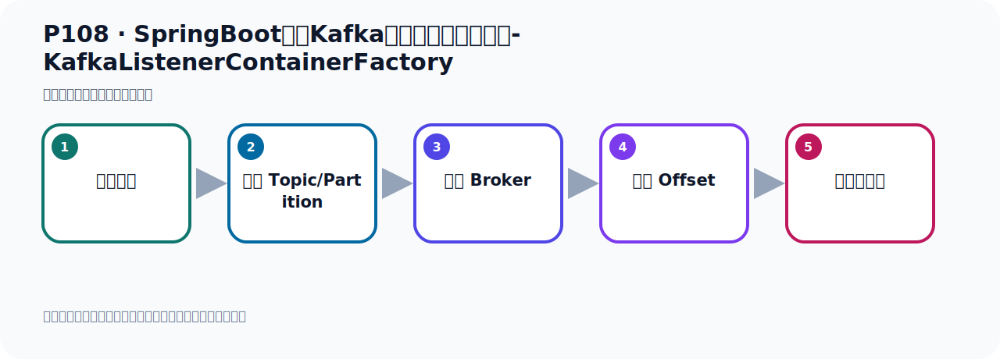
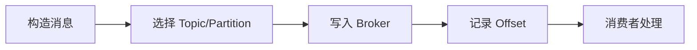

# P108：SpringBoot集成Kafka开发消费消息拦截器-KafkaListenerContainerFactory

> 笔记编号 108/156 · 时长 12:09 · [打开原视频 P108](https://www.bilibili.com/video/BV14J4m187jz?p=108)

[← P107: SpringBoot集成Kafka开发消费消息拦截器-ConsumerFactory](../07-consumer-internals/p107-SpringBoot集成Kafka开发消费消息拦截器-ConsumerFactory.md) · [返回本章](./README.md) · [P109: SpringBoot集成Kafka开发消费消息拦截器-消费者准备 →](../07-consumer-internals/p109-SpringBoot集成Kafka开发消费消息拦截器-消费者准备.md)

## 这节到底讲什么

**核心主题：SpringBoot集成Kafka开发消费消息拦截器-KafkaListenerContainerFactory。**

这节位于消息链路上。要顺着“发送端—Broker—分区日志—消费端”看数据和元数据怎样流动。
本节属于“消费者开发与分区分配”这一章；放在全章里看，它的作用是：掌握 ConsumerRecord、监听器、手动确认、指定位置消费、批量消费、拦截器和分区分配策略。

## 本节路线

## 老师的完整讲解顺序（ASR 辅助复核）

> 下面按时间顺序保留经过基础术语替换的 ASR，方便核对老师是否提到某个细节。
> 人名、命令、代码和英文参数仍可能识别错误；准确结论以本节白话说明、代码块和实操速查表为准。

### 1. 00:00–00:52

好，这个完了之后，接下来我们看一下，它里面有没有一个叫，叫做这么，容器工程啊，就是，就是Leasing的吧。Leasing，Leasing的这个content，content我看看有没有一个叫，Leasing的content，好，Leasing的content这个，这个factory，那我们先找一个这个，找不找我们找它复复接口，这是个冲向的对吧，点进来，好，点进来，我们点了这个内容去，先点进去，点进去之后，那么这个内，它是实现了这个接口，点进来，这个接口实现，这不是，这是犯行啊，那就是这个接口就是最底子的接口了，我们concure去看一下，对吧，它就已经是最底子的接口了，我们看一下容器中有没有这样一个类型的b，。

### 2. 00:53–01:52

就是这个Kafka，监听器，容器工程b，看有没有这个东西，好，那我们去在这里，去冲冲器中去打一下，那就是把这个代码去打一下，上面这个可以删掉，那我们去冲冲器中啊，那个是这个代码拿一下，拿一下这个b有没有，拿下这个b，那这个b就传个t，看看有没有这个b，然后我们这个地方其实这个可以打一个，这个不要，是吧，好，然后这个可以不要，那我看看你这边有没有，那我再说二啊，看看有没有这个叫Kafka，接进去容器工程这个b，有没有这个类型的b，那我们去冲冲器中看一下就知道了，那我们这个把这个程序冲起来，来，运行一下，这是从容器中拿这个类型b，我们去拿到是你看Kafka类型的container factory，它里面有一个呢，。

### 3. 01:52–02:43

名字末日，名字这个名字，它有一个这个东西，有个它，对吧，好，就是它里面末日有一个这东西，有按这样一个容器的工程，那上面这个东西我们也在这里做出写一下，它里面末日有一个这东西，末日有一个它，对不对，把末日给它，好，那现在就说你你这个使不认不得形容之后，它其实内部，它末日就有这个b和这个b，那么这几个b啊，其实就是它帮你内部帮你实现的，实现你倒是消息的这个监听，你看，这样一个Kafka监听容器的工程，它倒是可以实现消息监听，你发消息，倒是可以接收那现在我们因为我们要制定，我们自己搞按载设器，搞按载设器的话，那此时我们需要怎么办呢，我们就需要把它这个b覆盖掉。

### 4. 02:44–03:31

是吧，我们把他这个上面这个Consumer这个b要覆盖掉，同时把这个b要覆盖掉不能用它框架里面那个，因为它框架里面那个呢，它是没有给我们贴上载设器对吧，我们现在要贴上载设器，所以要覆盖掉它的有个b，把它覆盖掉那覆盖掉的话，就相当于我们在这里要自己的配一个，那就是b1a配一个，是吧，配哈姆利克，好，配个什么b呢，就配一个拿这样一个容器工程b的这个配个这个b，好，然后我们回退，又一个什么呢，我们的实现，那些6个像它这样的这个类型的实现一个这个实现那你在6这个实现的时候看一下，6个实现的时候，它6这个实现，你看着它的这个购习方法。

### 5. 03:31–04:24

6它的实现的时候呢，你看着它的购习方法，我们展在这里，好，我们看它的购习方法啊那它目前好像没有这个购习方法它购习方法它在没有，你看，没有，它只有的这个这个方法那我们如何去创建，那我们接下来就是如何去创建它这个实力呢它有无差过计然后呢，我们关系，然后它6个车，然后你们可以赛来一下什么东西赛来一下那个什么factory我们这里面设这个消费的工厂那你自己这样，因为它没有那个参数时间传进来，那就设了消费工厂，那消费工厂就是我们上面的这个消费工厂就这个好，那么这个的话，我们可以把上面这个作为容计一个b呢，b e a 作b如果它是一个b的话，我们可以通过方法参数把这个b呢。

### 6. 04:25–05:32

注入到我们这个方法，这样，然后你这个b啊就可以传进来对吧，传进来好，那当然我们不是这么写啊，我们这个应该这样我们现在删6一个这个工厂，就点v a r6这个工厂好，然后给这个工厂呢我们这个名字太长了啊，干脆搞一个这个叫 business好，然后给它设置一个呢设置一个消费的工厂好，最终我们返回这个b对吧，这样就可以了好，然后它这个是黄色的啊，我们可以把它加一下它左也是个键和纸嘛，那么加个键和纸这样的这样是不是就没有这个黄色了然后在这边呢加一个键头就行了这个里面因为前面已经只能立行了，这可以不指定好，那么这个地方呢你刚才给加个键。

### 7. 05:33–06:25

加个纸好，它这里方它是不能一整个的，所以我们可以把这个键和纸这么加的对吧这边我们就加个位号啊，直接位号就行了不确的类型加位号，避免它有黄色警告那这样的话，我相当于我们配了一个容器工厂，监制器容器工厂用的是我们自己这个b那这样的话我就把它框架里面那个给覆盖掉了就把框架里面这个覆盖掉了啊，这个覆盖掉了它框架里面一个这个b一个这个b，我们先通过自己配这两个就把它覆盖掉了覆盖掉之后，我们现在把我们这个配置打开可以打开打开之后你发现到时候，我们就是我们质疑了这两个两个病啊，我们可以把名字改一下你比如说这个名字我们改成叫我们的我们改成叫。

### 8. 06:26–07:13

我们的是吧，我们的这个可能群，好，这个名字啊，改这个名字这并名字改了那这边你住的时候，这个名字我们也改一下叫这个名字通过方法参数把这个b注入到这个里面来这是方法参数注入好，然后我们这个名字呢，就叫这个名字然后我们这个名字也改一下我们改是吗我们改成改成我们的orKafka是吧，就我们改了b的名字那到时候你看，我们从容器中去拿下这个b的名字的时候就变成我们的这个b的名字了我们去测试一下，对吧看看有没有覆盖掉吧，有没有把容器中那个本身默认那个覆盖掉我们现在这个配置打开了打开之后呢，现在我们运行备访方法运行备访方法之后，我们看来它打印出来这个b的名字。

### 9. 07:13–08:11

是不是我们自己的这个什么运行，看一下就知道了好，那么这个打印之后，我们发现我们的消费的工厂是我们自己的打印这个名字叫它吗，这个k的名字吗然后它那个监讯器容器工厂有两个下面这个是框枪里面的这个是我们自己配置的它有两个了，对吧有两个现在有两个我们可以这样确定啊，肯定是这样的就说我们这里打个分析线打个分析线啊你看我们再重新运行一下重新运行，看清楚一些好，你看这是消费的工厂就一个，就是我们那个原来框枪中的那个被我们覆盖掉了现在就剩我们这个了但是下面这个监讯器容器工厂有两个有两个，一个就是我们自己的因为我们这个b的名字叫R1。

### 10. 08:11–09:15

然后另外一个就是容器里面那个它有两个有两个，那就是你看一下我们的这个监讯器容器工厂，它用的是我们自己的这个消费的工厂对不对，就是说它是我们这个用的是它下面这个容器工厂它的消费的工厂是谁的它的消费工厂用的是谁的呢那我们就去看一下这个这个断点这个断点在你这个断点好，我们底报运行，底报运行一下好，这是我们的那个容器工厂那我们的工厂，那么它的那个消费工厂就是我们的我们的消费工厂对吧好，是它那然后我们再往下找一条循环一下再循环一下好，再进来再进来就变成使不变容器中也就是框架中它自己本身的那个监讯器容器工厂那么这个容器工厂它的消费者工厂是谁的。

### 11. 09:17–10:04

它里面有一个消费工厂就是它那么它是什么，你看这个名字NOTMALIDYBUSBRAIN是吧那就不是我们的了啊这就不是我们的那是框架里面的那么你看它的配置它的配置你看这些纸，这些纸这些纸它其实读的是配置文件读的是配置文件是吧，比如说这个纸我们没有设设它有这个纸它有这个纸，我们没有设设啊也这些就它自己读了想读了这个配置文件里面的或者是默认的而我们那个呢应该是有设设的你看我们是要走完我们重新再来走一下再提办法走一点我们那个那个呢它的设置你可以看一下它设置啊这现在这是我们的第一个是我们的那么它的消费工厂展开我们的配置是什么呢。

### 12. 10:04–10:56

我们的配置你看就是一个它建，直，还有服务器还有这个拦戒器对吧你看我们的这个消费工厂有拦戒器而它刚才另外一个那个B它的那个拦戒器工厂是没有这个的没有这个这个拦戒器B的所以你用它默认的那个呢肯定是不行的要用我们这个才可以是吧要用我们这个才可以好，那我们这样的话呢我们就自己配上一个消费的工厂啊一个消费的工厂另外一个就是监听器容器工厂两个有的两个之后呢其实就是你消费消息的时候啊使用我们自己的这个监听器容器的容器工厂那么它就可以使用这个拦戒器了对吧那也就是说我们在写这个消费的的时候比如说我们考一个消费的工厂考个消费的那这个是消费的吧。

### 13. 10:57–12:00

消费者我们沾到这里来考个消费者沾过来啊沾过来我们去改代吧好，把对象区观想改代吧改代吧呢我们在这里面可以指定一下什么呢指定一个属性呢点击在它的属性它的属性里面可以指定一下什么这个容器工厂B指定这个容器工厂B也就是我们的Kafka呢指定这个B我们用哪一个那么用哪个呢我们用我们自己的那个才可以那就是我们指定一下这个属性谁叫这个属性对吧好，等于什么呢等于我们B的名字我们B的名字是叫什么呢是叫这个名字的叫这个名字叫这个名字好，那么这样的话我们去消费的时候它就使用的是我们所配置的那个消费者工厂以及监听器容器工厂那这样的话呢它就可以使用到我们那个拦戒器。

### 14. 12:01–12:03

对我们消息消费之前可以使用拦戒器。

## 关键术语

- **Kafka：** Apache 开源的分布式事件流平台，常用于高吞吐消息传递、数据管道和流处理。
- **Consumer：** 从 Kafka Topic 拉取并处理事件的客户端。

## 完整原声逐段记录

[查看本节带时间戳的本地 ASR](./transcripts/p108-SpringBoot集成Kafka开发消费消息拦截器-KafkaListenerContainerFactory-ASR.md)。主笔记负责可读性和术语校正；ASR 页面负责完整性复核。

## 读完记住

- 本节主题是 **SpringBoot集成Kafka开发消费消息拦截器-KafkaListenerContainerFactory**，它服务于本章目标：掌握 ConsumerRecord、监听器、手动确认、指定位置消费、批量消费、拦截器和分区分配策略。
- 理解顺序是：构造消息 → 选择 Topic/Partition → 写入 Broker → 记录 Offset → 消费者处理。
- 学习时要同时核对老师的解释、画面中的配置/代码，以及最终运行结果。

## 最容易踩的坑

能发送成功不代表业务处理成功；序列化、分区、确认机制和消费进度需要分别观察。

## 自测

1. 不看笔记，用自己的话解释“SpringBoot集成Kafka开发消费消息拦截器-KafkaListenerContainerFactory”解决了什么问题。
2. 按顺序复述：构造消息、选择 Topic/Partition、写入 Broker、记录 Offset、消费者处理。
3. 如果运行结果和老师不同，你会先检查哪三个输入或环境条件？

## 学完检查

- [ ] 我能不看视频复述本节完整思路
- [ ] 我能指出关键命令、配置、类或接口的作用
- [ ] 我能解释画面中的输入与输出为什么对应
- [ ] 我核对过完整 ASR，没有跳过老师的补充说明
- [ ] 我完成了本节自测或复现实验
