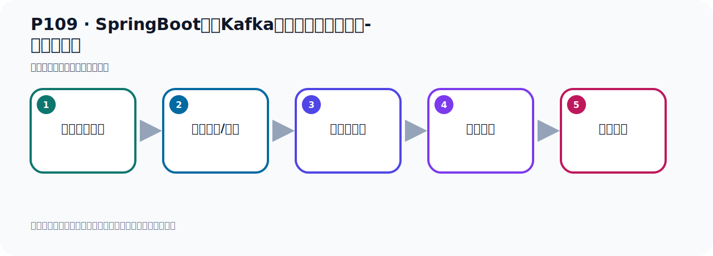

# P109：SpringBoot集成Kafka开发消费消息拦截器-消费者准备

> 笔记编号 109/156 · 时长 01:12 · [打开原视频 P109](https://www.bilibili.com/video/BV14J4m187jz?p=109)

[← P108: SpringBoot集成Kafka开发消费消息拦截器-KafkaListenerContainerFactory](../07-consumer-internals/p108-SpringBoot集成Kafka开发消费消息拦截器-KafkaListenerContainerFactory.md) · [返回本章](./README.md) · [P110: SpringBoot集成Kafka开发消费消息拦截器-测试验证 →](../07-consumer-internals/p110-SpringBoot集成Kafka开发消费消息拦截器-测试验证.md)

## 这节到底讲什么

**核心主题：SpringBoot集成Kafka开发消费消息拦截器-消费者准备。**

这是一节动手课。不要只记命令，要把前置条件、操作步骤、关键参数和成功信号连成一条验证链。
本节属于“消费者开发与分区分配”这一章；放在全章里看，它的作用是：掌握 ConsumerRecord、监听器、手动确认、指定位置消费、批量消费、拦截器和分区分配策略。

## 本节路线

## 老师的完整讲解顺序（ASR 辅助复核）

> 下面按时间顺序保留经过基础术语替换的 ASR，方便核对老师是否提到某个细节。
> 人名、命令、代码和英文参数仍可能识别错误；准确结论以本节白话说明、代码块和实操速查表为准。

### 1. 00:00–01:06

所以我们下面就可以测试一下。好，我们这里就不搞这个批调了，我们就搞一个普通的这个消费就可以了。不过消费，然后把它做一个打印就行了。好，这些多余料我们就删掉一下。消息消费，是吧？然后加上这个Record。好，这样我们就写好了。写好了之后，你到时候发消息，他就使用我们的这个容器工厂，到时候去消费。那么他里面有一个蓝节器，他里面有一个蓝节器。那下面我们就是写一个申请者去发送一下消息，发送一下消息之后，我们来看一下他有没有走蓝节器，也就是发送一个消息之后，所以之后我们看看我们的那个消费者，他在消费消息之前有没有走蓝节器，去验证一下我们的蓝节器有没有生效。

### 2. 01:06–01:08

好，那我们下面去看一下。

## 关键术语

- **Kafka：** Apache 开源的分布式事件流平台，常用于高吞吐消息传递、数据管道和流处理。

## 完整原声逐段记录

[查看本节带时间戳的本地 ASR](./transcripts/p109-SpringBoot集成Kafka开发消费消息拦截器-消费者准备-ASR.md)。主笔记负责可读性和术语校正；ASR 页面负责完整性复核。

## 读完记住

- 本节主题是 **SpringBoot集成Kafka开发消费消息拦截器-消费者准备**，它服务于本章目标：掌握 ConsumerRecord、监听器、手动确认、指定位置消费、批量消费、拦截器和分区分配策略。
- 理解顺序是：确认前置条件 → 执行安装/配置 → 启动或应用 → 观察输出 → 排查失败。
- 学习时要同时核对老师的解释、画面中的配置/代码，以及最终运行结果。

## 最容易踩的坑

只照抄命令而不核对当前目录、版本、端口和配置文件路径，最容易造成“命令没报错但服务不可用”。

## 自测

1. 不看笔记，用自己的话解释“SpringBoot集成Kafka开发消费消息拦截器-消费者准备”解决了什么问题。
2. 按顺序复述：确认前置条件、执行安装/配置、启动或应用、观察输出、排查失败。
3. 如果运行结果和老师不同，你会先检查哪三个输入或环境条件？

## 学完检查

- [ ] 我能不看视频复述本节完整思路
- [ ] 我能指出关键命令、配置、类或接口的作用
- [ ] 我能解释画面中的输入与输出为什么对应
- [ ] 我核对过完整 ASR，没有跳过老师的补充说明
- [ ] 我完成了本节自测或复现实验
