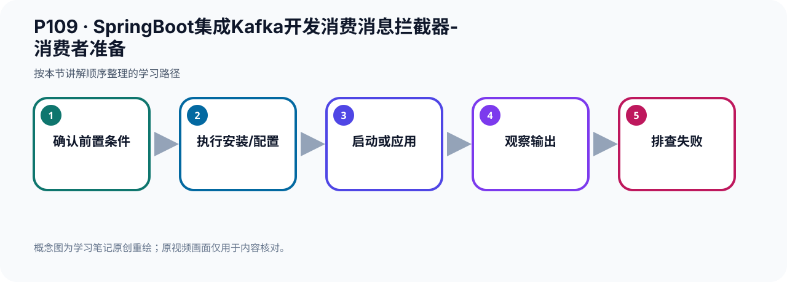

# P109：SpringBoot集成Kafka开发消费消息拦截器-消费者准备

> 笔记编号 109/156 · 时长 01:12 · [打开原视频 P109](https://www.bilibili.com/video/BV14J4m187jz?p=109)

[← P108: SpringBoot集成Kafka开发消费消息拦截器-KafkaListenerContainerFactory](../07-consumer-internals/p108-SpringBoot集成Kafka开发消费消息拦截器-KafkaListenerContainerFactory.md) · [返回本章](./README.md) · [P110: SpringBoot集成Kafka开发消费消息拦截器-测试验证 →](../07-consumer-internals/p110-SpringBoot集成Kafka开发消费消息拦截器-测试验证.md)

## 先看结论

> 这节通过“SpringBoot集成Kafka开发消费消息拦截器-消费者准备”完成一条可验证的操作链：先核对前置条件，再执行配置或命令，最后用日志和运行结果确认环境真正可用。它服务于本章目标：掌握 ConsumerRecord、监听器、手动确认、指定位置消费、批量消费、拦截器和分区分配策略。

## 老师怎么一步步讲

1. 第 1 步，围绕“SpringBoot集成Kafka开发消费消息拦截器-消费者准备”完成确认前置条件。
2. 第 2 步，围绕“SpringBoot集成Kafka开发消费消息拦截器-消费者准备”完成执行安装/配置。
3. 第 3 步，围绕“SpringBoot集成Kafka开发消费消息拦截器-消费者准备”完成启动或应用。
4. 第 4 步，围绕“SpringBoot集成Kafka开发消费消息拦截器-消费者准备”完成观察输出。
5. 第 5 步，围绕“SpringBoot集成Kafka开发消费消息拦截器-消费者准备”完成排查失败。

## 老师的补充说明

下面按原声顺序整理老师的完整讲解脉络。保留原因、案例、对比、操作过程、边界条件和口头提醒；删除重复语气词，并把长口语拆成适合阅读的短段落。

> 技术术语已经过统一校正；仍无法确认的人名或口头英文会保留原意，并通过右侧时间范围返回视频核对。

### 先明确：SpringBoot集成Kafka开发消费消息拦截器-消费者准备要解决什么 · 00:00–00:24

所以我们下面就可以测试一下。我们这里就不搞这个批量了，我们就搞一个普通的这个消费就可以了。不过消费，然后把它做一个打印就行了。这些多余代码我们就删掉一下。消息消费，是吧？

这一节承接前面已经配置好的 `ConsumerFactory` 和 `KafkaListenerContainerFactory`。老师先把消费者改回普通的单条消费，不启用批量监听；监听方法接收 `ConsumerRecord` 并打印。这样做是为了让测试只保留“消息到达—拦截器先执行—监听方法再消费”这条主线。

这里还没有完成最终验证，而是在准备观察点：下一步由生产者发出一条消息，消费端日志应当先出现消费者拦截器的输出，再出现监听方法打印的记录。这个先后顺序，就是判断 `ConsumerInterceptor` 是否真正接入监听容器工厂的依据。

### 继续拆解执行安装/配置 · 00:24–00:49

然后加上这个Record。这样我们就写好了。写好了之后，你到时候发消息，他就使用我们的这个容器工厂，到时候去消费。那么他里面有一个拦截器，他里面有一个拦截器。那下面我们就是写一个生产者去发送一下消息，发送一下消息之后，。

### 最后验证结果，并收束本节结论 · 00:49–01:08

我们来看一下他有没有走拦截器，也就是发送一个消息之后，所以之后我们看看我们的那个消费者，他在消费消息之前有没有走拦截器，去验证一下我们的拦截器有没有生效。那我们下面去看一下。

## 放进整套课

本节属于 **消费者开发与分区分配**。这一章要解决的是：掌握 ConsumerRecord、监听器、手动确认、指定位置消费、批量消费、拦截器和分区分配策略。

这是一节动手课。不要只记命令，要把前置条件、操作步骤、关键参数和成功信号连成一条验证链。

### 记忆路线

```mermaid
flowchart LR
    N0["确认前置条件"]
    N1["执行安装/配置"]
    N0 --> N1
    N2["启动或应用"]
    N1 --> N2
    N3["观察输出"]
    N2 --> N3
    N4["排查失败"]
    N3 --> N4
```

## 用在工作里

| 项目 | 内容 |
|---|---|
| 先回答 | 先确认版本、目录、端口和依赖服务是否满足本节前置条件。 |
| 立刻做 | 按老师的顺序复现安装或配置，并记录每条命令的输入与输出。 |
| 留下证据 | 留下一份包含成功信号和失败排查过程的实验记录。 |

## 关键术语

- **Kafka：** Apache 开源的分布式事件流平台，常用于高吞吐消息传递、数据管道和流处理。

## 最容易踩的坑

只照抄命令而不核对当前目录、版本、端口和配置文件路径，最容易造成“命令没报错但服务不可用”。

## 自测

1. 不看笔记，用自己的话解释“SpringBoot集成Kafka开发消费消息拦截器-消费者准备”解决了什么问题。
2. 按顺序复述：确认前置条件、执行安装/配置、启动或应用、观察输出、排查失败。
3. 如果运行结果和老师不同，你会先检查哪三个输入或环境条件？

## 学完检查

- [ ] 我能不看视频复述本节完整思路
- [ ] 我能指出关键命令、配置、类或接口的作用
- [ ] 我能解释画面中的输入与输出为什么对应
- [ ] 我读完了老师的详细讲解正文，没有只看路线图和要点
- [ ] 我完成了本节自测或复现实验

## 需要核对原话时

[查看本节带时间戳的完整 ASR](./transcripts/p109-SpringBoot集成Kafka开发消费消息拦截器-消费者准备-ASR.md)。主笔记负责理解与实践；ASR 页面负责逐句完整性复核。
