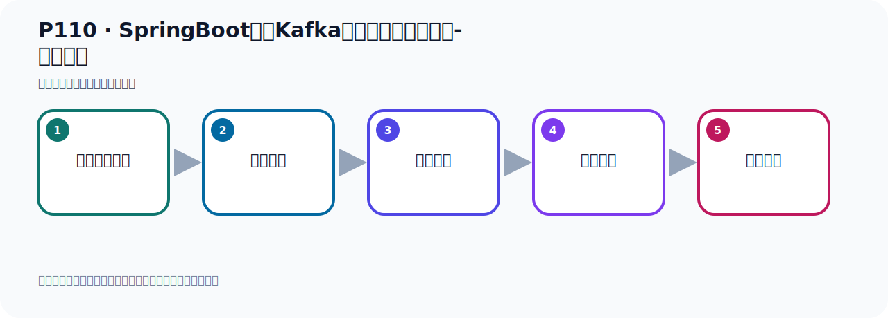
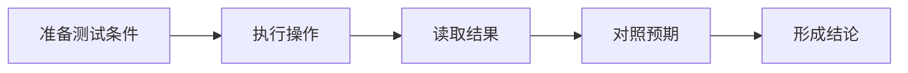

# P110：SpringBoot集成Kafka开发消费消息拦截器-测试验证

> 笔记编号 110/156 · 时长 06:12 · [打开原视频 P110](https://www.bilibili.com/video/BV14J4m187jz?p=110)

[← P109: SpringBoot集成Kafka开发消费消息拦截器-消费者准备](../07-consumer-internals/p109-SpringBoot集成Kafka开发消费消息拦截器-消费者准备.md) · [返回本章](./README.md) · [P111: SpringBoot集成Kafka开发消息转发 →](../07-consumer-internals/p111-SpringBoot集成Kafka开发消息转发.md)

## 这节到底讲什么

**核心主题：SpringBoot集成Kafka开发消费消息拦截器-测试验证。**

这节用实验验证前面的配置或机制。重点是记录输入、预期、实际输出，以及两者不一致时如何定位。
本节属于“消费者开发与分区分配”这一章；放在全章里看，它的作用是：掌握 ConsumerRecord、监听器、手动确认、指定位置消费、批量消费、拦截器和分区分配策略。

## 本节路线

## 老师的完整讲解顺序（ASR 辅助复核）

> 下面按时间顺序保留经过基础术语替换的 ASR，方便核对老师是否提到某个细节。
> 人名、命令、代码和英文参数仍可能识别错误；准确结论以本节白话说明、代码块和实操速查表为准。

### 1. 00:00–01:05

这些代码都准备好了，下面我们就是写一个发送者，发送一个消息，这里开始去消息监听接收，然后就看一看他有没有走我们的电器，我们去验证和测试一下。所以现在我们就写一个消息的发送者，发送者可以从这边拿下代码，Modular、生产者和Utl工具内都拿过来，沾到这边来，这个是先写过的，然后他Utl里面用的接审，我们需要考一个接审的依赖，这样一个驾包，这个驾包，没有驾包的话，但是这个接审转换，它会提示你找不到内，所以这里加一个驾包，刷新一下，让我们这个项目刷新一下，那我们准备就准备好了，看一下我们发送消息的代码，那我们这里不需要发送150条，125条不需要，这样就行了。

### 2. 01:07–02:05

那我们就发一条消息，1028吧，这个里面写了1，这个后面这个I去掉，我们这个K这个I也去掉，这样就发一条消息，发到Topic，Topic我们换个名字，比如说换个int3pt，就写个int吧，inta，就int，这是我们Topic的名字，int，它往这个Topic去发，那你这个接低的时候就接低Topic就行了，接着通过名字，这个分组我们写个int分组，写这个分组，这就是我们的代码就写好了，写好了之后我们在这里去发送，把我们的生辗者去发送就可以了，那就是我们的eventevent这个purduser，把它注入一下，。

### 3. 02:05–02:57

然后掉这个生辗者去发一条消息就可以了，点，发送，那我们这样去操作，首先我们把这个生辗者先给人开这里，因为你把生辗者开这里的话，他这个就开始接T，他这个容器开始接T，我把生辗者先打开，打开之后我去发，不准的话你发了之后你就历史消息，我们都是接不到，先把消费者先打开，打一下，好，那么他就打开了，打开了，这个之前的打开之后，看看他之前有没有接消息，看一下我们这个消息这个，我们这边应该是没有消息的啊，但是他也走了一下我们这个兰茄器的，这兰茄代码先走来一下，现在走的这个兰茄器但是他消息没有数据了，因为还没有发消息，他也走了一遍这个兰茄器啊，。

### 4. 02:58–03:45

那也就是这个代码走了一下这个我们的这个方法他走了，看一下是不是走了，走了，然后上面这个方法走了没有，这个方法再收一下，这个没走，他这个提交，这个方法执行的，上面方没执行，是吧，好，大概这个情况啊，我们现在主要就是看你消息发了之后他怎么样啊，好，现在我把接T器就接T开开这里的，能把之前是不是清一下是吧，现在就去发一个消息，看看他有没有拦截到，有没有接T到啊，拦截到我们的消息啊，走一下，先去发送右边这个是测试与发送消息，是吧，好，他现在应该是做右边这个已经发完了，发完之后看左边，左边这个你看他接的消息吗，消息接到了啊，这准备消息，我们发了个消息。

### 5. 03:46–04:32

然后这个消息的这个信息，信息就是我们的这个用物的对象，是吧，好，所以有了，然后在发送消息之前，应该他有一个这个onCosmo方法被执行的，这是拦截器的一个方法，然后你提交，提交那个Omfshand的时候，他会走这个方法是吧，在提交Omfshand之前，他会走下这个方法这个方法，所以我们这个拦截器就生效了，以上就是我们这个代码的一个实现，代码的实现啊，他会实现，他会走我们这个方法，还有走我们这个方法，对吧好，那如果说我们在这个消费者这个地方我们这个地方这个容器工厂，如果不使用我们自己这个容器工厂史诺斯框架里面那个容器工厂。

### 6. 04:33–05:24

或者说你这里不指定，就是我这里不指定这个容器工厂，我不指定的对吧，我没有指定容器工厂，好，这个时候会测一下，再把重新想想，他能不能走得了气呢，这个时候他应该是不能走得了气的因为你默认的，你不用你自己的容器工厂，那么他里面是没有那种人气的，对吧，说他不会走的啊，也就是说你一向用这个默认是这个容器工厂，那这个他是没有那个人气的，所以走不了的，好，这我们代码气好了，气好之后呢让他在这里接听啊，接听放这里，这个接听，然后今天我们去发消息，这里要发一下好，这样去发送，你看着他会不会走人气，我们可以观察一下好，那么这样的话我消息就发了，发了之后呢，我们在这边看一下啊，看起来他这个消息确实拿到了，消息拿到了，但是人节气没有走。

### 7. 05:25–06:07

不走的烈气，对吧，也就是我们的人气代码，比如说这个安康熊宝风暖之行，你看这些收下，康熊F收，收不到包括下面这个方法，这个在你收下，康熊F收，收不到所以呢，你不用你自己的那个容器工厂，那你倒数呢，他就没法去使用人节气，因为只有我们自己的那个容器工厂，他才里面才配两台节气，对吧，所以我们这里要指一下我们自己的那个这个容器工厂啊，容器工厂好，那以上啊，就是我们在我们的这个消费端，我们如何签，添加消息，来节气，他的距离的一个实现。

## 关键术语

- **Kafka：** Apache 开源的分布式事件流平台，常用于高吞吐消息传递、数据管道和流处理。
- **Topic：** 事件的逻辑分类。生产者向 Topic 写数据，消费者从 Topic 读取数据。
- **Event：** Kafka 中的一条业务记录，通常由 key、value、时间戳和 headers 等组成。

## 完整原声逐段记录

[查看本节带时间戳的本地 ASR](./transcripts/p110-SpringBoot集成Kafka开发消费消息拦截器-测试验证-ASR.md)。主笔记负责可读性和术语校正；ASR 页面负责完整性复核。

## 读完记住

- 本节主题是 **SpringBoot集成Kafka开发消费消息拦截器-测试验证**，它服务于本章目标：掌握 ConsumerRecord、监听器、手动确认、指定位置消费、批量消费、拦截器和分区分配策略。
- 理解顺序是：准备测试条件 → 执行操作 → 读取结果 → 对照预期 → 形成结论。
- 学习时要同时核对老师的解释、画面中的配置/代码，以及最终运行结果。

## 最容易踩的坑

测试前残留的 Topic、Offset、缓存或旧进程会污染结果；每次实验都要先确认初始状态。

## 自测

1. 不看笔记，用自己的话解释“SpringBoot集成Kafka开发消费消息拦截器-测试验证”解决了什么问题。
2. 按顺序复述：准备测试条件、执行操作、读取结果、对照预期、形成结论。
3. 如果运行结果和老师不同，你会先检查哪三个输入或环境条件？

## 学完检查

- [ ] 我能不看视频复述本节完整思路
- [ ] 我能指出关键命令、配置、类或接口的作用
- [ ] 我能解释画面中的输入与输出为什么对应
- [ ] 我核对过完整 ASR，没有跳过老师的补充说明
- [ ] 我完成了本节自测或复现实验
