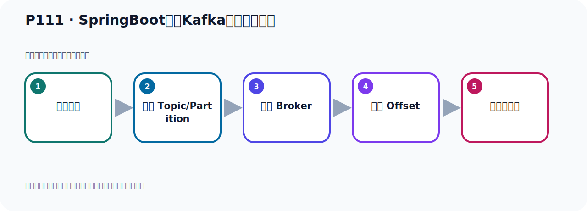
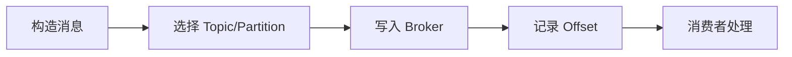

# P111：SpringBoot集成Kafka开发消息转发

> 笔记编号 111/156 · 时长 08:17 · [打开原视频 P111](https://www.bilibili.com/video/BV14J4m187jz?p=111)

[← P110: SpringBoot集成Kafka开发消费消息拦截器-测试验证](../07-consumer-internals/p110-SpringBoot集成Kafka开发消费消息拦截器-测试验证.md) · [返回本章](./README.md) · [P112: Kafka消息消费时的分区策略接口及实现类 →](../07-consumer-internals/p112-Kafka消息消费时的分区策略接口及实现类.md)

## 这节到底讲什么

**核心主题：SpringBoot集成Kafka开发消息转发。**

这节位于消息链路上。要顺着“发送端—Broker—分区日志—消费端”看数据和元数据怎样流动。
本节属于“消费者开发与分区分配”这一章；放在全章里看，它的作用是：掌握 ConsumerRecord、监听器、手动确认、指定位置消费、批量消费、拦截器和分区分配策略。

## 本节路线

## 老师的完整讲解顺序（ASR 辅助复核）

> 下面按时间顺序保留经过基础术语替换的 ASR，方便核对老师是否提到某个细节。
> 人名、命令、代码和英文参数仍可能识别错误；准确结论以本节白话说明、代码块和实操速查表为准。

### 1. 00:00–01:00

刚才我们介绍了消息的难解，我们接下来要介绍一下这个消息的转发。那首先消息转发是什么意思呢？消息转发就是，E-U-A从PoPiG-A中接收到消息。比如说，我们有E-U-A，它从PoPiG-A接到消息，这样接收到消息。接到消息之后，经过处理之后，它把消息又转到PoPiG-B，接到之后它又转过去。转到PoPiG-B里面去。只能够呢？PoPiG-B就是我们E-U-B来接收这个消息，那么E-U-B去接收PoPiG-B里面的消息。那么这的话就可以实现一个系统把消息处理之后，接着把这个消息再转发给其他系统。A把消息处理之后，再转到Kafka里面去，换个主题，B从另外一个主题再把消息接收到，。

### 2. 01:00–01:49

然后B可以继续处理这个消息。那这个在11kW中有可能有这样的需求，那如果说遇到这样的需求，我们可以使用这个消息转发。那这个开发呢，我们举个例子，就是我们有个E-U-GNT-PoPiG-B，脱密个A，它GNT脱密个A。接下来它把这个消息接到之后，它进行处理，处理的时候就是在它后面再加一个支付串，消息做了个加工，加工之后它通过剩个TOO这个重点，把这个加工后的信息，加工后的消息再转发到通过B里面去。好，那接下来我们有另外一个程序去GNT通过B，然后去接收通过B里面的这个消息就可以了，完成这个消息的转发，我们有写个代码去测试一下。

### 3. 01:50–02:40

好，那下面我们开代码，开代码为了大家看更清楚，所以我们都程序写一个新的，那我就从这个蕾式考背份，这样稍微快一点，抗卷C，然后在这里粘一下抗卷V，然后把名字改一下叫雷舞。好，OK一下，OK之后呢，我们需要把破文件改一下，主要是这几个名字全部给他换成雷舞，CogR选中它，然后改成雷舞，全部替换。好，这样我们就可以了，可以之后我们就把这个破文件它先不识别，我们右键破文件把它添加为Memory工程点一下，那么这样把它就识别了，好识别之后我们代码就证实了，好，那我们在这个一用的基础之上进行开发，好的，首先看一下我们有一个应用，它要GNT这个Topic可A，。

### 4. 02:40–03:32

对吧，那我就写个消费者，再写个消费者去GNT的Topic可A，Topic可A，好，那么这个就写好了，然后这一帮我们叫叫A Group，这名字叫A Group，好，那么这个容器工程这些我们现在不需要，我们用它默认的就可以了，是吧，好，它有接这个消息，消费，消息A，然后消费吧，好，这样消费了，消费之后然后转发，那怎么转发呢，给它上面加一个注解，是吧，SendTo，SendTo这个注解，好，SendTo注解里面给它指定一下，转发到哪个Topic可，好，里面指定一下这个Value，就是另外一个Topic可，就写个Value，转发到Topic的B，TopicB就可以了，。

### 5. 03:33–04:16

转发到TopicB，那我们这个时候呢，我们的方法呢，我们这个方法要有一个写个反规值，不可以像我们之前写个Value的，写个反规值，那我们反规个，比如说反规个十句吧，反十句呢，我就把这个消息，用十句的方式反规回去，那就变成我们这个消息吧，把它消息的值取到，它值就在里面，然后后面我们批个信息，好，这是SendTo，就是FourWord，FourWord到这个Message，是吧，这会转发后的一个消息，这样我们就把这个消息转发过去了，然后后面给它，将于做了个加工，然后给它跳到另外一个，发给另外一个Topic可，好，那我们这个方法写完了对吧，。

### 6. 04:17–05:02

写完之后呢，我们接下来就说，将于这个另外有一个程序，要接受Topic的B的信息，那这个手面在下面再写一个接地器，接地器，接地器怎么来，接地器通过B，然后这边写个B Group，对吧，好，下面这个SendTo转发不要了，好，我们这边要叫B吧，这个叫A吧，叫A，对吧，可以了，好，我们消息消息，B转发消费就可以了，好，B消费之后把它信息直接打印一下就可以了，那它转发过来之后，它能消息多少，好，那么直接打印一下这个消息，可以，就行了，那么B我们不需要转发写个货的，反回之前的货就可以了，那么直接不用转发写费，好，那这样就写完了，对吧，。

### 7. 05:02–05:56

那接下来我们就往这个Topic的A去发消息就可以了，是吧，往Topic的A发个消息，那次是我们在这里发消息，那这里有个生存者，那来接地器也不需要把删掉，不需要来把它去掉，然后这个配置可以看，这个配置也不需要，然后删掉，好，我们再是，这个消费者是这个效果，生存者在这里，好，我们去发消息，再去发消息了，再发一个消息，那么发哪儿去的，我们发到ATopic格，我们发到那个Topic个A，发这里，好，这些Topic个A就行了，把发回去，好，发回去之后我们再测试一下，测试一下，好，测试一下之后来我们在这个，这个成绩我们这样了，我们先把这个密封法起头起来，让它这个接地器开始工作，。

### 8. 05:57–06:43

然后我们再发消息，不然的话你这个历史消息它接不到对吧，好，现在我们这个成绩就吸引了，接下来之后来它这边也没有任何的问题，没有爆出，是吧，正筹的，好，这是轻一下，接下来我们去发消息，发信的我们用这个测试内再发一下，好，掉进发就发，要发完了，要再发就发就行了，好，那我们这里点一下发送，看一下发没被接到，看一下，好，那我这个发就发完了，这个发的时候它正筹的没有报错，看没有啊，好，那我们的接收在这边，接地器在这边，好，你看消息A在Topic个A里面它接到之后，好，这它接到的吗，接到之后它转了给托个B，好，那么托个B在B那个里面，。

### 9. 06:43–07:30

它又接到一次，然后，消费B也接到了，对吧，上面是A，然后是B，转发给B，好，那这个就是我们的消息转发，先是我们这个A接到，然后呢，再转发到B，那么B也接到啊，是这样的，那么它这里面会出两个Topic口，我们刷新看一下，在这里面我们刷新，刷新，刷新之后再展开看一下，Topic的A，有一条消息，是吧，托个B，你看也有一条消息，好，那么以上这个呢，那就是我们消息的转发，非常简单，就是加一个圣的兔，注解即可完成，我们这个接受到这个消息之后，然后消息可以做个处理，处理之后再转发给Topic个B就可以了，那么Topic个A里面呢，它是没有这个后面这个信息的，。

### 10. 07:30–08:13

没有这一段的，那么看一下它打个信息啊，那个信息里面，你看Topic个A，它接到的时候，它信息里面，你看它的数据应该在后面，是吧，它是这个基因串啊，这个基因串，政策基因串，那么它转发给托个B的时候，那么托个B接了手，它后面的信息是有变化的，看一下，托个B接受这个消息，那么它的信息里面，它后面加一个复活的，看一下，它的消息后面加一个复活的message，说明我们这个B接到这个消息是加工后的消息，好，至此就完成了消息的转发，它的代码主要就是一个圣的兔，用这个注解，即可实现，好，那么以上呢，就是我们介绍的这个消息的转发啊，。

## 关键术语

- **Kafka：** Apache 开源的分布式事件流平台，常用于高吞吐消息传递、数据管道和流处理。
- **Topic：** 事件的逻辑分类。生产者向 Topic 写数据，消费者从 Topic 读取数据。

## 完整原声逐段记录

[查看本节带时间戳的本地 ASR](./transcripts/p111-SpringBoot集成Kafka开发消息转发-ASR.md)。主笔记负责可读性和术语校正；ASR 页面负责完整性复核。

## 读完记住

- 本节主题是 **SpringBoot集成Kafka开发消息转发**，它服务于本章目标：掌握 ConsumerRecord、监听器、手动确认、指定位置消费、批量消费、拦截器和分区分配策略。
- 理解顺序是：构造消息 → 选择 Topic/Partition → 写入 Broker → 记录 Offset → 消费者处理。
- 学习时要同时核对老师的解释、画面中的配置/代码，以及最终运行结果。

## 最容易踩的坑

能发送成功不代表业务处理成功；序列化、分区、确认机制和消费进度需要分别观察。

## 自测

1. 不看笔记，用自己的话解释“SpringBoot集成Kafka开发消息转发”解决了什么问题。
2. 按顺序复述：构造消息、选择 Topic/Partition、写入 Broker、记录 Offset、消费者处理。
3. 如果运行结果和老师不同，你会先检查哪三个输入或环境条件？

## 学完检查

- [ ] 我能不看视频复述本节完整思路
- [ ] 我能指出关键命令、配置、类或接口的作用
- [ ] 我能解释画面中的输入与输出为什么对应
- [ ] 我核对过完整 ASR，没有跳过老师的补充说明
- [ ] 我完成了本节自测或复现实验
