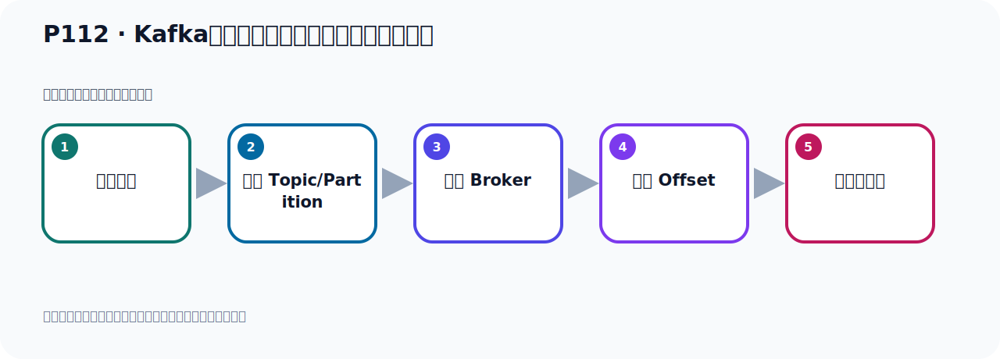

# P112：Kafka消息消费时的分区策略接口及实现类

> 笔记编号 112/156 · 时长 05:45 · [打开原视频 P112](https://www.bilibili.com/video/BV14J4m187jz?p=112)

[← P111: SpringBoot集成Kafka开发消息转发](../07-consumer-internals/p111-SpringBoot集成Kafka开发消息转发.md) · [返回本章](./README.md) · [P113: Kafka消息消费时的默认分区策略实现RangeAssignor →](../07-consumer-internals/p113-Kafka消息消费时的默认分区策略实现RangeAssignor.md)

## 这节到底讲什么

**核心主题：Kafka消息消费时的分区策略接口及实现类。**

这节位于消息链路上。要顺着“发送端—Broker—分区日志—消费端”看数据和元数据怎样流动。
本节属于“消费者开发与分区分配”这一章；放在全章里看，它的作用是：掌握 ConsumerRecord、监听器、手动确认、指定位置消费、批量消费、拦截器和分区分配策略。

## 本节路线

## 老师的完整讲解（按视频顺序校正）

> 下面保留老师的完整讲解顺序，并修正 Kafka、Java、ZooKeeper、
> Topic、Partition、Offset 等常见识别错误。它不是压缩摘要；原始 ASR 在后面单独保留。

### 1. 00:00–00:52

刚才我们介绍了消息的转发，那接下来我们继续看一下消息消费时的分区策略，这是消费。消息消费时的分区策略是什么意思呢？那么它指的就是，Kafka主题Topic中哪些分区应该有哪些消费者来消费。比方说我们选择往Topic、MaiTopic中发了很多消息，那么这个MaiTopic里面它还有三个分区，目前是三个，当然它也可以4个5个6个8个，它有好几个分区。那接下来我们这边有很多消费者，假如我们有三个消费者，那么这三个消费者，第一个消费者它消费哪个分区，第二个消费者它应该消费哪个分区，第三个消费哪个分区，那么这里面它有个策略。

### 2. 00:52–01:44

比方说现在我们只有三个分区，那每个消费者消费一个分区刚刚好，可以平均分配。那如果说我这边这个分区有4个，有5个，那么多了两个，那你现在每个人消费一个之后还剩两个分区，那么这个两个分区分配给哪个消费者去消费呢？那这个时候我们需要一套分配策略，这就是我们消费消息时的分配策略，就是我这个分区应该让哪个消费者去消费，这就是消费消息时的分区策略。那其实我们在前面也介绍过，这个生产者他发消息的时候，他也有一套分配策略。那么他如果说我这边有三个分区，有5个分区，那你发消息的时候你是发到哪个分区，发到没分区，还是一分区，还是二分区，还是五分区。

### 3. 01:44–02:44

那么生产者发出消息，他有一套发出消息的时候的分区策略。同时我们消费者消费消息的时候也有一套分区消费的策略。这就是我们这个分区的消费策略。那么在我们Kafka扣团里面，也就是我们Kafka提出了一个价包，Clant这个价包。这个价包里面他提出了一些类似的分区策略，有好几种。那么默认的这个分区策略，这个分区策略指的是我们消费消息时的分区策略。默认的是Range Oceler这样一个策略，叫范围的一个分配，按范围分配。当然他除了这个按范围分配之外，他还有其他的几种策略，分别是Range Oceler，那么这是轮巡的一种分配策略，还有Sticky Oceler。

### 4. 02:45–03:45

那么这个叫联系的联接，粘贴的联系的联系的一种分配策略。还有这个Conoperative Stick Oceler，那么前面这个单词表示合作的联系的分配。那么他里面有这样几种分配。这些分配策略各有各的特点，要根据实际应用场景和需求选择一个合适的分配策略。那么他整个内的实现技成图是这样的，最上面是我们这个接口，消费者Conchomo Padeci Oceler，就是消费者分区消费的一个策略，一个分配策略。下面有个抽象的一个抽象内，在下面就是我们这个具体的策略，Range Oceler，轮巡的这种策略，还有我们这种范围的策略。

### 5. 03:46–04:38

然后这一个抽象内，接下来就是我们这个Stick联系的分配策略，合作的联系的这个策略。好，整个是这么几个，这是实现内。那么这是抽象内，而在抽象内，这是接口，好，大概是这么一个结构。我们可以看一下他的顶尘这个接口，就是这个接口，Conchomo Padeci Oceler。那么在这边看一下，就是这个内的我在这边已经打开了，就是这个接口，最底层这个接口，把其他地方回关一下，然后你可以通过它，然后打开它这个内的结构图，打开，就这样子。对吧，在它的接口下面抽象内，实现，实现，这也是实现，这也是实现，这是抽象内，好，这个东西打开了实际上，。

### 6. 04:38–05:25

我们这个是由于历史原因可以打开过，它直接帮我展示出来了。你那边打开了是有可能这个没展出来，没展出来你需要怎么办呢？你需要通过它，然后展示它的所有实现这样，点所有实现。点所有实现的那么有一些，比如说这个什么，有一些这个包不对的，比如说这个Test，Test这就不算了，它说一测试嘛，这测试你也不用管它，还有使运猛，还有测试测试测试，那你选这些什么，这个Kavga Clantle里面的这些实现，Kavga Clantle它里面的实现，就是我们这些就它的实现，我们选这些实现，对吧，上面这是测试的，我们可以不管它。所以你如果下面这个没有出来的话，你可以在这里这个底层接口上右键，右键的手标，展示它的实现，展示实现，。

### 7. 05:25–05:41

选择这几种把它选上，按住Add键，然后一个个去选这样，Add键这样选，然后确定它就可以来展示这个图。好，这是它整个的内的一个结构图，那下面我们去测试一下。

## 关键术语

- **Kafka：** Apache 开源的分布式事件流平台，常用于高吞吐消息传递、数据管道和流处理。
- **Topic：** 事件的逻辑分类。生产者向 Topic 写数据，消费者从 Topic 读取数据。

## 完整原声逐段记录

[查看本节带时间戳的本地 ASR](./transcripts/p112-Kafka消息消费时的分区策略接口及实现类-ASR.md)。主笔记负责可读性和术语校正；ASR 页面负责完整性复核。

## 读完记住

- 本节主题是 **Kafka消息消费时的分区策略接口及实现类**，它服务于本章目标：掌握 ConsumerRecord、监听器、手动确认、指定位置消费、批量消费、拦截器和分区分配策略。
- 理解顺序是：构造消息 → 选择 Topic/Partition → 写入 Broker → 记录 Offset → 消费者处理。
- 学习时要同时核对老师的解释、画面中的配置/代码，以及最终运行结果。

## 最容易踩的坑

能发送成功不代表业务处理成功；序列化、分区、确认机制和消费进度需要分别观察。

## 自测

1. 不看笔记，用自己的话解释“Kafka消息消费时的分区策略接口及实现类”解决了什么问题。
2. 按顺序复述：构造消息、选择 Topic/Partition、写入 Broker、记录 Offset、消费者处理。
3. 如果运行结果和老师不同，你会先检查哪三个输入或环境条件？

## 学完检查

- [ ] 我能不看视频复述本节完整思路
- [ ] 我能指出关键命令、配置、类或接口的作用
- [ ] 我能解释画面中的输入与输出为什么对应
- [ ] 我核对过完整 ASR，没有跳过老师的补充说明
- [ ] 我完成了本节自测或复现实验
