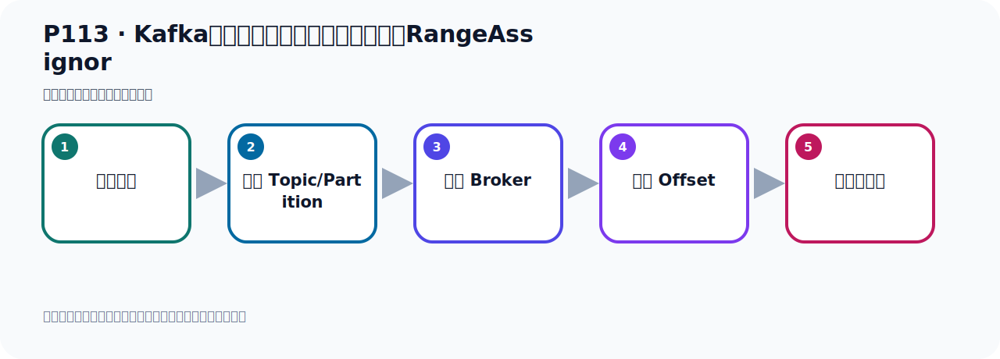
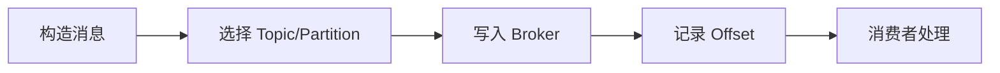

# P113：Kafka消息消费时的默认分区策略实现RangeAssignor

> 笔记编号 113/156 · 时长 06:10 · [打开原视频 P113](https://www.bilibili.com/video/BV14J4m187jz?p=113)

[← P112: Kafka消息消费时的分区策略接口及实现类](../07-consumer-internals/p112-Kafka消息消费时的分区策略接口及实现类.md) · [返回本章](./README.md) · [P114: Kafka消息消费时的默认分区策略RangeAssignor具体分配方式 →](../07-consumer-internals/p114-Kafka消息消费时的默认分区策略RangeAssignor具体分配方式.md)

## 这节到底讲什么

**核心主题：Kafka消息消费时的默认分区策略实现RangeAssignor。**

这节位于消息链路上。要顺着“发送端—Broker—分区日志—消费端”看数据和元数据怎样流动。
本节属于“消费者开发与分区分配”这一章；放在全章里看，它的作用是：掌握 ConsumerRecord、监听器、手动确认、指定位置消费、批量消费、拦截器和分区分配策略。

## 本节路线

## 老师的完整讲解（按视频顺序校正）

> 下面保留老师的完整讲解顺序，并修正 Kafka、Java、ZooKeeper、
> Topic、Partition、Offset 等常见识别错误。它不是压缩摘要；原始 ASR 在后面单独保留。

### 1. 00:00–01:02

消息消费时的分区策略，我们下面进行一下测试。那么进行测试的话，我们先准备一个程序。我们在这边就准备一个程序，把我们之前这个程序复制一份，复制一份，C，然后这里粘一个，CV，我们写个R6。这样方便后续区分复习。这样我们把破文件的名字我们统一都改一下。CountryR，然后这里做一个整体的替换，改成R6替换一下。替换之后来就可以了，可以之后把破文件右键，右键鼠标添加为Maple工程，然后这样的话它就正常了。这个名字它不对，我们通过手动这里调整一下。在这里重购项目，然后GNM，然后这个模块名改成R6，OK一下。OK之后我们看一下，它现在OK之后好像没有变过来，。

### 2. 01:02–01:51

没有变过来可能是ID的反应的问题，它没有反应过来，我们可以把ID重启一下。ID有时候它没有反应过来，那么点一下重启。重启一下，重启一下之后它就反应过来了，我们可以看一下。这个时候它后面就不见了，之前后面有个黑色的，有个扩号，先不见了。然后我们之前编这个Tag给了可以删掉，然后我们就可以开始改用代码。做个测试，我们这边看一下，这个服务器配置都配好了，我们这里面是个R6，那么这边没有问题，目前也是比较简洁的一种方式，然后就是我们消费者散热，这些消费者看一下，我们现在不用做转发，我们就做一个普通的消费就可以了，下面这个去掉。

### 3. 01:53–02:38

这个脱掉的名字，我们就取了叫MaiTorMig，叫这个名字。这个主叫MaiGorup，Gorup这个主，MaiGorup到时候去消费，就可以了。去消费消息，到时候打印一下，然后这个Return这个不需要，我们这个是一个V位的，我们去消费一下就可以了。那么这就是我们的消费者，准备好了，然后它的生产者在这里发出消息，发消息它正常发出消息，那就往MaiTorMig发出消息，MaiTorMig，去发出消息，这样就可以了，它发出这个数据发过去就行了，再发出消息，那就其他地方就没有什么需要修改的，然后再次备放运行，备放运行它下面这些多余的我们就删掉一下，。

### 4. 02:40–03:38

然后直接备放运行即可，好，这是我们的一个代码，到时候就去发消息，这边发消息测试，去调一下方法发送，那么代码准备好了之后，我们首先去看一下它的这个默认的分区是哪一个呢？默认分区是这个类，对吧？这个类，好，那我们在这个类来我们去进来，就这个类，这个类来我们再点一下，那就是在这个，那这个我们在一个锻点，看一下它那边有没有锻点，这里有锻点，你看它在消费消息的时候，它其实是会走这个锻点的，会走这个锻点，我这个锻点你打好了，打一个锻点，好，它有锻点，那首先我们这个项目要Db起动，这样Db起动，点Db起动，那此时我就把这个项目用Db分子把它跑起来，。

### 5. 03:39–04:21

好，跑起来之后呢，那么它就记住我们这个类的，记住这个类的，记住类，我看一下，那它对我刚才打开这个class本机，它记住这个Gama代码，记住这个Gama代码，好，我把这个左边关一下，左边关一下我们看看它的这个类是不是一样的，首先呢，我们这个类的这个class是吧，它是在这个保抢，在这个保抢，而我们记得这个类是在这个保抢吧，这个类它是哪个保抢呢？它是在这个保抢，它是在这个保抢，好，但这个包不一样，也就是它默认的这个分配策略是这个类，不是左边这个类，不是这个，这个下面这个包，不是这个包，内部一样是这个类，默认是这个类，好，我们看起来，。

### 6. 04:21–05:09

这个类在哪个地方，看一下，在哪个下包，它在这个加保里面，你让这个类，你让你点这个圆圈，它定位在这个位置的，这个位置在哪个，在我们这个加保里面，在这个加保，好，这是这个类，那么默认的它没有记这个类，说明不是这个加保，它的这个分区，消费分区的策略在这个clant的加保里面，在clant，那就在这个clant里面，那你看看我们这个类，我们点左边的圆圈，点一下，它进来这里是吧，在这里，在这里的话，它是在哪里呢？它在clant这个包里面，所以它的分区是在clant这个加保里面提供的，实现的，那么这里面我们还要说明一点就是，它的这个分区在你启动项目的时候，它就帮你要做好分区，你启动项目它就帮你做好分区的，。

### 7. 05:09–05:54

还没有你，你还没有消费啊，在你这个，就是你消费之前，你看我们消费的时候应该是哪里呢？我们消费的时候肯定是等于你这个这个这个get消息吧，它在你这个get消息之前，它首先就要会走一下它这个分配，会进入它这个分配，这个分配啊，分配来把这个分区就分好，你看它会进入这个这个代码中来，这就是分区，你的PartyC，分区，它要分好，分好之后，后续它才能用这个类去消费，它知道你怎么去消费，它要做好分区，好，我们看这个实现在这里，是吧，掉这个方法，所以它默认是用这个类去做这个分区的，消费的分区是用它，用它去实现的，好，那下面这个呢，就是它具体代表来一个实现，。

### 8. 05:54–06:05

那现在我们找到这个代码之后呢，我们接下来就来看一下，它这个分区具体是怎么做的，具体是怎么分的，我们来看一下这个问题，。

## 关键术语

- **Kafka：** Apache 开源的分布式事件流平台，常用于高吞吐消息传递、数据管道和流处理。
- **RangeAssignor：** 按 Topic 分别对分区做连续区间分配的消费者分区策略。

## 完整原声逐段记录

[查看本节带时间戳的本地 ASR](./transcripts/p113-Kafka消息消费时的默认分区策略实现RangeAssignor-ASR.md)。主笔记负责可读性和术语校正；ASR 页面负责完整性复核。

## 读完记住

- 本节主题是 **Kafka消息消费时的默认分区策略实现RangeAssignor**，它服务于本章目标：掌握 ConsumerRecord、监听器、手动确认、指定位置消费、批量消费、拦截器和分区分配策略。
- 理解顺序是：构造消息 → 选择 Topic/Partition → 写入 Broker → 记录 Offset → 消费者处理。
- 学习时要同时核对老师的解释、画面中的配置/代码，以及最终运行结果。

## 最容易踩的坑

能发送成功不代表业务处理成功；序列化、分区、确认机制和消费进度需要分别观察。

## 自测

1. 不看笔记，用自己的话解释“Kafka消息消费时的默认分区策略实现RangeAssignor”解决了什么问题。
2. 按顺序复述：构造消息、选择 Topic/Partition、写入 Broker、记录 Offset、消费者处理。
3. 如果运行结果和老师不同，你会先检查哪三个输入或环境条件？

## 学完检查

- [ ] 我能不看视频复述本节完整思路
- [ ] 我能指出关键命令、配置、类或接口的作用
- [ ] 我能解释画面中的输入与输出为什么对应
- [ ] 我核对过完整 ASR，没有跳过老师的补充说明
- [ ] 我完成了本节自测或复现实验
