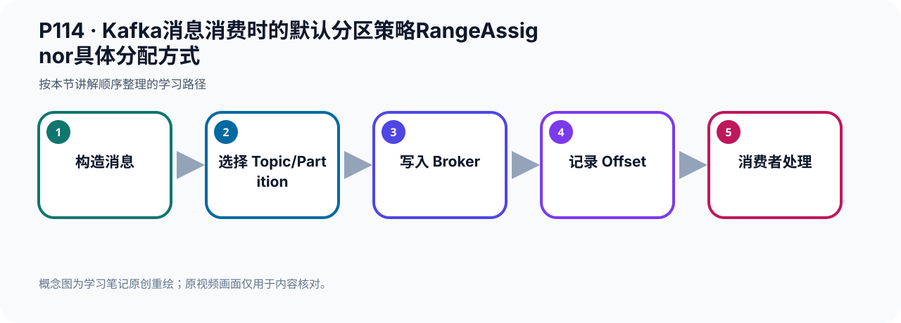
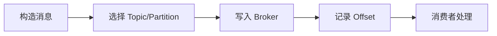

# P114：Kafka消息消费时的默认分区策略RangeAssignor具体分配方式

> 笔记编号 114/156 · 时长 04:58 · [打开原视频 P114](https://www.bilibili.com/video/BV14J4m187jz?p=114)

[← P113: Kafka消息消费时的默认分区策略实现RangeAssignor](../07-consumer-internals/p113-Kafka消息消费时的默认分区策略实现RangeAssignor.md) · [返回本章](./README.md) · [P115: Kafka消息消费时的默认分区策略RangeAssignor代码测试验证 →](../07-consumer-internals/p115-Kafka消息消费时的默认分区策略RangeAssignor代码测试验证.md)

## 先看结论

> 这节把“Kafka消息消费时的默认分区策略RangeAssignor具体分配方式”放回消息链路，沿 Producer、Broker、Partition、Offset 与 Consumer 追踪数据和元数据如何流动。它服务于本章目标：掌握 ConsumerRecord、监听器、手动确认、指定位置消费、批量消费、拦截器和分区分配策略。

## 老师怎么一步步讲

1. 第 1 步，围绕“Kafka消息消费时的默认分区策略RangeAssignor具体分配方式”完成构造消息。
2. 第 2 步，围绕“Kafka消息消费时的默认分区策略RangeAssignor具体分配方式”完成选择 Topic/Partition。
3. 第 3 步，围绕“Kafka消息消费时的默认分区策略RangeAssignor具体分配方式”完成写入 Broker。
4. 第 4 步，围绕“Kafka消息消费时的默认分区策略RangeAssignor具体分配方式”完成记录 Offset。
5. 第 5 步，围绕“Kafka消息消费时的默认分区策略RangeAssignor具体分配方式”完成消费者处理。

## 老师的补充说明

下面按原声顺序整理老师的完整讲解脉络。保留原因、案例、对比、操作过程、边界条件和口头提醒；删除重复语气词，并把长口语拆成适合阅读的短段落。

> 技术术语已经过统一校正；仍无法确认的人名或口头英文会保留原意，并通过右侧时间范围返回视频核对。

### 先明确：Kafka消息消费时的默认分区策略RangeAssignor具体分配方式要解决什么 · 00:00–01:08

消息消费的分区默认使用的是RangeAssignor。我们接下来看一下这个RangeAssignor叫做按范围进行分区，它具体是怎么分的。在这里我们一起梳理一下，我们举个例子，这样我们就可以知道它是怎么分的。首先我们假设一下，我们这个RangeAssignor它默认分区策略，假设我现在有个主题叫MighTopica，它里面有10个分区，10个分区那就是批人一到批9，有10个分区。

然后我们有消费者，我们有个消费者，有个消费组，比如说叫Might Group这个消费组，这个组里面有3个消费者，Consumer1、2、3消费者。按着我们这个RangeAssignor它的分区策略，那么第一步它是计算每个消费者应该得到几个分区。我们把这个东西稍微换一下，就说我们有一个Topic，Topic是吧？Topic里面才有10个分区，。

### 对比不同情况，明确条件和边界 · 01:08–02:18

我们画10个格子，一个，两个，三个，四个，五个，六个，七个，八个，九个，十个，好，十个。然后有三个消费者，三个消费者在一个组里面，这是一个组是吧？有一个消费者，两个消费者，三个消费者，好，我们三个消费者，那么这个消费者1叫C1，然后C2，然后C3，这样的，那三个消费者。那么第一步就是计算那个每个消费者应该得到几个分区，那怎么计算呢？就用分区总数除以消费者数量，分区总数的时，除以消费者数量是3，那么总数来就是有等于3在于1，那就是每个消费者理论上应该可以得到三个，是吧？

首先每个消费者应该要分三个分区，但是它与这个1，那怎么处理呢？我们看一下，每个消费者，他理论上应该分三个分区，但是由于有一个于数1，所以前一个消费者会多得一个分区，那就是怎么分的呢？那就是我们Consumer是我们第一个消费者，。

### 继续拆解写入 Broker · 02:18–03:26

他作为第一个消费者，他会得到3加1，4个分区，因为首先他相处之后，每个消费者应该分三个，他其实是一个均匀分配，这个软极，这个范围这个分配，他其实是个均匀分配，首先每个人得了三个，那么第一个消费者，由于他有于数，那把于数就给第一个消费者，所以第一个消费者就得了四个分区，然后消费者2和消费者3就得了三个分区，所以这个时候他就分四个分区，他就分三个分区，然后他分三个分区，也就是说这个CG他倒是接收四个分区的消息，那么C2他只接收三个分区的消息，C3也只接收三个分区的消息，那么这个时候具体的分配是怎么回事呢，具体分配就是分区，他首先按编号从0到9，按顺序进行排练，按顺序排序，按照编号顺序，然后排序，然后给消费者做分区，好，那这个时候就是按顺序排序，就从上往下去排败，上面是0到9是吧，我们是0到9，那是0，

然后最后那个消费者分区是9，0到9，。

### 最后验证结果，并收束本节结论 · 03:26–04:53

那这样的话我们C1这个消费者他就会获得了这个0，1，2，3，因为他要拿四个分区，所以他分0，1，2，3，好，那么C2呢就得456，那C3就得789，他就是这样种分配方式，把你的分区按顺序来排序，排序之后呢，然后给他分别分到三个消费者去，连续的分配，所以他叫范围叫乱级，乱级是范围，范围就连续分配，那你C1要分四个，那四个就是0到3，那么这就是四个，把这四个分区分配给C1这个消费者，然后接下来是连续了456分配给C2，连续了789分配给C3，好，那这就是我们这个乱级这个分配策略，采用这种方式进行分配的，所以他这个乱级分配策略，他是根据消费者组内这个消费者的数量和主题里面的分区个数，分区数量来进行这个均匀的一个分配，给每个消费者是进行均匀分配的，好，这就是我们乱级分配策略，那下面呢，我们写个代码，

把我们这个假设的场景用代码我们来掩饰和测试一下，看着我们的代码呢，倒是打热结果，是不是按照我们这个方式进行分的，我们去写个代码测试一下。

## 放进整套课

本节属于 **消费者开发与分区分配**。这一章要解决的是：掌握 ConsumerRecord、监听器、手动确认、指定位置消费、批量消费、拦截器和分区分配策略。

这节位于消息链路上。要顺着“发送端—Broker—分区日志—消费端”看数据和元数据怎样流动。

### 记忆路线

```mermaid
flowchart LR
    N0["构造消息"]
    N1["选择 Topic/Partition"]
    N0 --> N1
    N2["写入 Broker"]
    N1 --> N2
    N3["记录 Offset"]
    N2 --> N3
    N4["消费者处理"]
    N3 --> N4
```

## 用在工作里

| 项目 | 内容 |
|---|---|
| 先回答 | 先明确消息从哪里产生、写入哪个 Topic、由谁消费。 |
| 立刻做 | 复现发送、Broker 写入和消费者处理的完整链路。 |
| 留下证据 | 记录 Partition、Offset、序列化结果和消费端输出。 |

## 关键术语

- **Kafka：** Apache 开源的分布式事件流平台，常用于高吞吐消息传递、数据管道和流处理。
- **Topic：** 事件的逻辑分类。生产者向 Topic 写数据，消费者从 Topic 读取数据。
- **Consumer：** 从 Kafka Topic 拉取并处理事件的客户端。
- **RangeAssignor：** 按 Topic 分别对分区做连续区间分配的消费者分区策略。

## 最容易踩的坑

能发送成功不代表业务处理成功；序列化、分区、确认机制和消费进度需要分别观察。

## 自测

1. 不看笔记，用自己的话解释“Kafka消息消费时的默认分区策略RangeAssignor具体分配方式”解决了什么问题。
2. 按顺序复述：构造消息、选择 Topic/Partition、写入 Broker、记录 Offset、消费者处理。
3. 如果运行结果和老师不同，你会先检查哪三个输入或环境条件？

## 学完检查

- [ ] 我能不看视频复述本节完整思路
- [ ] 我能指出关键命令、配置、类或接口的作用
- [ ] 我能解释画面中的输入与输出为什么对应
- [ ] 我读完了老师的详细讲解正文，没有只看路线图和要点
- [ ] 我完成了本节自测或复现实验

## 需要核对原话时

[查看本节带时间戳的完整 ASR](./transcripts/p114-Kafka消息消费时的默认分区策略RangeAssignor具体分配方式-ASR.md)。主笔记负责理解与实践；ASR 页面负责逐句完整性复核。
