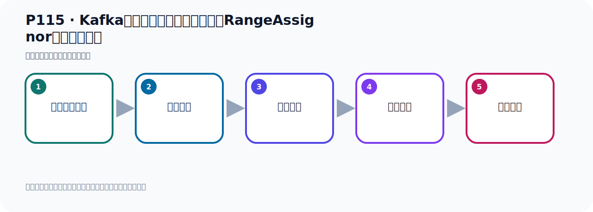

# P115：Kafka消息消费时的默认分区策略RangeAssignor代码测试验证

> 笔记编号 115/156 · 时长 10:54 · [打开原视频 P115](https://www.bilibili.com/video/BV14J4m187jz?p=115)

[← P114: Kafka消息消费时的默认分区策略RangeAssignor具体分配方式](../07-consumer-internals/p114-Kafka消息消费时的默认分区策略RangeAssignor具体分配方式.md) · [返回本章](./README.md) · [P116: Kafka消息消费时的分区策略RoundRobinAssignor →](../07-consumer-internals/p116-Kafka消息消费时的分区策略RoundRobinAssignor.md)

## 这节到底讲什么

**核心主题：Kafka消息消费时的默认分区策略RangeAssignor代码测试验证。**

这节用实验验证前面的配置或机制。重点是记录输入、预期、实际输出，以及两者不一致时如何定位。
本节属于“消费者开发与分区分配”这一章；放在全章里看，它的作用是：掌握 ConsumerRecord、监听器、手动确认、指定位置消费、批量消费、拦截器和分区分配策略。

## 本节路线

## 老师的完整讲解（按视频顺序校正）

> 下面保留老师的完整讲解顺序，并修正 Kafka、Java、ZooKeeper、
> Topic、Partition、Offset 等常见识别错误。它不是压缩摘要；原始 ASR 在后面单独保留。

### 1. 00:00–00:50

消息消费式的分区策略，默认是按范围进行分区。前面我们已经做了一个分析，接下来我们用代码来测试一下。首先我们写代码的时候，首先我们要冲一个主题叫MeTopica。它里面有10个分区。好，这个是我们看代码。我们要冲一个主题有10个分区的话，这个是我们需要用个配置内去实现一下。所以这里我们写个配置内。Config，然后Config，好，写个配置内。配置内我们就需要写一个6个Torpeaker。我们之前写过，我们把代码直接考备一下。那就是这样一个B配这样一个B，这样可以。然后我们是这个配置内，所以加个Config，可以写这个注写。

### 2. 00:51–01:36

那我们写个Torpeaker叫MeTopica，叫我的Torpeaker，名字叫MeTopica。好，它有10个分区，那这里是10，这10个分区。副本数是1，因为我们是单几点的，这一个副本。好，那这样的话我们就有10个分区了，Torpeaker有10个分区，这个有了。接下来就是我们有个消费组，然后这个组里面有3个消费者。那这个怎么做呢？那这个就是我们在消费的时候，消费，这是1，不对，我们是这个程序，能6，能6打开它的消费者，那就是这个消费者。在消费者这里，我们接听MeTopica，然后是我的分组，然后在后面指定一个参数管，。

### 3. 01:36–02:31

叫Concurrency，对，就是它，我们是3个消费者，那是一个3，它是一个双以后的3，这就是自补串，我们看一下这个材料数，Concurrency，它就是指你有几个消费者，那我们写个3，表示我们有3个消费者，3个消费者，好，那就是这次消费者，消费它起动了3个现成来消费我们的消息，那当时我们要打印一下，每个现成应该那个不一样吧，就是我要知道是哪个消费者，那这个时候我们这里加一个什么，Street.Concurrency，是吧，当前现成的AD吧，或者它的名字也可以，内容，加上它，这个空格一下，好，这样我们倒是知道，这个现成相与把这个现成名字作为一个区分，。

### 4. 02:31–03:23

作为这个消费者名字的区分，好，消费者，它消费的是呢，到这个名字不一样，每个现成的名字不一样，好，这是我们的这个消费者，好，那现在我就有了，这个10个分区有3个消费者都有了，好，有了之后呢，我们去发消息，看看它是不是按照这个方式去消费的，看下它是不是按照我们这种方式进行这个分配的，是不是这样分配的，那我们这个时候呢，去发消息，发消息用生产者去发，那发的时候呢，我们在这里呢，那这是发100条消息，那是可以的，发到might.com里面去，可以，那这样代码不用改，就可以了，好，可以之后呢，我们就这样，首先呢，我让这个消费者先不消费，先把这个注写去掉，注视去掉，注上，注视上，。

### 5. 03:23–04:04

然后呢，我们去直接去发，发完之后，我们单独再去消费，分两次啊，先不消费，好，我们现在去发，直接发，这个发里面它是发100个消息，好，它发100个消息，我们看一下，好，它应该发完了，这边也没有报错，是吧，正常的，正常的以后呢，我们就首先啊，通过这个插线看一下Kafka里面啊，我们这些刷新一下，说像周料叫might.com就这个，那么它就是，你看首先它的10个分区，这个没有问题啊，然后呢，我们是把消息100个消息，分到这个10个分区，分别发发给这个10个分区的，是这个情况，那接下来呢，我们就去消费，啊去消费啊，好，那这个是我们去消费，。

### 6. 04:04–04:53

好，把这些多余的关一下，那我们消费的话就是我们要把这个消费者去消费啊，然后消费的时候，因为你要消费之前的消息，你要消费之前历史消息，那这个是要加个all list，好，消费者里面加个all list，算了，all list，消费最早的，加一个它，好，这是我们消费者代码，代码是好的，是好的，这个注解已经打开了，打开了，然后我们开始去运行的媚方法，然后去消费，好，这是运行媚方法，走一下，运行媚方法，好，运行媚方法之后呢，这个时候你看一下，它就开始消费消息，我们看这个消费消息是不是100条啊，首先，Country F查一下，好，它确实是100条消息，啊，这显示100条对吧，好，100条消息，。

### 7. 04:53–06:00

那现在我们在这个地方我们看一下啊，那我们可以通过这一方，它这里面可以看它那个分区名字吧，也比如说，这个是四分区，这雷分区，什么分区啊，那我们看看比方说，我们这个名字，这个名字有几个，我们收一下，这个有33个，这个有33个，那么这33个，它消费的是哪个分区呢，我们看一下，它消费的是，这个六分区啊，在，在，那这个数据我们怎么去看啊，这个不太好看，那我们换一个方式啊，这个不太好看，我们刚才用这个ID算的啊，这个现在名字的话，太，太难看，我们写个，给点ID吧，用ID去走遍吧，ID走遍的话呢，那我现在怎么办呢，我现在这个分组已经消费过了，我要换个分组，再从最早来开始消费，这样也打了一样的效果，对不对，打一样的效果，好，那这个是呢，。

### 8. 06:01–06:52

我们再运行再吧，换个分组，因为之前那个分组它已经消费过了，消费过了，它已经记住了那个offside了，所以已经消费不了了，好，那这个就清楚一些啊，你看，它这个前面这个数字啊，这个好点是吧，这个数字你看，这个数字嘛，数字呢，就是第一个消费者按理说它那个数字应该最小，应该33，按理说这应该是33的，是吧，它这里面这个33，35，37，就是三个数字，没有别的，你看，33，35和37，没有别的，没有别的，好，那既然是如此的话，那我们就这样啊，我们就怎么来，比如说33也是第一个，我们就这个考虑一下，这一段数字，数字到一直数到，到这个位置吧，这一段，这一段数字，它应该消费过了，稍微讲，那么对于这个消费者，他消费了41条消息，。

### 9. 06:52–07:52

41条消息，我们分别看一下，首先，也是雷雷雷吧，雷分区 0分区 0分区，然后雷，好，雷分区是他消费的，在往下走看有两个分区他消费的，往下走，好，一个三分区是他消费的，这个三，有个三吧，有个三，雷和三有了，雷和三，雷和三，是吧，雷和三，现在雷和三，好，一个一，一是他消费吧，还有一分区啊，这个Partition就是分区嘛，这个Partition，现在已经有雷了，有三了，有一了，好，然后再看看啊，这个一，一，一，这也是一，好，有个二，现在有二了，你看，有二了吧，有二了吧，好，雷有了，一有了，二有了，三有了，这他就是不是消费的四个，消费四个，雷和三都有了，好，那你看，下面还有没有别的，拿的是二，二，二没有别的，你看，就是雷和三，对吧，就是我们刚才在课间里面，我们说算出来的数字是一样的，。

### 10. 07:53–08:47

第一个消费者他是雷，一，二，三，消费者，四个分区，那我们看看消费者二，消费二他应该是四五六，对吧，那消费者二的话，他那个ad应该是三十五了，应该三十五，那我们算，我们看一下三十五，复制他这一段，这一段，我们看一下，可能是一，复制一下，咋这里的，三十五，三十五他消费了三十三条，三十三条，那么三十五的话，他的这个值有哪一些，你看一下，三十五这里有个四吧，是，好，有个是，是他消费的，好，是，是，是，到这也是是，也是，是，也是，也是，是，好，一个五了吧，这个五了吧，几分之四，是吧，好，五也出现了，他四五，他只能消费四五六，好，这也是五吧，这也是五，五，好，一个六，看没有，六分区，六分区，把这些六吧，。

### 11. 08:48–09:47

还有六吧，六，好，这也是六吧，好，六了，六，六，好，下方就六吧，六，再下来就没有了，没有了，所以你看他就是四五六吧，四五，然后是吧，六吧，好，就是我们刚才的那个算出这个结论，啊，四五六，好，那么最后那个，最后那个应该是三十七，三十七那个消费者，三十七那个消费者，他都消费多少，七八九，他消费七八九，消费这三个回区，那这个是我们看下三十七，我们收在三十七，三十七，就这个消费者，我们去搜索一下，然后复制一下，然后去考取F，查一下他，是吧，好，三十七，我们去查三十七这个，三十七，好，三十七他消费二十六条消息，二十六条，那么从这边出来找一下，我们看下他，上面没有了，这开始，我们从第一条开始，我们找，第一条开始，我们找，第一条，好，这第一条，你看现在从这个数字一开始，是吧，数字一开始，好，第二条开始，那么他你看，三十七这个第三个消费者，他应该是七八九，。

### 12. 09:47–10:18

他是消费七八九，那消费七八九，你看这是七，然后是七七七，好，现在七，这样是七七，分区是七七，好，这个八啊，八，上面都是七，再七，然后上面都是七，好，这是八，七八，好，再八，八，那下面是八，还九呢，哎，九出来了，九了，是吧，哎，再九，再九，然后九，九，九，好，再往下来，没有了，所以，第三条是七八九，就完，好，所以他这个就和我们刚才，计算出来，就是按照这个分配的，也不一样，好，那以上这个呢，就是他，啊，这种分为分区方式，也是他默认的一种分区方式，他可以把你的，消费者均匀的分，分给，啊，每个分区取消费，啊，好，这就是我们，通过代码的方式呢，对我们这个做了一个测试啊，好，他的分区方式，默认分区方式啊，就是我们这样一个，啊，这就是我们的分区方式，那就是我们的。

### 13. 10:47–10:50

分区方式，就是我们这样一个分区方式。

## 关键术语

- **Kafka：** Apache 开源的分布式事件流平台，常用于高吞吐消息传递、数据管道和流处理。
- **Topic：** 事件的逻辑分类。生产者向 Topic 写数据，消费者从 Topic 读取数据。
- **Partition：** Topic 的物理分片，是 Kafka 并行度、顺序性和扩展能力的基本单位。
- **RangeAssignor：** 按 Topic 分别对分区做连续区间分配的消费者分区策略。

## 完整原声逐段记录

[查看本节带时间戳的本地 ASR](./transcripts/p115-Kafka消息消费时的默认分区策略RangeAssignor代码测试验证-ASR.md)。主笔记负责可读性和术语校正；ASR 页面负责完整性复核。

## 读完记住

- 本节主题是 **Kafka消息消费时的默认分区策略RangeAssignor代码测试验证**，它服务于本章目标：掌握 ConsumerRecord、监听器、手动确认、指定位置消费、批量消费、拦截器和分区分配策略。
- 理解顺序是：准备测试条件 → 执行操作 → 读取结果 → 对照预期 → 形成结论。
- 学习时要同时核对老师的解释、画面中的配置/代码，以及最终运行结果。

## 最容易踩的坑

测试前残留的 Topic、Offset、缓存或旧进程会污染结果；每次实验都要先确认初始状态。

## 自测

1. 不看笔记，用自己的话解释“Kafka消息消费时的默认分区策略RangeAssignor代码测试验证”解决了什么问题。
2. 按顺序复述：准备测试条件、执行操作、读取结果、对照预期、形成结论。
3. 如果运行结果和老师不同，你会先检查哪三个输入或环境条件？

## 学完检查

- [ ] 我能不看视频复述本节完整思路
- [ ] 我能指出关键命令、配置、类或接口的作用
- [ ] 我能解释画面中的输入与输出为什么对应
- [ ] 我核对过完整 ASR，没有跳过老师的补充说明
- [ ] 我完成了本节自测或复现实验
