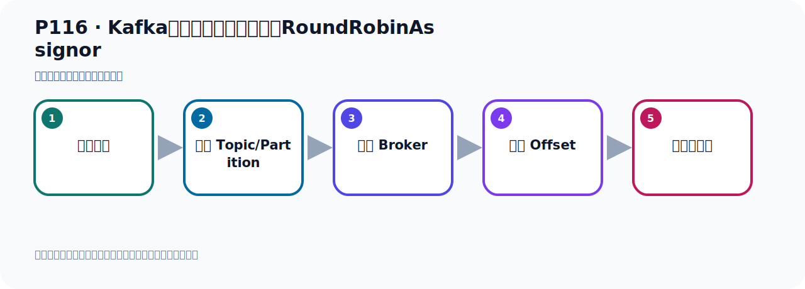
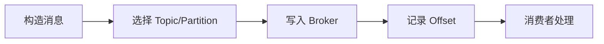

# P116：Kafka消息消费时的分区策略RoundRobinAssignor

> 笔记编号 116/156 · 时长 07:55 · [打开原视频 P116](https://www.bilibili.com/video/BV14J4m187jz?p=116)

[← P115: Kafka消息消费时的默认分区策略RangeAssignor代码测试验证](../07-consumer-internals/p115-Kafka消息消费时的默认分区策略RangeAssignor代码测试验证.md) · [返回本章](./README.md) · [P117: Kafka消息消费时的分区策略RoundRobinAssignor代码测试验证 →](../07-consumer-internals/p117-Kafka消息消费时的分区策略RoundRobinAssignor代码测试验证.md)

## 这节到底讲什么

**核心主题：Kafka消息消费时的分区策略RoundRobinAssignor。**

这节位于消息链路上。要顺着“发送端—Broker—分区日志—消费端”看数据和元数据怎样流动。
本节属于“消费者开发与分区分配”这一章；放在全章里看，它的作用是：掌握 ConsumerRecord、监听器、手动确认、指定位置消费、批量消费、拦截器和分区分配策略。

## 本节路线

## 老师的完整讲解（按视频顺序校正）

> 下面保留老师的完整讲解顺序，并修正 Kafka、Java、ZooKeeper、
> Topic、Partition、Offset 等常见识别错误。它不是压缩摘要；原始 ASR 在后面单独保留。

### 1. 00:00–00:57

消息消费时，分区策略默认时按范围进行分区。接下来我们看下它还提供了另外几种分区策略。接下来我们看一下RangeAssignor、RoundRobin策略。好，我们用这个方式来测试一下。首先我们打开代码。首先你要用RangeAssignor的方式，在配置文件中去配一下。在这里配个Partition，但是你发现它是没法进一配置的Partition，没有这样的配置参数。所以我们要想修改，你想指定自己的一个分区方式，那你需要通过配置类去完成。这个时候我们在配置类中需要配置一下。就是我们要配自己的消费者工厂，以及接近去容器工厂。在之前的代码中，。

### 2. 00:57–01:52

我记得我们是写过的，我们找一下。在之前的代码中应该是有的。比如说配置类的。首先我们要读配置文件的连接信息，把信息读进来。第一步，我们在这里首先读一下这个信息。目前的话我们有哪些信息，我把上面这个折起来。我们06的项目它用来信息的，服务器地址、K和值的返据的话，还有Outsight。这几个都需要读一下。那这个时候我们在代码中读一下。在这个代码这里面。还有读一个Pi，读一个值。这个值是我们这个值，就是OutsightVsight。读这个值。那我们这里面改成大写。再改成大写。好，那么这个时候得多少？得多少也是通过配置文件的方式，。

### 3. 01:52–02:40

用这个方式去配一下。好，这样子吧。这样子我们这个值呢，就是它用的是这个属性，读这个属性。那这也是读这个属性。好，那这样的话，我把这几个文件中配的这几个信息就读进去了。读进去了，我们接下来要配自己的消费者工厂，那就像这样了。是吧，首先把这个配置属性先夹在一起的，夹在到一个Map中，通过这个方法把配置属性夹在Map中。那我没有拿几个属性，我们分别看一下，伏击地址，K的值的反讯的话，伏击地址K值的反讯的话，好，然后还有一个Outsight，那么Outsight也放进来一下。Outsight它里面应该有哪一个参数呢？看一下配置，。

### 4. 02:40–03:42

找一下这个Outsight，好，是哪一个呢？Outsight看是哪一个配置啊？这个应该不是这个Outsight配置。这个不是Outsight，Outsight看是哪一个配置啊？那我先走，我再往下走，第一个。Outsight的配置，可能应该不是它，我想走一下。这是Outsight，好，就应该是这个配置的。Outsight它，对吧，就是它了，这个配置。它对的是没有Outsight的配置，好，那就是定义这个变量。好，它值多少？值就准备上面这个值。这是没有了。接下来我们干嘛来，指定我们的消费分区器，指定，指定使用轮巡的消息消费分区器，。

### 5. 03:42–04:30

是吧，只能轮巡的。好，那么这个应该有哪个参数，我们看一下啊，我再点一下，它现在是分区啊，那应该是Party系吧，P，有没有P啊？Party系，分区策略应该这个配置，就它，点击看一下，就它，你看，指定分区的一个分配策略，所以就这个配置，就它。就它，所以我们这个就显差，那里面的值怎么办？这个值的话呢，就是它，我们用轮巡策略的，你看它这个，这个配置对的文档在这里，是文档吧，这个文档里面，你看，在这范围，那么轮巡用这个，指定这个，好，指定这个类，那么这里它点class，点个任务，这里可以啊，是吧，好，那这样的话，我们把这个就配好了，。

### 6. 04:30–05:18

配好了之后，下面我们创建了个消费者工厂，好，那就是这样，创建消费工厂。利用我们刚才的这堆配置，创建消费工厂，就是我们这些手机配置呢，把它加进来，调一个方法，把加进来，创建消费工厂，在这个默认的消费工厂，然后呢，然后就创建这个，GNTG融计工厂，就这个，创建GNTG融计工厂，好，那么这个GNTG融计工厂，使用我们上面这个，消费工厂，你看，消费工厂，它会把这里，注入地台，注入地台之后，它就存在这里，好，这些代码在前面，我们都用过了，考配过了，你可以，是吧，好，那这样的话，我们把这个，配置配好了，我们使用的是，自己的消费工厂，。

### 7. 05:18–06:01

使用的是，自己的这个，消费者这个GNTG融计工厂，那么这些的话，我们就默认，就把这个，使用了你融计中，本身的那个，覆盖掉了，使用我们自己的，这是我们自己的，好，那么这个写完之后呢，我们今天干嘛呢？接下来，那你就可以去发消息打，发消息，好，发消息，那首先呢，我就是在这里，我先别接收，先不接收，把这个众字去掉，先不接收，我们先去发一下，发完之后，再去接收，对不对？好，那这个手柄开始发，你去发，是吧，这个代码，真的写好的，那么它发100条在里面，发100条，发到mitoMig上，那我把之前的mitoMig，给它删一下，这个mitoMig，。

### 8. 06:01–06:53

先删掉，让它重新去往这个mito发出，创新一个新的，好，那我们这个mitoMig，哎，mitoMig，我们也把成息，成息关掉，关了之后，关掉一下，好，关掉之后，我们这个手，好，我们通过删掉了，删掉以后，我们这个手再去发100条，通过这个网络，好，运行发送，好，那么这个的话，我们把100条消息，就发出去了，没有包一场，发出去了，发出去之后，接下来，我们就是开出去消费，开出去消费，那就把这个消费的，这个注射打开，开出去消费，这个注射打开，我们是三个消费者，然后我们用这个格补分组，格补分组，它是从最早的开始消费，mitoMig和消费，。

### 9. 06:53–07:29

我们发送的时候，也是放到mitoMig上，mitoMig上，好，我们消费从这个主题消费，然后我们这个配置里面，我们配了一个叫All List，那这个是All List，最早的，是吧，这个是从，这个多配置明天是All List，最早的，好，那这的话呢，我们就把这个，从第一条开始消费，所以我们这个时候，运行配方法就可以了，运行配方法之后，这个注射，这个注解打开了，打开之后，才可以GNT，可以消费了，那这个时候，我们运行配方法，然后让我们的消费者，开始消费，那首先，它是消费100条，对吧，我们看一下，这收出100条，好，。

### 10. 07:29–07:51

可以看到，我们再收出来是100条，好，这100条消息，都拿到了，然后就是看，每个消费者，他消费的是哪个分区，那他的这个轮群策略，有什么规矩，好，那下面我们看一下，轮群，它是怎么消费的，我们看这个日志数据，打一个数据，就可以分析出它的规矩，好，那下面我们去分析下这个规矩，。

## 关键术语

- **Kafka：** Apache 开源的分布式事件流平台，常用于高吞吐消息传递、数据管道和流处理。
- **Partition：** Topic 的物理分片，是 Kafka 并行度、顺序性和扩展能力的基本单位。
- **RangeAssignor：** 按 Topic 分别对分区做连续区间分配的消费者分区策略。
- **RoundRobinAssignor：** 把所有订阅分区轮询分配给消费者的策略。

## 完整原声逐段记录

[查看本节带时间戳的本地 ASR](./transcripts/p116-Kafka消息消费时的分区策略RoundRobinAssignor-ASR.md)。主笔记负责可读性和术语校正；ASR 页面负责完整性复核。

## 读完记住

- 本节主题是 **Kafka消息消费时的分区策略RoundRobinAssignor**，它服务于本章目标：掌握 ConsumerRecord、监听器、手动确认、指定位置消费、批量消费、拦截器和分区分配策略。
- 理解顺序是：构造消息 → 选择 Topic/Partition → 写入 Broker → 记录 Offset → 消费者处理。
- 学习时要同时核对老师的解释、画面中的配置/代码，以及最终运行结果。

## 最容易踩的坑

能发送成功不代表业务处理成功；序列化、分区、确认机制和消费进度需要分别观察。

## 自测

1. 不看笔记，用自己的话解释“Kafka消息消费时的分区策略RoundRobinAssignor”解决了什么问题。
2. 按顺序复述：构造消息、选择 Topic/Partition、写入 Broker、记录 Offset、消费者处理。
3. 如果运行结果和老师不同，你会先检查哪三个输入或环境条件？

## 学完检查

- [ ] 我能不看视频复述本节完整思路
- [ ] 我能指出关键命令、配置、类或接口的作用
- [ ] 我能解释画面中的输入与输出为什么对应
- [ ] 我核对过完整 ASR，没有跳过老师的补充说明
- [ ] 我完成了本节自测或复现实验
