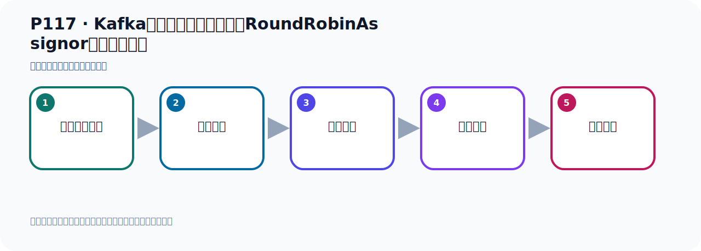

# P117：Kafka消息消费时的分区策略RoundRobinAssignor代码测试验证

> 笔记编号 117/156 · 时长 09:27 · [打开原视频 P117](https://www.bilibili.com/video/BV14J4m187jz?p=117)

[← P116: Kafka消息消费时的分区策略RoundRobinAssignor](../07-consumer-internals/p116-Kafka消息消费时的分区策略RoundRobinAssignor.md) · [返回本章](./README.md) · [P118: Kafka消息消费时的分区策略StickyAssignor和CooperativeStickyAssignor →](../07-consumer-internals/p118-Kafka消息消费时的分区策略StickyAssignor和CooperativeStickyAssignor.md)

## 这节到底讲什么

**核心主题：Kafka消息消费时的分区策略RoundRobinAssignor代码测试验证。**

这节用实验验证前面的配置或机制。重点是记录输入、预期、实际输出，以及两者不一致时如何定位。
本节属于“消费者开发与分区分配”这一章；放在全章里看，它的作用是：掌握 ConsumerRecord、监听器、手动确认、指定位置消费、批量消费、拦截器和分区分配策略。

## 本节路线

## 老师的完整讲解顺序（ASR 辅助复核）

> 下面按时间顺序保留经过基础术语替换的 ASR，方便核对老师是否提到某个细节。
> 人名、命令、代码和英文参数仍可能识别错误；准确结论以本节白话说明、代码块和实操速查表为准。

### 1. 00:00–01:02

我们看一下它消费的规律。我们这里看一下，首先35，33，38，35，38。它有三个消息消费者，33，35，38，3个。我们分别看一下，首先看33，我们就把这一段做一个复制。到时候看一下它PatiC这一块，昨次到时候看PatiC这一块，它分别是消费短一个，对吧？好，那就是看一下这一段。这一段复制一下，复制。好，那这个时候它是一个，是一个它是雷，雷，雷，雷。然后下面是多少呢？然后3，到这里是3，3，3，1，1，还有2。雷一二三，它是雷一二三，你看是吧？那它这个不对，那它相遇它是相遇雷一二三，那相遇就是我们原来那个范围策略，。

### 2. 01:02–01:55

这个不是轮循，范围策略，那就是没生效。我们再看一下35吧，35是不是就是456啊，看一下是不是啊？看是不是456，如果是的话，那就是它没有生效，又是原来那个范围策略，好，看35，35它早一下，35你看，哎，是，是，是，然后是，是，然后下来，好，到5了对吧？45好，5，45，这5，好，哎，6，哎，456，哎，那就是没生效，你看它是456，它用的是轮曲策略，那说明我们这个配置可能没有生效啊，是有点问题的，那我们可以这样来排查一下，现在我们这个，我们这个容器里面有几个那个消费的工厂，我们看一下，那就是在这个里面，它想要生效的话，它今天要生效的话，。

### 3. 01:55–02:46

我们看一下，首先我们看看这个有几个，是吧？哎，这个消费的工厂有几个，那就是拿到这个容器的，VR拿着容器，这容器里面去打印一下，哎，这代码我们在之前的地方写过，我们考一下，好像在这个龙氏啊龙氏山里面写过，我们考一下它的代码，这个秘方里面，对，就这个，考一下啊，考一下，站过来，我先把所有的关一下，所有的关一下，关掉，好，从于打开，打开的测试方法，那看一下，我们看一下这个消费工厂，哎，我们这个容器中有几个，从这个容器中拿消费工厂，然后从容器中拿这个接电器，这个工厂，是吧？Kafka，接电器工厂，也这个接个吗？那他好，看一下分别有哪些啊，还有几个，那我把这个呢关掉，。

### 4. 02:46–03:36

关掉之后来重新运行一下，这一物件呢，运行一下，好，预议之后我们看一下，好，预议文呢，我们看打印的只是啊，那我们那个工厂就是有一个，就有一个工厂，是吧？好，那这个工厂就是我们配的那个工厂，叫阿文康熊毛发个腿，就是我们配的这个，好，工厂没问题，接下来就是这个接电器容器工厂有两个，那就说明啊，他可能用的还是原来那个默认的工厂，因为他用的是默认工厂的话，那默认工厂里面他的那个分区策略，他是那个范围策略，是吧？不是我们自己的啊，不是我们自己的，那怎么办呢？那我们这只要指定一下用我们自己的，用我们自己的，那你就相当于在你这个消费者这里啊，在这个消费者呢，这个地方是消费者，。

### 5. 03:37–04:25

这个消费者呢，也指定一下你那个工厂那个，那个容器工厂算，应该是容器工厂，用我们的，我们的名字叫他这个名字，我们的Kafka，接电器，容器工厂，叫这个名字，那这的话是不是就用我们自己的那个配置，那去消费啊，是的，好，重新再消费一下，重新消费一下那此时呢，我需要怎么办呢？我需要，我是默认是从最早开始消费，因为他这般配置好的，默认从最早开始消费，这般有算，但是呢，你要求这个祖民之前要没有记录过奥勒赛特，这个祖民之前已经记录过奥勒赛特了，这是不行的，所以我们换个祖民，换个二吧，祖民换一下，是吧，哎，这样的话他就可以用新的祖民啊，再从头到尾消费，。

### 6. 04:26–05:06

那此时我们再运行，密封再跑一遍，运行一下，好，看一下这一次的消费是什么情况，有什么规律，好，他拿到的消息了，应该是100条，我们去找一找，好，那么他找了之后确实是100条，100条之后，然后看规律啊，那么他的这个消费者有三个消费者，那分别是33，3538，应该三个，应该那个数字，就35338，好，那么看第一个消费者是35是吧，是33，33这个消费者，我们去搜索一下，哎，看这个Partition是多少啊，这个我们看一下，33这个，搜索一下，33这个呢，分别是雷，好，雷，然后这也是雷，前面几个是雷，雷，雷，好，然后雷，雷，雷，雷，。

### 7. 05:06–06:08

然后雷，再往下来，好，到这就三了，哎，到三了，对吧，到三了，啊，到三了，好，再三，三，三，再往下来，三，好，再来是三，好，到六了，你看，到六了，对吧，好，到六了，你看，到六了，现在说明我们生效了，我们雷循策略生效了，好，连这是六啊，到六了啊，分区已经到六了，好，下面都六，到六，哎，还到九了，对吧，好，那我们得了个什么规律呢，那就是你看，第一个消费者，就叫生一吧，第一个消费者，他相遇是雷，三，六，九，他是消费这几个，是吧，他是雷三六九，在几个消费上，他是消费在几个，好，那我们看生一啊，生一他是，生一是哪些，生一，好，生一，我们已经知道是雷三六九，好，生一啊，生一啊的话，那我们看生一啊，生一啊应该35，应该35，。

### 8. 06:09–07:14

35，好，35，从做生物来开始找，所以他是四，这个是，是，是，好，这个是，他有个是啊，有个是，然后往下呢，是，在这四个是，哎，是，他有个一啊，里面都有一吧，有个一啊，有个一，有个一啊，那一，写前面吧，一，他有个一啊，有个一，年轻人有一啊，他有个七，有个七，好，那有个七，还有个七，然后再看下面呢，好，下面就没有了，没有了，好，没有了，好，他就是他消费者是，一是七啊，一是七，好，再看最后一个是第三，第三个消费者，看他是消费哪些啊，第三个消费者应该是38，38就这吧，好，38往上走走，查一下他有哪些消费者，他消费哪些废居，首先是一个是二，他消费二，消费二，。

### 9. 07:15–08:26

消费二，然后呢，消费二，好，然后到八了，这是八的，好，到八了，到八，再往上走，八，八，八，这个八好像有个五吧，有个五啊，有个五，好，那是一边有个五，有个五，这里，那就是卡住了，这个五，是吧，五啊，五，在我们下面，好，上面没有了，好，那他的规律就这个规律，你看，第一个消费者，是消费这些啊，第一个，第三个，好，在我们的消费者，那这个就确实就是轮局策略，你看一下，我们首先是有个脱屁股，是吧，脱屁股里有十个分区，十个吧，二，三是吧，是五，六，七，八，九，十，十个，十个，你有三个消费者，一个人，C1，是吧，C2，是吧，C3，那他就是什么，C1先消费他，。

### 10. 08:26–09:22

然后C2，那就是这个C2消费他，你看，C1，雷吗，然后一，二，你看，三，四，五，六，七，八，九，刚好每个消费者消费一下，消费一个分区，雷流的，他其实是雷流的，你看，你这个雷分区被消费的一消费了，那么一分区就被消费的二消费，那么二分区就被消费的三消费，那么三分区就又被消费的一消费，那最后这个就来就是C1消费，所以这就是雷流策略，雷循策略，这就说明电脑策略，电脑策略，消息消费的这个雷循策略叫Rounder Roby这个策略，雷循策略，。

## 关键术语

- **Kafka：** Apache 开源的分布式事件流平台，常用于高吞吐消息传递、数据管道和流处理。
- **Partition：** Topic 的物理分片，是 Kafka 并行度、顺序性和扩展能力的基本单位。
- **RoundRobinAssignor：** 把所有订阅分区轮询分配给消费者的策略。

## 完整原声逐段记录

[查看本节带时间戳的本地 ASR](./transcripts/p117-Kafka消息消费时的分区策略RoundRobinAssignor代码测试验证-ASR.md)。主笔记负责可读性和术语校正；ASR 页面负责完整性复核。

## 读完记住

- 本节主题是 **Kafka消息消费时的分区策略RoundRobinAssignor代码测试验证**，它服务于本章目标：掌握 ConsumerRecord、监听器、手动确认、指定位置消费、批量消费、拦截器和分区分配策略。
- 理解顺序是：准备测试条件 → 执行操作 → 读取结果 → 对照预期 → 形成结论。
- 学习时要同时核对老师的解释、画面中的配置/代码，以及最终运行结果。

## 最容易踩的坑

测试前残留的 Topic、Offset、缓存或旧进程会污染结果；每次实验都要先确认初始状态。

## 自测

1. 不看笔记，用自己的话解释“Kafka消息消费时的分区策略RoundRobinAssignor代码测试验证”解决了什么问题。
2. 按顺序复述：准备测试条件、执行操作、读取结果、对照预期、形成结论。
3. 如果运行结果和老师不同，你会先检查哪三个输入或环境条件？

## 学完检查

- [ ] 我能不看视频复述本节完整思路
- [ ] 我能指出关键命令、配置、类或接口的作用
- [ ] 我能解释画面中的输入与输出为什么对应
- [ ] 我核对过完整 ASR，没有跳过老师的补充说明
- [ ] 我完成了本节自测或复现实验
