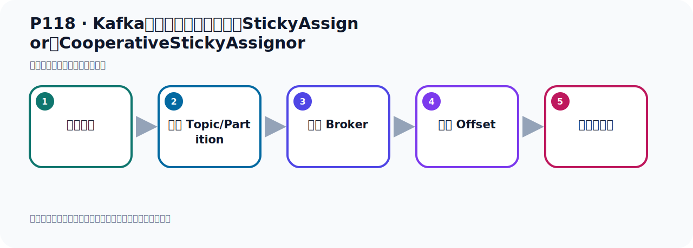

# P118：Kafka消息消费时的分区策略StickyAssignor和CooperativeStickyAssignor

> 笔记编号 118/156 · 时长 07:39 · [打开原视频 P118](https://www.bilibili.com/video/BV14J4m187jz?p=118)

[← P117: Kafka消息消费时的分区策略RoundRobinAssignor代码测试验证](../07-consumer-internals/p117-Kafka消息消费时的分区策略RoundRobinAssignor代码测试验证.md) · [返回本章](./README.md) · [P119: Kafka事件消息数据的存储 →](../08-storage-offsets/p119-Kafka事件消息数据的存储.md)

## 这节到底讲什么

**核心主题：Kafka消息消费时的分区策略StickyAssignor和CooperativeStickyAssignor。**

这节位于消息链路上。要顺着“发送端—Broker—分区日志—消费端”看数据和元数据怎样流动。
本节属于“消费者开发与分区分配”这一章；放在全章里看，它的作用是：掌握 ConsumerRecord、监听器、手动确认、指定位置消费、批量消费、拦截器和分区分配策略。

## 本节路线

## 老师的完整讲解顺序（ASR 辅助复核）

> 下面按时间顺序保留经过基础术语替换的 ASR，方便核对老师是否提到某个细节。
> 人名、命令、代码和英文参数仍可能识别错误；准确结论以本节白话说明、代码块和实操速查表为准。

### 1. 00:00–01:01

前面介紹了两种分区的策略：、消费分区策略：，第一种叫RangeAssignor，这是范围分区。第二种就是RoundRobin，这是轮寻的分区策略。下面还有两种，一种是StickyAssignor，还有一种是CooperativeStickyAssignor。下面我们看一下后面的这两种分区，这两种分区是什么意思呢？我们看一下课件的描述，首先我们看一下StickyAssignor，它是一种什么方式呢？它就是尽可能保持消费者与分区之间的关系不变。StickyAssignor表示连性的，粘贴连在一起，捆绑在一起，连性的分区策略。

### 2. 01:01–02:01

即便是你消费主的消费者发生变化，它也是减少不必要的分区重分配。就是减可能减少不必要的分区重分配，尽量保持现有的分区分配不变，仅对新加速的消费者或者离开的消费者进行分区调整。那么这样的话，大多数消费者可以继续消费他们之前消费的分区，只有少数消费者需要进行处理他耳问的分区，所以他叫连性分区。那么举个生活中的例子，可能更好理解。比如说我们现在有五个班，比如说我们三年级有五个班，有五个班，然后我现在用连性分区的话，就是我想把五个班变成四个班，把五个变成四个班。变成四个班，那你需要进行学生的一个合并，把一部分学生分到其他八里的去。

### 3. 02:01–02:55

那如果你有连性分区的话，那就是以前有一、二、三、四这四个班保持不变，它全部都不变，我们只对第五个班它里面的学生给它往这四个班里面去分配就行。这第五个班，它的学生往一班分几个，二班分几个，三班分几个，四班分几个，这里可以了。所以说原来的一、二、三、四班它所有的学员都不变，那么这个叫连性分区。如果说你不用连性分区的话，你都变，那你到时候你把一般的学生又分成二班去的，二班又分成四班去的，四班又分成三班去的，三班又分成一班去的，那你相与把所有的学生全部打乱，再做一次分配。那么这个工作，这个工作调整大一些，效率就会低一些，而我们连性分区就是我们只保持原用的不变，。

### 4. 02:55–03:56

只对那些有变化的班级做一个调整，好，这个连性分区。那另外一个呢，就是我们这个学生，叫Kong of Retivus，那么这个前面这个单词Kong of Retivus，它其实是一个什么协助的合作的这个意思。那么它叫协调合作，那就协助的连性的分区，这种策略。那么这个策略呢，它首先也是连性分区，所以它与连性分区是类似的。但是它增加了对协助式的一个支持，也就是重新分配，你要重新分配，但是有个协助。怎么协助就是消费者可以在他离开消费组之前通知协调器，然后以便这个协调器可以预先计划分区的遷移，因为我知道你要离开了，然后我就会提前规划我该怎么分区遷移，。

### 5. 03:56–04:53

而不是在消费者突然离开的时候立刻进行这个分区的遷移分配。所以它有一个预先的告知协调器，那就相与什么呢？相与我们原来有五个班，我要变成四个班合成四个班，但是我就五个班合成四个班，其实我这个五个班为什么要合成四个班？是因为这个有几个学生，他由于要转学了，要转到其他地方去上学了，所以我这个班的学员比较少，比较少的话我还是开五个班的话，学员太少，所以我就合成四个班。那这就的话我知道你有一部分学员哪一天哪一天你要转学了你不来了，那我就可以提前规划我该如何去划成四个班，那在划四个班的时候他肯定也是保持原有班的学生不动，然后只做少量的调整，。

### 6. 04:53–05:50

那他就要去协作室的，就是你要转学之前要提前告知学校，然后学校好做一个提前规划，类似这个意思，也像你这个离职的时候，要提前一个月给公司通知，你哪天要离职他，学校公司好做安排，你的工作存在接替，那么这个叫协作室的，那么这两种分区算法在代码实现的时候，其实就是你把到处来把我们这个配置内把这个内铃改一下，然后去测试一下就可以了，那在这里我就不再去演示这个测试了，但是你要知道这两个分区的一个什么意思，什么意思，好，在上面我们介绍了这个四种分区，是吧，那我们在实际生产会中，在公司的校服中，我们用什么分区呢，一般情况下往往后面出来的分区算法会更好，。

### 7. 05:50–06:39

那就是我们这个协作的联系的分区算法，它是最后出来的，新版本出来的，原来是没有的，那么它可以是更优的，所以我们也推荐出来，推荐在现代环境利用这个联系分区，或者说用这个协作式联系分区，这个是更推荐一些，当然我们在校服中你直接你就用默认的这个消费分区也是可以的，它的按范围分区也是可以的，但是这两种算法可能更好，因为什么呢，因为它在你消费者比说荡机的，你原来有五个消费者，现在只剩四个了，你原来有五个消费者，然后你突然又增加了三个，变成八个消费者了，当你消费者发生变化的时候，消费者个数发生变化的时候，那你的这个分配的，因为这种算法，它的分配的效率会更高一些，。

### 8. 06:39–07:29

因为它的分配重新分配，它千里的更少一些，它的变化小一些，所以它效率会高一些，所以我们就更推荐你用这个联系分区，或者说协作式联系分区，这是它的一个原因，但是你直接相不中，你直接用卧日的也是没有什么问题的，当然这个分区算法也可以自己去实现，你实现它的接口，也就摧毫它的代码的实现，你可以摧毫它代码实现，实现这个接口覆盖里面方法，然后你自己写一套分区算法也是可以的，当然你要做好研究的测试，这样的话你才可以在生产回忆中去使用，所以我们一般情况下，我们推荐直接用它类制的，对它这个框架给写好的，你自己写的太麻烦，而且你要做测试，增加你的工作量，。

### 9. 07:30–07:35

好，那么以上就是我们给大家介绍的这四种这个消费分区的策略，。

## 关键术语

- **Kafka：** Apache 开源的分布式事件流平台，常用于高吞吐消息传递、数据管道和流处理。
- **RangeAssignor：** 按 Topic 分别对分区做连续区间分配的消费者分区策略。
- **StickyAssignor：** 尽量均衡且减少重平衡时分区迁移的策略。
- **CooperativeStickyAssignor：** 采用协作式增量重平衡的粘性分配策略，减少全量停止。

## 完整原声逐段记录

[查看本节带时间戳的本地 ASR](./transcripts/p118-Kafka消息消费时的分区策略StickyAssignor和CooperativeStickyAssignor-ASR.md)。主笔记负责可读性和术语校正；ASR 页面负责完整性复核。

## 读完记住

- 本节主题是 **Kafka消息消费时的分区策略StickyAssignor和CooperativeStickyAssignor**，它服务于本章目标：掌握 ConsumerRecord、监听器、手动确认、指定位置消费、批量消费、拦截器和分区分配策略。
- 理解顺序是：构造消息 → 选择 Topic/Partition → 写入 Broker → 记录 Offset → 消费者处理。
- 学习时要同时核对老师的解释、画面中的配置/代码，以及最终运行结果。

## 最容易踩的坑

能发送成功不代表业务处理成功；序列化、分区、确认机制和消费进度需要分别观察。

## 自测

1. 不看笔记，用自己的话解释“Kafka消息消费时的分区策略StickyAssignor和CooperativeStickyAssignor”解决了什么问题。
2. 按顺序复述：构造消息、选择 Topic/Partition、写入 Broker、记录 Offset、消费者处理。
3. 如果运行结果和老师不同，你会先检查哪三个输入或环境条件？

## 学完检查

- [ ] 我能不看视频复述本节完整思路
- [ ] 我能指出关键命令、配置、类或接口的作用
- [ ] 我能解释画面中的输入与输出为什么对应
- [ ] 我核对过完整 ASR，没有跳过老师的补充说明
- [ ] 我完成了本节自测或复现实验
