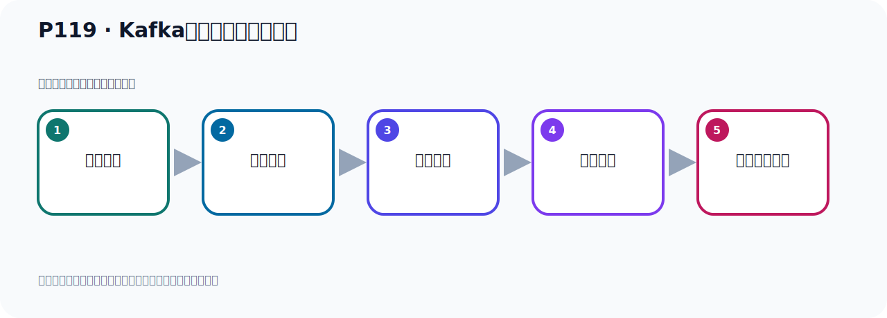

# P119：Kafka事件消息数据的存储

> 笔记编号 119/156 · 时长 10:07 · [打开原视频 P119](https://www.bilibili.com/video/BV14J4m187jz?p=119)

[← P118: Kafka消息消费时的分区策略StickyAssignor和CooperativeStickyAssignor](../07-consumer-internals/p118-Kafka消息消费时的分区策略StickyAssignor和CooperativeStickyAssignor.md) · [返回本章](./README.md) · [P120: Kafka的__consumer_offsets主题 →](../08-storage-offsets/p120-Kafka的__consumer_offsets主题.md)

## 这节到底讲什么

**核心主题：Kafka事件消息数据的存储。**

这是一节概念课。老师先交代背景，再给出定义、组成和作用，最后把概念放回 Kafka 整体架构。
本节属于“消息存储与 Offset”这一章；放在全章里看，它的作用是：理解日志文件、__consumer_offsets、生产者 Offset 与消费者 Offset 的含义和代码表现。

## 本节路线

## 先用白话读懂

Kafka 按 `log.dirs` 保存数据，默认示例目录是 `/tmp/kafka-logs`。每个 Topic-Partition 对应 `<topic>-<partition>` 目录；`.log` 保存记录，`.index` 按 Offset 定位，`.timeindex` 按时间定位，快照和 `leader-epoch-checkpoint` 用于恢复与 Leader Epoch 信息，`partition.metadata` 保存分区元数据。

## 老师的完整讲解（按视频顺序校正）

> 下面保留老师的完整讲解顺序，并修正 Kafka、Java、ZooKeeper、
> Topic、Partition、Offset 等常见识别错误。它不是压缩摘要；原始 ASR 在后面单独保留。

### 1. 00:00–00:56

下面我们来看一下Kafka事件的存储，那么事件就是消息和数据，它是一个存储。Kafka里面的所有事件，也就是它的所有的数据和消息，都是存放在了一个临时的文件夹，叫kafka-logs这个目录的。那么这个目录你可以通过配置文件进行配置，在Kafka有一个server.properties文件通过它进行配置，我们可以去看一下，这个是我们打开Kafka，这一道UserlogsKafka，然后靠费格布一下，然后有个server.properties文件，打开一下，打开，打开之后你找一下，在哪个位置呢，它有个server，在最上面往下走，它有个日志的配置，就是logs这个配置。

### 2. 00:56–01:46

那这个位置呢，就是叫log.dirs，这个就是它的日志的配置路径，那么它默认在这个临时目录下，我们可以根据需要做一些调整，你可以把这个配置改一下，那这样的话呢，它就可以到另外一个目录下去，配到另外一个目录下去，这是可以的。那这样的话呢，我们Kafka的所有视线，也就是它的所有的数据消息，都是以日志文件的方式来保存的。那由于我们Kafka呢，它是有海量的这个消息，你可以往里面发送很多数据，它经常用于大数据这个领域，那么为了避免日志文件过大，那么日志文件呢，它会被存放在多个日志目录下，分成多个目录，那么这个日志目录的一个命名规范就是了，。

### 3. 01:47–02:40

Topic名字，然后更分区的名字，分区的一个编号，用这个方式命令的。那下面我们去看一下，你看我们现在目前啊，我们在这里打开我们的Kafka，目前我们这边有这么多Topic，那么多这个Topic，我们再刷新一下。好，这么多是吧，哎，比每个下面可能有一个，或者多个分区，像这个它有五个分区，那这个只有一个分区，这个一个分区，这个有十个分区，这个是一个分区，这个是一个分区，那么它在我们的这个目录下就有多个文件夹，在这个tem，然后Kafka 0目录下就有好多文件夹，我们这个时候进去看一下，那我们记得tem，tmp，然后这个Kafka 0，这个目录下我们看一下，那这个时候你看这里面有好多文件夹，好，那我们分析一下啊，这个文件夹什么意思，。

### 4. 02:41–03:28

比如说第一个叫batch-tompo，那么它只有一个分区，这个时候它的文件夹就叫batch-tompo-0，所以你看它这边有个文件夹叫batch-tompo-0，前面这个是Topic名字，后面是分区编号，分区的编号，你只有一个分区那么是0，那我们发送到这个Topic下的这个消息，到时候就存放在这个目录下，存放在那个目录下，那目前我们这边是没有消息的，那这边没有消息是吧，是人个消息，这个Topic是人个消息，那我们记得这个目录下，可以去看一下batch-0看一下，那这个目录下有这样的一些这个文件，。

### 5. 03:29–04:21

那么它的真正的消息文件，消息在这个文件里面，在0这个文件里面，但是0是它的大小是人，因为现在你还没有发消息，所以这边是这个日志文件中是没有消息的，它的大小是人，哎，是这个情况，那我们回过头回到上一层看一下，比如说我们的这个hannoTopic有五个分区，那你看hannoTopic它就有五个，在batch，那hanno你看它就有五个，哎，这个分区的甲，然后分别是Topic名字，更这个分区的编号，n1234，哎，这有五个，对吧，哎，那我们这个，它只有一个分区，那么它就一个了，一个分区目录，然后它呢，有一个分区，那么它一个分区目录，是吧，然后这个mito笔可呢，是十个分区，十个分区，那么这个时候它mito笔可是有十个分区目录，。

### 6. 04:22–05:26

然后我们这个Topica是一个，托笔b也是一个，那这个时候Topica，托笔就只有一个分区目录，好，这是它的分区目录的命令规则，是这样命令的，所以啊，我们比如说你有一个Topic，fast的Topic，如果有三个分区，那么这个时候在这个部落下，它就有来，fast的Topic，更零，更一，更二，有三个名字甲，三个部落，好，那下面我们去看一下，我们比如说我们找一个有消息的数据，比如说mito笔可，哎，它的每一个分区下都是有数据的，你看这第一个分区有17个数据，那我们进入到它的这个里面去看一下mito笔可，mito笔可，然后雷这个目录下，好，这是mito笔可雷分区下的这个数据，那你看它有数据的话，你看这个logo的文件，它是有大小的，那这里面就是它的消息数据，我们可以打开看一下，看它一下这个雷，这个点诺个这个文件，打开，打开之后，。

### 7. 05:26–05:56

你可以看到我们之前往这里发到很多这个用户的这个消息，用户对象消息，你可以看到用户的手机号，用户的生日，是吧，用户的ad，用户的手机号，你就可以看到，虽然它的格式有点乱，这是因为它不是一个纯文本的格式，它里面带有Kafka的字运线格式，所以你看起来有点乱，对不对，其实你可以看到它前面有个k呢，比如说你这个k4，是吧，你这个什么，这个k7，是吧，可以危危危危。

### 8. 06:26–07:19

所以他会有一个索引这个索引呢就会记录你这个消息的这个Offset就是偏移量以及他所在的位置通过这个索引文件去记录这样的话呢我下次要获取这个消息的时候根据索引文件我可以我可以快速找到这个消息在哪里根据偏移量就可以找到他所以他是为了提高这个查导消息的效率的这是index的这份件我们可以打开index再看一下看一下他的零然后index的文件这个文件呢目前我们看不到什么东西啊它里面有十兆那你看不到啊因为这个文件我们格式不是一个标准的文本格式你看这个文件有十兆左右一个LL看一下你看这个文件有十兆啊其实个索引文件只是我们看来的时候看不到而已啊看不到而已。

### 9. 07:19–08:11

他是帮助我们查导消息变得更快啊一个索引文件就像数据库一样数据库也有索引文件在网上就是这个timeindex的文件这是消息的时间戳索引文件上面是索引文件下面也是索引文件那么这个索引文件呢它是以时间戳就是你这个消息是什么时间发的它会寄一个时间戳如果说你要根据时间来查导消息的话它就会利用到这个时间戳文件继续来查找这样来快速的定位到我这个消息在哪里所以根据时间来查取它有个时间戳的索引文件就这个文件那么在网上就是我们这个快照文件这个快照文件是生产者发生故障或者重启的时候用来恢复之前的那个操作恢复到原来的那个位置让你可以继续从之前的位置开始操作。

### 10. 08:11–09:08

所以它是个快照文件用于故障恢复的一个文件这是这个故障恢复文件目前我们这个像我这个分析下目前的没有但是有些分析下可能有有些分析下有这个里面没有没找到对吧这有些分析下是有的我们去找一个看有没有哪里找到的比如说我们换一个TopicTopicA这边看下有没有它里面快照它就有快照文件刚才那边就没看见是吧刚才这边就没有快照文件你看没有这边没有对吧这没有你看这下面就有了它里面就有个快照文件用于恢复故障的在我下有个什么切个point这个文件是吧那么这个文件干嘛呢这个文件是寄入每个分区中当前领导者的epoch以及领导者开始写入消息时的起始偏移量。

### 11. 09:08–10:04

它是寄入那个lead这个等于我们后面安装集取之后你知道我们的副文还有Leader 节点Leader 和副本吧它是寄入那个主节点主副本那个主副本是副的读和写的它寄入这个主副本它里面有个值一透起如果这个领导者发生变化这个值会加一它是寄入这么一个信息的就是这个信息的一个文件那下面这个partici， this is the middle data那它是寄入这个分区的这个元数据信息的这个了解就可以进入这个我们当前分区的一些元数据信息好，这是我们这个目标下的这些文件那我们知道我们的数据我们写的消息都是放在这个文件中的这是我们对这个数据存储的这个文件的一个解读。

## 关键术语

- **Kafka：** Apache 开源的分布式事件流平台，常用于高吞吐消息传递、数据管道和流处理。
- **Topic：** 事件的逻辑分类。生产者向 Topic 写数据，消费者从 Topic 读取数据。
- **Offset：** 事件在 Partition 中的位置编号，也是消费者记录消费进度的依据。

## 关键画面核对

课件明确展示 `/tmp/kafka-logs`、`<topic_name>-<partition_id>` 目录规则，以及 `.log`、`.index`、`.snapshot`、`leader-epoch-checkpoint`、`partition.metadata` 等文件。

[查看课程关键画面核对总表](../../sources/visual-checks.md)。

## 完整原声逐段记录

[查看本节带时间戳的本地 ASR](./transcripts/p119-Kafka事件消息数据的存储-ASR.md)。主笔记负责可读性和术语校正；ASR 页面负责完整性复核。

## 读完记住

- 本节主题是 **Kafka事件消息数据的存储**，它服务于本章目标：理解日志文件、__consumer_offsets、生产者 Offset 与消费者 Offset 的含义和代码表现。
- 理解顺序是：提出背景 → 给出定义 → 拆解组成 → 解释作用 → 放回整体架构。
- 学习时要同时核对老师的解释、画面中的配置/代码，以及最终运行结果。

## 最容易踩的坑

不要只背术语定义；需要同时说清它解决什么问题、与哪些组件交互、失效时会出现什么现象。

## 自测

1. 不看笔记，用自己的话解释“Kafka事件消息数据的存储”解决了什么问题。
2. 按顺序复述：提出背景、给出定义、拆解组成、解释作用、放回整体架构。
3. 如果运行结果和老师不同，你会先检查哪三个输入或环境条件？

## 学完检查

- [ ] 我能不看视频复述本节完整思路
- [ ] 我能指出关键命令、配置、类或接口的作用
- [ ] 我能解释画面中的输入与输出为什么对应
- [ ] 我核对过完整 ASR，没有跳过老师的补充说明
- [ ] 我完成了本节自测或复现实验
