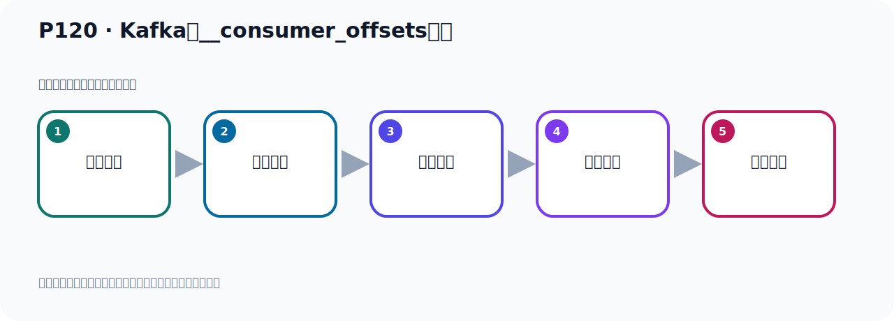
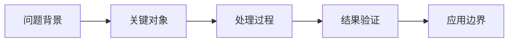

# P120：Kafka的__consumer_offsets主题

> 笔记编号 120/156 · 时长 05:49 · [打开原视频 P120](https://www.bilibili.com/video/BV14J4m187jz?p=120)

[← P119: Kafka事件消息数据的存储](../08-storage-offsets/p119-Kafka事件消息数据的存储.md) · [返回本章](./README.md) · [P121: Kafka的__consumer_offsets主题数据查看 →](../08-storage-offsets/p121-Kafka的__consumer_offsets主题数据查看.md)

## 这节到底讲什么

**核心主题：Kafka的__consumer_offsets主题。**

这节继续完善 Kafka 的完整知识链。请按老师的讲解顺序理解动机、做法和结果。
本节属于“消息存储与 Offset”这一章；放在全章里看，它的作用是：理解日志文件、__consumer_offsets、生产者 Offset 与消费者 Offset 的含义和代码表现。

## 本节路线

## 老师的完整讲解顺序（ASR 辅助复核）

> 下面按时间顺序保留经过基础术语替换的 ASR，方便核对老师是否提到某个细节。
> 人名、命令、代码和英文参数仍可能识别错误；准确结论以本节白话说明、代码块和实操速查表为准。

### 1. 00:00–01:01

接下来我们继续来看一下Kafka事件它的存储、它的一些目录。刚才我们看到的是Topic下的一些目录，这个时候我们再回到这个Nogue是文件夹下。现在刚才看的是Topic这些，那你可以看到这边还有一些Consumer、Offset、Gang09、40多、有一大堆这个文件，是吧？那么这个文件有50个文件夹，那么它是干嘛呢？它是重放的是我们消费者提交的那个Offset的信息。我们消费者拿到一个消息之后，那么它就会提交一个Offset，那么这个Offset就会记录在这个文件夹下。比方说我们进入那个文件夹，假设我们随便进一个，它是两个下滑线，Consumer、Offset的比如说我们进入到这个24，这个文件夹进来。

### 2. 01:01–02:03

进了之后，它里面和之前一样和我们这个Topic文件一样，它也有这么一些文件夹，这么一些文件。那么因为这个文件夹，它也是一个Topic，它本身也是个Topic，而且它这个Topic有50个分区，所以前面这个是Topic的名字，后面这个Gang，什么什么，Gang，什么是分区的编号。也就是我们这个Topic，它有50个分区，所以它这个地方有50个文件夹，0到49，它那个分区是0到49，总共是50个，所以它这个下面也是一样的，有这么几个文件，那这里面是存放的这个数据信息，是吧？我们看一下这个类里面的点多个，是吧？打开，好，那这里面存放了什么？是一些这个偏一调的信息，就是你消费消息之后所提交的那个偏一调的一个信息，除了这里面的，好，是这个情况。

### 3. 02:03–02:58

那现在这个文件呢，它是怎么计算的呢？我们看一下，就是你每次消费一个消息以后，消费消息之后你提交了，提交了就会保存当前消费到的最近的一个奥夫赛塔，比如说你把第六个消息消费了，那么它就会在那里保存七这个奥夫赛塔，也就是说下次消费从七这个位置开始消费，它会记录一个六，你消费的六这个消息，那么它会在这个文件下记录一个七这个字，那么在Kafka中，它就有一个呢，Topic名字叫两个下华县，可能是匈牡，然后下华县奥夫赛塔这个Topic，它是个主题，它是个主题，那么消费者提交奥夫赛塔信息，就会写入到这个主题中，那么这个主题中啊，就保存了每个消费组，某一时刻，提交了，。

### 4. 02:59–03:49

提交到那个偏移量奥夫赛塔信息，比如说现在我消费到第六条数据了，那么我们这个偏移量，到时保存在这个文件夹下，那么它就是七，保存七这个数字，这个偏移量，好，那么它这个主题，也就是这个Topic，它有默认有50个分区，那我们现在有一个消费组，我们是放了哪个分区下来，我们有个消费组，我们去消费消息，那我消费消息之后，我的提交偏移量往哪个文件夹去提交，好，那这个时候通过这个计算，它是这样计算的，就是Mass在我们加发了一个内，然后取决对值，用你这个Group ID分组，就是消费的那个消费组ID，然后Hash取HashCode，然后再与这个50，这个值就是50，一定是我们这个Topic它的默认分区个数，那么这个是50，那取50取余数，证明给你计算，那我们这个计算可以用代码去跑一下，好，那我这边写一个Test of Lay，Test of Lay，是吧，我去跑一下，比方说我这个主名，我消费组的名字叫A Group，对吧，我去跑一下，比方说我这个主名，我消费组的名字叫A Group，对吧，我去跑一下，比方说我这个主名，我消费组的名字叫A Group，对吧，我去跑一下，比方说我这个主名，我消费组的名字叫A Group，对吧，我去跑一下，比。

### 5. 04:18–05:08

好，我比如说我找一个最近消费的，在这里找消费的假设，我们之前这个主名叫这个名字，这个名字有没有消费过，不知道，我们换一个吧，这个主名字我们试一下，这个主名字不知道有没有消费过，是吧，我去找，那么这个主名，消费主名叫它，那我用Test算一下是多少呢，它用它取Hardcode，然后用50取余数，看它点多少，那么这个运行一下，看一下，好，运行好，那么它是111，对吧，那么111的话，那我就去111这个文件夹去找啊，那么进到111，那就是，下环线，下环线，consume，是吧，澳洲赛道，111好计判，进来之后在这里，对吧，这里之后我们看一下那个落格文件，能能能一，是吧，落格文件，打开，。

### 6. 05:08–05:47

它里面是有信息的，那就说明我们这个消费组，它所提交的Omphian信息，就会记录在这个，在这个，目录下的这个落格式的文件里面，记录它的偏一调，好，这是我们这个文件夹，它是干嘛用的，是记录你消费之后所提交的Omphian信息，所以它是一个单独的，是我们Kafka，默认给你创建这么一个Topic，这个Topic就是记录消费者，消费消益之后所提交的那个偏一调，能熬无赛道信息，会存放的这个主题下，这是它内置的一个主题，内置的一个Topic，默认是50个分区，。

## 关键术语

- **Kafka：** Apache 开源的分布式事件流平台，常用于高吞吐消息传递、数据管道和流处理。
- **Topic：** 事件的逻辑分类。生产者向 Topic 写数据，消费者从 Topic 读取数据。
- **Consumer：** 从 Kafka Topic 拉取并处理事件的客户端。
- **Offset：** 事件在 Partition 中的位置编号，也是消费者记录消费进度的依据。

## 完整原声逐段记录

[查看本节带时间戳的本地 ASR](./transcripts/p120-Kafka的__consumer_offsets主题-ASR.md)。主笔记负责可读性和术语校正；ASR 页面负责完整性复核。

## 读完记住

- 本节主题是 **Kafka的__consumer_offsets主题**，它服务于本章目标：理解日志文件、__consumer_offsets、生产者 Offset 与消费者 Offset 的含义和代码表现。
- 理解顺序是：问题背景 → 关键对象 → 处理过程 → 结果验证 → 应用边界。
- 学习时要同时核对老师的解释、画面中的配置/代码，以及最终运行结果。

## 最容易踩的坑

不要把孤立 API 或配置项当成完整能力；始终把它放回生产、存储、消费或集群链路中理解。

## 自测

1. 不看笔记，用自己的话解释“Kafka的__consumer_offsets主题”解决了什么问题。
2. 按顺序复述：问题背景、关键对象、处理过程、结果验证、应用边界。
3. 如果运行结果和老师不同，你会先检查哪三个输入或环境条件？

## 学完检查

- [ ] 我能不看视频复述本节完整思路
- [ ] 我能指出关键命令、配置、类或接口的作用
- [ ] 我能解释画面中的输入与输出为什么对应
- [ ] 我核对过完整 ASR，没有跳过老师的补充说明
- [ ] 我完成了本节自测或复现实验
