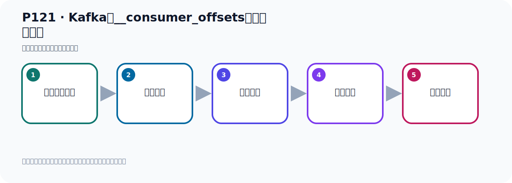
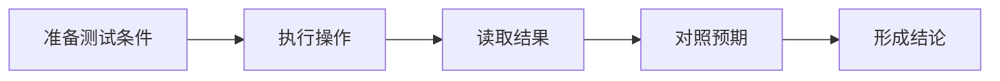

# P121：Kafka的__consumer_offsets主题数据查看

> 笔记编号 121/156 · 时长 05:34 · [打开原视频 P121](https://www.bilibili.com/video/BV14J4m187jz?p=121)

[← P120: Kafka的__consumer_offsets主题](../08-storage-offsets/p120-Kafka的__consumer_offsets主题.md) · [返回本章](./README.md) · [P122: Kafka的Offset详解-生产者Offset →](../08-storage-offsets/p122-Kafka的Offset详解-生产者Offset.md)

## 这节到底讲什么

**核心主题：Kafka的__consumer_offsets主题数据查看。**

这节用实验验证前面的配置或机制。重点是记录输入、预期、实际输出，以及两者不一致时如何定位。
本节属于“消息存储与 Offset”这一章；放在全章里看，它的作用是：理解日志文件、__consumer_offsets、生产者 Offset 与消费者 Offset 的含义和代码表现。

## 本节路线

## 老师的完整讲解（按视频顺序校正）

> 下面保留老师的完整讲解顺序，并修正 Kafka、Java、ZooKeeper、
> Topic、Partition、Offset 等常见识别错误。它不是压缩摘要；原始 ASR 在后面单独保留。

### 1. 00:00–00:45

刚才我们对Consumer、Offset这个Topic已经有所了解了。那么它作为一个Topic的话，那为什么在我们的idea里面看不到呢？idea里面有个Kafka的插件，对吧？Kafka插件我们这个Topic下看不到我们刚才那个Consumer、Offset那个Topic。因为它也是个Topic，Topic应该在这里可以看到，对吧？但是由于我们这个Topic是它内部给我们创建的一个Topic，不是我们应用程序创建的。那么这个Topic在我们现在这个插件这里面看不见，主要原因是因为我们目前这个Kafka用的是ZooKeeper方式启动的，采用的是ZooKeeper方式启动。

### 2. 00:45–01:32

不是用Currub的方式，如果你用的是Currub的方式启动的，那么它可以看到。因为现在用的是ZooKeeper，所以它的这个Topic注册到ZooKeeper上去的，我们通过ZooKeeper是可以看到的，在这边是看不见的。那我们这个时候为了你开发的方便，我们可以在这个idea插件里面装一个插件，在idea里面装个插件，点文件，塞体，然后我们找这个Blocking插件，这里面我们可以收一个，在这个位置点收一个ZooKeeper，收个ZooKeeper，那么你收个ZooKeeper的时候，它会找到一些ZooKeeper这个插件，你找一个安装看一下。

### 3. 01:32–02:24

那这里我用的是这个插件，那么其他插件你可以试一下，比如说它是付费的，这个你可以不用，像它呀，还有这里呀，这些呀，都可以安装尝试一下，那我在这里给大家用的是这个，ZooKeeper Manager，我们点一下安装，安装之后呢，我们可以通过一个插件连到ZooKeeper上去，然后看一下，那我安装好了，这里就OK一下，OK之后呢，我们这个时候在右车地方会多个图标，然后这个嘛，或者说你在这个位置也可以看到，在文件，这个Sighting，然后这个Tools，这个Tools工具，工具展开，展开这个里面有多一个呢，叫ZooKeeper就这个，在这里，会多个叫ZooKeeper，它右边这个地方会多个这个图标，这个位置多个图标，。

### 4. 02:25–03:21

然后呢，就是你在这个里面，配上你的IP端口，我这个地方ID可能是之前有配置过，所以它这个IP它帮我们寄箱了，你那边没有配的话，这些应该是空的，是空的，你倒是写一下，那么这个名字呢，可以随便写，因为它这个名字，那么这个是IP你必须要写对，要写上你另一个是IP，我们11118，所以这里是11118，端口2181，然后它这个路径点默认是斜槓入T-Bot，这个你可以不动，保持默认就可以了，这个Sighting超出时间它是6000，这块呢也可以保持不动，下面这个字幕编码默认668可以不动，这个Odemy Server，那么这个地方你要改的话就是把中间这个IP改成你服务器的IP就可以了，其他可以不用动，好，那我们这样配着好了，配到之后你这个点一下测试你，测试，它联络去了，好，联络去了，。

### 5. 03:22–04:36

那我们如Kibble就联好了，我们点一下OK就可以了，OK之后我们在右车这地方展开，就可以看到如Kibble，看如Kibble目前它可能在连接，这数据没出来，我们要么点刷新看你们出来，刷新一下，它现在看不到里面的节点数据，现在出来了，如Kibble的数据就是以节点的方式存在，你看，还有这个Odemy节点，Broker节点，像我们的这个Tobiker都是放在Broker节点里面的，展开之后它下面就有TobikerS，那TobikerS里面有我们所有的Tobiker，包括我们应用程序创建Tobiker也在这里面，那这个呢就是我们它类似的Tobiker用来存放消费者体积的OwS的信息，就在这里，对吧，好在里面，当然这里面它只是一些元素的信息，你要看它这个偏移量是多少你看不到，比如说之前我们看的是这个11，在11里面它里面是一个状态，状态里面是一些元素据，它并没有记住你这个OwS的到哪个地方了，那么OwS呢究竟是什么，。

### 6. 04:37–05:28

我们需要通过密利行工具去查看，这个地方它只是进入那个元素据，所以这块是看不见的，看不见的，我们需要通过密利行工具去查看我们11这个分区下，我们的这个Tobiker，我们的这个OwS究竟是存了多少，这个我们需要通过密利行工具去查看，这边它只是进入一些元素据信息，好，那这个我们可以通过这个X件，IDX件，帮助我们查看这个信息，所有的这个Roupieware上注册的这些信息都是元素据信息，没有你的实际数据，就是元素据，没有实际的数据的，好，那这就是我们对这个TonsumerOwSite，这个类制的这个主题，这个Tobiker，我们可以用这个TonsumerOwSite，这个类制的这个主题，这个TonsumerOwSite，这个类制的这个TonsumerOwSite，这个�。

### 7. 05:28–05:29

我们做了一个分析。

## 关键术语

- **Kafka：** Apache 开源的分布式事件流平台，常用于高吞吐消息传递、数据管道和流处理。
- **Topic：** 事件的逻辑分类。生产者向 Topic 写数据，消费者从 Topic 读取数据。
- **Broker：** 运行 Kafka 服务的节点；多个 Broker 组成 Kafka 集群。
- **Consumer：** 从 Kafka Topic 拉取并处理事件的客户端。
- **Offset：** 事件在 Partition 中的位置编号，也是消费者记录消费进度的依据。
- **ZooKeeper：** 旧版 Kafka 用于集群元数据和控制器协调的外部服务。

## 完整原声逐段记录

[查看本节带时间戳的本地 ASR](./transcripts/p121-Kafka的__consumer_offsets主题数据查看-ASR.md)。主笔记负责可读性和术语校正；ASR 页面负责完整性复核。

## 读完记住

- 本节主题是 **Kafka的__consumer_offsets主题数据查看**，它服务于本章目标：理解日志文件、__consumer_offsets、生产者 Offset 与消费者 Offset 的含义和代码表现。
- 理解顺序是：准备测试条件 → 执行操作 → 读取结果 → 对照预期 → 形成结论。
- 学习时要同时核对老师的解释、画面中的配置/代码，以及最终运行结果。

## 最容易踩的坑

测试前残留的 Topic、Offset、缓存或旧进程会污染结果；每次实验都要先确认初始状态。

## 自测

1. 不看笔记，用自己的话解释“Kafka的__consumer_offsets主题数据查看”解决了什么问题。
2. 按顺序复述：准备测试条件、执行操作、读取结果、对照预期、形成结论。
3. 如果运行结果和老师不同，你会先检查哪三个输入或环境条件？

## 学完检查

- [ ] 我能不看视频复述本节完整思路
- [ ] 我能指出关键命令、配置、类或接口的作用
- [ ] 我能解释画面中的输入与输出为什么对应
- [ ] 我核对过完整 ASR，没有跳过老师的补充说明
- [ ] 我完成了本节自测或复现实验
