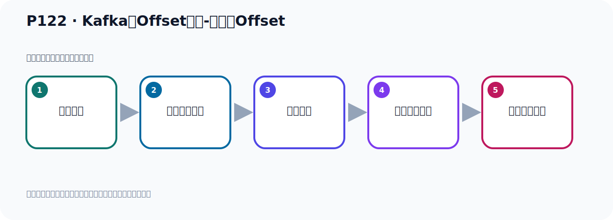

# P122：Kafka的Offset详解-生产者Offset

> 笔记编号 122/156 · 时长 02:50 · [打开原视频 P122](https://www.bilibili.com/video/BV14J4m187jz?p=122)

[← P121: Kafka的__consumer_offsets主题数据查看](../08-storage-offsets/p121-Kafka的__consumer_offsets主题数据查看.md) · [返回本章](./README.md) · [P123: Kafka的Offset详解-消费者Offset →](../08-storage-offsets/p123-Kafka的Offset详解-消费者Offset.md)

## 这节到底讲什么

**核心主题：Kafka的Offset详解-生产者Offset。**

这节围绕位置与进度展开。一定要区分日志中的位置、各副本的末端位置、可见水位和消费者提交进度。
本节属于“消息存储与 Offset”这一章；放在全章里看，它的作用是：理解日志文件、__consumer_offsets、生产者 Offset 与消费者 Offset 的含义和代码表现。

## 本节路线

## 老师的完整讲解顺序（ASR 辅助复核）

> 下面按时间顺序保留经过基础术语替换的 ASR，方便核对老师是否提到某个细节。
> 人名、命令、代码和英文参数仍可能识别错误；准确结论以本节白话说明、代码块和实操速查表为准。

### 1. 00:00–00:51

刚才我们介绍了消费者提交Offset。消费两个消息之后，他会提交之后，会在服务端、记录我提交到哪个位置了。那么这个记录会放在这个文件夹下，这个主题下。既然这里我们讲到这个Offset，包括前面我们也介绍过Offset。那接下来我们把Offset再做一个消息的解读。首先我们这个Offset要介绍一下生产者Offset，然后他还有消费者的Offset，这两个Offset。那生产者Offset就是我们生产者发上一条消息到Kafka的Block里面。当然他是发到KafkaBlock，也就是Kafka服务器，他那个某个Torbiger下的。

### 2. 00:52–01:45

那么Torbiger下他有很多分区，那么最终消息是发到Block里面的Torbiger下边的某个PartyC里面的。那Kafka内部他会给每条消息都分配一个唯一的Offset。这个Offset就是一个数字，从零开始一直增长的数字，零一三四增长的数字。这个Offset就是消息在PartyC中的位置，就是他有个编号。你的这个消息在哪个位置？我们可以看一下这个图，那就是这个样子。我们这张图，我们生产者发出消息，那么到把这个分区，到主题下的某个分区。那你的第一个消息就在零这个位置，第二条消息在一这个位置，一词放了这个位置。

### 3. 01:45–02:45

那每条消息都有个编号，一个数字，增长的一个数字。那你对于第二个分区也是一样，第一条消息在这里，第二条消息在这里，然后一次放到后面，它是有顺序的。有顺序的存放在R7，这个消息的后边，下一个消息放到它后边，再往后面放，有顺序的放。我们左边生导消息，右边是新消息，放的时候，消息放的时候，要放了前一个奥夫赛的后边。所以每个消息有一个编号，好，那么这个是我们生产者奥夫赛的，前面我们已经都介绍过。那这里相当于做一个整理，做一个梳理。那下面我们再介绍一下这个消费者的奥夫赛的，这个生产者奥夫赛的，是不需要我们从代码级别做管理的。我们在写代码的时候，你没有特殊的设置，不用做任何的设置，那么他是服务其端自己去管理的。

## 关键术语

- **Kafka：** Apache 开源的分布式事件流平台，常用于高吞吐消息传递、数据管道和流处理。
- **Offset：** 事件在 Partition 中的位置编号，也是消费者记录消费进度的依据。

## 完整原声逐段记录

[查看本节带时间戳的本地 ASR](./transcripts/p122-Kafka的Offset详解-生产者Offset-ASR.md)。主笔记负责可读性和术语校正；ASR 页面负责完整性复核。

## 读完记住

- 本节主题是 **Kafka的Offset详解-生产者Offset**，它服务于本章目标：理解日志文件、__consumer_offsets、生产者 Offset 与消费者 Offset 的含义和代码表现。
- 理解顺序是：消息写入 → 形成日志位置 → 副本同步 → 更新可见水位 → 记录消费进度。
- 学习时要同时核对老师的解释、画面中的配置/代码，以及最终运行结果。

## 最容易踩的坑

“Offset”不是一个全局数字；它必须放在具体 Topic、Partition、消费者组或副本语境中解释。

## 自测

1. 不看笔记，用自己的话解释“Kafka的Offset详解-生产者Offset”解决了什么问题。
2. 按顺序复述：消息写入、形成日志位置、副本同步、更新可见水位、记录消费进度。
3. 如果运行结果和老师不同，你会先检查哪三个输入或环境条件？

## 学完检查

- [ ] 我能不看视频复述本节完整思路
- [ ] 我能指出关键命令、配置、类或接口的作用
- [ ] 我能解释画面中的输入与输出为什么对应
- [ ] 我核对过完整 ASR，没有跳过老师的补充说明
- [ ] 我完成了本节自测或复现实验
