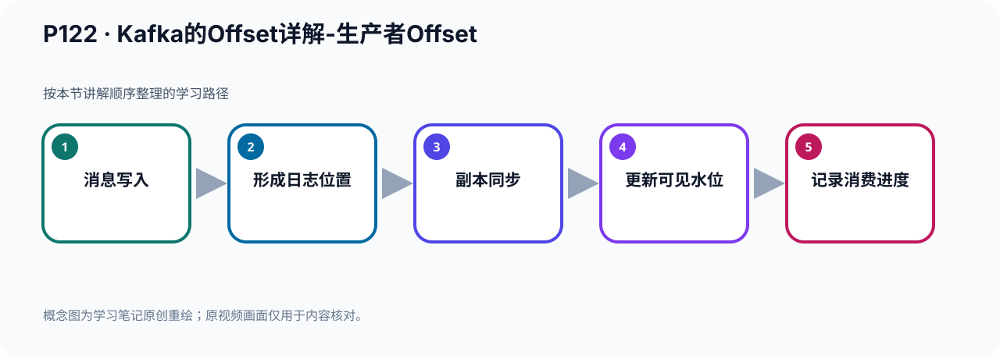
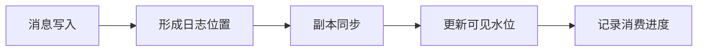

# P122：Kafka的Offset详解-生产者Offset

> 笔记编号 122/156 · 时长 02:50 · [打开原视频 P122](https://www.bilibili.com/video/BV14J4m187jz?p=122)

[← P121: Kafka的__consumer_offsets主题数据查看](../08-storage-offsets/p121-Kafka的__consumer_offsets主题数据查看.md) · [返回本章](./README.md) · [P123: Kafka的Offset详解-消费者Offset →](../08-storage-offsets/p123-Kafka的Offset详解-消费者Offset.md)

## 先看结论

> 这节用“Kafka的Offset详解-生产者Offset”区分日志位置、消费进度、副本末端和可见边界，避免把不同语境中的 Offset 混成一个数字。它服务于本章目标：理解日志文件、__consumer_offsets、生产者 Offset 与消费者 Offset 的含义和代码表现。

## 老师怎么一步步讲

1. 第 1 步，围绕“Kafka的Offset详解-生产者Offset”完成消息写入。
2. 第 2 步，围绕“Kafka的Offset详解-生产者Offset”完成形成日志位置。
3. 第 3 步，围绕“Kafka的Offset详解-生产者Offset”完成副本同步。
4. 第 4 步，围绕“Kafka的Offset详解-生产者Offset”完成更新可见水位。
5. 第 5 步，围绕“Kafka的Offset详解-生产者Offset”完成记录消费进度。

## 老师的补充说明

下面按原声顺序整理老师的完整讲解脉络。保留原因、案例、对比、操作过程、边界条件和口头提醒；删除重复语气词，并把长口语拆成适合阅读的短段落。

> 技术术语已经过统一校正；仍无法确认的人名或口头英文会保留原意，并通过右侧时间范围返回视频核对。

### 先明确：Kafka的Offset详解-生产者Offset要解决什么 · 00:00–00:51

刚才我们介绍了消费者提交Offset。消费两个消息之后，他会提交之后，会在服务端、记录我提交到哪个位置了。那么这个记录会放在这个文件夹下，这个主题下。既然这里我们讲到这个Offset，包括前面我们也介绍过Offset。那接下来我们把Offset再做一个消息的解读。首先我们这个Offset要介绍一下生产者Offset，然后他还有消费者的Offset，这两个Offset。那生产者Offset就是我们生产者发上一条消息到Kafka的Block里面。

当然他是发到KafkaBlock，也就是Kafka服务器，他那个某个Torbiger下的。

### 继续拆解形成日志位置 · 00:52–01:49

那么Torbiger下他有很多分区，那么最终消息是发到Block里面的Torbiger下边的某个PartyC里面的。那Kafka内部他会给每条消息都分配一个唯一的Offset。这个Offset就是一个数字，从零开始一直增长的数字，零一三四增长的数字。这个Offset就是消息在PartyC中的位置，就是他有个编号。你的这个消息在哪个位置？我们可以看一下这个图，那就是这个样子。我们这张图，我们生产者发出消息，那么到把这个分区，到主题下的某个分区。

那你的第一个消息就在零这个位置，第二条消息在一这个位置，一词放了这个位置。那每条消息都有个编号，一个数字，增长的一个数字。

### 最后验证结果，并收束本节结论 · 01:49–02:45

那你对于第二个分区也是一样，第一条消息在这里，第二条消息在这里，然后一次放到后面，它是有顺序的。有顺序的存放在R7，这个消息的后边，下一个消息放到它后边，再往后面放，有顺序的放。我们左边生导消息，右边是新消息，放的时候，消息放的时候，要放了前一个奥夫赛的后边。所以每个消息有一个编号，好，那么这个是我们生产者奥夫赛的，前面我们已经都介绍过。那这里相当于做一个整理，做一个梳理。那下面我们再介绍一下这个消费者的奥夫赛的，这个生产者奥夫赛的，是不需要我们从代码级别做管理的。

我们在写代码的时候，你没有特殊的设置，不用做任何的设置，那么他是服务其端自己去管理的。

## 放进整套课

本节属于 **消息存储与 Offset**。这一章要解决的是：理解日志文件、__consumer_offsets、生产者 Offset 与消费者 Offset 的含义和代码表现。

这节围绕位置与进度展开。一定要区分日志中的位置、各副本的末端位置、可见水位和消费者提交进度。

### 记忆路线

```mermaid
flowchart LR
    N0["消息写入"]
    N1["形成日志位置"]
    N0 --> N1
    N2["副本同步"]
    N1 --> N2
    N3["更新可见水位"]
    N2 --> N3
    N4["记录消费进度"]
    N3 --> N4
```

## 用在工作里

| 项目 | 内容 |
|---|---|
| 先回答 | 先说明当前 Offset 属于生产者、消费者组还是某个副本。 |
| 立刻做 | 用命令或代码观察写入、提交、重启前后的数值变化。 |
| 留下证据 | 留下 Topic、Partition、Group 与 Offset 的对应关系图。 |

## 关键术语

- **Kafka：** Apache 开源的分布式事件流平台，常用于高吞吐消息传递、数据管道和流处理。
- **Offset：** 事件在 Partition 中的位置编号，也是消费者记录消费进度的依据。

## 最容易踩的坑

“Offset”不是一个全局数字；它必须放在具体 Topic、Partition、消费者组或副本语境中解释。

## 自测

1. 不看笔记，用自己的话解释“Kafka的Offset详解-生产者Offset”解决了什么问题。
2. 按顺序复述：消息写入、形成日志位置、副本同步、更新可见水位、记录消费进度。
3. 如果运行结果和老师不同，你会先检查哪三个输入或环境条件？

## 学完检查

- [ ] 我能不看视频复述本节完整思路
- [ ] 我能指出关键命令、配置、类或接口的作用
- [ ] 我能解释画面中的输入与输出为什么对应
- [ ] 我读完了老师的详细讲解正文，没有只看路线图和要点
- [ ] 我完成了本节自测或复现实验

## 需要核对原话时

[查看本节带时间戳的完整 ASR](./transcripts/p122-Kafka的Offset详解-生产者Offset-ASR.md)。主笔记负责理解与实践；ASR 页面负责逐句完整性复核。
