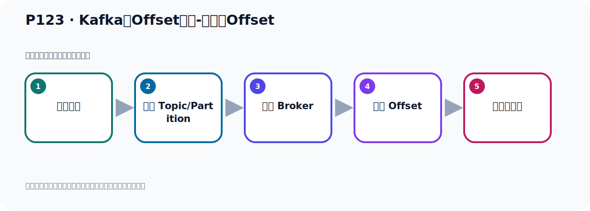
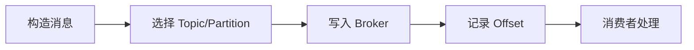

# P123：Kafka的Offset详解-消费者Offset

> 笔记编号 123/156 · 时长 06:51 · [打开原视频 P123](https://www.bilibili.com/video/BV14J4m187jz?p=123)

[← P122: Kafka的Offset详解-生产者Offset](../08-storage-offsets/p122-Kafka的Offset详解-生产者Offset.md) · [返回本章](./README.md) · [P124: Kafka的Offset详解-生产者Offset代码演示 →](../08-storage-offsets/p124-Kafka的Offset详解-生产者Offset代码演示.md)

## 这节到底讲什么

**核心主题：Kafka的Offset详解-消费者Offset。**

这节位于消息链路上。要顺着“发送端—Broker—分区日志—消费端”看数据和元数据怎样流动。
本节属于“消息存储与 Offset”这一章；放在全章里看，它的作用是：理解日志文件、__consumer_offsets、生产者 Offset 与消费者 Offset 的含义和代码表现。

## 本节路线

## 老师的完整讲解顺序（ASR 辅助复核）

> 下面按时间顺序保留经过基础术语替换的 ASR，方便核对老师是否提到某个细节。
> 人名、命令、代码和英文参数仍可能识别错误；准确结论以本节白话说明、代码块和实操速查表为准。

### 1. 00:00–00:49

刚才我们介绍了是生存者的Offset，接下来我们看一下第二个，消费者的Offset。那什么又是消费者的Offset呢？消费者的Offset它是消费者，它需要知道自己已经读取到哪个位置了。就是我们这个Party系中，我们分析中有很多消息，那我已经读到哪个位置了。接下来我需要从哪个位置开始继续读取消息，那这个时候它需要一个位置，就是我消费到哪里了，一边在发消息，一边在接消息，那我接消息的时候我是接到哪个位置了，我上一次接收到哪个位置了。我应该从哪个位置开始继续接收消息，所以这个时候它接收消息的一个位置就是消费者的Offset了。

### 2. 00:50–01:46

那我们知道我们消费者这边去消费消息的时候，它都是以组的方式去消费，就是你消费者即便是只有一个消费者，那你要给它指定一个消费组，因为你不指定消费组的话，整个程序都报错了，它是不允许的，它需要有个消费组。那我们知道这个消费的时候它不是会有一个分区策略，那你这个每个分区会分给这个主里面的每个消费者去消费，你的每个分区都会有消费者，每个分区都有消费者。好，那现在比如说我们这个P0这个分区，这个分区对于这一组消费者这个主的消费者来说，比如说比方说你这个P0分区是这个消费者去消费，分给它的，分给它的，那么这个时候它消费者哪去了呢？它消费者假设在二这个位置，我们用这个颜色表示，它是这个颜色，我们也是这个颜色，。

### 3. 01:46–02:40

让它消费到二这个位置的，那么这个二就是我们消费者的O-SET，当然它真的指的就是三，为什么呢？这个消费者的O-SET是你消费位置的下一个位置，就是我消费者的这个O-SET，那就表示我下次要从三这个位置开始消费，通过它季度，同样的比如说P这个分区，这个分区它肯定有个消费者，假设它是我们的第二个消费者，是它的消费，那么这个消费者它已经消费到三这个位置了，那么这个颜色表示，消费者三了，消费者三之后，那么下一次它从哪里消费，下一次那么从四这个位置开始消费，那么它的O-SET值那就是四，对于这个第二个分区来说，那么它的O-SET就是四，对于第一个分区来说它的消费者O-SET就是三，。

### 4. 02:40–03:34

那么下面这个P2这个分区，假设它是分给这个消费者的它的消费，它已经消费到四这个位置了，那么它的O-SET值就是它下一个位置，下一个位置就是五，那它下一次消费，就从五这个位置开始消费，好，那么这就是我们的这个消费者O-SET的，那么同样的你这个分区里面的这个消息也可以另外一个分组去消费，我有另外一个分组，用这一组，用这个分组去消费这个消息，好，那么这个颜色是它这个颜色，这个颜色那么假设我们这个P0这个分区分给这个消费者的，那么它现在已经消费到三了，那么它的O-SET就是四，因为O-SET的消费者O-SET是当前消费的消息的下一个位置，下一个值就是它的O-SET的，好，那么对于这个对于第二个分区，。

### 5. 03:34–04:31

假设它是分给这个消费者的，那么此时它已经消费到二了，那么它的O-SET的消费者O-SET就是三，那假设我们这个分区是分给这个消费者去消费，那么它的消费目前是到二这个位置，那么它的消费者O-SET的就是三，下一次从三这个位置开始消费，好，这就是我们消费者的O-SET的，所以我们每个消费组这个消费组中消费者都会独立的维护自己的O-SET的，你消费到哪里的，你自己维护这个O-SET的值，当个消费者从某个Party系读取消息时，他会记录当前读取的O-SET的，就是我读了哪里的，那么这样的话，即便是消费者崩溃或者重启，那么它可以下次，下一次它可以继续从上一次读取的位置继续读取数据，就是我这个消费者比较宕机的，。

### 6. 04:31–05:27

但是你把消费者给它重新启动起来，启动起来之后，因为它有O-SET，它可以接着上一次的位置继续读取消息，这样的话它不会出现重复读取消息，也不会出现遗漏消息，那么这就是我们消费者的O-SET，我们注意一下，我们消费者的O-SET，我们所说的消费者O-SET，一定是以消费消息之后，并且提交了，才会记录这个O-SET，如果你没有提交，那么这O-SET是不会做记录的，比方说我们这个消费者，他读取这个分区里面的消息，对吧，他读到二个位置的，但是他没有提交，没有提交，相当于这个消息，这个零一二这个消息，你下次还可以消费，因为你没有提交，你没有更新这个O-SET，那下次就不是从山脾下读了，那可能又要从前面开始读，因为你没有提交，。

### 7. 05:28–06:18

这个消息以消费到之后，也要提交，提交之后才会更新这个O-SET，那么这个提交我们前面见了过，他有自动提交和手动提交，自动提交，就是你不用做任何操作，也不用做任何配置，那么莫正情况下，Kafka的客户端的IPA都是自动提交，就是你读完一个消息之后，他自动提交，那么自动就会更新这个O-SET，但是如果说你把这个，你在客户端，你在开发的时候，你把它设为手动提交，设为手动提交，那这个时候你在代码中，一定要显示的调纳和代码，调那个ICK那个方法，这样才是提交，你不调那个ICK方法，那么他是不会提交的，不会提交的，那么O-SET是不会更新的，不会更新的，那么就是你下次消费，又开始从零这个开始消费，因为他没有帮你更新那个O-SET的，。

### 8. 06:19–06:50

所以消费者这个O-SET一定是以消费消息之后，要么是自动提交，要么是手动提交，提交之后才会嫉妒这个O-SET，如果说你忘记提交了，那他不会更新这个O-SET，那么以上就是我们这个消费者的O-SET，那接下来我们通过代码的方式来去验证一下，我们刚才所说的这些，这些细节，我们在这个消费者的O-SET，。

## 关键术语

- **Kafka：** Apache 开源的分布式事件流平台，常用于高吞吐消息传递、数据管道和流处理。
- **Offset：** 事件在 Partition 中的位置编号，也是消费者记录消费进度的依据。

## 完整原声逐段记录

[查看本节带时间戳的本地 ASR](./transcripts/p123-Kafka的Offset详解-消费者Offset-ASR.md)。主笔记负责可读性和术语校正；ASR 页面负责完整性复核。

## 读完记住

- 本节主题是 **Kafka的Offset详解-消费者Offset**，它服务于本章目标：理解日志文件、__consumer_offsets、生产者 Offset 与消费者 Offset 的含义和代码表现。
- 理解顺序是：构造消息 → 选择 Topic/Partition → 写入 Broker → 记录 Offset → 消费者处理。
- 学习时要同时核对老师的解释、画面中的配置/代码，以及最终运行结果。

## 最容易踩的坑

能发送成功不代表业务处理成功；序列化、分区、确认机制和消费进度需要分别观察。

## 自测

1. 不看笔记，用自己的话解释“Kafka的Offset详解-消费者Offset”解决了什么问题。
2. 按顺序复述：构造消息、选择 Topic/Partition、写入 Broker、记录 Offset、消费者处理。
3. 如果运行结果和老师不同，你会先检查哪三个输入或环境条件？

## 学完检查

- [ ] 我能不看视频复述本节完整思路
- [ ] 我能指出关键命令、配置、类或接口的作用
- [ ] 我能解释画面中的输入与输出为什么对应
- [ ] 我核对过完整 ASR，没有跳过老师的补充说明
- [ ] 我完成了本节自测或复现实验
