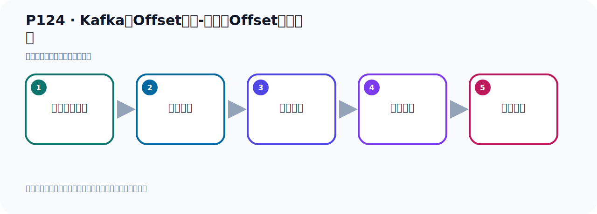

# P124：Kafka的Offset详解-生产者Offset代码演示

> 笔记编号 124/156 · 时长 05:26 · [打开原视频 P124](https://www.bilibili.com/video/BV14J4m187jz?p=124)

[← P123: Kafka的Offset详解-消费者Offset](../08-storage-offsets/p123-Kafka的Offset详解-消费者Offset.md) · [返回本章](./README.md) · [P125: Kafka的Offset详解-消费者Offset代码演示默认从最新位置消费 →](../08-storage-offsets/p125-Kafka的Offset详解-消费者Offset代码演示默认从最新位置消费.md)

## 这节到底讲什么

**核心主题：Kafka的Offset详解-生产者Offset代码演示。**

这节用实验验证前面的配置或机制。重点是记录输入、预期、实际输出，以及两者不一致时如何定位。
本节属于“消息存储与 Offset”这一章；放在全章里看，它的作用是：理解日志文件、__consumer_offsets、生产者 Offset 与消费者 Offset 的含义和代码表现。

## 本节路线

## 老师的完整讲解（按视频顺序校正）

> 下面保留老师的完整讲解顺序，并修正 Kafka、Java、ZooKeeper、
> Topic、Partition、Offset 等常见识别错误。它不是压缩摘要；原始 ASR 在后面单独保留。

### 1. 00:00–00:57

我们下面就通过代码的方式，我们来演示一下RO Set的这些细节。下面我们在这里就准备一个代码，我把之前的能力这个项目就完全复制一份Ctrl C，然后这里是Ctrl V，粘贴一下。我们改成能7，准备一下能7这个项目。这个时候把这个边移的Tagget删掉，然后破文件。这里面我们就把它这个名字改一下，我们现在是能7，Ctrl R把整个T换成能7，T换一下。这样T换了，T换之后其他地方不用动。此时我们在这里右键，然后T键将我们没有没工程，因为它现在不识别，要添加一下。添加一下之后，那么这就可以了。可以之后我们看个代码，这个测试内没有用，删掉。

### 2. 00:57–02:02

首先我们是发个消息，那我现在发消息，配置我就不要，用默认的，配置内不要。用默认的方式，那就是这里面的配置。这里是能7，那明的地址，在消费者的序列化器，这个读取Obset，我们来去掉。从最早开始读这个去掉，我们没有别的配置，就默认到这个样子。这是这个程序，那我们今天就是发消息，发消息的话用生长者去发，然后去发，发的话我就不再发100条了，直接一条就发。或者我发两条吧，我就不改就代码了，发少一点，就发两条了，一次一发两条，这样就发就可以了。那么这个Topic我们改个名字，叫ObsetTopic，叫ObsTopic，叫这个名字吧。好，这我们Topic名字，就往里面去发两条消息，那我们在测试内就去发一下就可以了，这个方式发一下。

### 3. 02:02–02:51

那掉这个方法，你看它底层掉的方法，那去发消息，好，那我们这个时候去发，那目前的话呢，这个里面，它现在是没有那个ObsTopic，是没有的，看一下，没有ObsTopic，这没有，那我们去发一个消息，它就有了。那在这里发，右键发送，好，这样我们就发生一个消息了。好，那么发生的时候不能够错，先把错解决一下，看它错了什么原因呢？在这个我们那个零的工厂这些，因为我们把它删掉了，那就是我们的消费者要改一下，这个消费者这里。好，我们这个工厂都没有了，现在已经删掉了这个。好，这消费者呢，我们也解救，不搞多线承证，就一个消费者，它摸了一个。

### 4. 02:52–03:42

好，而且我们消费者到这消费者是ObsTopic，ObsTopic。那么现在呢，我们把这个地方的这个消费暂时重调，先让它不消费，先不消费，这个分组我们叫Obs Group，Obs Group。我暂时是不去消费的，先把助了掉，我们先发消息，然后后面再消费，这样先把助了掉，那这个时候再去发。那在这里，刚才发那讲，看它这边有什么变化没有啊？这个Obs，因为它爆出了，ObsTopic还没有出来，刷新，没有，没有，好，那我们开始发。在这点一下发送。好，那现在它就发出去了。发出去了之后，那么它这也是没有错误的，日志是正常的，没有红色，没有错误。

### 5. 03:43–04:33

那接下来我们看一下，它发了之后，在我们这个Kafka这里，就可以刷新看一下，ObsTopic，ObsTopic。那这里面就有两条消息，那么它的Obs就变成了二嘛，就是你这个有几条消息，它的Obs结束就是几啊。其实它就相当于为一号位置有一条消息，一号位置有一条消息，那么它结束相当于你下次放消息的时候，应该放到那个二号位置，相当于为一号位置有消息了，一号位置有消息了，二号位置还没有放，那这里面有一个消息，这里面有一个消息，那这里面没有放，那就是它的Obs结束是在二这个位置，下次就放到二这个位置，就这样，这是它的Obs，这相当于是生产者Obs，过程你再发一下，那么它变成四了，就是下一次就放到四这个位置。

### 6. 04:36–05:23

好，那么这个我们再刷新，刷新到这里就变成四，它有四条消息，我们还可以通过之前安中的另一个工具，叫做这个Obs set as block，这个工具打开，同意一下，同意之后来展开我们的连接，好连上去，我们是托并可，对吧，托并可，我们叫OS托并可展开，展开之后开发定型，它默认只有一个发定型，那么现在它这个开始原是零开始，结束之四，它在转工里面已经发了四条消息，这也可以看出来，那这一块呢，相当于是我们生产者它发了几个消息了，通过这个可以查看到，好，这是生产者的这个Obs set，我们接下来去研究一下那个消费者的Obs set，好，那么看看消费者Obs set。

## 关键术语

- **Kafka：** Apache 开源的分布式事件流平台，常用于高吞吐消息传递、数据管道和流处理。
- **Topic：** 事件的逻辑分类。生产者向 Topic 写数据，消费者从 Topic 读取数据。
- **Offset：** 事件在 Partition 中的位置编号，也是消费者记录消费进度的依据。

## 完整原声逐段记录

[查看本节带时间戳的本地 ASR](./transcripts/p124-Kafka的Offset详解-生产者Offset代码演示-ASR.md)。主笔记负责可读性和术语校正；ASR 页面负责完整性复核。

## 读完记住

- 本节主题是 **Kafka的Offset详解-生产者Offset代码演示**，它服务于本章目标：理解日志文件、__consumer_offsets、生产者 Offset 与消费者 Offset 的含义和代码表现。
- 理解顺序是：准备测试条件 → 执行操作 → 读取结果 → 对照预期 → 形成结论。
- 学习时要同时核对老师的解释、画面中的配置/代码，以及最终运行结果。

## 最容易踩的坑

测试前残留的 Topic、Offset、缓存或旧进程会污染结果；每次实验都要先确认初始状态。

## 自测

1. 不看笔记，用自己的话解释“Kafka的Offset详解-生产者Offset代码演示”解决了什么问题。
2. 按顺序复述：准备测试条件、执行操作、读取结果、对照预期、形成结论。
3. 如果运行结果和老师不同，你会先检查哪三个输入或环境条件？

## 学完检查

- [ ] 我能不看视频复述本节完整思路
- [ ] 我能指出关键命令、配置、类或接口的作用
- [ ] 我能解释画面中的输入与输出为什么对应
- [ ] 我核对过完整 ASR，没有跳过老师的补充说明
- [ ] 我完成了本节自测或复现实验
