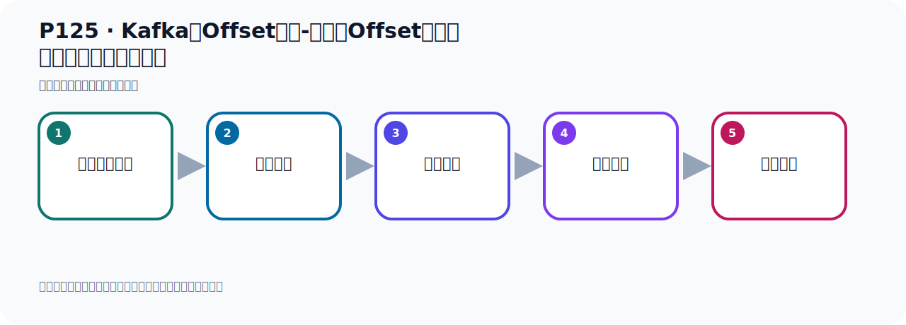

# P125：Kafka的Offset详解-消费者Offset代码演示默认从最新位置消费

> 笔记编号 125/156 · 时长 11:16 · [打开原视频 P125](https://www.bilibili.com/video/BV14J4m187jz?p=125)

[← P124: Kafka的Offset详解-生产者Offset代码演示](../08-storage-offsets/p124-Kafka的Offset详解-生产者Offset代码演示.md) · [返回本章](./README.md) · [P126: Kafka的Offset详解-消费者Offset代码演示默认从最新位置消费 →](../08-storage-offsets/p126-Kafka的Offset详解-消费者Offset代码演示默认从最新位置消费.md)

## 这节到底讲什么

**核心主题：Kafka的Offset详解-消费者Offset代码演示默认从最新位置消费。**

这节用实验验证前面的配置或机制。重点是记录输入、预期、实际输出，以及两者不一致时如何定位。
本节属于“消息存储与 Offset”这一章；放在全章里看，它的作用是：理解日志文件、__consumer_offsets、生产者 Offset 与消费者 Offset 的含义和代码表现。



## 本节路线


## 先用白话读懂实验

Topic 已经有 4 条历史消息，位置为 0、1、2、3，日志末端位置就是 4。一个从未消费过的
新消费组使用默认 `latest` 时，会把起点放在 4，因此不会读取前面 4 条；之后再发送两条，
它会读取位置 4、5 的新消息。

查看消费组：

```bash
bin/kafka-consumer-groups.sh \
  --bootstrap-server localhost:9092 \
  --describe \
  --group osGroup
```

- `CURRENT-OFFSET`：消费组下一条准备读取的位置。
- `LOG-END-OFFSET`：当前分区日志末端。
- `LAG`：两者之差，即尚未消费的消息数量。

因此老师第一次看到的是 `CURRENT-OFFSET=4`、`LOG-END-OFFSET=4`、`LAG=0`；再发送两条但
尚未消费时会变成末端 6、LAG 2，消费完成后 CURRENT-OFFSET 前进到 6、LAG 回到 0。

## 老师的完整讲解顺序（ASR 辅助复核）

> 下面按时间顺序保留经过基础术语替换的 ASR，方便核对老师是否提到某个细节。
> 人名、命令、代码和英文参数仍可能识别错误；准确结论以本节白话说明、代码块和实操速查表为准。

### 1. 00:00–01:00

下面我们看一下消费者的Offset。我们通过代码来做一些演示、测试。代码还是刚才的代码。刚才我们已经往Topic中发了一些消息了。叫OSTopic，已经发一些消息了。它里面发了4条，刚才发了4条。现在我们用一个消费者去消费。消息发了4条，现在我们去消费。去消费的话，那就是在我们这个消费者这个位置，然后把它这个注解打开。打开我们消费这个OSTopic，然后我们的分组给它取个名字叫OSGroup。那么这个分组其实是我们第一次去使用。那么我们的每个消费者会搞一个分组。这个分组它现在还没有消费过消息，还没有去消费过消息，那它去消费消息的时候，那么它的消息的那个OSTopic是多少？

### 2. 01:00–01:57

消费者OSTopic是多少？好，那是这样的，就是说，我们这个每个消费组启动开始监听消息的时候，它默认是从消息的最新位置开始监听。也就是把最新的位置作为消费者的OSTopic。那这个最新位置怎么理解呢？如果说你这个Topic分区中，你还没有发出过消息，那么这个最新位置就是人。因为这个Topic还是空的，你没有发出过消息，那么是人。那如果说这个Topic里面，这个分区里面，你已经发出过消息了，你发过消息了，比如说我们现在已经发了4条，发了4个消息了，那么这个最新的位置就是生产者OSTopic的下一个位置，你已经发了这个4条消息了，那么4条消息就像0号位置，1号位置，2号位置，3号位置，。

### 3. 01:57–02:50

好，这个4个位置都有消息了，那我这个下一个位置的相遇就是4，相遇的相遇就是4，那我的这个监听器开始消费消息的时候，从4的位置开始去消费，也就是说它从最新位置开始监听，开始接收消息，把最新位置作为OSTopic，那它就从4的位置开始接收消息，那么对于第一种情况，那么它最新位置是人，对吧，从0的话，那么它相遇就从0开始接收，你这个是人的话，那么它最新位置就是人，而因为里面没有消息，那我就从头到尾开始接收，那么它这个消费者，它消费消息的时候，那么它的这个起始位置就是人，从0这个位置就开始接收消息，因为这里面原来是空的，什么都没有，那我从0开始接收消息，是这样的，。

### 4. 02:50–03:36

把你的这个分区中的这个最新位置作为我的消费者的这个消费的开始位置，好，那么这样有了这个以后呢，我们下面看一下，我们去启动我们消费者的时候，你发现我们这边有4条消息，对吧，我们有4条消息，但是你启动之后你接不到消息，为什么接不到呢，你这个我是把最新位置作为接收消息的起始位置，是吧，那就相遇它从这个位置开始接收，但是这个位置接收你后面没有消息，从这个位置开始没有消息，你历史的这几个消息接不到，接不到的，它是把最新位置作为我的起始位置，作为我开始坚定的位置，所以我们虽然里面发了4条消息，现在我们启动监听器去接收手，你发现它接不到，。

### 5. 03:36–04:33

那我们看一下把这个位置运行，你看这个监听器它是接不到这4条消息的，想想看一下，看下之后呢，我们这里有打印的，我们可以看看这个打印有没有打印，消费消息这个文字有没有打印，在诗字中去收一下，你看收不到，没个结果，收不到，因为什么呢，因为现在你去启动的时候，这个消费者，这个分组，他从4作为起始位置去坚定消息，但是4从4开始接收的时候，从4这个往后是没有消息的，4这个位置之前才有消息，所以他接不到，也就是你之前发的那4条消息他接不到，就是我们这里面有4条消息，再看一下这里面有4条消息，但是是接不到的，接不到的，好，到这里我们给大家介绍一个命令，什么命令呢，就有这样一个命令，。

### 6. 04:35–05:37

你可以查看一下一个这个命令，好的命令，这个命令，在并幕下有个Kafka，Consumer，这个group叫消费组，连到你的Kafka上面去，然后这个组的名字叫什么，我们组叫OS这个group，后面加个discogram就描述一下他的消息情况，就是我们这个消费组，通过消费组这个脚本连到我们服务器上去，看看我们当前这个OSgroup，他一个消息情况，这个分组的一个消息情况，那我们这个是来通过这个命令去执行讲，可以看一下，那这是你，这是并幕录，对吧，并幕录，好执行啊，在当前幕下，当前幕下执行这个脚本，执行一下，好执行一下周园看一下，他现在呢，他这个有点这个，因为太窄了，他显得不出来，我把它复制一下，。

### 7. 05:37–06:21

复制一下周园我们用一个违背工具打开，这样子再一核显示，再一核显示，这样子再一核显示，这样子切除点，好，切除点是吧，你看，这是主的名字，OSgroup的话，Topic，我们叫OSTopic，这是Topic主题的名字，好，这是PartyC，我们只有一个分区，能一个分区，分区编号是能，对吧，好，那么这一个，current OSite，还有一个login的OSite，是吧，那么这个current OSite什么意思呢，就是当前OSite，你可以认为这个OSite就是你消费者的OSite，那就是消费者，他现在从市的位置开始消费，从市的位置开始消费，。

### 8. 06:22–07:09

而我们这个log，日治，日治的indOSite就是你那生产者，你发了个消息，现在已经发视觉消息了，那我这个ind结束了，就是标击那个位置，就是事，你已经发了四个消息了，那么这个位置就是事，对吧，好，那就是我消费者消费者从市开始消费，然后我的消息总不是是设条，那你从市开始消费，那这边是他的视觉消息是吧，你从市开始消费，消费从这个位置开始消费，你要从市开始消费，到这个位置往后是没有消息的，所以你就消费不到消息，消费不到，你可以把这个看作是我们消费者的那个消费的一个起始位置，这个是你总发了多少条消息，然后这个就是他们的一个差值，对吧，。

### 9. 07:10–08:01

比方说你这里发了这个四个，对吧，而我们当前这个地方假的我当前消费者那个片一样是一的话，那么他这个值道就是三，他们两个的差值，就是后面这个值啊，简去前面这个值，他的差值，就是你还有多少没有消费，就是这个意思，那目前是明个，明个就表示你不需要消费，因为我从市开始读消息，我们的数据也只有四条，那个是以后就没有数据了，所以他这个差值是能力啊，就相当于现在没有消息需要消费，没有消息需要消费，是这个情况，那如果说我们现在在网里面发消息啊，那这个实际上，我们看一下，我们这样，我现在把这个程序停掉，停掉了，对吧，我停掉之后，然后我把这个监听器给关掉，。

### 10. 08:02–09:01

注释掉了，好，注释掉了，注释掉之后，我在这边再发两条消息，他这边是徐余佛两次发两条消息，那么这样的话我就发了六条消息，好，这是我们发一下，那么生辗者就发了六条消息啊，好，他发完啊，发完了之后呢，我们可以用，不管你有哪个工具，这个工具看，你看它里面是六条消息，是吧，按你的结束六条，或者说你通过这个工具看也是一样啊，我这上面看不见，刷新一下，他再点一下，刷新一下，刷新这里，刷新一下，然后也是六条吧，六条，好，六条之后，我们通过这个密立行查看一下，查一下，这个密立行，好，这个密立，我们要去描述一下我们这个OS分组，它的一个消费情况，其实查看这个组的一个消费情况，那这个时候走一下，走一下，真谈那么他只是在讲我们负责一下，负责一下，。

### 11. 09:02–10:01

负责之后呢，把这个整个的这个在这粘一下，之前在放这里，我在下面删，下面删啊，好，上面这个密立这个我先去调一下，这个是你发现，我们这个核去掉，是吧，这是我们分组，这是我们Topic可，我们Topic可下的分区，只有一个分区，所以编分数能一，好，那我们消费者的偏移位置，也就是消费者的OS是四，是吧，你现在已经发了六条消息了，那六减四的二，所以现在我们还可以消费两条，有两条消息是可以消费的，有两条消息可以消费，对不对，好，所以我现在运营程序的话，你因为我的这个消费者的OS是四，那我现在启动消费者的时候，他就为什么来从四的位置开始读，这个读的话，那么四后面其实有两条消息，对不对，有两条消息，所以他到时候可以读了两条消息，那么前面的那四条还是读不到的，他只可以读了四以后的那两条消息，他可以读到，。

### 12. 10:02–10:55

所以现在呢，我们去启动我们的消费者的时候，你发现了他可以读到两条消息，好，那这个时候呢，我们把这个消费者这个接近器打开，重解打开，打开之后，我们启动路由方法，你发现他可以消费两条消息，可以消费两条，好，那这样子你看，这个消费者你看，我们搜一下，是不是消费两条呢，试打了，你看，在搜的中两条数据嘛，所以消费两条，消费两条之后，这个时候你再通过命令查看一下，查一下，在这个之后，这个时候你看一下，我们把这个整个的复正一下，复正一下，复正出来之后呢，在我们这边这个张一下，你看一下，好，看下之后呢，你发现，他现在他的消费者的O射了，更一图六了，然后他们之间已经没有插指了，那现在这个消息没有消息可以消费了，。

### 13. 10:55–11:11

也之前是剩两条消息可以消费，现在呢，已经没有消息可以消费了，好，那这就是我们这个消费者啊，他那个消费的这个偏移的这个问题，偏移的问题，这是关于消费者消费，对吧，消费消费啊，。

## 关键术语

- **Kafka：** Apache 开源的分布式事件流平台，常用于高吞吐消息传递、数据管道和流处理。
- **Topic：** 事件的逻辑分类。生产者向 Topic 写数据，消费者从 Topic 读取数据。
- **Consumer：** 从 Kafka Topic 拉取并处理事件的客户端。
- **Offset：** 事件在 Partition 中的位置编号，也是消费者记录消费进度的依据。

## 完整原声逐段记录

[查看本节带时间戳的本地 ASR](./transcripts/p125-Kafka的Offset详解-消费者Offset代码演示默认从最新位置消费-ASR.md)。主笔记负责可读性和术语校正；ASR 页面负责完整性复核。

## 读完记住

- 本节主题是 **Kafka的Offset详解-消费者Offset代码演示默认从最新位置消费**，它服务于本章目标：理解日志文件、__consumer_offsets、生产者 Offset 与消费者 Offset 的含义和代码表现。
- 理解顺序是：准备测试条件 → 执行操作 → 读取结果 → 对照预期 → 形成结论。
- 学习时要同时核对老师的解释、画面中的配置/代码，以及最终运行结果。

## 最容易踩的坑

测试前残留的 Topic、Offset、缓存或旧进程会污染结果；每次实验都要先确认初始状态。

## 自测

1. 不看笔记，用自己的话解释“Kafka的Offset详解-消费者Offset代码演示默认从最新位置消费”解决了什么问题。
2. 按顺序复述：准备测试条件、执行操作、读取结果、对照预期、形成结论。
3. 如果运行结果和老师不同，你会先检查哪三个输入或环境条件？

## 学完检查

- [ ] 我能不看视频复述本节完整思路
- [ ] 我能指出关键命令、配置、类或接口的作用
- [ ] 我能解释画面中的输入与输出为什么对应
- [ ] 我核对过完整 ASR，没有跳过老师的补充说明
- [ ] 我完成了本节自测或复现实验
