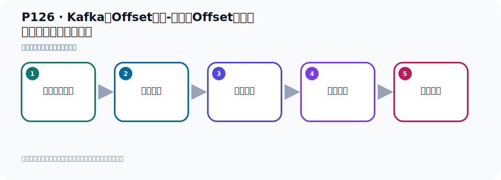

# P126：Kafka的Offset详解-消费者Offset代码演示默认从最新位置消费

> 笔记编号 126/156 · 时长 06:28 · [打开原视频 P126](https://www.bilibili.com/video/BV14J4m187jz?p=126)

[← P125: Kafka的Offset详解-消费者Offset代码演示默认从最新位置消费](../08-storage-offsets/p125-Kafka的Offset详解-消费者Offset代码演示默认从最新位置消费.md) · [返回本章](./README.md) · [P127: Kafka的Offset详解-消费者Offset代码演示总结 →](../08-storage-offsets/p127-Kafka的Offset详解-消费者Offset代码演示总结.md)

## 这节到底讲什么

**核心主题：Kafka的Offset详解-消费者Offset代码演示默认从最新位置消费。**

这节用实验验证前面的配置或机制。重点是记录输入、预期、实际输出，以及两者不一致时如何定位。
本节属于“消息存储与 Offset”这一章；放在全章里看，它的作用是：理解日志文件、__consumer_offsets、生产者 Offset 与消费者 Offset 的含义和代码表现。

## 本节路线

## 老师的完整讲解顺序（ASR 辅助复核）

> 下面按时间顺序保留经过基础术语替换的 ASR，方便核对老师是否提到某个细节。
> 人名、命令、代码和英文参数仍可能识别错误；准确结论以本节白话说明、代码块和实操速查表为准。

### 1. 00:00–00:53

刚才我们演示的实际上是这里面的第二种情况，就是我们分区中已经发生了消息，里面有四个消息，然后我们从最新的位置开始接收消息，那么它从四个位置开始接收消息。下面我们看一下，我们分区中如果没有消息，原来没有发生过消息，那么它莫之然就从零这个位置开始接收消息。好，那么看一下，这样的话我就可以这样来测试一下，首先把这个程序停掉。停留之后我就把我之前那个把这托避给删了，我们直接右键彻底把它删掉，停留删掉，删掉。那删掉之后就清空了，它里面就没有了。清空之后我可以怎么来，我可以先不发消息，我先把这个消费的启动起来，先把消费的启动。

### 2. 00:54–01:44

那么消费的启动的话，那就是把这个妹分启动，它启动十分容器，那么这个时候这个接电器就启动了。启动之后它其实已经会帮你创建这个托避口，这些托避口都不用我们管，它自己会创建。那这个你看我们运行这个妹方法，可以看一下它这个接电器就开始工作，开始工作之后它其实就已经创建了这个托避口了。当然目前肯定是没有消息的，因为它这里面一条消息都没有，所以你看收下，是没有的，没有结果。好，其中之后我们现在可以怎么来，现在它就在接电梯，但是这个托避口已经创建了，那么接电梯怎么接电的，它从雷开始接电，雷号位置开始接电梯。我把程序停掉，我现在停掉了，停掉之后我们可以我们刚才介绍的命令去查一下，比如说我们查一下我们这个分组，我们主名还是这个主名。

### 3. 01:45–02:58

用这个主名去查一下，你看因为通过这个查询你可以查到它当前它那个欧赛的是多少，消费值的欧赛的是多少，通过这个命令你可以查出来，对吧，可以查出来。好，用这个命令，把这个命令我们去执行一下，那在这里，好，把之前的清理一下，好，找一下，回车。那回到这边，你可以看到，我就不考出来了，直接可以看，你看这是分组吗？分组OS Group，这个分组，那是托避口，我们刚刚我们的分组就是OS托避口，然后它这个分区，它托避口下只有一个分区，所以你看它这个concerned OS，你看其实位置是雷，看没有，是雷吧，然后我们里面没有发消息，所以消息也是雷，然后它的这个差值也是雷，那现在我们这个什么意思，那现在就说你有这个值以后，这个值就相当于我们消费者的OS，那我们下次起当消费者的时候，消费者他一定是从雷这个位置开始消费，也就是他从头到尾开始消费，。

### 4. 02:58–03:56

因为他已经创建好这个骑士值了，这个骑士值已经创建好了，是吧，所以就说你没有，因为你这个分析中你没有消息，那么你起当消费者之后，那默认从最新位置开始接收，那么最新位置就雷了，那现在我把这个成续停了，成续停了，但是你这个分组，这个消息分组，他已经在卡巴卡中已经做了个记录了，记录了他的消费的那个位置，是雷，他已经记录好了，对吧，那我下次起到这个消费者的时候，他就会从雷位置开始消费，就相当于我上次我是在雷这个位置监听，然后呢不小心这个系统盪鸡了，是吧，盪鸡了，相当于我把他关了吗，消费者关了，盪鸡了，但是服务团已经记好了，我这个消费组，他从雷位置开始监听，那我下次把这个消费者起起来，起起来他还是从雷开始往后读，。

### 5. 03:56–04:42

所以我现在去发消息，发消息之后我到时候去接收的时候就可以接到，因为他从雷开始接吗，我们上次发消息我接，我再去起留消费者去接，为什么接不到啊，因为你起留消费者的时候他从事的位置开始接，因为你之前发了四个消息，那我去起留消费者之后他从事以后开始接收，是吧，那现在我这个分组已经出手忘好了，他的其实的位置是雷，对吧，对吧，这人到时候你往里面发消息，那我就可以接到，我可以接到啊，那此时你看一下，我现在把这个消费者了，我现在给你读了，先别接收的啊，先别接收，我这里去发，那我再发的话，再次发两条，他里面是去问两次发两条，可以看一下。

### 6. 04:44–05:46

发两条，好他发完了，发完之后我们这边查一下，应该是发两条，看一下你可以看到这个地方是两条，那么他有个差值是两条，那就是有两条还没有消费，对吧，那你看我们消费者的Opening是雷，是雷吧，所以我们现在起留消费的时候，他会从雷开的消费从雷开的消费，那么他可以拿到两条消息，可以拿上两条消息，好，那现在呢我就把消费的启动，就把重点打开，打开之后呢，我们预计这个测试方法，你看他可以拿到两条消息走一下好，你看这个消费，他打一句话，就这个为止，你再收一下，那剩两条了对吧，哎，两条消息，好，这就是我们这个消费者Opening所以这个消费者Opening，你就看他那个初始位置是多少，就是那个Opening，消费者Opening，他是多少。

### 7. 05:47–06:23

是吧，他是多少，他就从哪个位置开始消费，他启动之后，他那个位置是多少，就从什么位置开始消费你装这一点，他启动之后，他的位置，他消费者的位置从哪里开始的，如果你分局中原来没有消息，那么他启动之后，他的那个初始位置，那就是从哪里如果你原来分局中有消息，那么他从最新位置，那么最后一个消息的下一个位置开始消费最新位置就剩下的Opening的下一个位置，开始消费好，这样啊好，那刚才我们给你演示了，这样的一种情况。

## 关键术语

- **Kafka：** Apache 开源的分布式事件流平台，常用于高吞吐消息传递、数据管道和流处理。
- **Offset：** 事件在 Partition 中的位置编号，也是消费者记录消费进度的依据。

## 完整原声逐段记录

[查看本节带时间戳的本地 ASR](./transcripts/p126-Kafka的Offset详解-消费者Offset代码演示默认从最新位置消费-ASR.md)。主笔记负责可读性和术语校正；ASR 页面负责完整性复核。

## 读完记住

- 本节主题是 **Kafka的Offset详解-消费者Offset代码演示默认从最新位置消费**，它服务于本章目标：理解日志文件、__consumer_offsets、生产者 Offset 与消费者 Offset 的含义和代码表现。
- 理解顺序是：准备测试条件 → 执行操作 → 读取结果 → 对照预期 → 形成结论。
- 学习时要同时核对老师的解释、画面中的配置/代码，以及最终运行结果。

## 最容易踩的坑

测试前残留的 Topic、Offset、缓存或旧进程会污染结果；每次实验都要先确认初始状态。

## 自测

1. 不看笔记，用自己的话解释“Kafka的Offset详解-消费者Offset代码演示默认从最新位置消费”解决了什么问题。
2. 按顺序复述：准备测试条件、执行操作、读取结果、对照预期、形成结论。
3. 如果运行结果和老师不同，你会先检查哪三个输入或环境条件？

## 学完检查

- [ ] 我能不看视频复述本节完整思路
- [ ] 我能指出关键命令、配置、类或接口的作用
- [ ] 我能解释画面中的输入与输出为什么对应
- [ ] 我核对过完整 ASR，没有跳过老师的补充说明
- [ ] 我完成了本节自测或复现实验
