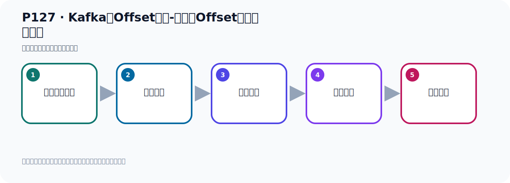

# P127：Kafka的Offset详解-消费者Offset代码演示总结

> 笔记编号 127/156 · 时长 07:33 · [打开原视频 P127](https://www.bilibili.com/video/BV14J4m187jz?p=127)

[← P126: Kafka的Offset详解-消费者Offset代码演示默认从最新位置消费](../08-storage-offsets/p126-Kafka的Offset详解-消费者Offset代码演示默认从最新位置消费.md) · [返回本章](./README.md) · [P128: Kafka集群的搭建-整体介绍 →](../09-cluster-replication/p128-Kafka集群的搭建-整体介绍.md)

## 这节到底讲什么

**核心主题：Kafka的Offset详解-消费者Offset代码演示总结。**

这节用实验验证前面的配置或机制。重点是记录输入、预期、实际输出，以及两者不一致时如何定位。
本节属于“消息存储与 Offset”这一章；放在全章里看，它的作用是：理解日志文件、__consumer_offsets、生产者 Offset 与消费者 Offset 的含义和代码表现。

## 本节路线

## 老师的完整讲解顺序（ASR 辅助复核）

> 下面按时间顺序保留经过基础术语替换的 ASR，方便核对老师是否提到某个细节。
> 人名、命令、代码和英文参数仍可能识别错误；准确结论以本节白话说明、代码块和实操速查表为准。

### 1. 00:00–01:27

通过前面的代码演示，实际上我们可以得到最终的结论。什么结论呢？就是消费者从什么位置开始消费，就看他到Offset。Offset是多少？就看消费者的Offset是多少。也就是消费者想之后，他的Offset是多少？消费者启动后，他的Offset是多少？你只要抓住这个主要矛盾，他从什么位置开始消费，他能不能消费到消息，你要看他消费者的Offset是多少？那么这个Offset是多少呢？就是消费者一启动就决定了。消费者Offset是多少？消费者Offset是多少？他启动后可以通过命令，可以通过上面的命令查看。

### 2. 01:32–02:26

不管你怎么变，你又看他的Offset是多少，然后他会从这个位置开始消费，通过命令可以查看一下，就可以了。然后你看，我们消费者消费消息后，如果他不提交，他不提交的话，他Offset是不更新的，提交了才更新。如果说我消费消息之后，我不提交，那我下次还可以再消费这个消息，可以反复消费这个消息。那我们知道，我们前面记得过，消费者他默认是自动提交，默认都提交了，你消费拿到消息之后，他默认就提交了。那如果说你感人手中提交，那他就，就是你自己去提交，你如果不调那个方法，调那个ACK方法，你不调那个方法，那么他不提交，不提交那么Offset是不更新的，那么这个呢，其实我们也可以测试一下，那是首先第一步，你把他给你改成手中提交，。

### 3. 02:27–03:16

手中提交，手中提交的话，我们在之前的代码中，那里写过我们考虑一下看一下，就是配置中，首先配置下手中提交，哎，就是这个接近器要从手中提交，认识这里吧，改成手中提交，那就是在这儿，是吧，这里是提交模式，是手动确认手中提交，好，这第一个，然后第二个呢，就是在你这个消息接近的时候，那么找一下这个消息接近这里，他要加一个呢，叫ACK，加上去，好，把这个收到关一下，让我们的代码消灭在这里，那就是我们在消费消息的时候，这里加一个呢，这个参数，是吧，好，那这个参数呢，你现在比如说我现在加成手中，但我不提交，他本来要执行一毫代码，就这个方法，但是我现在不执行，。

### 4. 03:16–04:10

不执行，那你这个消息，虽然拿到消息的，一不提交，那么这个OSET，消费者的OSET就不更新的，他不更新，我们可以测试一下啊，测一下，我现在关机啊，过去之后呢，我们通过命令查看一下，还是这个命令，查看一下，我们当前这个OS Group这个组是吧，这个组，他目前的这个什么，他的这个OSET是多少啊，是2，是2，他当前是2吧，是2啊，好，那现在我让他先不消费啊，先不要消费，那我再发几个消息，再给发一下，好再发一下，好再发一下，他里面是虚伟两次，给发两条，好那这个是发两条了，发两条之后我们在这边去查看一下，查一下，那这个时候他这边你看这个日志啊，这个赛的变成是了，因为他发了四点消息了，对吧，。

### 5. 04:10–05:04

然后你当前的消费者OSET是2，那么相应还有两条消息可以消费，还有两条可以消费，对吧，好，那现在我去启动这个消费者，他应该可以拿到两条消息，因为他的消费者的骑士位置是2，是2，2后面还有两条消息，所以他可以消费两条消息，好，那这个时候呢，我们去启动这个消费者，把这个重点打开，打开之后呢，我们这里呢，没有去提交，消息接到之后没有去提交啊，我们现在已经改成了这个手动提交模式，不是自动提交，改成手动提交模式，不提交，改成手动了，好，那现在我们去不提交啊，我们启动一下，你不提交，那你这个消费者的OSET是不变的，你看他已经拿到这两条消息了，但是呢，他没有提交，没有提交呢，这个时候你看OSET原来是2，那现在你看一下，你再执行一下，他还是2，这个OSET你看，当前这个OSET还是2，是吧，。

### 6. 05:04–06:02

还是2，那就是我再去启动这个消费者，他其实又从这个2的位置开始消费，他又可以把那个消息再拿一遍，好，你看我们把这个关掉，我们再启动，你看他又可以再拿一遍那个，那个两条消息，又可以拿一下，那又消费到这两条消息的，对吧，好，你再，再来一遍，他又拿到这两条消息，再拿一遍，好，又拿到两条消息，虽然我消费了好几次，但是你没有提交，那么这是消费者的OSET是没有变的，他还是2，你看，还是2，对吧，只有当你提交之后，这一方才变，所以我们这个提交一下，你看，我把这个方法执行一下，执行，是吧，好，关掉，我们这个是再来消费，再消费，右键，消费，这一次他可以消费到，消费两条，然后呢，他提交了，你看，消费了两条消息，但是此时已经提交了，之前是2，这个事情执行一下，就变成4了，他已经变成4了，他提交了，提交之后到现在就没有消息可以消费了，。

### 7. 06:02–07:02

所以此时如果说你再起来那个程序，比如你再来重启起一下，这个时候就消费不到了，你看，这个是没有消息的，你看我们找一下，我们是这个文字叫消息，消费，消费，你看，找不到这个消费，这个关键字，就是消费没有了，因为他现在已经到4了，4后面已经没有消息了，4后面没有消息了，好，那以上这个消息呢，就是关于我们这个生产者的OSET和消费者的OSET，生产者的OSET呢，就是不断的往日志没见后面去追加，这个比较简单，就是数字不断地认，那么消费者的OSET呢，是很重要的，因为你如果对这个不理解的话，我为什么这个消息没接到，为什么这个消息又接到了，为什么又接不到，为什么又接到了，那么这个时候你会有一些疑问，那最主要呢，也就看他的那个OSET呢，就是消费者的OSET是多少，他肯定是从上一次的OSET往后去接受的，。

### 8. 07:02–07:28

所以核心就是看他的消费者的OSET，那么这样呢，对于你持续，能不能接到这个消息，非常非常重要，让你去判断我这个监听器消费的情况之后，他能不能接到消息，是很重要的一个判断依据，所以主要就是看他的消费者的OSET，好，那以上我们重点给他介绍一下消费者的OSET，。

## 关键术语

- **Kafka：** Apache 开源的分布式事件流平台，常用于高吞吐消息传递、数据管道和流处理。
- **Offset：** 事件在 Partition 中的位置编号，也是消费者记录消费进度的依据。

## 完整原声逐段记录

[查看本节带时间戳的本地 ASR](./transcripts/p127-Kafka的Offset详解-消费者Offset代码演示总结-ASR.md)。主笔记负责可读性和术语校正；ASR 页面负责完整性复核。

## 读完记住

- 本节主题是 **Kafka的Offset详解-消费者Offset代码演示总结**，它服务于本章目标：理解日志文件、__consumer_offsets、生产者 Offset 与消费者 Offset 的含义和代码表现。
- 理解顺序是：准备测试条件 → 执行操作 → 读取结果 → 对照预期 → 形成结论。
- 学习时要同时核对老师的解释、画面中的配置/代码，以及最终运行结果。

## 最容易踩的坑

测试前残留的 Topic、Offset、缓存或旧进程会污染结果；每次实验都要先确认初始状态。

## 自测

1. 不看笔记，用自己的话解释“Kafka的Offset详解-消费者Offset代码演示总结”解决了什么问题。
2. 按顺序复述：准备测试条件、执行操作、读取结果、对照预期、形成结论。
3. 如果运行结果和老师不同，你会先检查哪三个输入或环境条件？

## 学完检查

- [ ] 我能不看视频复述本节完整思路
- [ ] 我能指出关键命令、配置、类或接口的作用
- [ ] 我能解释画面中的输入与输出为什么对应
- [ ] 我核对过完整 ASR，没有跳过老师的补充说明
- [ ] 我完成了本节自测或复现实验
