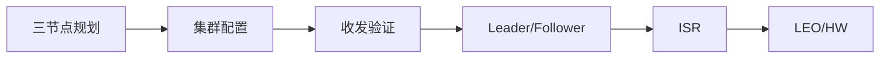

# 第 9 章：集群、副本机制与核心水位

搭建三节点集群，理解 Broker、Partition、Replica、ISR、LEO 与 HW 的协作关系。

## 整章核心讲解

集群把 Partition Leader 分散到多个 Broker。Producer 和 Consumer 主要与 Leader 交互，Follower 持续复制日志；Leader 失效后，控制器从合适的副本中完成新的 Leader 选举。

LEO 是每个副本自己的日志末端，ISR 是同步状态合格的副本集合，HW 是消费者可见的确认边界。Leader LEO 前进不代表 HW 立即前进，因为可靠性取决于 ISR 中副本的同步情况。

## 先看懂整章数据流

## 本章逐节目录

1. [P128 Kafka集群的搭建-整体介绍](./p128-Kafka集群的搭建-整体介绍.md) · 03:01
2. [P129 Kafka集群的搭建-准备3个Kafka](./p129-Kafka集群的搭建-准备3个Kafka.md) · 03:37
3. [P130 Kafka集群的搭建-配置文件](./p130-Kafka集群的搭建-配置文件.md) · 06:27
4. [P131 Kafka集群的搭建-3台配置文件](./p131-Kafka集群的搭建-3台配置文件.md) · 05:43
5. [P132 Kafka集群的测试-运行Zookeeper](./p132-Kafka集群的测试-运行Zookeeper.md) · 05:47
6. [P133 Kafka集群的测试-运行3台Kafka](./p133-Kafka集群的测试-运行3台Kafka.md) · 04:29
7. [P134 Kafka集群的测试-SpringBoot连接集群Kafka](./p134-Kafka集群的测试-SpringBoot连接集群Kafka.md) · 06:36
8. [P135 Kafka集群的测试-SpringBoot连接集群Kafka收发消息](./p135-Kafka集群的测试-SpringBoot连接集群Kafka收发消息.md) · 05:42
9. [P136 Kafka的集群架构分析](./p136-Kafka的集群架构分析.md) · 04:19
10. [P137 Kafka的集群架构分区和副本机制](./p137-Kafka的集群架构分区和副本机制.md) · 03:28
11. [P138 Kafka的集群架构分区和多副本机制分析](./p138-Kafka的集群架构分区和多副本机制分析.md) · 02:40
12. [P139 Kafka的集群架构分区和多副本机制分析](./p139-Kafka的集群架构分区和多副本机制分析.md) · 04:17
13. [P140 Kafka的集群架构分区和多副本机制分析](./p140-Kafka的集群架构分区和多副本机制分析.md) · 05:57
14. [P141 Kafka集群架构的多副本架构](./p141-Kafka集群架构的多副本架构.md) · 08:37
15. [P142 Kafka中的12个核心概念梳理](./p142-Kafka中的12个核心概念梳理.md) · 02:50
16. [P143 Kafka中的12个核心概念-ISR副本](./p143-Kafka中的12个核心概念-ISR副本.md) · 03:06
17. [P144 Kafka中的12个核心概念-ISR副本](./p144-Kafka中的12个核心概念-ISR副本.md) · 05:32
18. [P145 Kafka中的12个核心概念-LEO](./p145-Kafka中的12个核心概念-LEO.md) · 01:48
19. [P146 Kafka中的12个核心概念-HW](./p146-Kafka中的12个核心概念-HW.md) · 04:10
20. [P147 Kafka中ISR、HW、LEO的关系](./p147-Kafka中ISR、HW、LEO的关系.md) · 03:19

## 本章学习方法

1. 先把上面的流程图画在纸上，明确每节位于哪一步。
2. 读逐节正文，再用 ASR 核查老师的补充、口头提醒和演示顺序。
3. 遇到命令或代码课，必须记录“输入—配置—输出—失败原因”。
4. 学完后从头解释整章，不以“视频播放完”作为完成标准。
