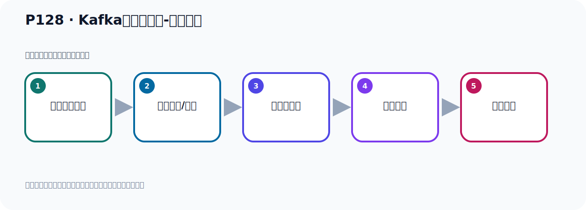

# P128：Kafka集群的搭建-整体介绍

> 笔记编号 128/156 · 时长 03:01 · [打开原视频 P128](https://www.bilibili.com/video/BV14J4m187jz?p=128)

[← P127: Kafka的Offset详解-消费者Offset代码演示总结](../08-storage-offsets/p127-Kafka的Offset详解-消费者Offset代码演示总结.md) · [返回本章](./README.md) · [P129: Kafka集群的搭建-准备3个Kafka →](../09-cluster-replication/p129-Kafka集群的搭建-准备3个Kafka.md)

## 这节到底讲什么

**核心主题：Kafka集群的搭建-整体介绍。**

这是一节动手课。不要只记命令，要把前置条件、操作步骤、关键参数和成功信号连成一条验证链。
本节属于“集群、副本机制与核心水位”这一章；放在全章里看，它的作用是：搭建三节点集群，理解 Broker、Partition、Replica、ISR、LEO 与 HW 的协作关系。

## 本节路线

## 老师的完整讲解（按视频顺序校正）

> 下面保留老师的完整讲解顺序，并修正 Kafka、Java、ZooKeeper、
> Topic、Partition、Offset 等常见识别错误。它不是压缩摘要；原始 ASR 在后面单独保留。

### 1. 00:00–00:55

下面我们来看一下Kafka集群。关于Kafka集群我这里换了一张图。这张图我们打算在后面搭好集群之后我们再来解读。刚开始我们去解读的话，可能大家不是很好理解。我们先动作去搭单文之后再回过头来解读一下它集群。接下来我们开始去搭集群。那么Kafka集群有两种搭的方式。一种是基于ZooKeeper方式搭建集群，一种是基于KRaft的方式搭建集群。集群就是我们搭多台Kafka，原来我们只有一个Kafka，是单机的Kafka，现在我们搭多个Kafka，比如说3个5个搭多个Kafka，这就是Kafka集群。好，两种方式，首先我们还是介绍基于ZooKeeper方式。

### 2. 00:55–01:48

这个是目前还是用的比较多的一种方式。KRaft方式是后面新出来的一种方式。好，先看ZooKeeper搭建方式。ZooKeeper搭建方式我们总结一下，就是三个步骤，三个步骤也非常简单，它搭起来还是很方便的。第一步就是你去下载一个Kafka，它是一个压缩包，直接解压，解压之后你解压三份，就是我们解压三个Kafka，相当于安装三个Kafka。那么这里你可以搞三台机器，在每一台机器上安装一个Kafka，这是第一种办法，第一种办法就是我们在一台机器上，比如说我们在一个Nilio上，我搞三个Kafka，我解压三份Kafka，然后用不同的目录，用不同的端口，。

### 3. 01:48–02:33

那么这个也可以，总之你要准备三个Kafka，或者是用三台机器，或者是在一台机器上安装三个Kafka，这样我们就可以搭建机群，这第一步，然后第二步来主要就是配一个文件，Kafka有个servo.pop的文件，第三步基本上就是测试的，启动然后测试，实际上我们基于ZooKeeper，这里面还有个搭建ZooKeeper机群，ZooKeeper机群属于ZooKeeper技术内容的范畴，所以这里我们就搭一个ZooKeeper，ZooKeeper本身其实也需要搭个机群，那么关于ZooKeeper的机群，大家自己单独去搭建一下，我们这里要使用一个ZooKeeper，。

### 4. 02:33–02:58

使用一个ZooKeeper，一手ZooKeeper机群也可以，那你搭三个ZooKeeper，那我们这里使用一个ZooKeeper，那我们就搭一个ZooKeeper，那么它的配置在我们Kamukka里面，就一个地址的问题，一个地址，你搭三个ZooKeeper，那你就写三个地址，你搭一个ZooKeeper，你写一个地址，所以区别很小，好，那么整体介绍我们介绍完了，下面我们就动手操作，动手去操作一下。

## 关键术语

- **Kafka：** Apache 开源的分布式事件流平台，常用于高吞吐消息传递、数据管道和流处理。
- **ZooKeeper：** 旧版 Kafka 用于集群元数据和控制器协调的外部服务。
- **KRaft：** Kafka 自带的 Raft 元数据仲裁模式，可在新架构中摆脱 ZooKeeper。

## 完整原声逐段记录

[查看本节带时间戳的本地 ASR](./transcripts/p128-Kafka集群的搭建-整体介绍-ASR.md)。主笔记负责可读性和术语校正；ASR 页面负责完整性复核。

## 读完记住

- 本节主题是 **Kafka集群的搭建-整体介绍**，它服务于本章目标：搭建三节点集群，理解 Broker、Partition、Replica、ISR、LEO 与 HW 的协作关系。
- 理解顺序是：确认前置条件 → 执行安装/配置 → 启动或应用 → 观察输出 → 排查失败。
- 学习时要同时核对老师的解释、画面中的配置/代码，以及最终运行结果。

## 最容易踩的坑

只照抄命令而不核对当前目录、版本、端口和配置文件路径，最容易造成“命令没报错但服务不可用”。

## 自测

1. 不看笔记，用自己的话解释“Kafka集群的搭建-整体介绍”解决了什么问题。
2. 按顺序复述：确认前置条件、执行安装/配置、启动或应用、观察输出、排查失败。
3. 如果运行结果和老师不同，你会先检查哪三个输入或环境条件？

## 学完检查

- [ ] 我能不看视频复述本节完整思路
- [ ] 我能指出关键命令、配置、类或接口的作用
- [ ] 我能解释画面中的输入与输出为什么对应
- [ ] 我核对过完整 ASR，没有跳过老师的补充说明
- [ ] 我完成了本节自测或复现实验
